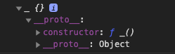
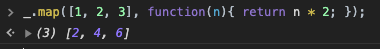
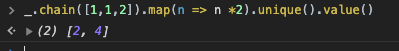
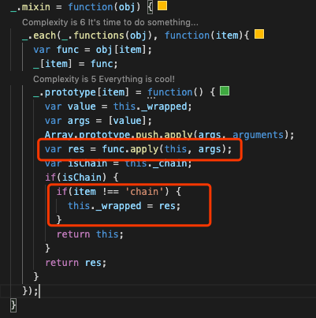

Underscore.js是很有名的一个工具库，我也经常用他来处理对象，数组等，本文会深入解析Underscore源码架构，跟大家一起学习下他源码的亮点，然后模仿他写一个简单的架子来加深理解。他的源码通读下来，我觉得他的亮点主要有如下几点：

* 不需要new的构造函数
* 同时支持静态方法调用和实例方法调用
* 支持链式调用

**本文的例子已经上传到GitHub，同一个repo下还有我全部的博文和例子，求个star：**

https://github.com/dennis-jiang/Front-End-Knowledges/tree/master/Examples/Architecture/Underscore

## 外层是一个自执行函数

Underscore外层就是一个自执行函数，在自执行函数里面将`_`挂载到了window上。这是很多第三方库惯用的套路。如果你还不知道怎么入手看源码，不知道入口在哪里，或者看不懂他的外层结构，请看[从架构入手轻松读懂框架源码：以jQuery，Zepto，Vue和lodash-es为例](https://juejin.im/post/5e549c4d6fb9a07cd614d268)，这篇文章详细讲解了怎么入手看源码。本文主要讲解Underscore源码架构里面的亮点，怎么入手就不再赘述了。

## 不用new的构造函数

我们在使用第三方库的时候，经常需要先拿一个他们的实例，有些库需要用new来显式的调用，比如原生的Promise，有些库不需要new也可以拿到实例对象，比如jQuery。不用new就返回一个实例原生JS肯定是不支持的，有这些特性的库都是自己封装了一层的。不同的库在封装的时候也有不同的思路，下面我们来讲讲其中两种方案。

### jQuery的方案

之前我在另一篇文章[从架构入手轻松读懂框架源码：以jQuery，Zepto，Vue和lodash-es为例](https://juejin.im/post/5e549c4d6fb9a07cd614d268)中详细讲解了jQuery是怎么实现不用new就返回一个实例的。另外还模仿jQuery的这种方案实现了我自己的一个工具库：[学以致用：手把手教你撸一个工具库并打包发布，顺便解决JS小数计算不准问题](https://juejin.im/post/5e64cf0ef265da5734024f84)。这里贴一段我工具库文章的代码简单回顾下这种方案：

```javascript
// 首先创建一个fc的函数，我们最终要返回的其实就是一个fc的实例
// 但是我们又不想让用户new，那么麻烦
// 所以我们要在构造函数里面给他new好这个实例，直接返回
function FractionCalculator(numStr, denominator) {
  // 我们new的其实是fc.fn.init
  return new FractionCalculator.fn.init(numStr, denominator);
}

// fc.fn其实就是fc的原型，算是个简写，所有实例都会拥有这上面的方法
FractionCalculator.fn = FractionCalculator.prototype = {};

// 这个其实才是真正的构造函数，这个构造函数也很简单，就是将传入的参数转化为分数
// 然后将转化的分数挂载到this上，这里的this其实就是返回的实例
FractionCalculator.fn.init = function(numStr, denominator) {
  this.fraction = FractionCalculator.getFraction(numStr, denominator);
};

// 前面new的是init，其实返回的是init的实例
// 为了让返回的实例能够访问到fc的方法，将init的原型指向fc的原型
FractionCalculator.fn.init.prototype = FractionCalculator.fn;

// 调用的时候就不用new了，直接调用就行
FractionCalculator();
```

### Underscore的方案

jQuery的方案是在构造函数里面new了另外一个对象，然后将这个对象的原型指向jQuery的原型，以便返回的实例能够访问jQuery的实例方法。目的是能够达到的，但是方案显得比较冗长，Underscore的方案就简洁多了：

```javascript
function _(){
  if(!(this instanceof _)) {
    return new _();
  }
}

// 调用的时候直接_()就可以拿到实例对象
const instance = _();
console.log(instance);
```

上面代码的输出是:



可以看到constructor指向的是`_()`，说明这真的是一个_的实例，我们来分析下代码执行流程：

> 1. 调用`_()`，里面的this指向外层的作用域，我们这里是window，因为window不是_的实例，会走到if里面去。[关于this指向，如果你还不是很明白，请看这篇文章](https://juejin.im/post/5e59e35ce51d4526e651c338)。
> 2. if里面会调用`new _()`，这会拿到一个实例对象，并将这个对象`return`出去。`new _()`也会调到`_()`方法，但是因为使用new调用，里面的this指向的就是new出来的实例，所以if进不去，执行结束。

Underscore巧妙应用了this的指向，通过检测this的指向来判断你是new调用的还是普通调用的，如果是普通调用就帮你new一下再返回。

## 同时支持静态方法和实例方法

用过Underscore的朋友应该有注意到，对于同一个方法来说，Underscore既支持作为静态方法调用，也支持作为实例方法调用，下面是官方的例子：

```javascript
_.map([1, 2, 3], function(n){ return n * 2; });   // map作为静态方法调用
_([1, 2, 3]).map(function(n){ return n * 2; });   // map作为实例方法调用
```

当我们把方法作为静态方法调用的时候，需要处理的数据就是第一个参数；当把他作为实例方法调用的时候，待处理数据是作为参数传给构造函数的。下面我们来讲讲这是怎么实现的。

其实最简单的方法就是写两个函数，一个是静态方法，一个是实例方法。但是如果我们这样做了，这两个函数内部处理的逻辑其实是高度相似的，可能只是参数稍微有点不同而已。这肯定不是一个优雅的程序员应该做的。Underscore给出的方法就是所有方法先写成静态方法，然后用一个统一的函数来将所有的静态方法挂载到原型上，让他成为一个实例方法。我们试着一步一步的来实现下。

### 先写一个静态方法

我们先来写一个简单的map方法，将它挂载到_上成为静态方法：

```javascript
_.map = function(array, callback) {
    var result = [];
    var length = array.length;
    for(var i = 0; i< length; i++) {
      var res = callback(array[i]);
      result[i] = res;
    }

    return result;
  }
```

这个方法写完其实就可以直接用了，用上面那个例子调用如下：



### 映射成实例方法

在Underscore里面是用一个`mixin`方法来将静态方法映射到原型上的，`mixin`方法接收一个对象作为参数，然后将这个对象上的方法全部复制到原型上。具体流程如下：

> 1. 取出参数里面的函数属性，将其塞入一个数组
> 2. 遍历这个数组，将里面的每个项设置到原型上
> 3. 设置原型的时候注意处理下实例方法和静态方法的参数

下面来看看代码： 

```javascript
_.mixin = function(obj) {
  // 遍历obj里面的函数属性
  _.each(_.functions(obj), function(item){
    // 取出每个函数
    var func = obj[item];
    // 在原型上设置一个同名函数
    _.prototype[item] = function() {
      // 注意这里，实例方法待处理数据是构造函数接收的参数，改造构造函数的代码在后面
      // 这里将数据取出来作为静态方法的第一个参数
      var value = this._wrapped;
      var args = [value];
      // 将数据和其他参数放到一个数组里面，作为静态方法的参数
      Array.prototype.push.apply(args, arguments);
      // 用处理好的参数来调用静态方法
      var res = func.apply(this, args);
      // 将结果返回
      return res;
    }
  });
}

// 上面的mixin写好后不要忘了调用一下，将_自己作为参数传进去
_.mixin(_);

// 构造函数需要接收处理的数据
// 并将它挂载到this上，这里的this是实例对象
function _(value){
  if(!(this instanceof _)) {
    return new _(value);
  }

  this._wrapped = value;
}
```

上面的`_.mixin(_);`调用之后就会将`_`上的静态方法全部映射到原型上，这样`_()`返回的实例也有了所有的静态方法，这就让`_`支持了两种调用方式。可能有朋友注意到，我们上面的代码还有`each`和`functions`两个辅助方法，我们也来实现下这两个方法:

```javascript
// functions就是取出对象上所有函数的名字，塞到一个数组里面返回
_.functions = function(obj){
  var result = [];
  for(var key in obj) {
    if(typeof obj[key] === 'function'){
      result.push(key);
    }
  }
  return result;
}

// each就是对一个数组进行遍历，每个都执行下callback
_.each = function(array, callback){
  var length = array.length;
  for(var i = 0; i < length; i++) {
    callback(array[i]);
  }
}
```

### mixin顺便支持插件

Underscore的`mixin`不仅让他支持了静态和实例方法两种调用方式，同时因为他自己也是`_`的一个静态方法，我们也是可以拿来用的。官方支持自定义插件就是用的这个方法，下面是官方例子：

```javascript
_.mixin({
  capitalize: function(string) {
    return string.charAt(0).toUpperCase() + string.substring(1).toLowerCase();
  }
});
_("fabio").capitalize();   // Fabio
```

其实我们前面写的那个`mixin`方法已经支持将自定义方法作为实例方法了，但是还差一点，还差静态方法，所以我们再加一行代码，同时将接收到的参数赋值给`_`就行了：

```javascript
_.mixin = function(obj) {
  _.each(_.functions(obj), function(item){
    var func = obj[item];
    // 注意这里，我们同时将这个方法赋值给_作为静态方法，这下就完全支持自定义插件了
    _[item] = func;
    _.prototype[item] = function() {
      var value = this.value;
      var args = [value];
      Array.prototype.push.apply(args, arguments);
      var res = func.apply(this, args);
      return res;
    }
  });
}
```

## 支持链式调用

链式调用也很常见，比如jQuery的点点点，我在另一篇文章[学以致用：手把手教你撸一个工具库并打包发布，顺便解决JS小数计算不准问题](https://juejin.im/post/5e64cf0ef265da5734024f84#heading-7)详细讲解过这种实例方法的链式调用怎么实现，关键是每个实例方法计算完成后都返回当前实例，**对于实例方法来说，当前实例就是this**。这种方式也适用于Underscore，但是Underscore因为自身需求和API结构的原因，他的链式调用需要支持更多场景：

> 1. Underscore的实例方法还支持直接调用返回结果，不能简单的返回实例
> 2. Underscore的静态方法也要支持链式调用

### 实例方法支持链式调用

我们一步一步来，先来解决实例方法支持链式调用的问题，我们前面已经实现了将静态方法映射成实例方法，前面实现的实例方法的返回值就是静态方法的返回值。为了实现链式调用，我们还需要实例方法计算完后还能够返回当前实例(也就是this)，所以我们需要一个依据来判断应该返回计算结果还是当前实例。这个依据在Underscore里面是要用户给的，也就是显式调用`chain`方法。依据我们的分析，`chain`应该很简单，给一个依据来判断实例方法应该返回啥，也就是给当前实例设置一个标志位:

```javascript
_.chain = function() {
  this._chain = true;
  return this;
}
```

`chain`就是这么简单，两行代码，然后我们的实例方法里面根据_chain来判断返回计算结果还是当前实例:

```javascript
_.mixin = function(obj) {
  _.each(_.functions(obj), function(item){
    var func = obj[item];
    _[item] = func;
    _.prototype[item] = function() {
      var value = this._wrapped;
      var args = [value];
      Array.prototype.push.apply(args, arguments);
      var res = func.apply(this, args);
      // 检查链式调用标记，如果是链式调用
      // 将数据挂载到实例上，返回实例
      var isChain = this._chain;
      if(isChain) {
        // 注意如果方法是chain本身，不要更新_wrapped，不然_wrapped会被改为chain的返回值，也就是一个实例
        // 这里有点丑，后面优化
        if(item !== 'chain') {
          this._wrapped = res;
        }
        return this;
      }
      return res;
    }
  });
}
```

我们再来写个`unique`方法来验证下链式调用:

```javascript
_.unique = function(array){
  var result = [];
  var length = array.length;
  for(var i = 0; i < length; i++) {
    if(result.indexOf(array[i]) === -1){
      result.push(array[i]);
    }
  }

  return result;
}
```

试下链式调用:


我们发现结果是对的，但是输出的是一个实例，不是我们想要的，所以我们还要一个方法来输出真正的计算结果，这个方法只能挂在原型上，不能写成静态方法，不然还会走到我们的mixin，会返回实例：

```javascript
_.prototype.value = function() {
  return this._wrapped;
}
```

再来试一下呢:


### 静态方法支持链式调用

静态方法也要支持链式调用，我们必须要让他的返回值也能够访问到实例方法才行。一般情况下静态方法的返回值是不能返回实例的，但是我们现在已经有了`chain`方法，我们直接让这个方法构造一个`_`实例返回就行了，上面的实例方法支持链式调用是利用了现成的实例，返回的this，但是如果`chain`返回一个新实例，也是兼容上面的，于是`chain`改为:

```javascript
_.chain = function(obj) {
  var instance = _(obj);
  instance._chain = true;
  return instance;
}
```

这样我们的静态方法`chain`也可以链式调用了，数据跟其他静态方法一样作为参数传给`chain`:



### 优化代码

到这里我们的功能基本实现了，但是`mixin`函数还有需要优化的地方：



1. `var res = func.apply(this, args);`这里的this指向的是当前实例，但是一个方法作为静态方法调用时，比如`_.map()`，方法里面的this指向的是`_`，所以这里应该改成`_`。之前这里传this是因为`chain`里面操作的是this，现在已经改成新建实例，就不用传this，所以改为正确的`_`。

2. 对`item`进行了特异性判断，前面之所以这么做，也是因为`chain`里面操作的是this，所以在apply里面其实已经设置了`this._chain`为true，所以会走到if里面去，现在新建实例了，走到apply的时候，设置的其实是`res._chain`，所以不会进到if，要调下一个实例方法的时候，`this._chain`才会是true，所以这个if可以直接去掉了。

   ```javascript
   _.mixin = function(obj) {
     _.each(_.functions(obj), function(item){
       var func = obj[item];
       _[item] = func;
       _.prototype[item] = function() {
         var value = this._wrapped;
         var args = [value];
         Array.prototype.push.apply(args, arguments);
         var res = func.apply(_, args);
   
         var isChain = this._chain;
         if(isChain) {
           // if(item !== 'chain') {
           this._wrapped = res;
           // }
           return this;
         }
         return res;
       }
     });
   }
   ```

3. Underscore里面还将`isChain`的判断单独提成了一个方法，我这里没这么做了，放在一起看着还直观点。

## 总结

本文主要讲解了Underscore源码的架构，并自己实现了一个简单的架子，部分变量名字和方法的具体实现可能不一样，但是原理是一样的。通过搭建这个简单的架子，其实我们学会了：

1. 不用new构造实例对象
2. `mixin`怎么扩展静态方法到原型上
3. 通过显式的调用`chain`来支持静态方法和实例方法的链式调用

**文章的最后，感谢你花费宝贵的时间阅读本文，如果本文给了你一点点帮助或者启发，请不要吝啬你的赞和GitHub小星星，你的支持是作者持续创作的动力。**

**作者博文GitHub项目地址： https://github.com/dennis-jiang/Front-End-Knowledges**

**作者掘金文章汇总：https://juejin.im/post/5e3ffc85518825494e2772fd**