不知道有没有朋友有这种经历。雄心勃勃的打开一个开源框架的源码，开始看，一行一行的看下去，看了几行就感觉，“我艹，这什么玩意儿”，然后就看不下去了。如果你有类似的经历，可以看看本文，本文会以几个常见开源库为例讲解几种常见的开源框架的代码架构，从架构出发，帮你轻松读懂框架源码。记住以下两个要点：

1. 不要试图一行一行的往下读
2. 先找入口，再理架构，依流程读下去

## jQuery

以jQuery为例，来看看他的基本架构，然后再来一步步看看这个是什么意思，如果大家能够打开代码跟着我一步步走下去，食用效果更佳：


### 找入口

我们这里用的版本是3.4.1, 我们用npm将jQuery下载下来，然后去`node_modules`里面找到他。

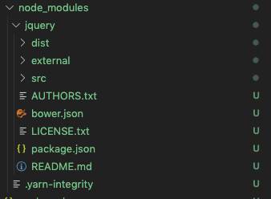

打开`package.json`，找到`main`属性，这个属性是我们程序引入它时查找的路径，通常就是程序的入口文件。如果没有这个属性，入口一般是目录下的`index.js`文件：

```javascript
"main": "dist/jquery.js",
```

### 理结构

我们打开`dist/jquery.js`，发现他有上万行代码，瞬间心里有点懵逼，但是不要怕！我们把最外层的函数都折叠起来，外层结构瞬间清晰了：

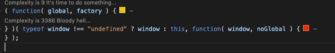

（请忽略图上我的complexity插件。）这个外层结构不就是一个自执行函数吗？他往里面传了两个参数，一个是global，一个是factory。global很好理解，判断一下是不是浏览器，如果是浏览器就把window传进去，如果不是，就传this。这里有个技巧是将window作为参数传进去，而不是直接在函数内部去拿window，这是因为在里面拿会往上找一层才能拿到，会稍微慢一点。

第二个参数factory看名字是个工厂，我们展开上面的函数看看：

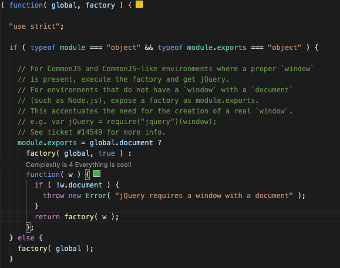

先是做了一些检测，兼容CommonJS和node.js，其实核心代码就一行：

```javascript
factory( global );
```

将global作为参数调用了factory，看来jQuery真正的核心还是这个factory方法，他其实就是外面传进来的第二个参数，我们展开它，发现这个方法有一万行代码，果然是核心，这下又不知道怎么入手了。这时候想想我们使用jQuery的时候是怎么用的，我们都是直接用`$`就调用了，说明他肯定在window上挂载了一个`$`，直接在代码里面搜`window.$`，找到了：

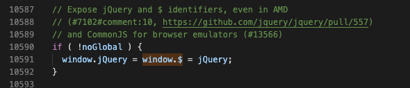

这下我们找到了jQuery真正的对象`jQuery`，这里可以直接通过编辑器跳转到定义，发现`jQuery`也是一个很简单的方法. 


这个方法直接调用了`jQuery.fn.init`,这个方法也可以直接在文件里面搜到，我们发现他支持几种`selector`: 字符串，DOM元素和方法，如果展开他们，你会发现他们都是根据`selector`去把匹配的结果挂载到this上，然后返回`this`。如果传入的`selector`不是支持的类型，他会调用`jQuery.makeArray`造一个类数组结构挂载在this上，然后返回this。那这时候的`this`指向谁呢？回到前面图片的代码`return new jQuery.fn.init( selector, context );`,他是通过`new`关键字来调用的`jQuery.fn.init`，那这里面this就指向new出来的实例对象，这个实例对象又作为返回值被jQuery方法返回出去了，成为了我们平时调用`$('selector')`所拿到的返回值。

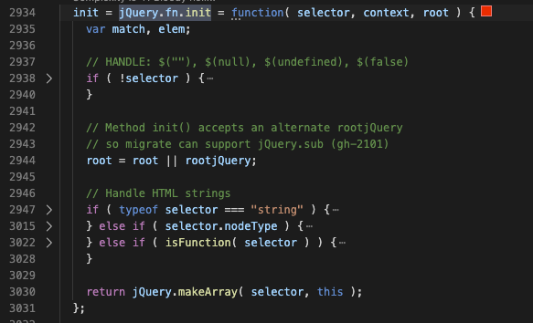

那我们平时使用的`$('selector').first()`和`$.ajax`又是怎么实现的呢，似乎整个调用流程都没看到这些方法呢。这要回到我们前面`jQuery.fn.init`，我们发现在`init`前面还有一个`fn`，那这个fn是什么东西呢？我们可以直接搜索"jQuery.fn ="，看看他在哪里定义的：

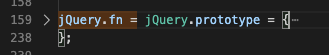

瞬间恍然大悟，原来`jQuery.fn`就是`jQuery.prototype`，展开他我们就找到了`first`方法。但是这个是jQuery的实例对象才会继承的方法，我们返回的并不是`new jQuery()`，而是`new jQuery.fn.init`。为什么在这个实例里面也能拿到jQuery的原型对象呢？原来在`jQuery.fn.init`函数定义下面我们还发现了一行代码：


这行代码将`jQuery.fn`也就是`jQuery.prototype`又赋值给了`jQuery.fn.init.prototype`。这就实现了我们通过`new jQuery.fn.init()`拿到的实例对象，也就是`jQuery()`返回的对象能够访问到`jQuery.prototype`上的对象。这就是`$('selector').first()`的挂载机制。

看到这里是不是感觉有点绕，绕了一圈在`jQuery()`方法里面其实就是返回了一个`jQuery`实例嘛，为什么不直接返回`new jQuery()`呢？比如这样：

```javascript
function jQuery() {
  return new jQuery();
}

window.$ = jQuery;

// 使用时
const instance = $();
```

上述代码其实有很明显的问题，在构造函数里面又`new`了一个自身，又会去调用构造函数，构造函数又`new`一个自身。。。这就死循环了！所以要`new`另外一个方法，然后将这个方法的原型跟jQuery的原型连接起来，让代码在事实上返回一个jQuery的实例对象。

那`$.ajax`又是怎么挂载的呢？我们直接在代码里面搜`ajax`，我们发现他包在了`jQuery.extend`的参数里面：

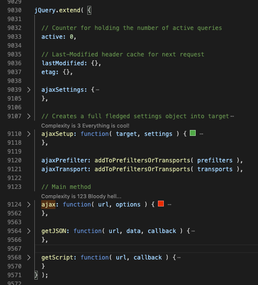

那`jQuery.extend`是我们必须要看的方法：

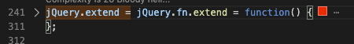

还好这个方法并没有太多的外部调用，仔细阅读下我们发现了他的功能其实就是一个拷贝：

- 将传入的对象拷贝到target上
- 如果没传target，target就是this，也就是调用者jQuery或者jQuery.fn
- 还有一个可选参数是deep，来控制他是否需要递归拷贝

所以前面的`ajax`方法就是直接拷贝到了`jQuery`上成为了他的一个静态方法。网上经常看到有人问，`jQuery.extend`和`jQuery.fn.extend`有啥区别。这下看了源码就清清楚楚了，`jQuery.extend`就是将对象拷贝到`jQuery`上，成为静态方法，可以直接通过类似`$.ajax`调用，`jQuery.fn.extend`就是拷贝到原型链上成为实例方法，通过`$('selector').first()`这样调用。实例方法一般是用来对jQuery实例，也就是`selector`对应的DOM进行操作，比如删除，插入，查找，修改样式等。静态方法一般用于不涉及jQuery实例的操作，比如`ajax`请求，浏览器检测，数组合并等，这些跟具体某个DOM元素没关系，所以直接挂载在jQuery上成为静态方法。

通过上面的的一系列的顺藤摸瓜，其实我们已经知道了jQuery的基本架构了，包括他的实例化，实例方法的挂载，静态方法的挂载，以及`jQuery.fn`，`jQuery.fn.init`，`jQuery.prototype`之间的关系。画下来就是最开始那张图：

 

有了这张图，我们再去读里面具体的方法心里就更有谱了。这里主要讲怎么入手，怎么理清架构，其他具体的方法篇幅有限这里就不展开了。整个过程中我们可以看到jQuery大量运用了`prototype`，如果你对`prototype`还不是很了解可能会看得云里雾里，那可以先看看[我这篇讲prototype的文章](https://juejin.im/post/5e50e5b16fb9a07c9a1959af)。

## 框架套路

从前面jQuery的讲解我们可以看出来，每次你调用`$(selector)`的时候，jQuery都会返回一个`selector`对应的实例给你，这其实就是工厂模式。就相当于有一个工厂，你告诉他你要一双鞋子(selector=鞋子)，他就生产一双鞋子给你，你要一双袜子(selector=袜子)，他就生产一双袜子给你。总结起来，开源框架主要有如下几种模式：

1. **工厂模式**，比如 jQuery，Zepto
2. **建造者模式**，比如vue 2.0，express
3. **函数式**，比如loadsh-es

### 工厂模式：jQuery和Zepto

工厂模式就是我们前面讲的jQuery的模式，你传一个selector，给你返回一个对应的实例对象。**工厂模式的一个典型特征是会往`window`上挂载一个工厂方法，这个方法会返回一个对应的实例对象给你。**这种模式的一个好处是使用者不用使用`new`就能拿到一个实例对象，这个`new`的调用是框架里面实现了，直接返回给调用者一个`new`好了的实例，对于需要频繁拿多个实例的框架来说，使用起来更方便。

Zepto是一个跟jQuery很类似的框架，架构也是类似的，我们完全可以按照前面jQuery的思路整理出他的架构。具体流程我就不写了，大家可以根据实例化流程图梳理出来，下面画出我整理的结构图。

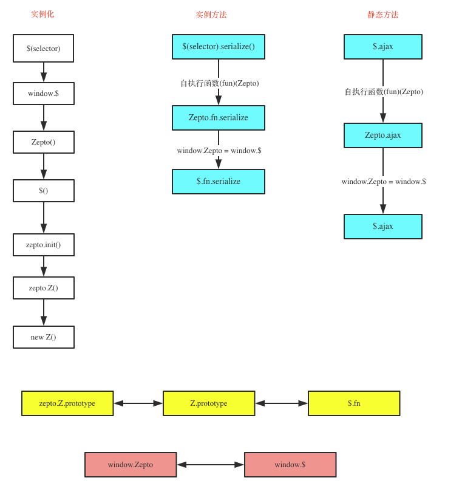

从上图可以看出当我们实例化一个Zepto的时候，实际返回的是`new Z()`的一个实例对象，又因为`Z.prototype = $.fn`，所以这个实例对象可以访问`$.fn`上的方法。Zepto跟jQuery最大的区别是扩展实例方法和静态方法的方式不一样。jQuery是通过`$.fn.extend`和`$.extend`来做的，而Zepto是通过自执行函数，将Zepto作为参数传进去，然后在自执行函数里面直接对`$`和`$.fn`添加属性来实现的。

#### Zepto扩展实例方法

下图是Zepto 1.2.0的代码截图：

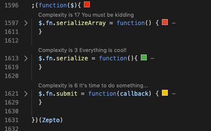

可以看到这个自执行函数将`Zepto`作为参数传进去了，这个`Zepto`就是`window.Zepto`，也就是`window.$`，然后`serialize`等方法是直接添加到了`$.fn`上，也就是`Z.prototype`上，这样我们`new Z()`得到的实例对象就能访问`serialize`方法了。

#### Zepto扩展静态方法

还是来一张代码截图，下图我只保留了核心代码：

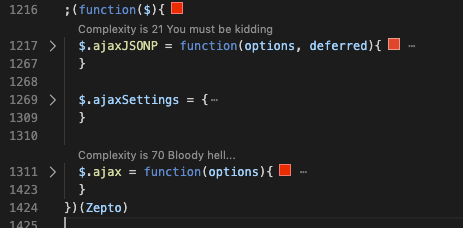

上图可以看出，静态方法的扩展跟实例方法类似，也是一个自执行函数，直接将方法添加到了`$`上。

其实Zepto也有`$.extend`方法:

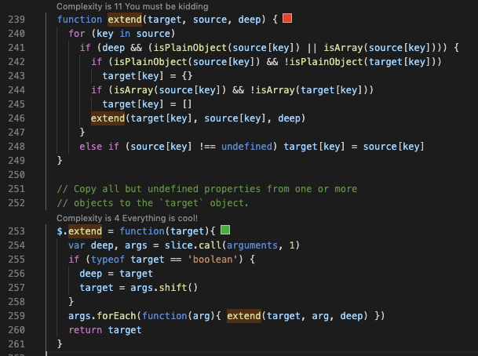

从源码可以看出，`$.extend`只是将一个对象拷贝到`target`上，并没有jQuery中默认拷贝到`this`的功能。所以这个这个`extend`如果要拿来做扩展，应该这么写：

```javascript
;(function($){
  $.extend($.fn, {
    foo: function(){
      // `this` refers to the current Zepto collection.
      // When possible, return the Zepto collection to allow chaining.
      return this.html('bar')
    }
  })
})(Zepto)
```

这也是官方文档的例子。

无论是jQuery的`extend`扩展方法还是Zepto的自执行方法扩展方法，他们其实都起到了同一个效果，那就是将各个模块分开独立了。每一个模块独立使用一个`extend`或者自执行函数，既方便了阅读，也方便了维护，不同模块可能是不同人开发的，通过这种方法可以将各个模块集成起来。将这个方式暴露出去，还可以让第三方开发者开发插件。

### 建造者模式：Vue 2.0

建造者模式暴露出来的是一个类，而不是一个工厂，使用的时候需要用户new一个实例出来。比如Vue(v 2.6.11)，我们在使用的时候就是`new Vue()`获得一个实例，拿来使用。打开Vue源码，发现他也是一个自执行方法，而且也有一个`factory`方法，但是这个方法并没有返回一个实例，而是返回了一个`Vue`方法，这也就是我们真正new的那个Vue。


这个Vue方法也很简单，只有一个必须通过new执行的检测，注意这里的this，如果你直接调用这个方法，那这个this指向调用者或者window，他就不是一个Vue的实例，会抛出警告。如果你通过new来调用，这个方法就成了构造函数，这个this就指向new出来的那个实例对象，这个检测就能通过，然后做一些初始化操作。


Vue的调用层级并没有jQuery和Zepto那么深，函数挂载方式也很明显。在Vue构造函数下面就有几行代码执行了几个mixin。


我们随便打开一个mixin看看，这个mixin其实就是在`Vue.prototype`上添加了相关的属性，实例方法也是通过这种方式添加上去的。注意有些地方使用了直接赋值，有些地方使用了`Object.defineProperty`，这是因为`Object.defineProperty`可以限制属性的修改，可以设置成只读的，[具体可以看我这篇文章](https://juejin.im/post/5e1fcbf9e51d451c52193791#heading-1)。


其实Vue也有一些静态方法，比如`Vue.extend`，这些方法也是直接添加到Vue上的，在源码里面有一个方法`initGlobalAPI`，这个方法里面就负责了静态方法的创建：

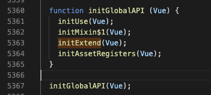

我们打开`initExtend`看看：

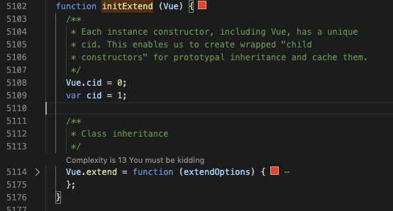

这个方法就直接把`extend`方法挂载到了`Vue`上成为了一个静态方法。

### 函数式：lodash-es

函数式其实就是一堆方法，然后组合使用这些方法来实现功能，也有很多框架是函数式的，比如lodash-es。原因主要有两个，一个是有一种理论是说，“组合大于继承”，如果继承层级过深，或者需要多重继承时，继承关系会比较混乱，后期维护也不方便。如果是不同函数组合完成功能的话，不需要用哪个函数，直接拿掉就行了。还有个比较现实的原因是tree-shaking，这是webpack自带的一个功能，他可以将没有使用的方法从最终生成的包里面拿掉，而只保留用到了的包。但是tree-shaking是基于export的，使用prototype继承或者class继承都没办法进行tree-shaking。考虑如下代码：

```javascript
function jquery() {}
jquery.prototype.css = function() {}
jquery.prototype.attr = function() {}
```

如果我们代码只用了css，而没有用attr，最终打包还是会将这两个方法都打包进去的。而如果换一种方法，换成函数式：

```javascript
export function css() {}
export function attr() {}
```

上面的代码在打包时就只会打包css，而不会打包attr。

比较典型的函数式框架是`lodash-es`，注意是**`lodash-es`**，而不是`lodash`，`lodash`是比较老的版本，不能支持tree-shaking，因为它仍然是采用的往全局对象(window)上挂载一个复杂对象的方法。而`lodash-es`就是将单个方法export出来的方法，如果你使用时只import了部分方法，其他没用到的方法并不会打包进去。


## 总结

1. 工厂模式适用于需要大量获取类似对象的场景，比如jQuery，我们在使用时可能需要获得很多dom的jQuery实例，工厂模式让使用者可以直接`$(selector)`这样用，而不需要new，使用起来更方便。

2. 建造者模式适用于获取一个或少数几个复杂对象的场景，比如我们使用Vue时，一般一个应用只需要new一个实例就行了。

3. 函数式一般适用于包含多个相互独立的方法的工具库，他们使用函数式可以减小最终包的体积。

通过本文的讲解，我们知道了，开源框架无非就这么几种架构。知道了一个框架的架构，我们就可以将一个复杂的框架进行庖丁解牛，将它分成一个一个的模块，再弄清楚各个模块是怎么通信的，就知道了他的蓝图，就再也不会有无从下手的感觉了。顺着不同的模块，我们可以一个一个将它读下去，读懂，那一个复杂框架的源码也就读懂了。

> 原创不易，每篇文章都耗费了作者大量的时间和心血，如果本文对你有帮助，请**点赞**支持作者，也让更多人看到本文~~
>
> 更多文章请看**[我的掘金文章汇总](https://juejin.im/post/5e3ffc85518825494e2772fd)**

