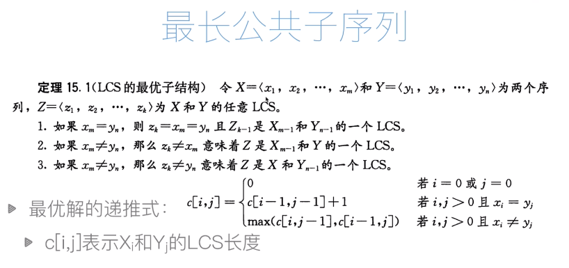
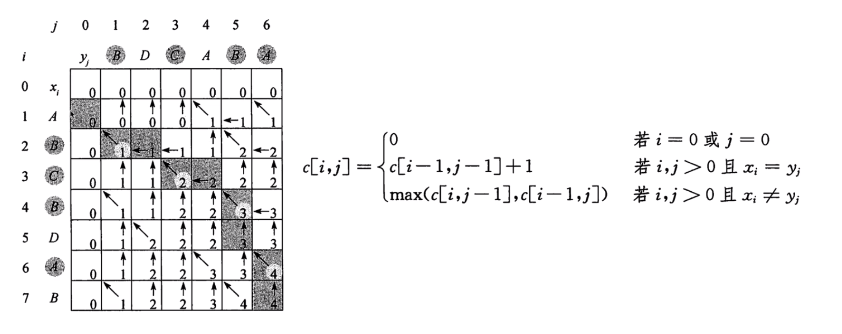

动态规划是一种常用的算法思想，很多朋友觉得不好理解，其实不然，如果掌握了他的核心思想，并且多多练习还是可以掌握的。下面我们从几个例题由浅入深的来讲讲动态规划。

## 斐波拉契数列

首先我们来看看斐波拉契数列，这是一个大家都很熟悉的数列：

```
// f = [1, 1, 2, 3, 5, 8]
f(1) = 1;
f(2) = 1;
f(n) = f(n-1) + f(n -2); // n > 2
```

有了上面的公式，我们很容易写出计算`f(n)`的递归代码：

```javascript
function fibonacci_recursion(n) {
  if(n === 1 || n === 2) {
    return 1;
  }
  
  return fibonacci_recursion(n - 1) + fibonacci_recursion(n - 2);
}

const res = fibonacci_recursion(5);
console.log(res);   // 5
```

现在我们考虑一下上面的计算过程，计算f(5)的时候需要f(4)与f(3)的值，计算f(4)的时候需要f(3)与f(2)的值，这里f(3)就重复算了两遍。在我们已知f(1)和f(2)的情况下，我们其实只需要计算f(3)，f(4)，f(5)三次计算就行了，但是从下图可知，为了计算f(5)，我们总共计算了8次其他值，里面f(3), f(2), f(1)都有多次重复计算。如果n不是5，而是一个更大的数，计算次数更是指数倍增长，这个递归算法的时间复杂度是$$O(2^n)$$。


### 非递归的斐波拉契数列

为了解决上面指数级的时间复杂度，我们不能用递归算法了，而要用一个普通的循环算法。应该怎么做呢？我们只需要加一个数组，里面记录每一项的值就行了，为了让数组与f(n)的下标相对应，我们给数组开头位置填充一个`0`：

```javascript
const res = [0, 1, 1];
f(n) = res[n];
```

我们需要做的就是给`res`数组填充值，然后返回第n项的值就行了:

```javascript
function fibonacci_no_recursion(n) {
  const res = [0, 1, 1];
  for(let i = 3; i <= n; i++){
    res[i] = res[i-1] + res[i-2];
  }
  
  return res[n];
}

const num = fibonacci_no_recursion(5);
console.log(num);   // 5
```

上面的方法就没有重复计算的问题，因为我们把每次的结果都存到一个数组里面了，计算f(n)的时候只需要将f(n-1)和f(n-2)拿出来用就行了，因为是从小往大算，所以f(n-1)和f(n-2)的值之前就算好了。这个算法的时间复杂度是O(n)，比$$O(2^n)$$好的多得多。这个算法其实就用到了动态规划的思想。

## 动态规划

动态规划主要有如下两个特点

1. 最优子结构：一个规模为n的问题可以转化为规模比他小的子问题来求解。换言之，f(n)可以通过一个比他规模小的递推式来求解，在前面的斐波拉契数列这个递推式就是f(n) = f(n-1) + f(n -2)。一般具有这种结构的问题也可以用递归求解，但是递归的复杂度太高。
2. 子问题的重叠性：如果用递归求解，会有很多重复的子问题，动态规划就是修剪了重复的计算来降低时间复杂度。但是因为需要存储中间状态，空间复杂度是增加了。

其实动态规划的难点是归纳出递推式，在斐波拉契数列中，递推式是已经给出的，但是更多情况递推式是需要我们自己去归纳总结的。

## 钢条切割问题


先看看暴力穷举怎么做，以一个长度为5的钢条为例：


上图红色的位置表示可以下刀切割的位置，每个位置可以有切和不切两种状态，总共是$$2^4 = 16$$种，对于长度为n的钢条，这个情况就是$$2^{n-1}$$种。穷举的方法就不写代码了，下面直接来看递归的方法：

### 递归方案

还是以上面那个长度为5的钢条为例，假如我们只考虑切一刀的情况，这一刀的位置可以是1，2，3，4中的任意位置，那切割之后，左右两边的长度分别是：

```
// [left, right]: 表示切了后左边，右边的长度
[1, 4]: 切1的位置
[2, 3]: 切2的位置
[3, 2]: 切3的位置
[4, 1]: 切4的位置
```

分成了左右两部分，那左右两部分又可以继续切，每部分切一刀，又变成了两部分，又可以继续切。这不就将一个长度为5的问题，分解成了4个小问题吗，那最优的方案就是这四个小问题里面最大的那个值，同时不要忘了我们也可以一刀都不切，这是第五个小问题，我们要的答案其实就是这5个小问题里面的最大值。写成公式就是，对于长度为n的钢条，最佳收益公式是：


* $$r_n$$ : 表示我们求解的目标，长度为n的钢条的最大收益
* $$p_n$$:  表示钢条完全不切的情况
* $$r_1 + r_{n-1}$$:  表示切在1的位置，分为了左边为1，右边为n-1长度的两端，他们的和是这种方案的最优收益
* 我们的最大收益就是不切和切在不同情况的子方案里面找最大值

上面的公式已经可以用递归求解了：

```javascript
const p = [0, 1, 5, 8, 9, 10, 17, 17, 20, 24, 30]; // 下标表示钢条长度，值表示对应价格

function cut_rod(n) {
  if(n === 1) return 1;
  
  let max = p[n];
  for(let i = 1; i < n; i++){
    let sum = cut_rod(i) + cut_rod(n - i);
    if(sum > max) {
      max = sum;
    }
  }
  
  return max;
}

cut_rod(9);  // 返回 25
```

上面的公式还可以简化，假如我们长度9的最佳方案是切成`2 3 2 2`，用前面一种算法，第一刀将它切成`2 7`和`5 4`，然后两边再分别切最终都可以得到`2 3 2 2`，所以`5 4`方案最终结果和`2 7`方案是一样的，都会得到`2 3 2 2`，如果这两种方案，两边都继续切，其实还会有重复计算。那长度为9的切第一刀，左边的值肯定是`1 -- 9`，我们从1依次切过来，如果后面继续对左边的切割，那继续切割的那个左边值必定是我们前面算过的一个左边值。比如`5 4`切割成`2 3 4`，其实等价于第一次切成`2 7`，第一次如果是`3 6`,如果继续切左边，切为`1 2 6`，其实等价于`1 8`，都是前面切左边为1的时候算过的。所以如果我们左边依次是从1切过来的，那么就没有必要再切左边了，只需要切右边。所以我们的公式可以简化为：
$$
r_n = \max_{1<=i<=n}(pi+r_{n-i})
$$
继续用递归实现这个公式：

```javascript
const p = [0, 1, 5, 8, 9, 10, 17, 17, 20, 24, 30]; // 下标表示钢条长度，值表示对应价格

function cut_rod2(n) {
  if(n === 1) return 1;
  
  let max = p[n];
  for(let i = 1; i <= n; i++){
    let sum = p[i] + cut_rod2(n - i);
    if(sum > max) {
      max = sum;
    }
  }
  
  return max;
}

cut_rod2(9);  // 结果还是返回 25
```

上面的两个公式都是递归，复杂度都是指数级的，下面我们来讲讲动态规划的方案。

### 动态规划方案

动态规划方案的公式和前面的是一样的，我们用第二个简化了的公式：
$$
r_n = \max_{1<=i<=n}(pi+r_{n-i})
$$
动态规划就是不用递归，而是从底向上计算值，每次计算上面的值的时候，下面的值算好了，直接拿来用就行。所以我们需要一个数组来记录每个长度对应的最大收益。

```javascript
const p = [0, 1, 5, 8, 9, 10, 17, 17, 20, 24, 30]; // 下标表示钢条长度，值表示对应价格

function cut_rod3(n) {
  let r = [0, 1];   // r数组记录每个长度的最大收益
  
  for(let i = 2; i <=n; i++) {
    let max = p[i];
    for(let j = 1; j <= i; j++) {
      let sum = p[j] + r[i - j];
      
      if(sum > max) {
        max = sum;
      }
    }
    
    r[i] = max;
  }
  
  console.log(r);
  return r[n];
}

cut_rod3(9);  // 结果还是返回 25
```

我们还可以把`r`数组也打出来看下，这里面存的是每个长度对应的最大收益：

```javascript
r = [0, 1, 5, 8, 10, 13, 17, 18, 22, 25]
```

使用动态规划将递归的指数级复杂度降到了双重循环，即$$O(n^2)$$的复杂度。

### 输出最佳方案

上面的动态规划虽然计算出来最大值，但是我们并不是知道这个最大值对应的切割方案是什么，为了知道这个方案，我们还需要一个数组来记录切割一次时左边的长度，然后在这个数组中回溯来找出切割方案。回溯的时候我们先取目标值对应的左边长度，然后右边剩下的长度又继续去这个数组找最优方案对应的左边切割长度。假设我们左边记录的数组是：

```
leftLength = [0, 1, 2, 3, 2, 2, 6, 1, 2, 3]
```

我们要求长度为9的钢条的最佳切割方案：

```
1. 找到leftLength[9], 发现值为3，记录下3为一次切割
2. 左边切了3之后，右边还剩6，又去找leftLength[6]，发现值为6，记录下6为一次切割长度
3. 又切了6之后，发现还剩0，切完了，结束循环；如果还剩有钢条继续按照这个方式切
4. 输出最佳长度为[3, 6]
```


改造代码如下：

```javascript
const p = [0, 1, 5, 8, 9, 10, 17, 17, 20, 24, 30]; // 下标表示钢条长度，值表示对应价格

function cut_rod3(n) {
  let r = [0, 1];   // r数组记录每个长度的最大收益
  let leftLength = [0, 1];  // 数组leftLength记录切割一次时左边的长度
  let solution = [];
  
  for(let i = 2; i <=n; i++) {
    let max = p[i];
    leftLength[i] = i;     // 初始化左边为整块不切
    for(let j = 1; j <= i; j++) {
      let sum = p[j] + r[i - j];
      
      if(sum > max) {
        max = sum;
        leftLength[i] = j;  // 每次找到大的值，记录左边的长度
      } 
    }
    
    r[i] = max;
  }
  
  // 回溯寻找最佳方案
  let tempN = n;
  while(tempN > 0) {
    let left = leftLength[tempN];
    solution.push(left);
    tempN = tempN - left;
  }
  
  console.log(leftLength);  // [0, 1, 2, 3, 2, 2, 6, 1, 2, 3]
  console.log(solution);    // [3, 6]
  console.log(r);           // [0, 1, 5, 8, 10, 13, 17, 18, 22, 25]
  return {max: r[n], solution: solution};
}

cut_rod3(9);  // {max: 25, solution: [3, 6]}
```

## 最长公共子序列（LCS）


上叙问题也可以用暴力穷举来求解，先列举出X字符串所有的子串，假设他的长度为m，则总共有$$2^m$$种情况，因为对于X字符串中的每个字符都有留着和不留两种状态，m个字符的全排列种类就是$$2^m$$种。那对应的Y字符串就有$$2^n$$种子串, n为Y的长度。然后再遍历找出最长的公共子序列，这个复杂度非常高，我这里就不写了。

我们观察两个字符串，如果他们最后一个字符相同，则他们的LCS(最长公共子序列简写)就是两个字符串都去掉最后一个字符的LCS再加一。因为最后一个字符相同，所以最后一个字符是他们的子序列，把他去掉，子序列就少了一个，所以他们的LCS是他们去掉最后一个字符的字符串的LCS再加一。如果他们最后一个字符不相同，那他们的LCS就是X去掉最后一个字符与Y的LCS，或者是X与Y去掉最后一个字符的LCS，是他们两个中较长的那一个。写成数学公式就是：



看着这个公式，一个规模为`(i, j)`的问题转化为了规模为`(i-1, j-1)`的问题，这不就又可以用递归求解了吗？

### 递归方案

公式都有了，不废话，直接写代码：

```javascript
function lcs(str1, str2) {
  let length1 = str1.length;
  let length2 = str2.length;
  
  if(length1 === 0 || length2 === 0) {
    return 0;
  }
  
  let shortStr1 = str1.slice(0, -1);
  let shortStr2 = str2.slice(0, -1);
  if(str1[length1 - 1] === str2[length2 -  1]){
    return lcs(shortStr1, shortStr2) + 1;
  } else {
    let lcsShort2 = lcs(str1, shortStr2);
    let lcsShort1 = lcs(shortStr1, str2);
    
    return lcsShort1 > lcsShort2 ? lcsShort1 : lcsShort2;
  }
}

let result = lcs('ABBCBDE', 'DBBCD');
console.log(result);   // 4
```

### 动态规划

递归虽然能实现我们的需求，但是复杂度是在太高，长一点的字符串需要的时间是指数级增长的。我们还是要用动态规划来求解，根据我们前面讲的动态规划原理，我们需要从小的往大的算，每算出一个值都要记下来。因为`c(i, j)`里面有两个变量，我们需要一个二维数组才能存下来。注意这个二维数组的行数是X的长度加一，列数是Y的长度加一，因为第一行和第一列表示X或者Y为空串的情况。代码如下：

```javascript
function lcs2(str1, str2) {
  let length1 = str1.length;
  let length2 = str2.length;
  
  // 构建一个二维数组
  // i表示行号，对应length1 + 1
  // j表示列号， 对应length2 + 1
  // 第一行和第一列全部为0
  let result = [];
  for(let i = 0; i < length1 + 1; i++){
    result.push([]); //初始化每行为空数组
    for(let j = 0; j < length2 + 1; j++){
      if(i === 0) {
        result[i][j] = 0; // 第一行全部为0
      } else if(j === 0) {
        result[i][j] = 0; // 第一列全部为0
      } else if(str1[i - 1] === str2[j - 1]){
        // 最后一个字符相同
        result[i][j] = result[i - 1][j - 1] + 1;
      } else{
        // 最后一个字符不同
        result[i][j] = result[i][j - 1] > result[i - 1][j] ? result[i][j - 1] : result[i - 1][j];
      }
    }
  }
  
  console.log(result);
  return result[length1][length2]
}

let result = lcs2('ABCBDAB', 'BDCABA');
console.log(result);   // 4
```

上面的`result`就是我们构造出来的二维数组，对应的表格如下，每一格的值就是`c(i, j)`，如果$$X_i = Y_j$$，则它的值就是他斜上方的值加一，如果$$X_i \neq Y_i$$，则它的值是上方或者左方较大的那一个。



### 输出最长公共子序列

要输出LCS，思路还是跟前面切钢条的类似，把每一步操作都记录下来，然后再回溯。为了记录操作我们需要一个跟`result`二维数组一样大的二维数组，每个格子里面的值是当前值是从哪里来的，当然，第一行和第一列仍然是0。每个格子的值要么从斜上方来，要么上方，要么左方，所以：

```
1. 我们用1来表示当前值从斜上方来
2. 我们用2表示当前值从左方来
3. 我们用3表示当前值从上方来
```

看代码：

```javascript
function lcs3(str1, str2) {
  let length1 = str1.length;
  let length2 = str2.length;
  
  // 构建一个二维数组
  // i表示行号，对应length1 + 1
  // j表示列号， 对应length2 + 1
  // 第一行和第一列全部为0
  let result = [];
  let comeFrom = [];   // 保存来历的数组
  for(let i = 0; i < length1 + 1; i++){
    result.push([]); //初始化每行为空数组
    comeFrom.push([]);
    for(let j = 0; j < length2 + 1; j++){
      if(i === 0) {
        result[i][j] = 0; // 第一行全部为0
        comeFrom[i][j] = 0;
      } else if(j === 0) {
        result[i][j] = 0; // 第一列全部为0
        comeFrom[i][j] = 0;
      } else if(str1[i - 1] === str2[j - 1]){
        // 最后一个字符相同
        result[i][j] = result[i - 1][j - 1] + 1;
        comeFrom[i][j] = 1;      // 值从斜上方来
      } else if(result[i][j - 1] > result[i - 1][j]){
        // 最后一个字符不同,值是左边的大
        result[i][j] = result[i][j - 1];
        comeFrom[i][j] = 2;
      } else {
        // 最后一个字符不同,值是上边的大
        result[i][j] = result[i - 1][j];
        comeFrom[i][j] = 3;
      }
    }
  }
  
  console.log(result);
  console.log(comeFrom);
  
  // 回溯comeFrom数组，找出LCS
  let pointerI = length1;
  let pointerJ = length2;
  let lcsArr = [];   // 一个数组保存LCS结果
  while(pointerI > 0 && pointerJ > 0) {
    console.log(pointerI, pointerJ);
    if(comeFrom[pointerI][pointerJ] === 1) {
      lcsArr.push(str1[pointerI - 1]);
      pointerI--;
      pointerJ--;
    } else if(comeFrom[pointerI][pointerJ] === 2) {
      pointerI--;
    } else if(comeFrom[pointerI][pointerJ] === 3) {
      pointerJ--;
    }
  }
  
  console.log(lcsArr);   // ["B", "A", "D", "B"]
  //现在lcsArr顺序是反的
  lcsArr = lcsArr.reverse();
  
  return {
    length: result[length1][length2], 
    lcs: lcsArr.join('')
  }
}

let result = lcs3('ABCBDAB', 'BDCABA');
console.log(result);   // {length: 4, lcs: "BDAB"}
```

## 最短编辑距离

这是[leetcode上的一道题目](https://leetcode-cn.com/problems/edit-distance/)，题目描述如下：


这道题目的思路跟前面最长公共子序列非常像，我们同样假设第一个字符串是$$X=(x_1, x_2 ... x_m)$$,第二个字符串是$$Y=(y_1, y_2 ... y_n)$$。我们要求解的目标为$$r$$, $$r[i][j]$$为长度为$$i$$的$$X$$和长度为$$j$$的$$Y$$的解。我们同样从两个字符串的最后一个字符开始考虑：

1. 如果他们最后一个字符是一样的，那最后一个字符就不需要编辑了，只需要知道他们前面一个字符的最短编辑距离就行了，写成公式就是：如果$$Xi = Y_j$$，$$r[i][j] = r[i-1][j-1]$$。
2. 如果他们最后一个字符是不一样的，那最后一个字符肯定需要编辑一次才行。那最短编辑距离就是$$X$$去掉最后一个字符与$$Y$$的最短编辑距离，再加上最后一个字符的一次；或者是是$$Y$$去掉最后一个字符与$$X$$的最短编辑距离，再加上最后一个字符的一次，就看这两个数字哪个小了。这里需要注意的是$$X$$去掉最后一个字符或者$$Y$$去掉最后一个字符，相当于在$$Y$$上进行插入和删除，但是除了插入和删除两个操作外，还有一个操作是替换，如果是替换操作，并不会改变两个字符串的长度，替换的时候，距离为$$r[i][j]=r[i-1][j-1]+1$$。最终是在这三种情况里面取最小值，写成数学公式就是：如果$$Xi \neq Y_j$$，$$r[i][j] = \min(r[i-1][j], r[i][j-1],r[i-1][j-1]) + 1$$。
3. 最后就是如果$$X$$或者$$Y$$有任意一个是空字符串，那为了让他们一样，就往空的那个插入另一个字符串就行了，最短距离就是另一个字符串的长度。数学公式就是：如果$$i=0$$，$$r[i][j] = j$$；如果$$j=0$$，$$r[i][j] = i$$。

上面几种情况总结起来就是
$$
r[i][j]=
    \begin{cases}
      j, & \text{if}\ i=0 \\
      i, & \text{if}\ j=0 \\
      r[i-1][j-1], & \text{if}\ X_i=Y_j \\
      \min(r[i-1][j], r[i][j-1], r[i-1][j-1]) + 1, & \text{if} \ X_i\neq Y_j
    \end{cases}
$$

### 递归方案

老规矩，有了递推公式，我们先来写个递归：

```javascript
const minDistance = function(str1, str2) {
    const length1 = str1.length;
    const length2 = str2.length;

    if(!length1) {
        return length2;
    }

    if(!length2) {
        return length1;
    }

    const shortStr1 = str1.slice(0, -1);
    const shortStr2 = str2.slice(0, -1); 

    const isLastEqual = str1[length1-1] === str2[length2-1];

    if(isLastEqual) {
        return minDistance(shortStr1, shortStr2);
    } else {
        const shortStr1Cal = minDistance(shortStr1, str2);
        const shortStr2Cal = minDistance(str1, shortStr2);
        const updateCal = minDistance(shortStr1, shortStr2);

        const minShort = shortStr1Cal <= shortStr2Cal ? shortStr1Cal : shortStr2Cal;
        const minDis = minShort <= updateCal ? minShort : updateCal;

        return minDis + 1;
    }
}; 

//测试一下
let result = minDistance('horse', 'ros');
console.log(result);  // 3

result = minDistance('intention', 'execution');
console.log(result);  // 5
```

### 动态规划

上面的递归方案提交到leetcode会直接超时，因为复杂度太高了，指数级的。还是上我们的动态规划方案吧，跟前面类似，需要一个二维数组来存放每次执行的结果。

```javascript
const minDistance = function(str1, str2) {
    const length1 = str1.length;
    const length2 = str2.length;

    if(!length1) {
        return length2;
    }

    if(!length2) {
        return length1;
    }

    // i 为行，表示str1
    // j 为列，表示str2
    const r = [];
    for(let i = 0; i < length1 + 1; i++) {
        r.push([]);
        for(let j = 0; j < length2 + 1; j++) {
            if(i === 0) {
                r[i][j] = j;
            } else if (j === 0) {
                r[i][j] = i;
            } else if(str1[i - 1] === str2[j - 1]){ // 注意下标，i,j包括空字符串，长度会大1
                r[i][j] = r[i - 1][j - 1];
            } else {
                r[i][j] = Math.min(r[i - 1][j ], r[i][j - 1], r[i - 1][j - 1]) + 1;
            }
        }
    }

    return r[length1][length2];
};

//测试一下
let result = minDistance('horse', 'ros');
console.log(result);  // 3

result = minDistance('intention', 'execution');
console.log(result);  // 5
```

上述代码因为是双重循环，所以时间复杂度是$$O(mn)$$。

## 总结

动态规划的关键点是要找出递推式，有了这个递推式我们可以用递归求解，也可以用动态规划。用递归时间复杂度通常是指数级增长，所以我们有了动态规划。动态规划的关键点是从小往大算，将每一个计算记过的值都记录下来，这样我们计算大的值的时候直接就取到前面计算过的值了。动态规划可以大大降低时间复杂度，但是增加了一个存计算结果的数据结构，空间复杂度会增加。这也算是一种用空间换时间的策略了。