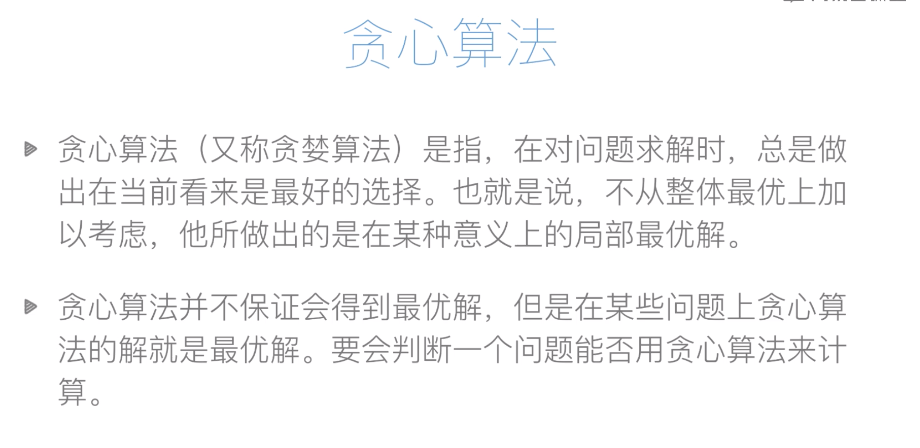
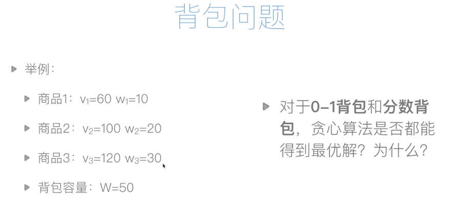
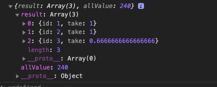
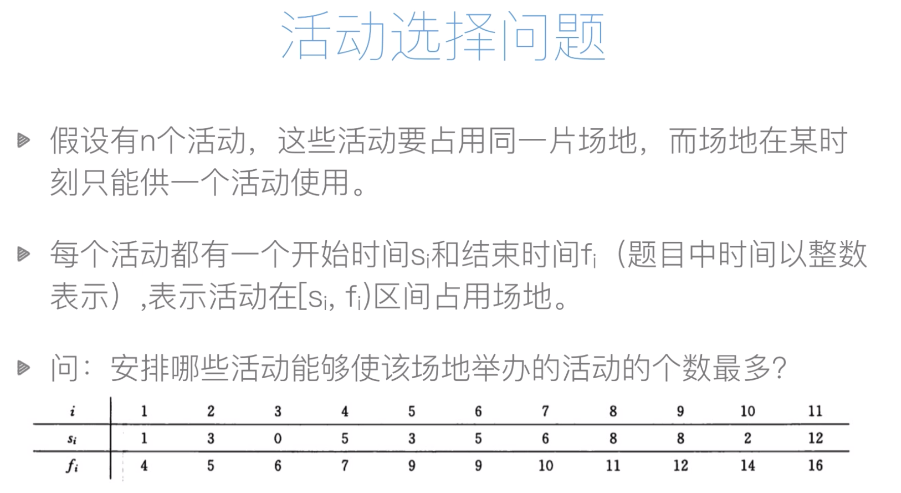
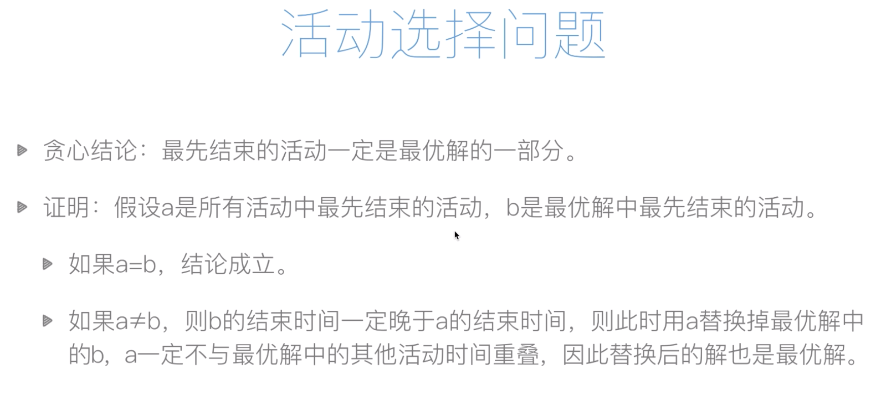

贪心算法是一种很常见的算法思想，而且很好理解，因为它符合人们一般的思维习惯。下面我们由浅入深的来讲讲贪心算法。

## 找零问题

我们先来看一个比较简单的问题：

> 假设你是一个商店老板，你需要给顾客找零n元钱，你手上有的钱的面值为：100元，50元，20元，5元，1元。请问如何找零使得所需要的钱币数量最少？
>
> 例子：你需要找零126元，则所需钱币数量最少的方案为100元1找，20元1张，5元1张，1元1张。

这个问题在生活中很常见，买东西的时候经常会遇到，那我们一般是怎么思考的呢？假设我们需要找零126元，我们先看看能找的最大面值是多少，我们发现126比100大，那肯定可以找一张100块，然后剩下26元，再看26能匹配的最大面值是多少，发现是20，那找一张20的，还剩6块，同样的思路，找一张5块的和1块的。这其实就是贪心算法的思想，每次都很贪心的去找最大的匹配那个值，然后再找次大的。这个算法代码也很好写：

```javascript
const allMoney = [100, 50, 20, 5, 1];  // 表示我们手上有的面值
function changeMoney(n, allMoney) {
  const length = allMoney.length;
  const result = [];    // 存储结果的数组，每项表示对应面值的张数
  for(let i = 0; i < length; i++) {
    if(n >= allMoney[i]) {
      // 如果需要找的钱比面值大，那就可以找，除一下看看能找几张
      result[i] = parseInt(n / allMoney[i]);
      n = n - result[i] * allMoney[i];   // 更新剩下需要找的钱
    } else {
      // 否则不能找
      result[i] = 0;
    }
  }
  
  return result;
}

const result = changeMoney(126, allMoney);
console.log(result);   // [1, 0, 1, 1, 1]
```

## 贪心算法

上面的找零问题就是贪心算法，每次都去贪最大面值的，发现贪不了了，再去贪次大的。从概念上讲，贪心算法是：



从上面的定义可以看出，并不是所有问题都可以用贪心算法来求解的，因为它每次拿到的只是局部最优解，局部最优解组合起来并不一定是全局最优解。下面我们来看一个这样的例子：

## 背包问题

背包问题也是一个很经典的算法问题，题目如下：

> 有一个小偷，他进到了一个店里要偷东西，店里有很多东西，每个东西的价值是v，每个东西的重量是w。但是小偷只有一个背包，他背包总共能承受的重量是W。请问怎么拿东西能让他拿到的价值最大？

其实背包问题细分下来又可以分成两个问题：0-1背包和分数背包。

>**0-1背包**：指的是对于某个商品来说，你要么不拿，要么全拿走，不能只拿一半或者只拿三分之二。可以将商品理解成金砖，你要么整块拿走，要么不拿，不能拿半块。

> **分数背包**：分数背包就是跟0-1背包相反的，你可以只拿一部分，可以拿一半，也可以拿三分之二。可以将商品理解成金砂，可以只拿一部分。

下面来看个例子：



这个问题用我们平时的思维也很好想，要拿到总价值最大，那我们就贪呗，就拿最贵的，即价值除以重量的数最大的。但是每次都拿最贵的，是不是最后总价值最大呢？我们先假设上面的例子是0-1背包，最贵的是v1，然后是v2，v3。我们先拿v1, 背包还剩40，拿到总价值是60，然后拿v2，背包还剩20，拿到总价值是160。然后就拿不下了，因为v3的重量是30，我们背包只剩20了，装不下了。但是这个显然不是全局最优解，因为我们明显可以看出，如果我们拿v2，v3，背包刚好装满，总价值是220，这才是最优解。**所以0-1背包问题不能用贪心算法。**

但是分数背包可以用贪心，因为我们总是可以拿最贵的。我们先拿了v1, v2，发现v3装不下了，那就不装完了嘛，装三分之二就行了。下面我们用贪心来实现一个分数背包：

```javascript
const products = [
  {id:1, v: 60, w: 10}, 
  {id:2, v: 100, w: 20}, 
  {id:3, v: 120, w: 30}
];    // 新建一个数组表示商品列表，每个商品加个id用于标识

function backpack(W, products) {
  const sortedProducts = products.sort((product1, product2) => {
    const price1 = product1.v / product1.w;
    const price2 = product2.v / product2.w;
    if(price1 > price2) {
      return -1;
    } else if(price1 < price2) {
      return 1;
    }
    
    return 0;
  });  // 先对商品按照价值从大到小排序
  
  const result = []; // 新建数组接收结果
  let allValue = 0;  // 拿到的总价值
  const length = sortedProducts.length;
  
  for(let i = 0; i < length; i++) {
    const sortedProduct = sortedProducts[i];
    if(W >= sortedProduct.w) {
      // 整个拿完
      result.push({
        id: sortedProduct.id,
        take: 1,     // 拿的数量
      });
      W = W - sortedProduct.w;
      allValue = allValue + sortedProduct.v;
    } else if(W > 0) {
      // 只能拿一部分
      result.push({
        id: sortedProduct.id,
        take: W / sortedProduct.w,     
      });
      allValue = allValue + sortedProduct.v * (W / sortedProduct.w);
      W = 0; // 装满了
    } else {
      // 不能拿了
      result.push({
        id: sortedProduct.id,
        take: 0,     
      });
    }
  }
  
  return {result: result, allValue: allValue};
}

// 测试一下
const result = backpack(50, products);
console.log(result);
```

运行结果：



### 0-1背包

前面讲过0-1背包不能用贪心求解，我们这里还是讲讲他怎么来求解吧。要解这个问题需要用到动态规划的思想，关于动态规划的思想，可以看看[我这篇文章](https://juejin.im/post/5e4b472251882549507b015f)，如果你只想看看贪心算法，可以跳过这一部分。假设我们背包放了n个商品，W是我们背包的总容量，我们这时拥有的总价值是$$D(n, W)$$。我们考虑最后一步，

> 假如我们不放最后一个商品，则总价值为$$D(n-1, W)$$

> 假设我们放了最后一个商品，则总价值为最后一个商品加上前面已经放了的价值，表示为$$v_n + D(n-1, W-w_n)$$，这时候需要满足的条件是$$ W >= w_n$$，即最后一个要放得下。

我们要求的最大解其实就是上述两个方案的最大值，表示如下：
$$
D(n, W) = max(D(n-1, W), v_n + D(n-1, W-w_n))
$$

#### 递归解法

有了递推公式，我们就可以用递归解法了：

```javascript
const products = [
  {id:1, v: 60, w: 10}, 
  {id:2, v: 100, w: 20}, 
	{id:3, v: 120, w: 30}
];    // 新建一个数组表示商品列表，每个商品加个id用于标识

function backpack01(n, W, products) {
  if(n < 0 || W <= 0) {
    return 0;
  }
  
  const noLast = backpack01(n-1, W, products);  // 不放最后一个
  
  let getLast = 0;
  if(W >= products[n].w){  // 如果最后一个放得下
    getLast = products[n].v + backpack01(n-1, W-products[n].w, products);
  }
  
  const result = Math.max(noLast, getLast);
  
  return result;
}

// 测试一下
const result = backpack01(products.length-1, 50, products);
console.log(result);   // 220
```

#### 动态规划

递归的复杂度很高，我们用动态规划重写一下：

```javascript
const products = [
  {id:1, v: 60, w: 10}, 
  {id:2, v: 100, w: 20}, 
	{id:3, v: 120, w: 30}
];    // 新建一个数组表示商品列表，每个商品加个id用于标识

function backpack01(W, products) {
  const d = [];      // 初始化一个数组放计算中间值，其实为二维数组，后面填充里面的数组
  const length = products.length;
  
  // i表示行，为商品个数，数字为 0 -- (length - 1)
  // j表示列，为背包容量，数字为 0 -- W
  for(let i = 0; i < length; i++){
    d.push([]);
    for(let j = 0; j <= W; j++) {
      if(j === 0) {
        // 背包容量为0
        d[i][j] = 0;
      } else if(i === 0) {
        if(j >= products[i].w) {
          // 可以放下第一个商品
          d[i][j] = products[i].v;
        } else {
          d[i][j] = 0;
        }
      } else {
        const noLast = d[i-1][j];
        
        let getLast = 0;
        if(j >= products[i].w) {
          getLast = products[i].v + d[i-1][j - products[i].w];
        }
        
        if(noLast > getLast) {
          d[i][j] = noLast;
        } else {
          d[i][j] = getLast;
        }
      }
    }
  }
  
  console.log(d);
  return d[length-1][W];
}

// 测试一下
const result = backpack01(50, products);
console.log(result);   // 220
```

#### 回溯最优解

为了能够输出最优解，我们需要将每个最后放入的商品记录下来，然后从最后往前回溯，将前面的代码改造如下：

```javascript
const products = [
  {id:1, v: 60, w: 10}, 
  {id:2, v: 100, w: 20}, 
	{id:3, v: 120, w: 30}
];    // 新建一个数组表示商品列表，每个商品加个id用于标识

function backpack01(W, products) {
  const d = [];      // 初始化一个数组放计算中间值，其实为二维数组，后面填充里面的数组
  const res = [];    // 记录每次放入的最后一个商品, 同样为二维数组
  const length = products.length;
  
  // i表示行，为商品个数，数字为 0 -- (length - 1)
  // j表示列，为背包容量，数字为 0 -- W
  for(let i = 0; i < length; i++){
    d.push([]);
    res.push([]);
    for(let j = 0; j <= W; j++) {
      if(j === 0) {
        // 背包容量为0
        d[i][j] = 0;
        res[i][j] = null;  
      } else if(i === 0) {
        if(j >= products[i].w) {
          // 可以放下第一个商品
          d[i][j] = products[i].v;
          res[i][j] = products[i];
        } else {
          d[i][j] = 0;
          res[i][j] = null;
        }
      } else {
        const noLast = d[i-1][j];
        
        let getLast = 0;
        if(j >= products[i].w) {
          getLast = products[i].v + d[i-1][j - products[i].w];
        }
        
        if(noLast > getLast) {
          d[i][j] = noLast;
        } else {
          d[i][j] = getLast;
          res[i][j] = products[i];   // 记录最后一个商品
        }
      }
    }
  }
  
  // 回溯res, 得到最优解
  let tempW = W;
  let tempI = length - 1;
  const bestSol = [];
  while (tempW > 0 && tempI >= 0) {
    const last = res[tempI][tempW];
    bestSol.push(last);
    tempW = tempW - last.w;
    tempI = tempI - 1;
  }
  
  console.log(d);
  console.log(bestSol);
  return {
    totalValue: d[length-1][W],
    solution: bestSol
  }
}

// 测试一下
const result = backpack01(50, products);
console.log(result);   // 220
```

上面代码的输出：


## 数字拼接问题

再来看一个贪心算法的问题，加深下理解，这个问题如下：


这个问题看起来也不难，我们有时候也会遇到类似的问题，我们可以很直观的想到一个解法：看哪个数字的第一个数字大，把他排前面，比如32和94，把第一位是9的94放前面，得到9432，肯定比32放前面的3294大。这其实就是按照字符串大小来排序嘛，字符大的排前面，但是这种解法正确吗？我们再来看两个数字，假如我们有728和7286，按照字符序，7286排前面，得到7286728，但是这个值没有728放前面的7287286大。说明单纯的字符序是搞不定这个的，对于两个数字a,b，如果他们的长度一样，那按照字符序就没问题，如果他们长度不一样，这个解法就不一定对了，那怎么办呢？其实也简单，我们看看a+b和b+a拼成的数字，哪个大就行了。

```
假设
a = 728
b = 7286
字符串： a + b = "7287286"
字符串： b + a = "7286728"
比较下这两个字符串, a + b比较大，a放前面就行了, 反之放到后面
```

上述算法就是一个贪心，这里贪的是什么的？贪的是`a + b`的值，要大的那个。在实现的时候，可以自己写个冒泡，也可以直接用数组的sort方法:

```javascript
const nums = [32, 94, 128, 1286, 6, 71];

function getBigNum(nums) {
  nums.sort((a, b) => {
    const ab = `${a}${b}`;
    const ba = `${b}${a}`;
    
    if(ab > ba) {
      return -1;   // ab大，a放前面
    } else if (ab < ba) {
      return 1;  
    }
    
    return 0;
  });
  
  return nums;
}

const res = getBigNum(nums);
console.log(res);    // [94, 71, 6, 32, 1286, 128]
```

## 活动选择问题

活动选择问题稍微难一点，也可以用贪心，但是需要贪的东西没前面的题目那么直观，我们先来看看题目：



这个问题应该这么思考：为了能尽量多的安排活动，我们在安排一个活动时，应该尽量给后面的活动多留时间，这样后面有机会可以安排更多的活动。换句话说就是，应该把结束时间最早的活动安排在第一个，再剩下的时间里面继续安排结束时间早的活动。这里的贪心其实贪的就是结束时间早的，这个结论其实可以用数学来证明的：



下面来实现下代码：

```javascript
const activities = [
  {start: 1, end: 4},
  {start: 3, end: 5},
  {start: 0, end: 6},
  {start: 5, end: 7},
  {start: 3, end: 9},
  {start: 5, end: 9},
  {start: 6, end: 10},
  {start: 8, end: 11},
  {start: 8, end: 12},
  {start: 2, end: 14},
  {start: 12, end: 16},
];

function chooseActivity(activities) {
  // 先按照结束时间从小到大排序
  activities.sort((act1, act2) => {
    if(act1.end < act2.end) {
      return -1;
    } else if(act1.end > act2.end) {
      return 1;
    }
    
    return 0;
  });
  
  const res = [];  // 接收结果的数组
  let lastEnd = 0; // 记录最后一个活动的结束时间
  
  for(let i = 0; i < activities.length; i++){
    const act = activities[i];
    if(act.start >= lastEnd) {
      res.push(act);
      lastEnd = act.end
    }
  }
  
  return res;
}

// 测试一下
const result = chooseActivity(activities);
console.log(result);
```

上面代码的运行结果如下：


## 总结

贪心算法的重点就在一个贪字，要找到贪的对象，然后不断的贪，最后把目标贪完，输出最优解。要注意的是，每次贪的时候其实拿到的都只是局部最优解，局部最优解不一定组成全局最优解，比如0-1背包，对于这种问题是不能用贪心的，要用其他方法求解。