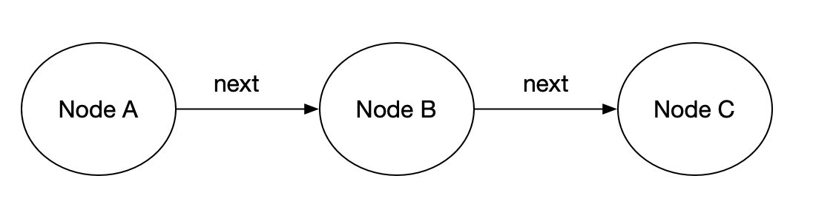

链表是一种很常见的数据结构，React的Fiber也是采用链表树的数据结构来解决主线程阻塞的问题。它有一个头结点以及多个普通节点组成，每个节点有自己的值，还有一个next属性指向下一个节点，最后一个节点的next为null。链表就通过next将一个个节点连接起来的。



一个典型的JS链表如下：

```javascript
const NodeD = {
  value: 4,
  next: null
};

const NodeC = {
  value: 3,
  next: NodeD
};

const NodeB = {
  value: 2,
  next: NodeC
};

const NodeA = {
  value: 1,
  next: NodeB
};

const LinkedList = {
  head: NodeA
};
```

## 遍历链表

遍历链表是一个很简单的操作，从head开始，通过next一个一个往下走就行，下面我们来实现一下：

```javascript
// 遍历方法还接收一个参数作为回调，可以用来对每个值进行处理
const traversal = (linkedList, callback) => {
  const headNode = linkedList.head;
  let currentNode = headNode;

  while(currentNode.next) {
    callback(currentNode.value);
    currentNode = currentNode.next;
  }

  // 处理最后一个节点的值
  callback(currentNode.value);
}

// 测试一下
let total = 0;
const sum = (value) => total = total + value;

traversal(LinkedList, sum);
console.log(total);
```

## 链表有环

如果我们最后一个节点的next不是null，而是指向第一个节点，我们上面的遍历代码就会陷入死循环。那怎么来判断是不是有环呢？方法其实跟[深拷贝处理循环引用很像](/Articles/JavaScript/Copy.html#解决循环引用):

```javascript
const hasCycle = (linkedList) => {
  const map = new WeakMap();
  const headNode = linkedList.head;
  let current = headNode;
  
  while(current.next){
    const exist = map.get(current);
    
    if(exist) return true;
    
    map.set(current, current.value);
    
    current = current.next;
  }
  
  return false;
}

// 用这个方法检测下前面的链表
console.log(hasCycle(LinkedList)); // false

// 来检测一个有环的
const NodeB2 = {
  value: 2,
};

const NodeA2 = {
  value: 1,
  next: NodeB2
};

NodeB2.next = NodeA2;

const LinkedList2 = {
  head: NodeA2
};
console.log(hasCycle(LinkedList2)); // true
```

上面的检测方法需要一个map来记录所有遍历过的对象，所以空间复杂度是O(n)，还有一个算法可以将空间复杂度降到O(1)。我们可以用两个指针来同时遍历链表，第一个指针的前进速度是1，第二个指针的前进速度是2，如果有环，他们肯定可以相遇：

```javascript
const hasCycle2 = (linkedList) => {
  const headNode = linkedList.head;
  let pointer1 = headNode;
  let pointer2 = headNode;
  
  while(pointer1.next){
    // pointer2跑得快，会先到尾部
    // 如果他到尾部了，说明没环
    if(!pointer2.next || !pointer2.next.next) {
      return false;
    }
    
    if(pointer1 === pointer2) {
      return ture;
    }
    
    pointer1 = pointer1.next;
    pointer2 = pointer2.next.next;
  }
  
  return false;
}
```

未完待续。。。