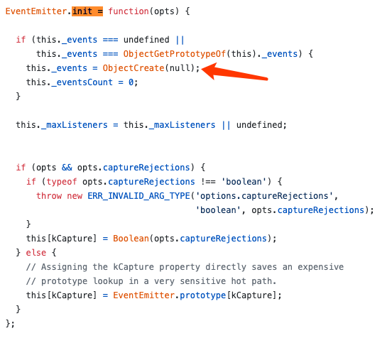
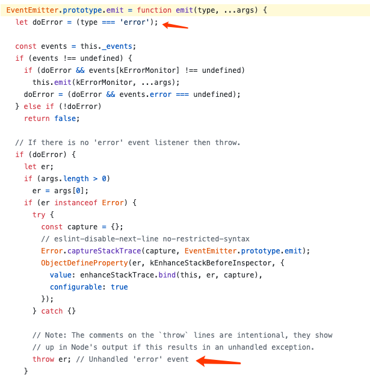
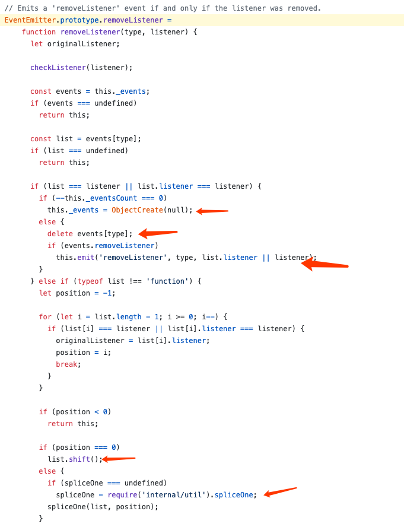
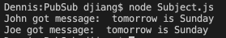

前面一篇文章[setTimeout和setImmediate到底谁先执行，本文让你彻底理解Event Loop](https://juejin.im/post/5e782486518825490455fb17)详细讲解了浏览器和Node.js的异步API及其底层原理Event Loop。本文会讲一下不用原生API怎么达到异步的效果，也就是发布订阅模式。发布订阅模式在面试中也是高频考点，本文会自己实现一个发布订阅模式，弄懂了他的原理后，我们就可以去读Node.js的`EventEmitter`源码，这也是一个典型的发布订阅模式。

本文所有例子已经上传到GitHub，同一个repo下面还有我所有博文和例子：

[https://github.com/dennis-jiang/Front-End-Knowledges/tree/master/Examples/DesignPatterns/PubSub](https://github.com/dennis-jiang/Front-End-Knowledges/tree/master/Examples/DesignPatterns/PubSub)

## 为什么要用发布订阅模式

在没有`Promise`之前，我们使用异步API的时候经常会使用回调，但是如果有几个互相依赖的异步API调用，回调层级太多可能就会陷入“回调地狱”。下面代码演示了假如我们有三个网络请求，第二个必须等第一个结束才能发出，第三个必须等第二个结束才能发起，如果我们使用回调就会变成这样：

```javascript
const request = require("request");

request('https://www.baidu.com', function (error, response) {
  if (!error && response.statusCode == 200) {
    console.log('get times 1');

    request('https://www.baidu.com', function(error, response) {
      if (!error && response.statusCode == 200) {
        console.log('get times 2');

        request('https://www.baidu.com', function(error, response) {
          if (!error && response.statusCode == 200) {
            console.log('get times 3');
          }
        })
      }
    })
  }
});
```

由于浏览器端ajax会有跨域问题，上述例子我是用Node.js运行的。这个例子里面有三层回调，我们已经有点晕了，如果再多几层，那真的就是“地狱”了。

## 发布订阅模式

发布订阅模式是一种设计模式，并不仅仅用于JS中，这种模式可以帮助我们解开“回调地狱”。他的流程如下图所示：


> 1. 消息中心：负责存储消息与订阅者的对应关系，有消息触发时，负责通知订阅者
> 2. 订阅者：去消息中心订阅自己感兴趣的消息
> 3. 发布者：满足条件时，通过消息中心发布消息

有了这种模式，前面处理几个相互依赖的异步API就不用陷入"回调地狱"了，只需要让后面的订阅前面的成功消息，前面的成功后发布消息就行了。

## 自己实现一个发布订阅模式

知道了原理，我们自己来实现一个发布订阅模式，这次我们使用ES6的class来实现，[如果你对JS的面向对象或者ES6的class还不熟悉，请看这篇文章](https://juejin.im/post/5e50e5b16fb9a07c9a1959af):

```javascript
class PubSub {
  constructor() {
    // 一个对象存放所有的消息订阅
    // 每个消息对应一个数组，数组结构如下
    // {
    //   "event1": [cb1, cb2]
    // }
    this.events = {}
  }

  subscribe(event, callback) {
    if(this.events[event]) {
      // 如果有人订阅过了，这个键已经存在，就往里面加就好了
      this.events[event].push(callback);
    } else {
      // 没人订阅过，就建一个数组，回调放进去
      this.events[event] = [callback]
    }
  }

  publish(event, ...args) {
    // 取出所有订阅者的回调执行
    const subscribedEvents = this.events[event];

    if(subscribedEvents && subscribedEvents.length) {
      subscribedEvents.forEach(callback => {
        callback.call(this, ...args);
      });
    }
  }

  unsubscribe(event, callback) {
    // 删除某个订阅，保留其他订阅
    const subscribedEvents = this.events[event];

    if(subscribedEvents && subscribedEvents.length) {
      this.events[event] = this.events[event].filter(cb => cb !== callback)
    }
  }
}
```

## 解决回调地狱

有了我们自己的`PubSub`，我们就可以用它来解决前面的毁掉地狱问题了:

```javascript
const request = require("request");
const pubSub = new PubSub();

request('https://www.baidu.com', function (error, response) {
  if (!error && response.statusCode == 200) {
    console.log('get times 1');
    // 发布请求1成功消息
    pubSub.publish('request1Success');
  }
});

// 订阅请求1成功的消息，然后发起请求2
pubSub.subscribe('request1Success', () => {
  request('https://www.baidu.com', function (error, response) {
    if (!error && response.statusCode == 200) {
      console.log('get times 2');
      // 发布请求2成功消息
      pubSub.publish('request2Success');
    }
  });
})

// 订阅请求2成功的消息，然后发起请求3
pubSub.subscribe('request2Success', () => {
  request('https://www.baidu.com', function (error, response) {
    if (!error && response.statusCode == 200) {
      console.log('get times 3');
      // 发布请求3成功消息
      pubSub.publish('request3Success');
    }
  });
})
```

## Node.js的EventEmitter

Node.js的`EventEmitter`思想跟我们前面的例子是一样的，不过他有更多的错误处理和更多的API，源码在GitHub上都有：[https://github.com/nodejs/node/blob/master/lib/events.js](https://github.com/nodejs/node/blob/master/lib/events.js)。我们挑几个API看一下：

### 构造函数

代码传送门: [https://github.com/nodejs/node/blob/master/lib/events.js#L64](https://github.com/nodejs/node/blob/master/lib/events.js#L64)


构造函数很简单，就一行代码，主要逻辑都在`EventEmitter.init`里面:



`EventEmitter.init`里面也是做了一些初始化的工作，`this._events`跟我们自己写的`this.events`功能是一样的，用来存储订阅的事件。核心代码我在图上用箭头标出来了。这里需要注意一点，如果一个类型的事件只有一个订阅,`this._events`就直接是那个函数了，而不是一个数组，在源码里面我们会多次看到对这个进行判断，这样写是为了提高性能。

### 订阅事件

代码传送门: [https://github.com/nodejs/node/blob/master/lib/events.js#L405](https://github.com/nodejs/node/blob/master/lib/events.js#L405)

`EventEmitter`订阅事件的API是`on`和`addListener`，从源码中我们可以看出这两个方法是完全一样的：


这两个方法都是调用了`_addListener`，这个方法对参数进行了判断和错误处理，核心代码仍然是往`this._events`里面添加事件:


### 发布事件

代码传送门：[https://github.com/nodejs/node/blob/master/lib/events.js#L263](https://github.com/nodejs/node/blob/master/lib/events.js#L263)

`EventEmitter`发布事件的API是`emit`，这个API里面会对"error"类型的事件进行特殊处理，也就是抛出错误：



如果不是错误类型的事件，就把订阅的回调事件拿出来执行:


### 取消订阅

代码传送门：[https://github.com/nodejs/node/blob/master/lib/events.js#L450](https://github.com/nodejs/node/blob/master/lib/events.js#L450)

`EventEmitter`里面取消订阅的API是`removeListener`和`off`，这两个是完全一样的。`EventEmitter`的取消订阅API不仅仅会删除对应的订阅，在删除后还会emit一个`removeListener`事件来通知外界。这里也会对`this._events`里面对应的`type`进行判断，如果只有一个，也就是说这个`type`的类型是`function`，会直接删除这个键，如果有多个订阅，就会找出这个订阅，然后删掉他。如果所有订阅都删完了，就直接将`this._events`置空：



## 观察者模式

这里再提一个很相似的设计模式：观察者模式，有些文章认为他和发布订阅模式是一样的，有些认为他们是有区别的。笔者认为他更像一个低配版的发布订阅模式，我们来实现一个看看：

```javascript
class Subject {
  constructor() {
    // 一个数组存放所有的订阅者
    // 每个消息对应一个数组，数组结构如下
    // [
    //   {
    //     observer: obj,
    //     action: () => {}
    //   }
    // ]
    this.observers = [];
  }

  addObserver(observer, action) {
    // 将观察者和回调放入数组
    this.observers.push({observer, action});
  }

  notify(...args) {
    // 执行每个观察者的回调
    this.observers.forEach(item => {
      const {observer, action} = item;
      action.call(observer, ...args);
    })
  }
}

const subject = new Subject();

// 添加一个观察者
subject.addObserver({name: 'John'}, function(msg){
  console.log(this.name, 'got message: ', msg);
})

// 再添加一个观察者
subject.addObserver({name: 'Joe'}, function(msg) {
  console.log(this.name, 'got message: ', msg);
})

// 通知所有观察者
subject.notify('tomorrow is Sunday');

```

上述代码的输出是：



通过这个输出可以看出一旦调了通知的方法`notify`，所有观察者都会收到通知，而且会收到同样的信息。而发布订阅模式还可以自定义需要接受的通知，所以说观察者模式是低配版的发布订阅模式。

## 总结

本文讲解了发布订阅模式的原理，并自己实现了一个简单的发布订阅模式。在了解了原理后，还去读了Node.js的`EventEmitter`模块的源码，进一步学习了生产环境的发布订阅模式的写法。总结下来发布订阅模式有以下特点：

1. 解决了“回调地狱”
2. 将多个模块进行了解耦，自己执行时，不需要知道另一个模块的存在，只需要关心发布出来的事件就行
3. 因为多个模块可以不知道对方的存在，自己关心的事件可能是一个很遥远的旮旯发布出来的，也不能通过代码跳转直接找到发布事件的地方，debug的时候可能会有点困难。
4. 观察者模式是低配版的发布订阅模式，一旦发布通知，所有观察者都会收到消息，不能做到发布订阅那样精细的控制。

**文章的最后，感谢你花费宝贵的时间阅读本文，如果本文给了你一点点帮助或者启发，请不要吝啬你的赞和GitHub小星星，你的支持是作者持续创作的动力。**

**作者博文GitHub项目地址： [https://github.com/dennis-jiang/Front-End-Knowledges](https://github.com/dennis-jiang/Front-End-Knowledges)**

**作者掘金文章汇总：[https://juejin.im/post/5e3ffc85518825494e2772fd](https://juejin.im/post/5e3ffc85518825494e2772fd)**