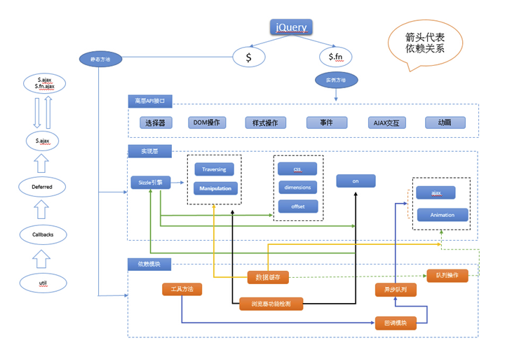
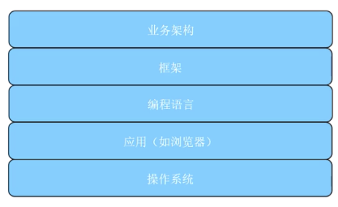
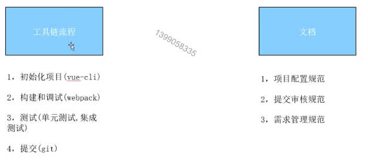
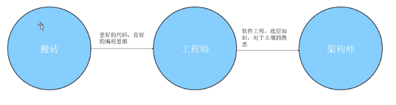

本篇文章主要讲作为一个前端负责人应该具备什么知识，在公司应该担任什么样的角色。其实前端负责人除了应该具备普通程序猿应该有的知识和能力之外，还应该知道：

1. 如何做架构设计。
2. 如何定义公司的前端规范。

## 架构

既然前端负责人要做架构设计，那什么是架构呢？我们先来看看什么是程序？其实从工程的角度来说，一个程序就是能独立完成一系列功能的软件，他可能包含很多模块，各个模块之间以某种方式来交流，最终合作来完成这些功能。所以：

```
程序 = 模块 + 消息交流
```

根据程序的定义，我们很容易知道架构设计是干什么的了。**架构设计就是划分出低耦合的模块，并高效的设计模块间的沟通。**架构师需要从需求出发将系统分成多个模块，让这些模块能够高效，低耦合的工作。我们以一个具体的例子来讲解架构应该怎么拆解，假如我们有这样一个需求：

*我们需要制作一个在线编辑器，需要能够调整字体大小和颜色，并且能够前进和后退。*

我们分析一下这个需求，来看看需要几个模块。因为是编辑器，肯定需要一个能够写字的地方，其实就是一个DOM元素的初始化，在初始化的时候可能还需要接收一些用户参数。然后是调整字体大小和颜色，那我们还需要一个模块来控制显示的样式。最后还需要支持前进和后退，也就是状态管理。根据这么划分，那我们至少需要三个模块：

1. DOM元素的初始化管理模块
2. 样式控制器
3. 状态管理器

我们尝试用这个划分来写一个简单的架构代码，只写结构，不实现具体代码：

```javascript
// DOM初始化
function initer(styleController, stateController) {
  this.styleController = styleController;
  this.stateController = stateController;
  this.dom = null;
}
initer.prototype.initConfig = function() {} // 初始化配置
initer.prototype.initDom = function(config) {   // 初始化DOM
  const finalConfig = this.initConfig(config);  // 合并用户配置，得到最终配置
  // 使用finalConfig,生成this.dom，代码省略
  // 给DOM绑定事件，各个模块在这里就是通过事件通信的
  // 这里以改变颜色为例
  this.dom.onClick = function() {   
    this.styleController.adjustColor('red');
  }
} 

// 样式管理器
function styleController() {
  
}
styleController.prototype.adjustSize = function() {}   // 调整字体大小
styleController.prototype.adjustColor = function() {}  // 调整颜色

// 状态控制器
function stateController() {
  this.stateArr = [];   // 存储状态
  this.nowState = 0;    // 当前状态
}
stateController.prototype.addState = function() {}  // 添加状态
stateController.prototype.backState = function() {}  // 后退状态
stateController.prototype.forwardState = function() {}  // 前进状态


// 需要一个整合的方法，这个方法才是最终暴露出去的方法
function writer(config) {
  this.styleController = new styleController();
  this.stateController = new stateController();
  this.initer = new initer(this.styleController, this.stateController);
  
  this.initer.initDom(config);  // 使用用户配置初始化DOM
}

// 挂载到window，别人new一下就可以用了
window.writer = writer;

```

将一个程序分成多个模块，可以降低他们的耦合，可以方便以后的更改。比如现在要添加一个改变字体粗细的功能，只需要修改`styleController`，添加一个方法就行了，而不用修改其他模块。

一个完整架构既包括上面提的业务模块，也有一些支持的库，比如组件库，工具库，共用css。


- **组件库**： 第三方通用库或者自己公司的UI库。使用自己的组件库，可以实现自己特定的功能，比如访问统计，还有可以复用，好维护等优点。
- **工具库**：比如cookie处理，对象拷贝，token验证等模块
- **公用css**：根据设计稿，将统一风格的css，比如颜色，字体大小，将这些提出来也利于后期的维护。

一个优秀的框架，比如jQuery，在架构上就分得很清晰，如下图所示，最下层都是一些支持的工具方法，中间是具体的实现，最上面才是他暴露出给外面用的业务API。



前面说的都是业务架构，一个架构师不仅仅要会做业务架构，还有个很重要的工作就是技术选型，决定用哪个框架，不用哪个框架，这要求架构师对多个框架都有了解才行。不一定每个都了解得非常深入，但是应该知道他的适用场景和优缺点。一个完整的宏观下沟如下图所示，前端架构主要关注业务架构和框架，因为编程语言，应用，操作系统并没有什么选择空间。



## 规范

前面讲了，架构的工作还有一部分是规范。这里的规范并不是指一纸空文，那并没有什么用。前端需要规范的主要包括以下3个方面：

1. 代码风格
2. 性能
3. 工作流程

这一系列标准并不是写在纸上或者来个大佬人工监督就行，而是要做成自动化的。如果不遵守这些规范，代码就写不了，写了也提交不了。

### 代码风格

代码风格可以用[eslint](https://eslint.bootcss.com/)来自动检测，根据官方网站的指导，写一个配置文件就行。

### 性能

用户浏览器的性能也是可以监控的，这需要用到一个API`window.performance`，每个浏览器都有这个。他里面包括了内存使用情况和响应时间情况，每次拿到这个数据都发送给服务器，就可以监控用户的性能了：


### 工作流程

工作流程我们可以在创建项目或者在项目里面添加文件时进行规范化限制，这可以使用自定义的cli实现。在Jenkins部署时，我们还可以跑一遍单元测试，如果单元测试没过，或者覆盖率不达标，可以直接让Jenkins报错。在git commit时，可以使用[husky](https://github.com/typicode/husky)进行检测，检测不过，直接不能提交代码。



## 总结

简单总结下初，中，高级工程师之间的路线区别，如下：



