# 手写一个webpack，看看AST怎么用

本文开始我会围绕`webpack`和`babel`写一系列的工程化文章，这两个工具我虽然天天用，但是对他们的原理理解的其实不是很深入，写这些文章的过程其实也是我深入学习的过程。由于`webpack`和`babel`的体系太大，知识点众多，不可能一篇文章囊括所有知识点，目前我的计划是从简单入手，先实现一个最简单的可以运行的`webpack`，然后再看看`plugin`, `loader`和`tree shaking`等功能。目前我计划会有这些文章：

1. 手写最简`webpack`，也就是本文
2. `webpack`的`plugin`实现原理
3. `webpack`的`loader`实现原理
4. `webpack`的`tree shaking`实现原理
5. `webpack`的`HMR`实现原理
6. `babel`和`ast`原理

所有文章都是原理或者源码解析，欢迎关注~

**本文可运行代码已经上传GitHub，大家可以拿下来玩玩：[https://github.com/dennis-jiang/Front-End-Knowledges/tree/master/Examples/Engineering/mini-webpack](https://github.com/dennis-jiang/Front-End-Knowledges/tree/master/Examples/Engineering/mini-webpack)**

**注意：本文主要讲`webpack`原理，在实现时并不严谨，而且只处理了`import`和`export`的`default`情况，如果你想在生产环境使用，请自己添加其他情况的处理和边界判断**。

## 为什么要用webpack

笔者刚开始做前端时，其实不知道什么`webpack`，也不懂模块化，都是`html`里面直接写`script`，引入`jquery`直接干。所以如果一个页面的JS需要依赖`jquery`和`lodash`，那`html`可能就长这样：

```html
<!DOCTYPE html>
<html>
  <head>
    <meta charset="utf-8" />
    <script src="https://unpkg.com/jquery@3.5.1"></script>
    <script src="https://unpkg.com/lodash@4.17.20"></script>
    <script src="./src/index.js"></script>
  </head>
  <body>
  </body>
</html>
```

这样写会导致几个问题：

1. 单独看`index.js`不能清晰的找到他到底依赖哪些外部库
2. `script`的顺序必须写正确，如果错了就会导致找不到依赖，直接报错
3. 模块间通信困难，基本都靠往`window`上注入变量来暴露给外部
4. 浏览器严格按照`script`标签来下载代码，有些没用到的代码也会下载下来
5. 当前端规模变大，JS脚本会显得很杂乱，项目管理混乱

`webpack`的一个最基本的功能就是来解决上述的情况，允许在JS里面通过`import`或者`require`等关键字来显式申明依赖，可以引用第三方库，自己的JS代码间也可以相互引用，这样在实质上就实现了前端代码的模块化。由于历史问题，老版的JS并没有自己模块管理方案，所以社区提出了很多模块管理方案，比如`ES2015`的`import`，`CommonJS`的`require`，另外还有`AMD`，`CMD`等等。就目前我见到的情况来说，`import`因为已经成为`ES2015`标准，所以在客户端广泛使用，而`require`是`Node.js`的自带模块管理机制，也有很广泛的用途，而`AMD`和`CMD`的使用已经很少见了。

但是`webpack`作为一个开放的模块化工具，他是支持`ES6`，`CommonJS`和`AMD`等多种标准的，不同的模块化标准有不同的解析方法，本文只会讲`ES6`标准的`import`方案，这也是客户端JS使用最多的方案。

## 简单例子

按照业界惯例，我也用`hello world`作为一个简单的例子，但是我将这句话拆成了几部分，放到了不同的文件里面。

先来建一个`hello.js`，只导出一个简单的字符串：

```javascript
const hello = 'hello';

export default hello;
```

然后再来一个`helloWorld.js`，将`hello`和`world`拼成一句话，并导出拼接的这个方法：

```javascript
import hello from './hello';

const world = 'world';

const helloWorld = () => `${hello} ${world}`;

export default helloWorld;
```

最后再来个`index.js`，将拼好的`hello world`插入到页面上去：

```javascript
import helloWorld from "./helloWorld";

const helloWorldStr = helloWorld();

function component() {
  const element = document.createElement("div");

  element.innerHTML = helloWorldStr;

  return element;
}

document.body.appendChild(component());
```

现在如果你直接在`html`里面引用`index.js`是不能运行成功的，因为大部分浏览器都不支持`import`这种模块导入。而`webpack`就是来解决这个问题的，它会将我们模块化的代码转换成浏览器认识的普通JS来执行。

### 引入webpack

我们印象中`webpack`的配置很多，很麻烦，但那是因为我们需要开启的功能很多，如果只是解析转换`import`，配置起来非常简单。

1. 先把依赖装上吧，这没什么好说的：

   ```javascript
   // package.json
   {
     "devDependencies": {
       "webpack": "^5.4.0",
       "webpack-cli": "^4.2.0"
     },
   }
   ```

2. 为了使用方便，再加个`build`脚本吧：

   ```javascript
   // package.json
   {
     "scripts": {
       "build": "webpack"
     },
   }
   ```

3. 最后再简单写下`webpack`的配置文件就好了：

   ```javascript
   // webpack.config.js
   
   const path = require("path");
   
   module.exports = {
     mode: "development",
     devtool: 'source-map',
     entry: "./src/index.js",
     output: {
       filename: "main.js",
       path: path.resolve(__dirname, "dist"),
     },
   };
   ```

   这个配置文件里面其实只要指定了入口文件`entry`和编译后的输出文件目录`output`就可以正常工作了，这里这个配置的意思是让`webpack`从`./src/index.js`开始编译，编译后的文件输出到`dist/main.js`这个文件里面。

   这个配置文件上还有两个配置`mode`和`devtool`只是我用来方便调试编译后的代码的，`mode`指定用哪种模式编译，默认是`production`，会对代码进行压缩和混淆，不好读，所以我设置为`development`；而`devtool`是用来控制生成哪种粒度的`source map`，简单来说，想要更好调试，就要更好的，更清晰的`source map`，但是编译速度变慢；反之，想要编译速度快，就要选择粒度更粗，更不好读的`source map`，`webpack`提供了很多可供选择的`source map`，[具体的可以看他的文档](https://webpack.docschina.org/configuration/devtool/)。

4. 然后就可以在`dist`下面建个`index.html`来引用编译后的代码了：

   ```html
   // index.html
   
   <!DOCTYPE html>
   <html>
     <head>
       <meta charset="utf-8" />
     </head>
     <body>
       <script src="main.js"></script>
     </body>
   </html>
   ```

5. 运行下`yarn build`就会编译我们的代码，然后打开`index.html`就可以看到效果了。

   

## 深入原理

前面讲的这个例子很简单，一般也满足不了我们实际工程中的需求，但是对于我们理解原理却是一个很好的突破口，毕竟`webpack`这么庞大的一个体系，我们也不能一口吃个胖子，得一点一点来。

### webpack把代码编译成了啥？

为了弄懂他的原理，我们可以直接从编译后的代码入手，先看看他长啥样子，有的朋友可能一提到去看源码，心理就没底，其实我以前也是这样的。但是完全没有必要惧怕，他编译后的代码浏览器能够执行，那肯定就是普通的JS代码，不会藏着这么黑科技。

下面是编译完的代码截图：


虽然我们只有三个简单的JS文件，但是加上`webpack`自己的逻辑，编译后的文件还是有一百多行代码，所以即使我把具体逻辑折叠起来了，这个截图还是有点长，为了能够看清楚他的结构，我将它分成了4个部分，标记在了截图上，下面我们分别来看看这几个部分吧。

1. 第一部分其实就是一个对象`__webpack_modules__`，这个对象里面有三个属性，属性名字是我们三个模块的文件路径，属性的值是一个函数，我们随便展开一个`./src/helloWorld.js`看下：

   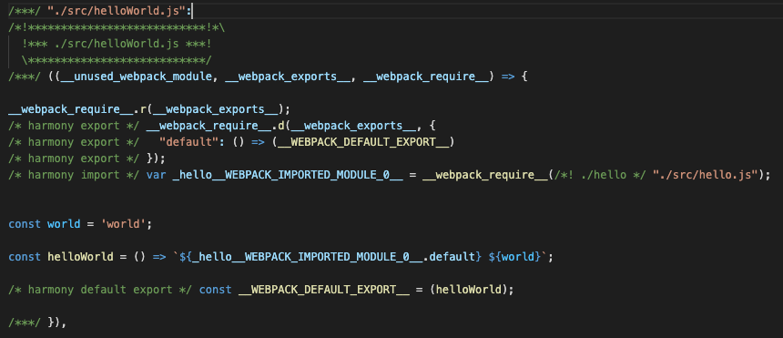

   我们发现这个代码内容跟我们自己写的`helloWorld.js`非常像：

   

   他只是在我们的代码前先调用了`__webpack_require__.r`和`__webpack_require__.d`，这两个辅助函数我们在后面会看到。

   然后对我们的代码进行了一点修改，将我们的`import`关键字改成了`__webpack_require__`函数，并用一个变量`_hello__WEBPACK_IMPORTED_MODULE_0__`来接收了`import`进来的内容，后面引用的地方也改成了这个，其他跟这个无关的代码，比如`const world = 'world';`还是保持原样的。

   这个`__webpack_modules__`对象存了所有的模块代码，其实对于模块代码的保存，在不同版本的`webpack`里面实现的方式并不一样，我这个版本是`5.4.0`，在`4.x`的版本里面好像是作为数组存下来，然后在最外层的立即执行函数里面以参数的形式传进来的。但是不管是哪种方式，都只是转换然后保存一下模块代码而已。

2. 第二块代码的核心是`__webpack_require__`，这个代码展开，瞬间给了我一种熟悉感：

   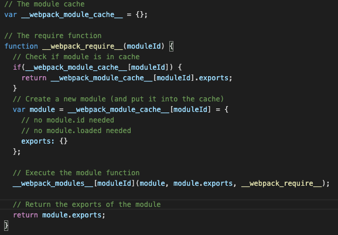

   来看一下这个流程吧：

   1. 先定义一个变量`__webpack_module_cache__`作为加载了的模块的缓存
   2. `__webpack_require__`其实就是用来加载模块的
   3. 加载模块时，先检查缓存中有没有，如果有，就直接返回缓存
   4. 如果缓存没有，就从`__webpack_modules__`将对应的模块取出来执行
   5. `__webpack_modules__`就是上面第一块代码里的那个对象，取出的模块其实就是我们自己写的代码，取出执行的也是我们每个模块的代码
   6. 每个模块执行除了执行我们的逻辑外，还会将`export`的内容添加到`module.exports`上，这就是前面说的`__webpack_require__.d`辅助方法的作用。添加到`module.exports`上其实就是添加到了`__webpack_module_cache__`缓存上，后面再引用这个模块就直接从缓存拿了。

   这个流程我太熟悉了，因为他简直跟`Node.js`的`CommonJS`实现思路一模一样，具体的可以看我之前写的这篇文章：[深入Node.js的模块加载机制，手写require函数](https://juejin.cn/post/6866973719634542606)。

3. 第三块代码其实就是我们前面看到过的几个辅助函数的定义，具体干啥的，其实他的注释已经写了：

   1. `__webpack_require__.d`：核心其实是`Object.defineProperty`，主要是用来将我们模块导出的内容添加到全局的`__webpack_module_cache__`缓存上。

      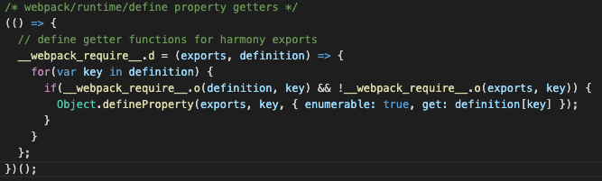

   2. `__webpack_require__.o`：其实就是`Object.prototype.hasOwnProperty`的一个简写而已。

      

   3. `__webpack_require__.r`：这个方法就是给每个模块添加一个属性`__esModule`，来表明他是一个`ES6`的模块。

           

   4. 第四块就一行代码，调用`__webpack_require__`加载入口模块，启动执行。

这样我们将代码分成了4块，每块的作用都搞清楚，其实webpack干的事情就清晰了：

1. 将`import`这种浏览器不认识的关键字替换成了`__webpack_require__`函数调用。
2. `__webpack_require__`在实现时采用了类似`CommonJS`的模块思想。
3. 一个文件就是一个模块，对应模块缓存上的一个对象。
4. 当模块代码执行时，会将`export`的内容添加到这个模块对象上。
5. 当再次引用一个以前引用过的模块时，会直接从缓存上读取模块。

### 自己实现一个webpack

现在webpack到底干了什么事情我们已经清楚了，接下来我们就可以自己动手实现一个了。根据前面最终生成的代码结果，我们要实现的代码其实主要分两块：

1. 遍历所有模块，将每个模块代码读取出来，替换掉`import`和`export`关键字，放到`__webpack_modules__`对象上。
2. 整个代码里面除了`__webpack_modules__`和最后启动的入口是变化的，其他代码，像`__webpack_require__`，`__webpack_require__.r`这些方法其实都是固定的，整个代码结构也是固定的，所以完全可以先定义好一个模板。

### 使用AST解析代码

由于我们需要将`import`这种代码转换成浏览器能识别的普通JS代码，所以我们首先要能够将代码解析出来。在解析代码的时候，可以将它读出来当成字符串替换，也可以使用更专业的`AST`来解析。`AST`全称叫`Abstract Syntax Trees`，也就是`抽象语法树`，是一个将代码用树来表示的数据结构，一个代码可以转换成`AST`，`AST`又可以转换成代码，而我们熟知的`babel`其实就可以做这个工作。要生成`AST`很复杂，涉及到编译原理，但是如果仅仅拿来用就比较简单了，本文就先不涉及复杂的编译原理，而是直接将`babel`生成好的`AST`拿来使用。

**注意： webpack源码解析AST并不是使用的`babel`，而是使用的[acorn](https://github.com/acornjs/acorn)，webpack继承`acorn`的`Parser`，自己实现了一个[JavascriptParser](https://github.com/webpack/webpack/blob/a07a1269f0a0b23d40de6c9565eeaf962fbc8904/lib/javascript/JavascriptParser.js)，本文写作时采用了`babel`，这也是一个大家更熟悉的工具**。

比如我先将入口文件读出来，然后用`babel`转换成`AST`可以直接这样写：

```javascript
const fs = require("fs");
const parser = require("@babel/parser");

const config = require("../webpack.config"); // 引入配置文件

// 读取入口文件
const fileContent = fs.readFileSync(config.entry, "utf-8");

// 使用babel parser解析AST
const ast = parser.parse(fileContent, { sourceType: "module" });

console.log(ast);   // 把ast打印出来看看
```

上面代码可以将生成好的`ast`打印在控制台：

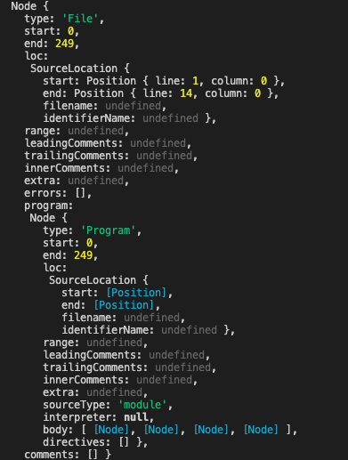

这虽然是一个完整的`AST`，但是看起来并不清晰，关键数据其实是`body`字段，这里的`body`也只是展示了类型名字。所以照着这个写代码其实不好写，这里推荐一个在线工具[https://astexplorer.net/](https://astexplorer.net/)，可以很清楚的看到每个节点的内容：

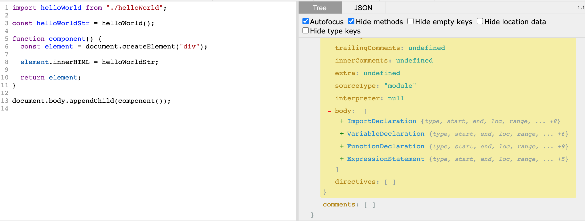

从这个解析出来的`AST`我们可以看到，`body`主要有4块代码：

1. `ImportDeclaration`：就是第一行的`import`定义
2. `VariableDeclaration`：第三行的一个变量申明
3. `FunctionDeclaration`：第五行的一个函数定义
4. `ExpressionStatement`：第十三行的一个普通语句

你如果把每个节点展开，会发现他们下面又嵌套了很多其他节点，比如第三行的`VariableDeclaration`展开后，其实还有个函数调用`helloWorld()`：


### 使用`traverse`遍历`AST`

对于这样一个生成好的`AST`，我们可以使用`@babel/traverse`来对他进行遍历和操作，比如我想拿到`ImportDeclaration`进行操作，就直接这样写：

```javascript
// 使用babel traverse来遍历ast上的节点
traverse(ast, {
  ImportDeclaration(path) {
    console.log(path.node);
  },
});
```

上面代码可以拿到所有的`import`语句：

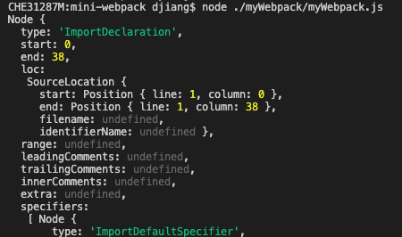

### 将`import`转换为函数调用

前面我们说了，我们的目标是将ES6的`import`：

```javascript
import helloWorld from "./helloWorld";
```

转换成普通浏览器能识别的函数调用：

```javascript
var _helloWorld__WEBPACK_IMPORTED_MODULE_0__ = __webpack_require__("./src/helloWorld.js");
```

为了实现这个功能，我们还需要引入`@babel/types`，这个库可以帮我们创建新的`AST`节点，所以这个转换代码写出来就是这样：

```javascript
const t = require("@babel/types");

// 使用babel traverse来遍历ast上的节点
traverse(ast, {
  ImportDeclaration(p) {
    // 获取被import的文件
    const importFile = p.node.source.value;

    // 获取文件路径
    let importFilePath = path.join(path.dirname(config.entry), importFile);
    importFilePath = `./${importFilePath}.js`;

    // 构建一个变量定义的AST节点
    const variableDeclaration = t.variableDeclaration("var", [
      t.variableDeclarator(
        t.identifier(
          `__${path.basename(importFile)}__WEBPACK_IMPORTED_MODULE_0__`
        ),
        t.callExpression(t.identifier("__webpack_require__"), [
          t.stringLiteral(importFilePath),
        ])
      ),
    ]);

    // 将当前节点替换为变量定义节点
    p.replaceWith(variableDeclaration);
  },
});
```

上面这段代码我们用了很多`@babel/types`下面的API，比如`t.variableDeclaration`，`t.variableDeclarator`，这些都是用来创建对应的节点的，[具体的API可以看这里](https://babeljs.io/docs/en/babel-types#variabledeclaration)。注意这个代码里面我有很多写死的地方，比如`importFilePath`生成逻辑，还应该处理多种后缀名的，还有最终生成的变量名`_${path.basename(importFile)}__WEBPACK_IMPORTED_MODULE_0__`，最后的数字我也是直接写了`0`，按理来说应该是根据不同的`import`顺序来生成的，但是本文主要讲`webpack`的原理，这些细节上我就没花过多时间了。

上面的代码其实是修改了我们的`AST`，修改后的`AST`可以用`@babel/generator`又转换为代码：

```javascript
const generate  = require('@babel/generator').default;

const newCode = generate(ast).code;
console.log(newCode);
```

这个打印结果是：

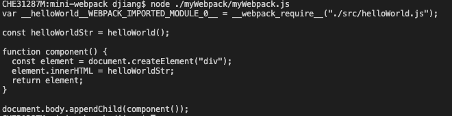

可以看到这个结果里面`import helloWorld from "./helloWorld";`已经被转换为`var __helloWorld__WEBPACK_IMPORTED_MODULE_0__ = __webpack_require__("./src/helloWorld.js");`。

### 替换`import`进来的变量

前面我们将`import`语句替换成了一个变量定义，变量名字也改为了`__helloWorld__WEBPACK_IMPORTED_MODULE_0__`，自然要将调用的地方也改了。为了更好的管理，我们将`AST`遍历，操作以及最后的生成新代码都封装成一个函数吧。

```javascript
function parseFile(file) {
  // 读取入口文件
  const fileContent = fs.readFileSync(file, "utf-8");

  // 使用babel parser解析AST
  const ast = parser.parse(fileContent, { sourceType: "module" });

  let importFilePath = "";

  // 使用babel traverse来遍历ast上的节点
  traverse(ast, {
    ImportDeclaration(p) {
      // 跟之前一样的
    },
  });

  const newCode = generate(ast).code;

  // 返回一个包含必要信息的新对象
  return {
    file,
    dependcies: [importFilePath],
    code: newCode,
  };
}
```

然后启动执行的时候就可以调这个函数了

```javascript
parseFile(config.entry);
```

拿到的结果跟之前的差不多：

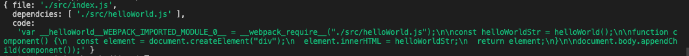

好了，现在需要将使用`import`的地方也替换了，因为我们已经知道了这个地方是将它作为函数调用的，也就是要将

```javascript
const helloWorldStr = helloWorld();
```

转为这个样子：

```javascript
const helloWorldStr = (0,_helloWorld__WEBPACK_IMPORTED_MODULE_0__.default)();
```

这行代码的效果其实跟`_helloWorld__WEBPACK_IMPORTED_MODULE_0__.default()`是一样的，为啥在前面包个`(0, )`，我也不知道，有知道的大佬告诉下我呗。

所以我们在`traverse`里面加一个`CallExpression`：

```javascript
  traverse(ast, {
    ImportDeclaration(p) {
      // 跟前面的差不多，省略了
    },
    CallExpression(p) {
      // 如果调用的是import进来的函数
      if (p.node.callee.name === importVarName) {
        // 就将它替换为转换后的函数名字
        p.node.callee.name = `${importCovertVarName}.default`;
      }
    },
  });
```

这样转换后，我们再重新生成一下代码，已经像那么个样子了：


### 递归解析多个文件

现在我们有了一个`parseFile`方法来解析处理入口文件，但是我们的文件其实不止一个，我们应该依据模块的依赖关系，递归的将所有的模块都解析了。要实现递归解析也不复杂，因为前面的`parseFile`的依赖`dependcies`已经返回了：

1. 我们创建一个数组存放文件的解析结果，初始状态下他只有入口文件的解析结果
2. 根据入口文件的解析结果，可以拿到入口文件的依赖
3. 解析所有的依赖，将结果继续加到解析结果数组里面
4. 一直循环这个解析结果数组，将里面的依赖文件解析完
5. 最后将解析结果数组返回就行

写成代码就是这样：

```javascript
function parseFiles(entryFile) {
  const entryRes = parseFile(entryFile); // 解析入口文件
  const results = [entryRes]; // 将解析结果放入一个数组

  // 循环结果数组，将它的依赖全部拿出来解析
  for (const res of results) {
    const dependencies = res.dependencies;
    dependencies.map((dependency) => {
      if (dependency) {
        const ast = parseFile(dependency);
        results.push(ast);
      }
    });
  }

  return results;
}
```

然后就可以调用这个方法解析所有文件了：

```javascript
const allAst = parseFiles(config.entry);
console.log(allAst);
```

看看解析结果吧：


这个结果其实跟我们最终需要生成的`__webpack_modules__`已经很像了，但是还有两块没有处理：

1. 一个是`import`进来的内容作为变量使用，比如

   ```javascript
   import hello from './hello';
   
   const world = 'world';
   
   const helloWorld = () => `${hello} ${world}`;
   ```

2. 另一个就是`export`语句还没处理

### 替换`import`进来的变量(作为变量调用)

前面我们已经用`CallExpression`处理过作为函数使用的`import`变量了，现在要处理作为变量使用的其实用`Identifier`处理下就行了，处理逻辑跟之前的`CallExpression`差不多：

```javascript
  traverse(ast, {
    ImportDeclaration(p) {
      // 跟以前一样的
    },
    CallExpression(p) {
			// 跟以前一样的
    },
    Identifier(p) {
      // 如果调用的是import进来的变量
      if (p.node.name === importVarName) {
        // 就将它替换为转换后的变量名字
        p.node.name = `${importCovertVarName}.default`;
      }
    },
  });
```

现在再运行下，`import`进来的变量名字已经变掉了：


### 替换`export`语句

从我们需要生成的结果来看，`export`需要进行两个处理：

1. 如果一个文件有`export default`，需要添加一个`__webpack_require__.d`的辅助方法调用，内容都是固定的，加上就行。
2. 将`export`语句转换为普通的变量定义。

对应生成结果上的这两个：

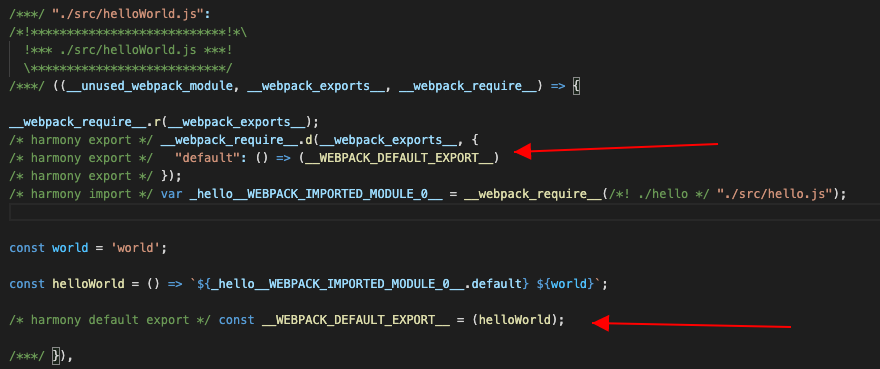

要处理`export`语句，在遍历`ast`的时候添加`ExportDefaultDeclaration`就行了：

```javascript
  traverse(ast, {
    ImportDeclaration(p) {
      // 跟以前一样的
    },
    CallExpression(p) {
			// 跟以前一样的
    },
    Identifier(p) {
      // 跟以前一样的
    },
    ExportDefaultDeclaration(p) {
      hasExport = true; // 先标记是否有export

      // 跟前面import类似的，创建一个变量定义节点
      const variableDeclaration = t.variableDeclaration("const", [
        t.variableDeclarator(
          t.identifier("__WEBPACK_DEFAULT_EXPORT__"),
          t.identifier(p.node.declaration.name)
        ),
      ]);

      // 将当前节点替换为变量定义节点
      p.replaceWith(variableDeclaration);
    },
  });
```

然后再运行下就可以看到`export`语句被替换了：


然后就是根据`hasExport`变量判断在`AST`转换为代码的时候要不要加`__webpack_require__.d`辅助函数：

```javascript
const EXPORT_DEFAULT_FUN = `
__webpack_require__.d(__webpack_exports__, {
   "default": () => (__WEBPACK_DEFAULT_EXPORT__)
});\n
`;

function parseFile(file) {
  // 省略其他代码
  // ......
  
  let newCode = generate(ast).code;

  if (hasExport) {
    newCode = `${EXPORT_DEFAULT_FUN} ${newCode}`;
  }
}
```

最后生成的代码里面`export`也就处理好了：

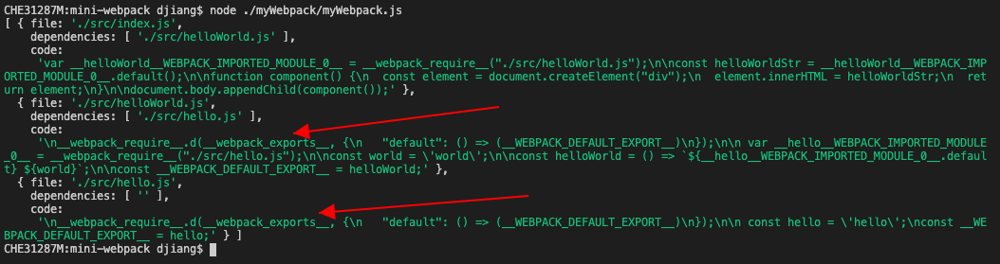

### 把`__webpack_require__.r`的调用添上吧

前面说了，最终生成的代码，每个模块前面都有个`__webpack_require__.r`的调用

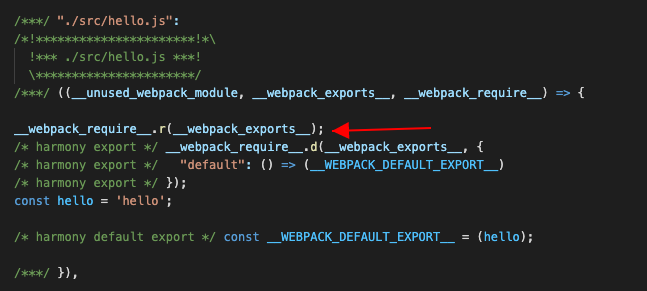

这个只是拿来给模块添加一个`__esModule`标记的，我们也给他加上吧，直接在前面`export`辅助方法后面加点代码就行了：

```javascript
const ESMODULE_TAG_FUN = `
__webpack_require__.r(__webpack_exports__);\n
`;

function parseFile(file) {
  // 省略其他代码
  // ......
  
  let newCode = generate(ast).code;

  if (hasExport) {
    newCode = `${EXPORT_DEFAULT_FUN} ${newCode}`;
  }
  
  // 下面添加模块标记代码
  newCode = `${ESMODULE_TAG_FUN} ${newCode}`;
}
```

再运行下看看，这个代码也加上了：


### 创建代码模板

到现在，最难的一块，模块代码的解析和转换我们其实已经完成了。下面要做的工作就比较简单了，因为最终生成的代码里面，各种辅助方法都是固定的，动态的部分就是前面解析的模块和入口文件。所以我们可以创建一个这样的模板，将动态的部分标记出来就行，其他不变的部分写死。这个模板文件的处理，你可以将它读进来作为字符串处理，也可以用模板引擎，我这里采用`ejs`模板引擎：

```javascript
// 模板文件，直接从webpack生成结果抄过来，改改就行
/******/ (() => { // webpackBootstrap
/******/ 	"use strict";
// 需要替换的__TO_REPLACE_WEBPACK_MODULES__
/******/ 	var __webpack_modules__ = ({
                <% __TO_REPLACE_WEBPACK_MODULES__.map(item => { %>
                    '<%- item.file %>' : 
                    ((__unused_webpack_module, __webpack_exports__, __webpack_require__) => {
                        <%- item.code %>
                    }),
                <% }) %>
            });
// 省略中间的辅助方法
    /************************************************************************/
    /******/ 	// startup
    /******/ 	// Load entry module
// 需要替换的__TO_REPLACE_WEBPACK_ENTRY
    /******/ 	__webpack_require__('<%- __TO_REPLACE_WEBPACK_ENTRY__ %>');
    /******/ 	// This entry module used 'exports' so it can't be inlined
    /******/ })()
    ;
    //# sourceMappingURL=main.js.map
```

### 生成最终的代码

生成最终代码的思路就是：

1. 模板里面用`__TO_REPLACE_WEBPACK_MODULES__`来生成最终的`__webpack_modules__`
2. 模板里面用`__TO_REPLACE_WEBPACK_ENTRY__`来替代动态的入口文件
3. `webpack`代码里面使用前面生成好的`AST`数组来替换模板的`__TO_REPLACE_WEBPACK_MODULES__`
4. `webpack`代码里面使用前面拿到的入口文件来替代模板的`__TO_REPLACE_WEBPACK_ENTRY__`
5. 使用`ejs`来生成最终的代码

所以代码就是：

```javascript
// 使用ejs将上面解析好的ast传递给模板
// 返回最终生成的代码
function generateCode(allAst, entry) {
  const temlateFile = fs.readFileSync(
    path.join(__dirname, "./template.js"),
    "utf-8"
  );

  const codes = ejs.render(temlateFile, {
    __TO_REPLACE_WEBPACK_MODULES__: allAst,
    __TO_REPLACE_WEBPACK_ENTRY__: entry,
  });

  return codes;
}
```

### 大功告成

最后将`ejs`生成好的代码写入配置的输出路径就行了：

```javascript
const codes = generateCode(allAst, config.entry);

fs.writeFileSync(path.join(config.output.path, config.output.filename), codes);
```

然后就可以使用我们自己的`webpack`来编译代码，最后就可以像之前那样打开我们的`html`看看效果了：


## 总结

本文使用简单质朴的方式讲述了`webpack`的基本原理，并自己手写实现了一个基本的支持`import`和`export`的`default`的`webpack`。

**本文可运行代码已经上传GitHub，大家可以拿下来玩玩：[https://github.com/dennis-jiang/Front-End-Knowledges/tree/master/Examples/Engineering/mini-webpack](https://github.com/dennis-jiang/Front-End-Knowledges/tree/master/Examples/Engineering/mini-webpack)**

下面再就本文的要点进行下总结：

1. `webpack`最基本的功能其实是将`JS`的高级模块化语句，`import`和`require`之类的转换为浏览器能认识的普通函数调用语句。
2. 要进行语言代码的转换，我们需要对代码进行解析。
3. 常用的解析手段是`AST`，也就是将代码转换为`抽象语法树`。
4. `AST`是一个描述代码结构的树形数据结构，代码可以转换为`AST`，`AST`也可以转换为代码。
5. `babel`可以将代码转换为`AST`，但是`webpack`官方并没有使用`babel`，而是基于[acorn](https://github.com/acornjs/acorn)自己实现了一个[JavascriptParser](https://github.com/webpack/webpack/blob/a07a1269f0a0b23d40de6c9565eeaf962fbc8904/lib/javascript/JavascriptParser.js)。
6. 本文从`webpack`构建的结果入手，也使用`AST`自己生成了一个类似的代码。
7. `webpack`最终生成的代码其实分为动态和固定的两部分，我们将固定的部分写入一个模板，动态的部分在模板里面使用`ejs`占位。
8. 生成代码动态部分需要借助`babel`来生成`AST`，并对其进行修改，最后再使用`babel`将其生成新的代码。
9. 在生成`AST`时，我们从配置的入口文件开始，递归的解析所有文件。即解析入口文件的时候，将它的依赖记录下来，入口文件解析完后就去解析他的依赖文件，在解析他的依赖文件时，将依赖的依赖也记录下来，后面继续解析。重复这种步骤，直到所有依赖解析完。
10. 动态代码生成好后，使用`ejs`将其写入模板，以生成最终的代码。
11. 如果要支持`require`或者`AMD`，其实思路是类似的，最终生成的代码也是差不多的，主要的差别在`AST`解析那一块。

## 参考资料

1. [babel操作AST文档](https://babeljs.io/docs/en/babel-types)
2. [webpack源码](https://github.com/webpack/webpack/)
3. [webpack官方文档](https://webpack.js.org/concepts/)

**文章的最后，感谢你花费宝贵的时间阅读本文，如果本文给了你一点点帮助或者启发，请不要吝啬你的赞和GitHub小星星，你的支持是作者持续创作的动力。**

**欢迎关注我的公众号[进击的大前端](https://test-dennis.oss-cn-hangzhou.aliyuncs.com/QRCode/QR430.jpg)第一时间获取高质量原创~**

**“前端进阶知识”系列文章：[https://juejin.im/post/5e3ffc85518825494e2772fd](https://juejin.im/post/5e3ffc85518825494e2772fd)**

**“前端进阶知识”系列文章源码GitHub地址： [https://github.com/dennis-jiang/Front-End-Knowledges](https://github.com/dennis-jiang/Front-End-Knowledges)**

