# 使用mono-repo实现跨项目组件共享

本文会分享一个我在实际工作中遇到的案例，从最开始的需求分析到项目搭建，以及最后落地的架构的整个过程。最终实现的效果是使用`mono-repo`实现了跨项目的组件共享。在本文中你可以看到：

1. 从接到需求到深入分析并构建架构的整个思考过程。
2. `mono-repo`的简单介绍。
3. `mono-repo`适用的场景分析。
4. 产出一个可以跨项目共享组件的项目架构。

**本文产出的架构模板已经上传到GitHub，如果你刚好需要一个mono-repo + react的模板，直接clone下来吧：[https://github.com/dennis-jiang/mono-repo-demo](https://github.com/dennis-jiang/mono-repo-demo)**

## 需求

### 需求概况

是这么个情况，我还是在那家外企供职，不久前我们接到一个需求：要给外国的政府部门或者他的代理机构开发一个可以缴纳水电费，顺便还能卖卖可乐的网站。主要使用场景是市政厅之类的地方，类似这个样子：


这张图是我在网上随便找的某银行的图片，跟我们使用场景有点类似。他有个自助的ATM机，远处还有人工柜台。我们也会有自助机器，另外也会有人工柜台，这两个地方都可以交水电费，汽车罚款什么的，唯一有个区别是人工那里除了交各种账单，还可能会卖点东西，比如口渴了买个可乐，烟瘾犯了来包中华。

### 需求分析

上面只是个概况，要做下来还有很多东西需要细化，柜员使用的功能和客户自助使用的功能看起来差不多，细想下来区别还真不少：

1. 无论是交账单还是卖可乐，我们都可以将它视为一个商品，既然卖商品那肯定有上架和下架的功能，也就是商品管理，这个肯定只能做在柜员端。
2. 市政厅人员众多，也会有上下级关系，普通柜员可能没有权限上/下架，他可能只有售卖权限，上/下架可能需要经理才能操作，这意味着柜员界面还需要权限管理。
3. 权限管理的基础肯定是用户管理，所以柜员界面需要做登陆和注册。
4. 客户自助界面只能交账单不能卖可乐很好理解，因为是自助机，旁边无人值守，如果摆几瓶可乐，他可能会拿了可乐不付钱。
5. 那客户自助交水电费需要登陆吗？不需要！跟国内差不多，只需要输入卡号和姓名等基本信息就可以查询到账单，然后线上信用卡就付了。所以客户界面不需要登陆和用户管理。

从上面这几点分析我们可以看出，柜员界面会多很多功能，包括商品管理，用户管理，权限管理等，而客户自助界面只能交账单，其他功能都没有。

### 原型设计

基于上面几点分析，我们的设计师很快设计了两个界面的原型。

**这个是柜员界面的**：


柜员界面看起来也很清爽，上面一个头部，左上角显示了当前机构的名称，右上角显示了当前用户的名字和设置入口。登陆/登出相关功能点击用户名可以看到，商品管理，用户管理需要点击设置按钮进行跳转。

**这个是客户自助界面的**：


这个是客户界面的，看起来基本是一样的，只是少了用户和设置那一块，卖的东西少了可乐，只能交账单。

## 技术

现在需求基本已经理清楚了，下面就该我们技术出马了，进行技术选型和架构落地。

### 一个站点还是两个站点？

首先我们需要考虑的一个问题就是，柜员界面和客户界面是做在一个网站里面，还是单独做两个网站？因为两个界面高度相似，所以我们完全可以做在一起，在客户自助界面隐藏掉右上角的用户和设置就行了。

但是这里面其实还隐藏着一个问题：**柜员界面是需要登陆的，所以他的入口其实是登陆页；客户界面不需要登陆，他的入口应该直接就是售卖页**。如果将他们做在一起，因为不知道是柜员使用还是客户使用，所以入口只能都是登录页，柜员直接登陆进入售卖页，对于客户可以单独加一个“客户自助入口”让他进入客户的售卖页面。但是这样**用户体验不好**，客户本来不需要登陆的，你给他看一个登录页可能会造成困惑，可能需要频繁求教工作人员才知道怎么用，会降低整体的工作效率，所以产品经理并不接受这个，要求客户一进来就需要看到客户的售卖页面。

而且从技术角度考虑，现在我们是一个`if...else...`隐藏用户和设置就行了，那万一以后两个界面差异变大，客户界面要求更花哨的效果，就不是简单的一个`if...else...`能搞定的了。**所以最后我们决定部署两个站点，柜员界面和客户界面单独部署到两个域名上**。

### 组件重复

既然是两个站点，考虑到项目的可扩展性，我们创建了两个项目。但是这两个项目的UI在目前阶段是如此相似，如果我们写两套代码，势必会有很多组件是重复的，比较典型的就是上面的商品卡片，购物车组件等。其实除了上面可以看到这些会重复外，我们往深入想，交个水费，我们肯定还需要用户输入姓名，卡号之类的信息，所以点了水费的卡片后肯定会有一个输入信息的表单，而且这个表单在柜员界面和客户界面基本是一样的，除了水费表单外，还有电费表单，罚单表单等等，所以可以预见重复的组件会非常多。

作为一个有追求的工程师，这种重复组件肯定不能靠CV大法来解决，我们得想办法让这些组件可以复用。那组件怎么复用呢？提个公共组件库嘛，相信很多朋友都会这么想。我们也是这么想的，但是公共组件库有多种组织方式，我们主要考虑了这么几种：

#### 单独NPM包

再创建一个项目，这个项目专门放这些可复用的组件，类似于我们平时用的`antd`之类的，创建好后发布到公司的私有NPM仓库上，使用的时候直接这样：

```javascript
import { Cart } from 'common-components';
```

但是，我们需要复用的这些组件跟`antd`组件有一个本质上的区别：**我们需要复用的是业务组件，而不是单纯的UI组件**。`antd`UI组件库为了保证通用性，基本不带业务属性，样式也是开放的。但是我这里的业务组件不仅仅是几个按钮，几个输入框，而是一个完整的表单，包括前端验证逻辑都需要复用，**所以我需要复用的组件其实是跟业务强绑定的**。因为他是跟业务强绑定的，即使我将它作为一个单独的NPM包发布出去，公司的其他项目也用不了。一个不能被其他项目共享的NPM包，始终感觉有点违和呢。

#### git submodule

另一个方案是`git submodule`，我们照样为这些共享组件创建一个新的Git项目，但是不发布到NPM仓库去骚扰别人，而是直接在我们主项目以`git submodule`的方式引用他。`git submodule`的基本使用方法网上有很多，我这里就不啰嗦了，主要说几个缺点，也是我们没采用他的原因：

1. 本质上`submodule`和主项目是两个不同的`git repo`，所以你需要为每个项目创建一套脚手架(代码规范，发布脚本什么的)。
2. `submodule`其实只是主项目保存了一个对子项目的依赖链接，说明了当前版本的主项目依赖哪个版本的子项目，你需要小心的使用`git submodule update`来管理这种依赖关系。如果没有正确使用`git submodule update`而搞乱了版本的依赖关系，那就呵呵了。。。
3. 发布的时候需要自己小心处理依赖关系，先发子项目，子项目好了再发布主项目。

#### mono-repo

`mono-repo`是现在越来越流行的一种项目管理方式了，与之相对的叫`multi-repo`。`multi-repo`就是`多个仓库`，上面的`git submodule`其实就是`multi-repo`的一种方式，主项目和子项目都是单独的`git仓库`，也就构成了`多个仓库`。而`mono-repo`就是`一个大仓库`，多个项目都放在`一个git仓库`里面。现在很多知名开源项目都是采用的`mono-repo`的组织方式，比如`Babel`，`React` ,`Jest`,  `create-react-app`, `react-router`等等。`mono-repo`特别适合联系紧密的多个项目，比如本文面临的这种情况，下面我们就进入本文的主题，认真看下`mono-repo`。

## mono-repo

其实我之前写[`react-router`源码解析的时候就提到过`mono-repo`](https://juejin.cn/post/6855129007949398029#heading-2)，当时就说有机会单独写一篇`mono-repo`的文章，本文也算是把坑填上了。所以我们先从`react-router`的源码结构入手，来看下`mono-repo`的整体情况，下图就是`react-router`的源码结构：

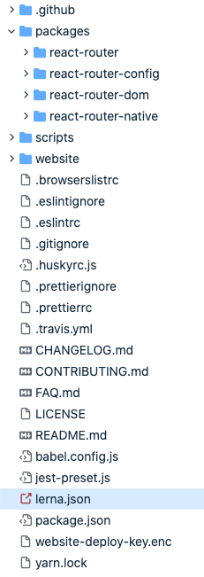

我们发现他有个`packages`文件夹，里面有四个项目：

1. **react-router**：是`React-Router`的核心库，处理一些共用的逻辑

2. **react-router-config**：是`React-Router`的配置处理库

3. **react-router-dom**：浏览器上使用的库，会引用`react-router`核心库

4. **react-router-native**：支持`React-Native`的路由库，也会引用`react-router`核心库

这四个项目都是为`react`的路由管理服务的，在业务上有很强的关联性，完成一个功能可能需要多个项目配合才能完成。比如修某个BUG需要同时改`react-router-dom`和`react-router`的代码，如果他们在不同的Git仓库，需要在两个仓库里面分别修改，提交，打包，测试，然后还要修改彼此依赖的版本号才能正常工作。但是使用了`mono-repo`，因为他们代码都在同一个Git仓库，我们在一个`commit`里面就可以修改两个项目的代码，然后统一打包，测试，发布，如果我们使用了`lerna`管理工具，版本号的依赖也是自动更新的，实在是方便太多了。

### lerna

`lerna`是最知名的`mono-repo`的管理工具，今天我们就要用它来搭建前面提到的共享业务组件的项目，我们目标的项目结构是这个样子的：

```bash
mono-repo-demo/                  --- 主项目，这是一个Git仓库
  package.json
  packages/
    common/                      --- 共享的业务组件
      package.json
    admin-site/                  --- 柜员网站项目
      package.json
    customer-site/               --- 客户网站项目
      package.json
```

### lerna init

`lerna`初始化很简单，先创建一个空的文件夹，然后运行：

```javascript
npx lerna init
```

这行命令会帮我创建一个空的`packages`文件夹，一个`package.json`和`lerna.json`，整个结构长这样：

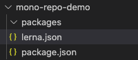

`package.json`中有一点需要注意，他的`private`必须设置为`true`，因为`mono-repo`本身的这个Git仓库并不是一个项目，他是多个项目，所以他自己不能直接发布，发布的应该是`packages/`下面的各个子项目。

```json
"private": true,
```

`lerna.json`初始化长这样：

```json
{
  "packages": [
    "packages/*"
  ],
  "version": "0.0.0"
}
```

`packages`字段就是标记你子项目的位置，默认就是`packages/`文件夹，当然他是一个数组，所以是支持多个不同位置的。另外一个需要特别注意的是`version`字段，这个字段有两个类型的值，一个是像上面的`0.0.0`这样一个具体版本号，还可以是`independent`这个关键字。如果是`0.0.0`这种具体版本号，那`lerna`管理的所有子项目都会有相同的版本号----`0.0.0`，如果你设置为`independent`，那各个子项目可以有自己的版本号，比如子项目1的版本号是`0.0.0`，子项目2的版本号可以是`0.1.0`。

### 创建子项目

现在我们的`packages/`目录是空的，根据我们前面的设想，我们需要创建三个项目：

1. `common`：共享的业务组件，本身不需要运行，放各种组件就行了。
2. `admin-site`：柜员站点，需要能够运行，使用`create-react-app`创建吧
3. `customer-site`：客户站点，也需要运行，还是使用`create-react-app`创建

创建子项目可以使用`lerna`的命令来创建：

```bash
lerna create <name>
```

也可以自己手动创建文件夹，这里`common`子项目我就用`lerna`命令创建吧，`lerna create common`，运行后·`common`文件夹就出现在`packages`下面了：


这个是使用`lerna create`默认生成的目录结构，`__test__`文件夹下面放得是单元测试内容，`lib`下面放得是代码。由于我是准备用它来放共享组件的，所以我把目录结构调整了，默认生成的两个文件夹都删了，新建了一个`components`文件夹：

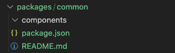

另外两个可运行站点都用`create-react-app`创建了，在`packages`文件夹下运行：

```bash
npx create-react-app admin-site; npx create-react-app customer-site;
```

几个项目都创建完后，整个项目结构是这样的：

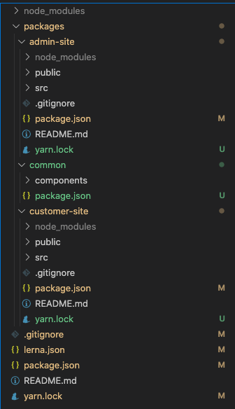

按照`mono-repo`的惯例，这几个子项目的名称最好命名为`@<主项目名称>/<子项目名称>`，这样当别人引用你的时候，你的这几个项目都可以在`node_modules`的同一个目录下面，目录名字就是`@<主项目名称>`，所以我们手动改下三个子项目`package.json`里面的`name`为：

```javascript
@mono-repo-demo/admin-site
@mono-repo-demo/common
@mono-repo-demo/customer-site
```

### lerna bootstrap

上面的图片可以看到，`packages/`下面的每个子项目有自己的`node_modules`，如果将它打开，会发现很多重复的依赖包，这会占用我们大量的硬盘空间。`lerna`提供了另一个强大的功能：**将子项目的依赖包都提取到最顶层**，我们只需要**先删除子项目的`node_modules`再跑下面这行命令就行了**：

```bash
lerna bootstrap --hoist
```

删除已经安装的子项目`node_modules`可以手动删，也可以用这个命令：

```bash
lerna clean
```

### yarn workspace

`lerna bootstrap --hoist`虽然可以将子项目的依赖提升到顶层，但是他的方式比较粗暴：先在每个子项目运行`npm install`，等所有依赖都安装好后，将他们移动到顶层的`node_modules`。这会导致一个问题，如果多个子项目依赖同一个第三方库，但是需求的版本不同怎么办？比如我们三个子项目都依赖`antd`，但是他们的版本不完全一样：

```json
// admin-site
"antd": "3.1.0"

// customer-site
"antd": "3.1.0"

// common
"antd": "4.9.4"
```

这个例子中`admin-site`和`customer-site`需要的`antd`版本都是`3.1.0`，但是`common`需要的版本却是`4.9.4`，如果使用`lerna bootstrap --hoist`来进行提升，`lerna`会提升用的最多的版本，也就是`3.1.0`到顶层，然后把子项目的`node_modules`里面的`antd`都删了。也就是说`common`去访问`antd`的话，也会拿到`3.1.0`的版本，这可能会导致`common`项目工作不正常。

这时候就需要介绍`yarn workspace` 了，他可以解决前面说的版本不一致的问题，`lerna bootstrap --hoist`会把所有子项目用的最多的版本移动到顶层，而`yarn workspace` 则会检查每个子项目里面依赖及其版本，如果版本不一样则会留在子项目自己的`node_modules`里面，只有完全一样的依赖才会提升到顶层。

还是以上面这个`antd`为例，使用`yarn workspace`的话，会把`admin-site`和`customer-site`的`3.1.0`版本移动到顶层，而`common`项目下会保留自己`4.9.4`的`antd`，这样每个子项目都可以拿到自己需要的依赖了。

`yarn workspace`使用也很简单，`yarn 1.0`以上的版本默认就是开启`workspace`的，所以我们只需要在顶层的`package.json`加一个配置就行：

```json
// 顶层package.json
{
  "workspaces": [
    "packages/*"
  ]
}
```

然后在`lerna.json`里面指定`npmClient`为`yarn`，并将`useWorkspaces`设置为`true`：

```json
// lerna.json
{
  "npmClient": "yarn",
  "useWorkspaces": true
}
```

使用了`yarn workspace`，我们就不用`lerna bootstrap`来安装依赖了，而是像以前一样`yarn install`就行了，他会自动帮我们提升依赖，这里的`yarn install`无论在顶层运行还是在任意一个子项目运行效果都是一样的。

### 启动子项目

现在我们建好了三个子项目，要启动CRA子项目，可以去那个目录下运行`yarn start`，但是频繁切换文件夹实在是太麻烦了。其实有了`lerna`的帮助我们可以直接在顶层运行，这需要用到`lerna`的这个功能：

```bash
lerna run [script]
```

比如我们在顶层运行了`lerna run start`，这相当于去每个子项目下面都去执行`yarn run start`或者`npm run start`，具体是`yarn`还是`npm`，取决于你在`lerna.json`里面的这个设置：

```json
"npmClient": "yarn"    
```

如果我只想在其中一个子项目运行命令，应该怎么办呢？加上`--scope`就行了，比如我就在顶层的`package.json`里面加了这么一行命令：

```json
// 顶层package.json
{
  "scripts": {
    "start:aSite": "lerna --scope @mono-repo-demo/admin-site run start"
  }
}
```

所以我们可以直接在顶层运行`yarn start:aSite`，这会启动前面说的管理员站点，他其实运行的命令还是`lerna run start`，然后加了`--scope`来指定在管理员子项目下运行，`@mono-repo-demo/admin-site`就是我们管理员子项目的名字，是定义在这个子项目的`package.json`里面的：

```json
// 管理员子项目package.json
{
  "name": "@mono-repo-demo/admin-site"
}
```

然后我们实际运行下`yarn start:aSite`吧：

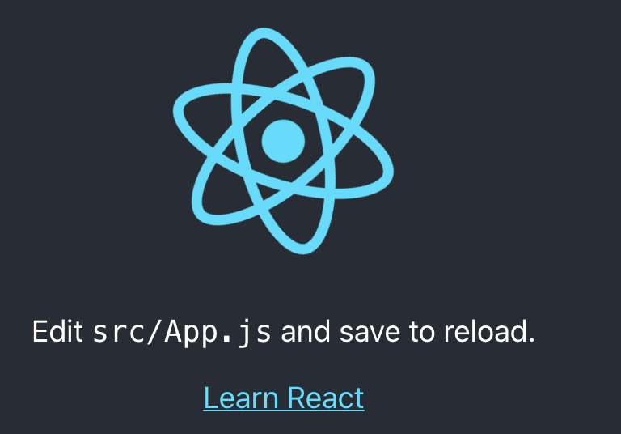

看到了我们熟悉的CRA转圈圈，说明到目前为止我们的配置还算顺利，哈哈~

### 创建公共组件

现在项目基本结构已经有了，我们建一个公共组件试一下效果。我们就用`antd`创建一个交水费的表单吧，也很简单，就一个姓名输入框，一个查询按钮。

```jsx
//  packages/common/components/WaterForm.js

import { Form, Input, Button } from 'antd';
const layout = {
  labelCol: {
    span: 8,
  },
  wrapperCol: {
    span: 16,
  },
};
const tailLayout = {
  wrapperCol: {
    offset: 8,
    span: 16,
  },
};

const WaterForm = () => {
  const onFinish = (values) => {
    console.log('Success:', values);
  };

  const onFinishFailed = (errorInfo) => {
    console.log('Failed:', errorInfo);
  };

  return (
    <Form
      {...layout}
      name="basic"
      initialValues={{
        remember: true,
      }}
      onFinish={onFinish}
      onFinishFailed={onFinishFailed}
    >
      <Form.Item
        label="姓名"
        name="username"
        rules={[
          {
            required: true,
            message: '请输入姓名',
          },
        ]}
      >
        <Input />
      </Form.Item>

      <Form.Item {...tailLayout}>
        <Button type="primary" htmlType="submit">
          查询
        </Button>
      </Form.Item>
    </Form>
  );
};

export default WaterForm;
```

### 引入公共组件

这个组件写好了，我们就在`admin-site`里面引用下他，要引用上面的组件，我们需要先在`admin-site`的`package.json`里面将这个依赖加上，我们可以去手动修改他，也可以使用`lerna`命令：

```bash
lerna add @mono-repo-demo/common --scope @mono-repo-demo/admin-site
```

这个命令效果跟你手动改`package.json`是一样的：


然后我们去把`admin-site`默认的CRA圈圈改成这个水费表单吧：

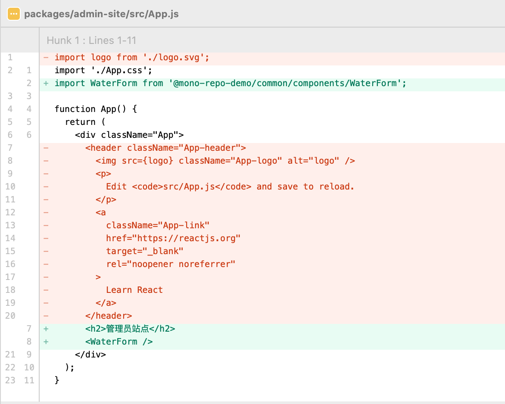

然后再运行下：

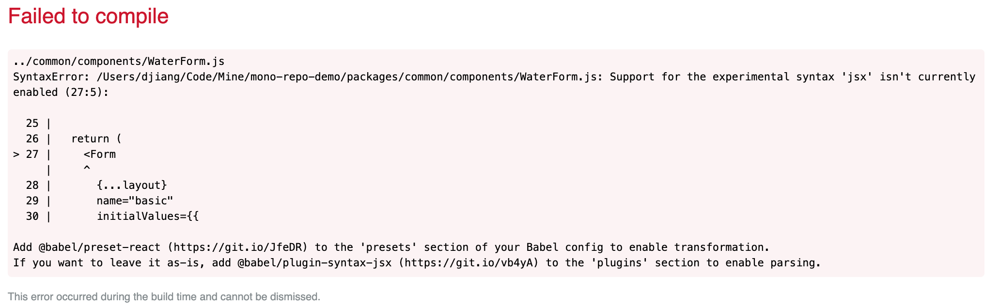

嗯？报错了。。。如果我说这个错误是我预料之中的，你信吗😜

### 共享脚手架

仔细看下上面的错误，是报在`WaterForm`这个组件里面的，错误信息是说：jsx语法不支持，最后两行还给了个建议，叫我们引入`babel`来编译。这些都说明了一个同问题：**babel的配置对common子项目没有生效**。这其实是预料之中的，我们的`admin-site`之所以能跑起来是因为CRA帮我们配置好了这些脚手架，而`common`这个子项目并没有配置这些脚手架，自然编译不了。

我们这几个子项目都是`React`的，其实都可以共用一套脚手架，所以我的方案是：**将CRA的脚手架全部eject出来，然后手动挪到顶层，让三个子项目共享。**

首先我们到`admin-site`下面运行：

```bash
yarn eject
```

这个命令会将CRA的`config`文件夹和`scripts`文件夹弹出来，同时将他们的依赖添加到`admin-site`的`package.json`里面。所以我们要干的就是手动将`config`文件夹和`scripts`文件夹移动到顶层，然后将CRA添加到`package.json`的依赖也移到最顶层，具体CRA改了`package.json`里面的哪些内容可以通过`git`看出来的。移动过后的项目结构长这样：


注意CRA项目的启动脚本在`scripts`文件夹里面，所以我们需要稍微修改下`admin-site`的启动命令：

```json
// admin-site package.json

{
  "scripts": "node ../../scripts/start.js",
}
```

现在我们使用`yarn start:aSite`仍然会报错，所以我们继续修改`babel`的设置。

首先在`config/paths`里面添加上我们`packages`的路径并`export`出去：

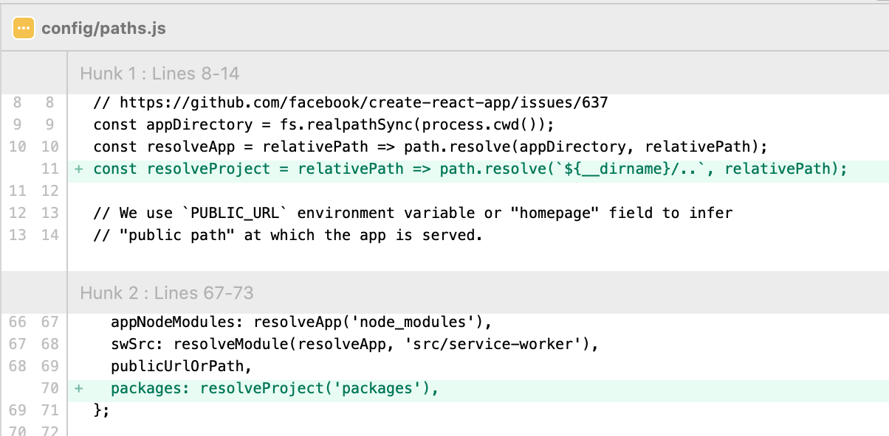

然后修改`webpacka`配置，在`babel-loader`的`include`路径里面添加上这个路径：

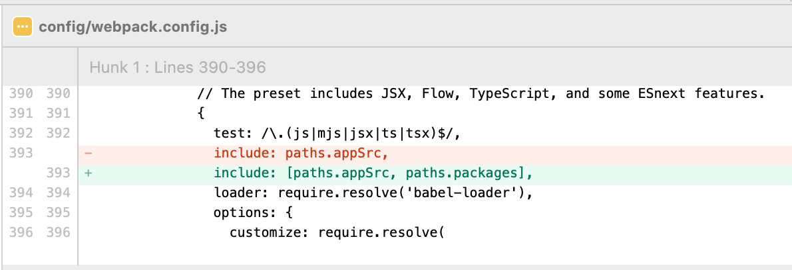

现在再运行下我们的项目就正常了：

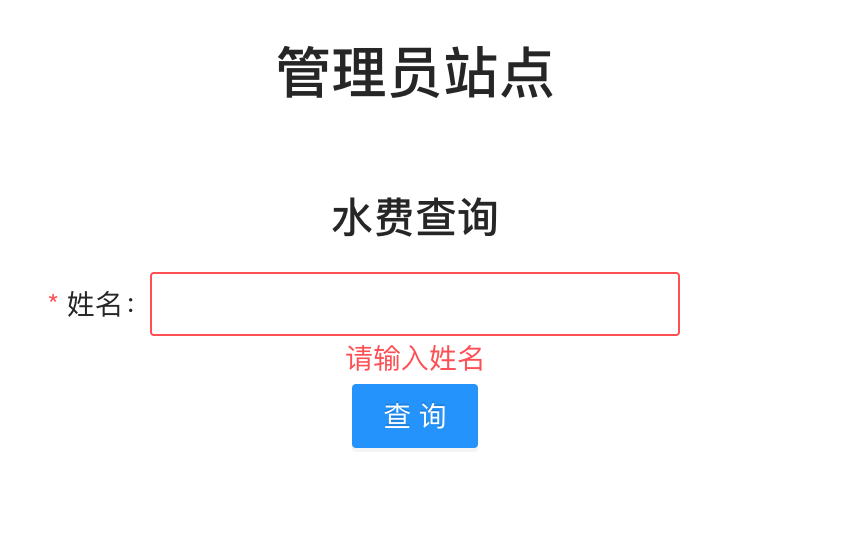

最后别忘了，还有我们的`customer-site`哦，这个处理起来就简单了，因为前面我们已经调好了整个主项目的结构，我们可以将`customer-site`的其他依赖都删了，只保留`@mono-repo-demo/common`，然后调整下启动脚本就行了：


这样客户站点也可以引入公共组件并启动了。

### 发布

最后要注意的一点是，当我们修改完成后，需要发布了，一定要使用`lerna publish`，他会自动帮我更新依赖的版本号。比如我现在不稍微修改了一下水费表单，然后提交：

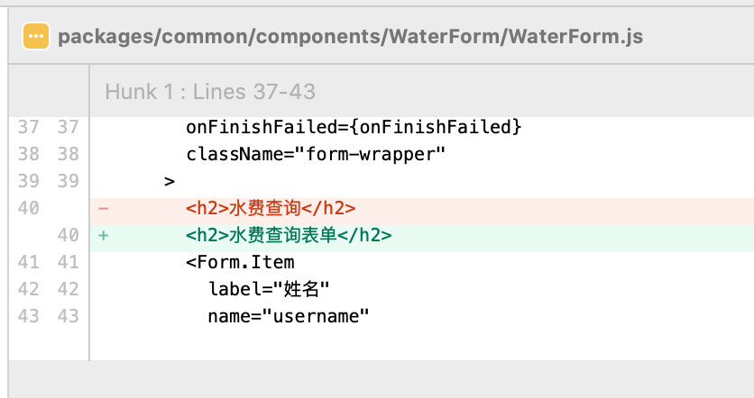

现在我试着发布一下，运行

```bash 
lerna publish
```

运行后，他会让你选择新的版本号：

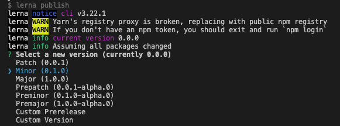

我这里选择一个`minor`，也就是版本号从`0.0.0`变成`0.1.0`,然后`lerna`会自动更新相关的依赖版本，包括：

1. `lerna.json`自己版本号升为`0.1.0`：

   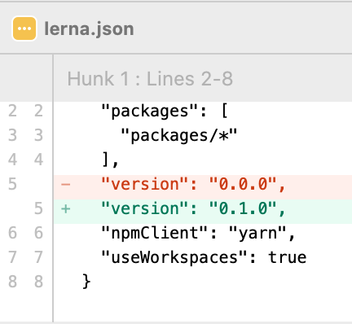

2. `common`的版本号变为`0.1.0`：

   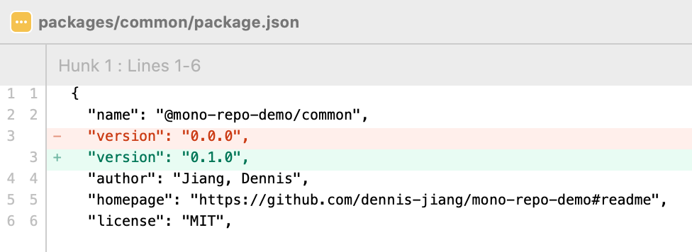

3. `admin-site`的版本号也变为`0.1.0`，同时更新依赖的`common`为`0.1.0`：

   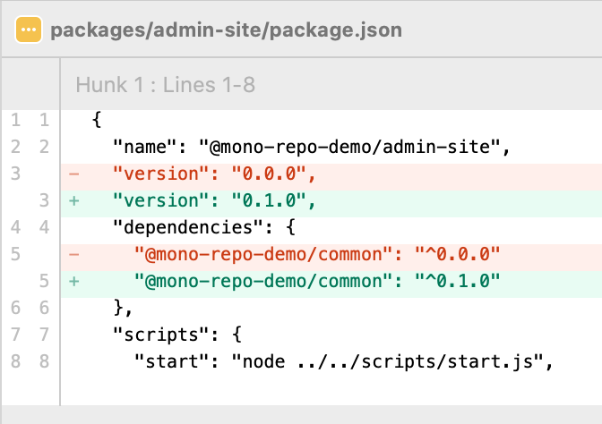

4. `customer-site`的变化跟`admin-site`是一样的。

### independent version

上面这种发布策略，我们修改了`common`的版本，`admin-site`的版本也跟着变了，按理来说，这个不是必须的，`admin-site`只需要更新依赖的`common`版本就行，自己的版本可以不变。**这种情况下，`admin-site`的版本要不要跟着变，取决于`lerna.json`里面的`version`配置，前面说过了，如果它是一个固定的指，那所有子项目版本会保持一致，所以`admin-site`版本会跟着变，我们将它改成`independent`就会不一样了。**

```json
// lerna.json
{
  "version": "independent"
}
```

然后我再改下`common`再发布试试：


在运行下`lerna publish`，我们发现他会让你自己一个一个来选子项目的版本，我这里就可以选择将`common`升级为`0.2.0`，而`admin-site`只是依赖变了，就可以升级为`0.1.1`:

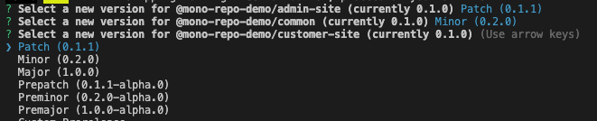

具体采用哪种策略，是每个子项目版本都保持一致还是各自版本独立，大家可以根据自己的项目情况决定。

## 总结

**这个`mono-repo`工程我已经把代码清理了一下，上传到了GitHub，如果你刚好需要一个`mono-repo + react`的项目模板，直接clone吧：[https://github.com/dennis-jiang/mono-repo-demo](https://github.com/dennis-jiang/mono-repo-demo)**

下面我们再来回顾下本文的要点：

1. 事情的起源是我们接到了一个外国人交水电费并能卖东西的需求，有柜员端和客户自助端。
2. 经过分析，我们决定将柜员端和客户自助端部署为两个站点。
3. 为了这两个站点，我们新建了两个项目，这样扩展性更好。
4. 这两个项目有很多长得一样的业务组件，我们需要复用他们。
5. 为了复用这些业务组件，我们引入了`mono-repo`的架构来进行项目管理。
6. `mono-repo`最出名的工具是`lerna`。
7. `lerna`可以自动管理各个项目之间的依赖以及`node_modules`。
8. 使用`lerna bootstrap --hoist`可以将子项目的`node_modules`提升到顶层，解决`node_modules`重复的问题。
9. 但是`lerna bootstrap --hoist`在提升时如果遇到各个子项目引用的依赖版本不一致，会提升使用最多的版本，从而导致少数派那个找不到正确的依赖，发生错误。
10. 为了解决提升时版本冲突的问题，我们引入了`yarn workspace`，他也会提升用的最多的版本，但是会为少数派保留自己的依赖在自己的`node_modules`下面。
11. 我们示例中两个CRA项目都有自己的脚手架，而`common`没有脚手架，我们调整了脚手架，将它挪到了最顶层，从而三个项目可以共享。
12. 发布的时候使用`lerna publish`，他会自动更新内部依赖，并更新各个子项目自己的版本号。
13. 子项目的版本号规则可以在`lerna.json`里面配置，如果配置为固定版本号，则各个子项目保持一致的版本，如果配置为`independent`关键字，各个子项目可以有自己不同的版本号。

## 参考资料

1. Lerna官网：[https://lerna.js.org/](https://lerna.js.org/)
2. Yarn workspace: [https://classic.yarnpkg.com/en/docs/workspaces/](https://classic.yarnpkg.com/en/docs/workspaces/)

**文章的最后，感谢你花费宝贵的时间阅读本文，如果本文给了你一点点帮助或者启发，请不要吝啬你的赞和GitHub小星星，你的支持是作者持续创作的动力。**

**作者博文GitHub项目地址： [https://github.com/dennis-jiang/Front-End-Knowledges](https://github.com/dennis-jiang/Front-End-Knowledges)**

**作者掘金文章汇总：[https://juejin.im/post/5e3ffc85518825494e2772fd](https://juejin.im/post/5e3ffc85518825494e2772fd)**

**欢迎关注我的公众号[进击的大前端](http://dennisgo.cn/images/Others/QR430.jpg)第一时间获取高质量原创~**

