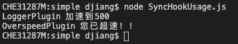
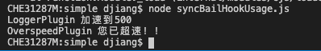

# webpack核心模块tapable源码解析

[上一篇文章我写了`tapable`的基本用法](https://juejin.cn/post/6939794845053485093)，我们知道他是一个增强版版的`发布订阅模式`，本文想来学习下他的源码。`tapable`的源码我读了一下，发现他的抽象程度比较高，直接扎进去反而会让人云里雾里的，所以本文会从最简单的`SyncHook`和`发布订阅模式`入手，再一步一步抽象，慢慢变成他源码的样子。

**本文可运行示例代码已经上传GitHub，大家拿下来一边玩一边看文章效果更佳：[https://github.com/dennis-jiang/Front-End-Knowledges/tree/master/Examples/Engineering/tapable-source-code](https://github.com/dennis-jiang/Front-End-Knowledges/tree/master/Examples/Engineering/tapable-source-code)**。

## `SyncHook`的基本实现

上一篇文章已经讲过`SyncHook`的用法了，我这里就不再展开了，他使用的例子就是这样子：

```javascript
const { SyncHook } = require("tapable");

// 实例化一个加速的hook
const accelerate = new SyncHook(["newSpeed"]);

// 注册第一个回调，加速时记录下当前速度
accelerate.tap("LoggerPlugin", (newSpeed) =>
  console.log("LoggerPlugin", `加速到${newSpeed}`)
);

// 再注册一个回调，用来检测是否超速
accelerate.tap("OverspeedPlugin", (newSpeed) => {
  if (newSpeed > 120) {
    console.log("OverspeedPlugin", "您已超速！！");
  }
});

// 触发一下加速事件，看看效果吧
accelerate.call(500);
```

其实这种用法就是一个最基本的`发布订阅模式`，我之前[讲发布订阅模式的文章](https://juejin.cn/post/6844904101331877895)讲过，我们可以仿照那个很快实现一个`SyncHook`：

```javascript
class SyncHook {
    constructor(args = []) {
        this._args = args;       // 接收的参数存下来
        this.taps = [];          // 一个存回调的数组
    }

    // tap实例方法用来注册回调
    tap(name, fn) {
        // 逻辑很简单，直接保存下传入的回调参数就行
        this.taps.push(fn);
    }

    // call实例方法用来触发事件，执行所有回调
    call(...args) {
        // 逻辑也很简单，将注册的回调一个一个拿出来执行就行
        const tapsLength = this.taps.length;
        for(let i = 0; i < tapsLength; i++) {
            const fn = this.taps[i];
            fn(...args);
        }
    }
}
```

这段代码非常简单，是一个最基础的`发布订阅模式`，使用方法跟上面是一样的，将`SyncHook`从`tapable`导出改为使用我们自己的：

```javascript
// const { SyncHook } = require("tapable");
const { SyncHook } = require("./SyncHook");
```

运行效果是一样的：



**注意：** 我们构造函数里面传入的`args`并没有用上，`tapable`主要是用它来动态生成`call`的函数体的，在后面讲代码工厂的时候会看到。

## `SyncBailHook`的基本实现

再来一个`SyncBailHook`的基本实现吧，`SyncBailHook`的作用是当前一个回调返回不为`undefined`的值的时候，阻止后面的回调执行。基本使用是这样的：

```javascript
const { SyncBailHook } = require("tapable");    // 使用的是SyncBailHook

const accelerate = new SyncBailHook(["newSpeed"]);

accelerate.tap("LoggerPlugin", (newSpeed) =>
  console.log("LoggerPlugin", `加速到${newSpeed}`)
);

// 再注册一个回调，用来检测是否超速
// 如果超速就返回一个错误
accelerate.tap("OverspeedPlugin", (newSpeed) => {
  if (newSpeed > 120) {
    console.log("OverspeedPlugin", "您已超速！！");

    return new Error('您已超速！！');
  }
});

// 由于上一个回调返回了一个不为undefined的值
// 这个回调不会再运行了
accelerate.tap("DamagePlugin", (newSpeed) => {
  if (newSpeed > 300) {
    console.log("DamagePlugin", "速度实在太快，车子快散架了。。。");
  }
});

accelerate.call(500);
```

他的实现跟上面的`SyncHook`也非常像，只是`call`在执行的时候不一样而已，`SyncBailHook`需要检测每个回调的返回值，如果不为`undefined`就终止执行后面的回调，所以代码实现如下：

```javascript
class SyncBailHook {
    constructor(args = []) {
        this._args = args;       
        this.taps = [];          
    }

    tap(name, fn) {
        this.taps.push(fn);
    }

    // 其他代码跟SyncHook是一样的，就是call的实现不一样
    // 需要检测每个返回值，如果不为undefined就终止执行
    call(...args) {
        const tapsLength = this.taps.length;
        for(let i = 0; i < tapsLength; i++) {
            const fn = this.taps[i];
            const res = fn(...args);

            if( res !== undefined) return res;
        }
    }
}
```

然后改下`SyncBailHook`从我们自己的引入就行：

```javascript
// const { SyncBailHook } = require("tapable"); 
const { SyncBailHook } = require("./SyncBailHook"); 
```

运行效果是一样的：



## 抽象重复代码

现在我们只实现了`SyncHook`和`SyncBailHook`两个`Hook`而已，上一篇讲用法的文章里面总共有9个`Hook`，如果每个`Hook`都像前面这样实现也是可以的。但是我们再仔细看下`SyncHook`和`SyncBailHook`两个类的代码，发现他们除了`call`的实现不一样，其他代码一模一样，所以作为一个有追求的工程师，我们可以把这部分重复的代码提出来作为一个基类：`Hook`类。

`Hook`类需要包含一些公共的代码，`call`这种不一样的部分由各个子类自己实现。所以`Hook`类就长这样：

```javascript
const CALL_DELEGATE = function(...args) {
	this.call = this._createCall();
	return this.call(...args);
};

// Hook是SyncHook和SyncBailHook的基类
// 大体结构是一样的，不一样的地方是call
// 不同子类的call是不一样的
// tapable的Hook基类提供了一个抽象接口compile来动态生成call函数
class Hook {
    constructor(args = []) {
        this._args = args;       
        this.taps = [];          

        // 基类的call初始化为CALL_DELEGATE
        // 为什么这里需要这样一个代理，而不是直接this.call = _createCall()
        // 等我们后面子类实现了再一起讲
        this.call = CALL_DELEGATE;
    }

    // 一个抽象接口compile
    // 由子类实现，基类compile不能直接调用
    compile(options) {
      throw new Error("Abstract: should be overridden");
    }

    tap(name, fn) {
        this.taps.push(fn);
    }

    // _createCall调用子类实现的compile来生成call方法
    _createCall() {
      return this.compile({
        taps: this.taps,
        args: this._args,
      });
	}
}
```

官方对应的源码看这里：[https://github.com/webpack/tapable/blob/master/lib/Hook.js](https://github.com/webpack/tapable/blob/master/lib/Hook.js)

### 子类SyncHook实现

现在有了`Hook`基类，我们的`SyncHook`就需要继承这个基类重写，`tapable`在这里继承的时候并没有使用`class extends`，而是手动继承的：

```javascript
const Hook = require('./Hook');

function SyncHook(args = []) {
    // 先手动继承Hook
	  const hook = new Hook(args);
    hook.constructor = SyncHook;

    // 然后实现自己的compile函数
    // compile的作用应该是创建一个call函数并返回
		hook.compile = function(options) {
        // 这里call函数的实现跟前面实现是一样的
        const { taps } = options;
        const call = function(...args) {
            const tapsLength = taps.length;
            for(let i = 0; i < tapsLength; i++) {
                const fn = this.taps[i];
                fn(...args);
            }
        }

        return call;
    };
    
	return hook;
}

SyncHook.prototype = null;
```

**注意**：我们在基类`Hook`构造函数中初始化`this.call`为`CALL_DELEGATE`这个函数，这是有原因的，最主要的原因是**确保`this`的正确指向**。思考一下假如我们不用`CALL_DELEGATE`，而是直接`this.call = this._createCall()`会发生什么？我们来分析下这个执行流程：

1. 用户使用时，肯定是使用`new SyncHook()`，这时候会执行`const hook = new Hook(args);`
2. `new Hook(args)`会去执行`Hook`的构造函数，也就是会运行`this.call = this._createCall()`
3. 这时候的`this`指向的是基类`Hook`的实例，`this._createCall()`会调用基类的`this.compile()`
4. 由于基类的`complie`函数是一个抽象接口，直接调用会报错`Abstract: should be overridden`。

**那我们采用`this.call = CALL_DELEGATE`是怎么解决这个问题的呢**？

1. 采用`this.call = CALL_DELEGATE`后，基类`Hook`上的`call`就只是被赋值为一个代理函数而已，这个函数不会立马调用。
2. 用户使用时，同样是`new SyncHook()`，里面会执行`Hook`的构造函数
3. `Hook`构造函数会给`this.call`赋值为`CALL_DELEGATE`，但是不会立即执行。
4. `new SyncHook()`继续执行，新建的实例上的方法`hook.complie`被覆写为正确方法。
5. 当用户调用`hook.call`的时候才会真正执行`this._createCall()`，这里面会去调用`this.complie()`
6. 这时候调用的`complie`已经是被正确覆写过的了，所以得到正确的结果。

### 子类SyncBailHook的实现

子类`SyncBailHook`的实现跟上面`SyncHook`的也是非常像，只是`hook.compile`实现不一样而已：

```javascript
const Hook = require('./Hook');

function SyncBailHook(args = []) {
    // 基本结构跟SyncHook都是一样的
	  const hook = new Hook(args);
    hook.constructor = SyncBailHook;

    
    // 只是compile的实现是Bail版的
		hook.compile = function(options) {
        const { taps } = options;
        const call = function(...args) {
            const tapsLength = taps.length;
            for(let i = 0; i < tapsLength; i++) {
                const fn = this.taps[i];
                const res = fn(...args);

                if( res !== undefined) break;
            }
        }

        return call;
    };
    
	return hook;
}

SyncBailHook.prototype = null;
```

## 抽象代码工厂

上面我们通过对`SyncHook`和`SyncBailHook`的抽象提炼出了一个基类`Hook`，减少了重复代码。基于这种结构子类需要实现的就是`complie`方法，但是如果我们将`SyncHook`和`SyncBailHook`的`complie`方法拿出来对比下：

**SyncHook**:

```javascript
hook.compile = function(options) {
  const { taps } = options;
  const call = function(...args) {
    const tapsLength = taps.length;
    for(let i = 0; i < tapsLength; i++) {
      const fn = this.taps[i];
      fn(...args);
    }
  }

  return call;
};
```

**SyncBailHook**：

```javascript
hook.compile = function(options) {
  const { taps } = options;
  const call = function(...args) {
    const tapsLength = taps.length;
    for(let i = 0; i < tapsLength; i++) {
      const fn = this.taps[i];
      const res = fn(...args);

      if( res !== undefined) return res;
    }
  }

  return call;
};
```

我们发现这两个`complie`也非常像，有大量重复代码，所以`tapable`为了解决这些重复代码，又进行了一次抽象，也就是代码工厂`HookCodeFactory`。`HookCodeFactory`的作用就是用来生成`complie`返回的`call`函数体，而`HookCodeFactory`在实现时也采用了`Hook`类似的思路，也是先实现了一个基类`HookCodeFactory`，然后不同的`Hook`再继承这个类来实现自己的代码工厂，比如`SyncHookCodeFactory`。

### 创建函数的方法

在继续深入代码工厂前，我们先来回顾下JS里面创建函数的方法。一般我们会有这几种方法：

1. 函数申明

   ```javascript
   function add(a, b) {
     return a + b;
   }
   ```

2. 函数表达式

   ```javascript
   const add = function(a, b) {
     return a + b;
   }
   ```

但是除了这两种方法外，还有种不常用的方法：**使用Function构造函数**。比如上面这个函数使用构造函数创建就是这样的：

```javascript
const add = new Function('a', 'b', 'return a + b;');
```

上面的调用形式里，最后一个参数是函数的函数体，前面的参数都是函数的形参，最终生成的函数跟用函数表达式的效果是一样的，可以这样调用：

```javascript
add(1, 2);    // 结果是3
```

**注意**：上面的`a`和`b`形参放在一起用逗号隔开也是可以的：

```javascript
const add = new Function('a, b', 'return a + b;');    // 这样跟上面的效果是一样的
```

当然函数并不是一定要有参数，没有参数的函数也可以这样创建：

```javascript
const sayHi = new Function('alert("Hello")');

sayHi(); // Hello
```

这样创建函数和前面的函数申明和函数表达式有什么区别呢？**使用Function构造函数来创建函数最大的一个特征就是，函数体是一个字符串，也就是说我们可以动态生成这个字符串，从而动态生成函数体**。因为`SyncHook`和`SyncBailHook`的`call`函数很像，我们可以像拼一个字符串那样拼出他们的函数体，为了更简单的拼凑，`tapable`最终生成的`call`函数里面并没有循环，而是在拼函数体的时候就将循环展开了，比如`SyncHook`拼出来的`call`函数的函数体就是这样的：

```javascript
"use strict";
var _x = this._x;
var _fn0 = _x[0];
_fn0(newSpeed);
var _fn1 = _x[1];
_fn1(newSpeed);
```

上面代码的`_x`其实就是保存回调的数组`taps`，这里重命名为`_x`，我想是为了节省代码大小吧。这段代码可以看到，`_x`，也就是`taps`里面的内容已经被展开了，是一个一个取出来执行的。

而`SyncBailHook`最终生成的`call`函数体是这样的：

```javascript
"use strict";
var _x = this._x;
var _fn0 = _x[0];
var _result0 = _fn0(newSpeed);
if (_result0 !== undefined) {
    return _result0;
    ;
} else {
    var _fn1 = _x[1];
    var _result1 = _fn1(newSpeed);
    if (_result1 !== undefined) {
        return _result1;
        ;
    } else {
    }
}
```

这段生成的代码主体逻辑其实跟`SyncHook`是一样的，都是将`_x`展开执行了，他们的区别是`SyncBailHook`会对每次执行的结果进行检测，如果结果不是`undefined`就直接`return`了，后面的回调函数就没有机会执行了。

### 创建代码工厂基类

基于这个目的，我们的代码工厂基类应该可以生成最基本的`call`函数体。我们来写个最基本的`HookCodeFactory`吧，目前他只能生成`SyncHook`的`call`函数体：

```javascript
class HookCodeFactory {
    constructor() {
        // 构造函数定义两个变量
        this.options = undefined;
        this._args = undefined;
    }

    // init函数初始化变量
    init(options) {
        this.options = options;
        this._args = options.args.slice();
    }

    // deinit重置变量
    deinit() {
        this.options = undefined;
        this._args = undefined;
    }

    // args用来将传入的数组args转换为New Function接收的逗号分隔的形式
    // ['arg1', 'args'] --->  'arg1, arg2'
    args() {
        return this._args.join(", ");
    }

    // setup其实就是给生成代码的_x赋值
    setup(instance, options) {
        instance._x = options.taps.map(t => t);
    }

    // create创建最终的call函数
    create(options) {
        this.init(options);
        let fn;

        // 直接将taps展开为平铺的函数调用
        const { taps } = options;
        let code = '';
        for (let i = 0; i < taps.length; i++) {
            code += `
                var _fn${i} = _x[${i}];
                _fn${i}(${this.args()});
            `
        }

        // 将展开的循环和头部连接起来
        const allCodes = `
            "use strict";
            var _x = this._x;
        ` + code;

        // 用传进来的参数和生成的函数体创建一个函数出来
        fn = new Function(this.args(), allCodes);

        this.deinit();  // 重置变量

        return fn;    // 返回生成的函数
    }
}
```

上面代码最核心的其实就是`create`函数，这个函数会动态创建一个`call`函数并返回，所以`SyncHook`可以直接使用这个`factory`创建代码了：

```javascript
// SyncHook.js

const Hook = require('./Hook');
const HookCodeFactory = require("./HookCodeFactory");

const factory = new HookCodeFactory();

// COMPILE函数会去调用factory来生成call函数
const COMPILE = function(options) {
	factory.setup(this, options);
	return factory.create(options);
};

function SyncHook(args = []) {
		const hook = new Hook(args);
    hook.constructor = SyncHook;

    // 使用HookCodeFactory来创建最终的call函数
    hook.compile = COMPILE;

	return hook;
}

SyncHook.prototype = null;
```

### 让代码工厂支持`SyncBailHook`

现在我们的`HookCodeFactory`只能生成最简单的`SyncHook`代码，我们需要对他进行一些改进，让他能够也生成`SyncBailHook`的`call`函数体。你可以拉回前面再仔细观察下这两个最终生成代码的区别：

1. `SyncBailHook`需要对每次执行的`result`进行处理，如果不为`undefined`就返回
2. `SyncBailHook`生成的代码其实是`if...else`嵌套的，我们生成的时候可以考虑使用一个递归函数

为了让`SyncHook`和`SyncBailHook`的子类代码工厂能够传入差异化的`result`处理，我们先将`HookCodeFactory`基类的`create`拆成两部分，将代码拼装的逻辑单独拆成一个函数：

```javascript
class HookCodeFactory {
    // ...
  	// 省略其他一样的代码
  	// ...

    // create创建最终的call函数
    create(options) {
        this.init(options);
        let fn;

        // 拼装代码头部
        const header = `
            "use strict";
            var _x = this._x;
        `;

        // 用传进来的参数和函数体创建一个函数出来
        fn = new Function(this.args(),
            header +
            this.content());         // 注意这里的content函数并没有在基类HookCodeFactory实现，而是子类实现的

        this.deinit();

        return fn;
    }

    // 拼装函数体
  	// callTapsSeries也没在基类调用，而是子类调用的
    callTapsSeries() {
        const { taps } = this.options;
        let code = '';
        for (let i = 0; i < taps.length; i++) {
            code += `
                var _fn${i} = _x[${i}];
                _fn${i}(${this.args()});
            `
        }

        return code;
    }
}
```

**上面代码里面要特别注意`create`函数里面生成函数体的时候调用的是`this.content`，但是`this.content`并没与在基类实现，这要求子类在使用`HookCodeFactory`的时候都需要继承他并实现自己的`content`函数，所以这里的`content`函数也是一个抽象接口。那`SyncHook`的代码就应该改成这样：**

```javascript
// SyncHook.js

// ... 省略其他一样的代码 ...

// SyncHookCodeFactory继承HookCodeFactory并实现content函数
class SyncHookCodeFactory extends HookCodeFactory {
    content() {
        return this.callTapsSeries();    // 这里的callTapsSeries是基类的
    }
}

// 使用SyncHookCodeFactory来创建factory
const factory = new SyncHookCodeFactory();

const COMPILE = function (options) {
    factory.setup(this, options);
    return factory.create(options);
};
```

**注意这里：**子类实现的`content`其实又调用了基类的`callTapsSeries`来生成最终的函数体。所以这里这几个函数的调用关系其实是这样的：


**那这样设计的目的是什么呢**？**为了让子类`content`能够传递参数给基类`callTapsSeries`，从而生成不一样的函数体**。我们马上就能在`SyncBailHook`的代码工厂上看到了。

为了能够生成`SyncBailHook`的函数体，我们需要让`callTapsSeries`支持一个`onResult`参数，就是这样：

```javascript
class HookCodeFactory {
    // ... 省略其他相同的代码 ...

    // 拼装函数体，需要支持options.onResult参数
    callTapsSeries(options) {
        const { taps } = this.options;
        let code = '';
        let i = 0;

        const onResult = options && options.onResult;
        
        // 写一个next函数来开启有onResult回调的函数体生成
        // next和onResult相互递归调用来生成最终的函数体
        const next = () => {
            if(i >= taps.length) return '';

            const result = `_result${i}`;
            const code = `
                var _fn${i} = _x[${i}];
                var ${result} = _fn${i}(${this.args()});
                ${onResult(i++, result, next)}
            `;

            return code;
        }

        // 支持onResult参数
        if(onResult) {
            code = next();
        } else {
          	// 没有onResult参数的时候，即SyncHook跟之前保持一样
            for(; i< taps.length; i++) {
                code += `
                    var _fn${i} = _x[${i}];
                    _fn${i}(${this.args()});
                `
            }
        }

        return code;
    }
}
```

然后我们的`SyncBailHook`的代码工厂在继承工厂基类的时候需要传一个`onResult`参数，就是这样：

```javascript
const Hook = require('./Hook');
const HookCodeFactory = require("./HookCodeFactory");

// SyncBailHookCodeFactory继承HookCodeFactory并实现content函数
// content里面传入定制的onResult函数，onResult回去调用next递归生成嵌套的if...else...
class SyncBailHookCodeFactory extends HookCodeFactory {
    content() {
        return this.callTapsSeries({
            onResult: (i, result, next) =>
                `if(${result} !== undefined) {\nreturn ${result};\n} else {\n${next()}}\n`,
        });
    }
}

// 使用SyncHookCodeFactory来创建factory
const factory = new SyncBailHookCodeFactory();

const COMPILE = function (options) {
    factory.setup(this, options);
    return factory.create(options);
};


function SyncBailHook(args = []) {
    // 基本结构跟SyncHook都是一样的
    const hook = new Hook(args);
    hook.constructor = SyncBailHook;

    // 使用HookCodeFactory来创建最终的call函数
    hook.compile = COMPILE;

    return hook;
}
```

现在运行下代码，效果跟之前一样的，大功告成~

## 其他Hook的实现

到这里，`tapable`的源码架构和基本实现我们已经弄清楚了，但是本文只用了`SyncHook`和`SyncBailHook`做例子，其他的，比如`AsyncParallelHook`并没有展开讲。因为`AsyncParallelHook`之类的其他`Hook`的实现思路跟本文是一样的，比如我们可以先实现一个独立的`AsyncParallelHook`类：

```javascript
class AsyncParallelHook {
    constructor(args = []) {
        this._args = args;
        this.taps = [];
    }
    tapAsync(name, task) {
        this.taps.push(task);
    }
    callAsync(...args) {
        // 先取出最后传入的回调函数
        let finalCallback = args.pop();

        // 定义一个 i 变量和 done 函数，每次执行检测 i 值和队列长度，决定是否执行 callAsync 的最终回调函数
        let i = 0;
        let done = () => {
            if (++i === this.taps.length) {
                finalCallback();
            }
        };

        // 依次执行事件处理函数
        this.taps.forEach(task => task(...args, done));
    }
}
```

然后对他的`callAsync`函数进行抽象，将其抽象到代码工厂类里面，使用字符串拼接的方式动态构造出来就行了，整体思路跟前面是一样的。具体实现过程可以参考`tapable`源码：

[Hook类源码](https://github.com/webpack/tapable/blob/v2.2.0/lib/Hook.js)

[SyncHook类源码](https://github.com/webpack/tapable/blob/v2.2.0/lib/SyncHook.js)

[SyncBailHook类源码](https://github.com/webpack/tapable/blob/v2.2.0/lib/SyncBailHook.js)

[HookCodeFactory类源码](https://github.com/webpack/tapable/blob/v2.2.0/lib/HookCodeFactory.js)

## 总结

**本文可运行示例代码已经上传GitHub，大家拿下来一边玩一边看文章效果更佳：[https://github.com/dennis-jiang/Front-End-Knowledges/tree/master/Examples/Engineering/tapable-source-code](https://github.com/dennis-jiang/Front-End-Knowledges/tree/master/Examples/Engineering/tapable-source-code)**。

下面再对本文的思路进行一个总结：

1. `tapable`的各种`Hook`其实都是基于发布订阅模式。
2. 各个`Hook`自己独立实现其实也没有问题，但是因为都是发布订阅模式，会有大量重复代码，所以`tapable`进行了几次抽象。
3. 第一次抽象是提取一个`Hook`基类，这个基类实现了初始化和事件注册等公共部分，至于每个`Hook`的`call`都不一样，需要自己实现。
4. 第二次抽象是每个`Hook`在实现自己的`call`的时候，发现代码也有很多相似之处，所以提取了一个代码工厂，用来动态生成`call`的函数体。
5. 总体来说，`tapable`的代码并不难，但是因为有两次抽象，整个代码架构显得不那么好读，经过本文的梳理后，应该会好很多了。

**文章的最后，感谢你花费宝贵的时间阅读本文，如果本文给了你一点点帮助或者启发，请不要吝啬你的赞和GitHub小星星，你的支持是作者持续创作的动力。**

**欢迎关注我的公众号[进击的大前端](https://test-dennis.oss-cn-hangzhou.aliyuncs.com/QRCode/QR430.jpg)第一时间获取高质量原创~**

**“前端进阶知识”系列文章：[https://juejin.im/post/5e3ffc85518825494e2772fd](https://juejin.im/post/5e3ffc85518825494e2772fd)**

**“前端进阶知识”系列文章源码GitHub地址： [https://github.com/dennis-jiang/Front-End-Knowledges](https://github.com/dennis-jiang/Front-End-Knowledges)**

## 参考资料

`tapable`用法介绍：[https://juejin.cn/post/6939794845053485093](https://juejin.cn/post/6939794845053485093)

`tapable`源码地址：[https://github.com/webpack/tapable](https://github.com/webpack/tapable)

