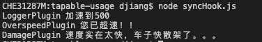
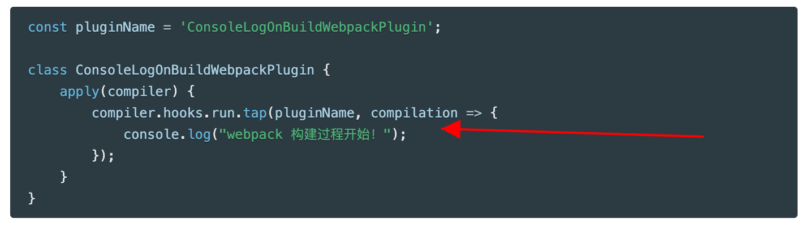
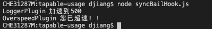
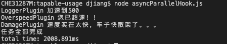
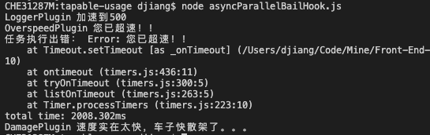
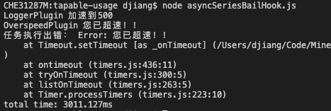
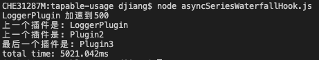

# webpack核心模块tapable用法解析

前不久写了一篇[webpack基本原理和AST用法的文章](https://juejin.cn/post/6930877602840182791)，本来想接着写`webpack plugin`的原理的，但是发现`webpack plugin`高度依赖[tapable](https://github.com/webpack/tapable)这个库，不清楚`tapable`而直接去看`webpack plugin`始终有点雾里看花的意思。所以就先去看了下`tapable`的文档和源码，发现这个库非常有意思，是增强版的`发布订阅模式`。`发布订阅模式`在源码世界实在是太常见了，我们已经在多个库源码里面见过了：

1. [`redux`的`subscribe`和`dispatch`](https://juejin.cn/post/6845166891682512909)
2. [`Node.js`的`EventEmitter`](https://juejin.cn/post/6844904101331877895)
3. [`redux-saga`的`take`和`put`](https://juejin.cn/post/6885223002703822855)

这些库基本都自己实现了自己的`发布订阅模式`，实现方式主要是用来满足自己的业务需求，而`tapable`并没有具体的业务逻辑，是一个专门用来实现事件订阅或者他自己称为`hook`(钩子)的工具库，其根本原理还是`发布订阅模式`，但是他实现了多种形式的`发布订阅模式`，还包含了多种形式的流程控制。

`tapable`暴露多个API，提供了多种流程控制方式，连使用都是比较复杂的，所以我想分两篇文章来写他的原理：

1. 先看看用法，体验下他的多种流程控制方式
2. 通过用法去看看源码是怎么实现的

本文就是讲用法的文章，知道了他的用法，大家以后如果有自己实现`hook`或者事件监听的需求，可以直接拿过来用，非常强大！

**本文例子已经全部上传到GitHub，大家可以拿下来做个参考：[https://github.com/dennis-jiang/Front-End-Knowledges/tree/master/Examples/Engineering/tapable-usage](https://github.com/dennis-jiang/Front-End-Knowledges/tree/master/Examples/Engineering/tapable-usage)**

## tapable是什么

`tapable`是`webpack`的核心模块，也是`webpack`团队维护的，是`webpack plugin`的基本实现方式。他的主要功能是为使用者提供强大的`hook`机制，`webpack plugin`就是基于`hook`的。

### 主要API

下面是官方文档中列出来的主要API，所有API的名字都是以`Hook`结尾的：

```javascript
const {
	SyncHook,
	SyncBailHook,
	SyncWaterfallHook,
	SyncLoopHook,
	AsyncParallelHook,
	AsyncParallelBailHook,
	AsyncSeriesHook,
	AsyncSeriesBailHook,
	AsyncSeriesWaterfallHook
 } = require("tapable");
```

这些API的名字其实就解释了他的作用，注意这些关键字：`Sync`, `Async`, `Bail`, `Waterfall`, `Loop`, `Parallel`, `Series`。下面分别来解释下这些关键字：

**Sync**：这是一个同步的`hook`

**Async**：这是一个异步的`hook`

**Bail**：`Bail`在英文中的意思是`保险，保障`的意思，实现的效果是，当一个`hook`注册了多个回调方法，任意一个回调方法返回了不为`undefined`的值，就不再执行后面的回调方法了，就起到了一个“保险丝”的作用。

**Waterfall**：`Waterfall`在英语中是`瀑布`的意思，在编程世界中表示顺序执行各种任务，在这里实现的效果是，当一个`hook`注册了多个回调方法，前一个回调执行完了才会执行下一个回调，而前一个回调的执行结果会作为参数传给下一个回调函数。

**Loop**：`Loop`就是循环的意思，实现的效果是，当一个`hook`注册了回调方法，如果这个回调方法返回了`true`就重复循环这个回调，只有当这个回调返回`undefined`才执行下一个回调。

**Parallel**：`Parallel`是并行的意思，有点类似于`Promise.all`，就是当一个`hook`注册了多个回调方法，这些回调同时开始并行执行。

**Series**：`Series`就是串行的意思，就是当一个`hook`注册了多个回调方法，前一个执行完了才会执行下一个。

`Parallel`和`Series`的概念只存在于异步的`hook`中，因为同步`hook`全部是串行的。

下面我们分别来介绍下每个API的用法和效果。

## 同步API

同步API就是这几个：

```javascript
const {
	SyncHook,
	SyncBailHook,
	SyncWaterfallHook,
	SyncLoopHook,
 } = require("tapable");
```

前面说了，同步API全部是串行的，所以这几个的区别就在流程控制上。

### SyncHook

`SyncHook`是一个最基础的`hook`，其使用方法和效果接近我们经常使用的`发布订阅模式`，注意`tapable`导出的所有`hook`都是类，基本用法是这样的：

```javascript
const hook = new SyncHook(["arg1", "arg2", "arg3"]);
```

因为`SyncHook`是一个类，所以使用`new`来生成一个实例，构造函数接收的参数是一个数组`["arg1", "arg2", "arg3"]`，这个数组有三项，表示生成的这个实例注册回调的时候接收三个参数。实例`hook`主要有两个实例方法：

1. `tap`：就是注册事件回调的方法。
2. `call`：就是触发事件，执行回调的方法。

下面我们扩展下官方文档中小汽车加速的例子来说明下具体用法：

```javascript
const { SyncHook } = require("tapable");

// 实例化一个加速的hook
const accelerate = new SyncHook(["newSpeed"]);

// 注册第一个回调，加速时记录下当前速度
accelerate.tap("LoggerPlugin", (newSpeed) =>
  console.log("LoggerPlugin", `加速到${newSpeed}`)
);

// 再注册一个回调，用来检测是否超速
accelerate.tap("OverspeedPlugin", (newSpeed) => {
  if (newSpeed > 120) {
    console.log("OverspeedPlugin", "您已超速！！");
  }
});

// 再注册一个回调，用来检测速度是否快到损坏车子了
accelerate.tap("DamagePlugin", (newSpeed) => {
  if (newSpeed > 300) {
    console.log("DamagePlugin", "速度实在太快，车子快散架了。。。");
  }
});

// 触发一下加速事件，看看效果吧
accelerate.call(500);
```

然后运行下看看吧，当加速事件出现的时候，会依次执行这三个回调：



上面这个例子主要就是用了`tap`和`call`这两个实例方法，其中`tap`接收两个参数，第一个是个字符串，并没有实际用处，仅仅是一个注释的作用，第二个参数就是一个回调函数，用来执行事件触发时的具体逻辑。

```javascript
accelerate.tap("LoggerPlugin", (newSpeed) =>
  console.log("LoggerPlugin", `加速到${newSpeed}`)
);
```

上述这种写法其实与[webpack官方文档中对于plugin的介绍非常像了](https://www.webpackjs.com/concepts/plugins/#%E5%89%96%E6%9E%90)，因为`webpack`的`plguin`就是用`tapable`实现的，第一个参数一般就是`plugin`的名字：



而`call`就是简单的触发这个事件，在`webpack`的`plguin`中一般不需要开发者去触发事件，而是`webpack`自己在不同阶段会触发不同的事件，比如`beforeRun`, `run`等等，`plugin`开发者更多的会关注这些事件出现时应该进行什么操作，也就是在这些事件上注册自己的回调。

### SyncBailHook

上面的`SyncHook`其实就是一个简单的`发布订阅模式`，`SyncBailHook`就是在这个基础上加了一点流程控制，前面我们说过了，`Bail`就是个保险，实现的效果是，前面一个回调返回一个不为`undefined`的值，就中断这个流程。比如我们现在将前面这个例子的`SyncHook`换成`SyncBailHook`，然后在检测超速的这个插件里面加点逻辑，当它超速了就返回错误，后面的`DamagePlugin`就不会执行了：

```javascript
const { SyncBailHook } = require("tapable");    // 使用的是SyncBailHook

// 实例化一个加速的hook
const accelerate = new SyncBailHook(["newSpeed"]);

accelerate.tap("LoggerPlugin", (newSpeed) =>
  console.log("LoggerPlugin", `加速到${newSpeed}`)
);

// 再注册一个回调，用来检测是否超速
// 如果超速就返回一个错误
accelerate.tap("OverspeedPlugin", (newSpeed) => {
  if (newSpeed > 120) {
    console.log("OverspeedPlugin", "您已超速！！");

    return new Error('您已超速！！');
  }
});

accelerate.tap("DamagePlugin", (newSpeed) => {
  if (newSpeed > 300) {
    console.log("DamagePlugin", "速度实在太快，车子快散架了。。。");
  }
});

accelerate.call(500);
```

然后再运行下看看：



可以看到由于`OverspeedPlugin`返回了一个不为`undefined`的值，`DamagePlugin`被阻断，没有运行了。

### SyncWaterfallHook

`SyncWaterfallHook`也是在`SyncHook`的基础上加了点流程控制，前面说了，`Waterfall`实现的效果是将上一个回调的返回值作为参数传给下一个回调。所以通过`call`传入的参数只会传递给第一个回调函数，后面的回调接受都是上一个回调的返回值，最后一个回调的返回值会作为`call`的返回值返回给最外层：

```javascript
const { SyncWaterfallHook } = require("tapable");

const accelerate = new SyncWaterfallHook(["newSpeed"]);

accelerate.tap("LoggerPlugin", (newSpeed) => {
  console.log("LoggerPlugin", `加速到${newSpeed}`);

  return "LoggerPlugin";
});

accelerate.tap("Plugin2", (data) => {
  console.log(`上一个插件是: ${data}`);

  return "Plugin2";
});

accelerate.tap("Plugin3", (data) => {
  console.log(`上一个插件是: ${data}`);

  return "Plugin3";
});

const lastPlugin = accelerate.call(100);

console.log(`最后一个插件是：${lastPlugin}`);
```

然后看下运行效果吧：


### SyncLoopHook

`SyncLoopHook`是在`SyncHook`的基础上添加了循环的逻辑，也就是如果一个插件返回`true`就会一直执行这个插件，直到他返回`undefined`才会执行下一个插件：

```javascript
const { SyncLoopHook } = require("tapable");

const accelerate = new SyncLoopHook(["newSpeed"]);

accelerate.tap("LoopPlugin", (newSpeed) => {
  console.log("LoopPlugin", `循环加速到${newSpeed}`);

  return new Date().getTime() % 5 !== 0 ? true : undefined;
});

accelerate.tap("LastPlugin", (newSpeed) => {
  console.log("循环加速总算结束了");
});

accelerate.call(100);
```

执行效果如下：


## 异步API

所谓异步API是相对前面的同步API来说的，前面的同步API的所有回调都是按照顺序同步执行的，每个回调内部也全部是同步代码。但是实际项目中，可能需要回调里面处理异步情况，也可能希望多个回调可以同时并行执行，也就是`Parallel`。这些需求就需要用到异步API了，主要的异步API就是这些：

```javascript
const {
	AsyncParallelHook,
	AsyncParallelBailHook,
	AsyncSeriesHook,
	AsyncSeriesBailHook,
	AsyncSeriesWaterfallHook
 } = require("tapable");
```

既然涉及到了异步，那肯定还需要异步的处理方式，`tapable`支持回调函数和`Promise`两种异步的处理方式。所以这些异步API除了用前面的`tap`来注册回调外，还有两个注册回调的方法：`tapAsync`和`tapPromise`，对应的触发事件的方法为`callAsync`和`promise`。下面分别来看下每个API吧：

### AsyncParallelHook

`AsyncParallelHook`从前面介绍的命名规则可以看出，他是一个异步并行执行的`Hook`，我们先用`tapAsync`的方式来看下怎么用吧。

#### tapAsync和callAsync

还是那个小汽车加速的例子，只不过这个小汽车加速没那么快了，需要一秒才能加速完成，然后我们在2秒的时候分别检测是否超速和是否损坏，为了看出并行的效果，我们记录下整个过程从开始到结束的时间：

```javascript
const { AsyncParallelHook } = require("tapable");

const accelerate = new AsyncParallelHook(["newSpeed"]);

console.time("total time"); // 记录起始时间

// 注意注册异步事件需要使用tapAsync
// 接收的最后一个参数是done，调用他来表示当前任务执行完毕
accelerate.tapAsync("LoggerPlugin", (newSpeed, done) => {
  // 1秒后加速才完成
  setTimeout(() => {
    console.log("LoggerPlugin", `加速到${newSpeed}`);

    done();
  }, 1000);
});

accelerate.tapAsync("OverspeedPlugin", (newSpeed, done) => {
  // 2秒后检测是否超速
  setTimeout(() => {
    if (newSpeed > 120) {
      console.log("OverspeedPlugin", "您已超速！！");
    }
    done();
  }, 2000);
});

accelerate.tapAsync("DamagePlugin", (newSpeed, done) => {
  // 2秒后检测是否损坏
  setTimeout(() => {
    if (newSpeed > 300) {
      console.log("DamagePlugin", "速度实在太快，车子快散架了。。。");
    }

    done();
  }, 2000);
});

accelerate.callAsync(500, () => {
  console.log("任务全部完成");
  console.timeEnd("total time"); // 记录总共耗时
});

```

上面代码需要注意的是，注册回调要使用`tapAsync`，而且回调函数里面最后一个参数会自动传入`done`，你可以调用他来通知`tapable`当前任务已经完成。触发任务需要使用`callAsync`，他最后也接收一个函数，可以用来处理所有任务都完成后需要执行的操作。所以上面的运行结果就是：



从这个结果可以看出，最终消耗的时间大概是2秒，也就是三个任务中最长的单个任务耗时，而不是三个任务耗时的总额，这就实现了`Parallel`并行的效果。

#### tapPromise和promise

现在都流行`Promise`，所以`tapable`也是支持的，执行效果是一样的，只是写法不一样而已。要用`tapPromise`，需要注册的回调返回一个`promise`，同时触发事件也需要用`promise`，任务运行完执行的处理可以直接使用`then`，所以上述代码改为：

```javascript
const { AsyncParallelHook } = require("tapable");

const accelerate = new AsyncParallelHook(["newSpeed"]);

console.time("total time"); // 记录起始时间

// 注意注册异步事件需要使用tapPromise
// 回调函数要返回一个promise
accelerate.tapPromise("LoggerPlugin", (newSpeed) => {
  return new Promise((resolve) => {
    // 1秒后加速才完成
    setTimeout(() => {
      console.log("LoggerPlugin", `加速到${newSpeed}`);

      resolve();
    }, 1000);
  });
});

accelerate.tapPromise("OverspeedPlugin", (newSpeed) => {
  return new Promise((resolve) => {
    // 2秒后检测是否超速
    setTimeout(() => {
      if (newSpeed > 120) {
        console.log("OverspeedPlugin", "您已超速！！");
      }
      resolve();
    }, 2000);
  });
});

accelerate.tapPromise("DamagePlugin", (newSpeed) => {
  return new Promise((resolve) => {
    // 2秒后检测是否损坏
    setTimeout(() => {
      if (newSpeed > 300) {
        console.log("DamagePlugin", "速度实在太快，车子快散架了。。。");
      }

      resolve();
    }, 2000);
  });
});

// 触发事件使用promise，直接用then处理最后的结果
accelerate.promise(500).then(() => {
  console.log("任务全部完成");
  console.timeEnd("total time"); // 记录总共耗时
});
```

这段代码的逻辑和运行结果和上面那个是一样的，只是写法不一样：


#### tapAsync和tapPromise混用

既然`tapable`支持这两种异步写法，那这两种写法可以混用吗？我们来试试吧：

```javascript
const { AsyncParallelHook } = require("tapable");

const accelerate = new AsyncParallelHook(["newSpeed"]);

console.time("total time"); // 记录起始时间

// 来一个promise写法
accelerate.tapPromise("LoggerPlugin", (newSpeed) => {
  return new Promise((resolve) => {
    // 1秒后加速才完成
    setTimeout(() => {
      console.log("LoggerPlugin", `加速到${newSpeed}`);

      resolve();
    }, 1000);
  });
});

// 再来一个async写法
accelerate.tapAsync("OverspeedPlugin", (newSpeed, done) => {
  // 2秒后检测是否超速
  setTimeout(() => {
    if (newSpeed > 120) {
      console.log("OverspeedPlugin", "您已超速！！");
    }
    done();
  }, 2000);
});

// 使用promise触发事件
// accelerate.promise(500).then(() => {
//   console.log("任务全部完成");
//   console.timeEnd("total time"); // 记录总共耗时
// });

// 使用callAsync触发事件
accelerate.callAsync(500, () => {
  console.log("任务全部完成");
  console.timeEnd("total time"); // 记录总共耗时
});
```

这段代码无论我是使用`promise`触发事件还是`callAsync`触发运行的结果都是一样的，所以`tapable`内部应该是做了兼容转换的，两种写法可以混用：


由于`tapAsync`和`tapPromise`只是写法上的不一样，我后面的例子就全部用`tapAsync`了。

### AsyncParallelBailHook

前面已经看了`SyncBailHook`，知道带`Bail`的功能就是当一个任务返回不为`undefined`的时候，阻断后面任务的执行。但是由于`Parallel`任务都是同时开始的，阻断是阻断不了了，实际效果是如果有一个任务返回了不为`undefined`的值，最终的回调会立即执行，并且获取`Bail`任务的返回值。我们将上面三个任务执行时间错开，分别为1秒，2秒，3秒，然后在2秒的任务触发`Bail`就能看到效果了：

```javascript
const { AsyncParallelBailHook } = require("tapable");

const accelerate = new AsyncParallelBailHook(["newSpeed"]);

console.time("total time"); // 记录起始时间

accelerate.tapAsync("LoggerPlugin", (newSpeed, done) => {
  // 1秒后加速才完成
  setTimeout(() => {
    console.log("LoggerPlugin", `加速到${newSpeed}`);

    done();
  }, 1000);
});

accelerate.tapAsync("OverspeedPlugin", (newSpeed, done) => {
  // 2秒后检测是否超速
  setTimeout(() => {
    if (newSpeed > 120) {
      console.log("OverspeedPlugin", "您已超速！！");
    }

    // 这个任务的done返回一个错误
    // 注意第一个参数是node回调约定俗成的错误
    // 第二个参数才是Bail的返回值
    done(null, new Error("您已超速！！"));
  }, 2000);
});

accelerate.tapAsync("DamagePlugin", (newSpeed, done) => {
  // 3秒后检测是否损坏
  setTimeout(() => {
    if (newSpeed > 300) {
      console.log("DamagePlugin", "速度实在太快，车子快散架了。。。");
    }

    done();
  }, 3000);
});

accelerate.callAsync(500, (error, data) => {
  if (data) {
    console.log("任务执行出错：", data);
  } else {
    console.log("任务全部完成");
  }
  console.timeEnd("total time"); // 记录总共耗时
});

```

可以看到执行到任务2时，由于他返回了一个错误，所以最终的回调会立即执行，但是由于任务3之前已经同步开始了，所以他自己仍然会运行完，只是已经不影响最终结果了：



### AsyncSeriesHook

`AsyncSeriesHook`是异步串行`hook`，如果有多个任务，这多个任务之间是串行的，但是任务本身却可能是异步的，下一个任务必须等上一个任务`done`了才能开始：

```javascript
const { AsyncSeriesHook } = require("tapable");

const accelerate = new AsyncSeriesHook(["newSpeed"]);

console.time("total time"); // 记录起始时间

accelerate.tapAsync("LoggerPlugin", (newSpeed, done) => {
  // 1秒后加速才完成
  setTimeout(() => {
    console.log("LoggerPlugin", `加速到${newSpeed}`);

    done();
  }, 1000);
});

accelerate.tapAsync("OverspeedPlugin", (newSpeed, done) => {
  // 2秒后检测是否超速
  setTimeout(() => {
    if (newSpeed > 120) {
      console.log("OverspeedPlugin", "您已超速！！");
    }
    done();
  }, 2000);
});

accelerate.tapAsync("DamagePlugin", (newSpeed, done) => {
  // 2秒后检测是否损坏
  setTimeout(() => {
    if (newSpeed > 300) {
      console.log("DamagePlugin", "速度实在太快，车子快散架了。。。");
    }

    done();
  }, 2000);
});

accelerate.callAsync(500, () => {
  console.log("任务全部完成");
  console.timeEnd("total time"); // 记录总共耗时
});

```

每个任务代码跟`AsyncParallelHook`是一样的，只是使用的`Hook`不一样，而最终效果的区别是：`AsyncParallelHook`所有任务同时开始，所以最终总耗时就是耗时最长的那个任务的耗时；`AsyncSeriesHook`的任务串行执行，下一个任务要等上一个任务完成了才能开始，所以最终总耗时是所有任务耗时的总和，上面这个例子就是`1 + 2 + 2`，也就是5秒：


### AsyncSeriesBailHook

`AsyncSeriesBailHook`就是在`AsyncSeriesHook`的基础上加上了`Bail`的逻辑，也就是中间任何一个任务返回不为`undefined`的值，终止执行，直接执行最后的回调，并且将这个返回值传给最终的回调：

```javascript
const { AsyncSeriesBailHook } = require("tapable");

const accelerate = new AsyncSeriesBailHook(["newSpeed"]);

console.time("total time"); // 记录起始时间

accelerate.tapAsync("LoggerPlugin", (newSpeed, done) => {
  // 1秒后加速才完成
  setTimeout(() => {
    console.log("LoggerPlugin", `加速到${newSpeed}`);

    done();
  }, 1000);
});

accelerate.tapAsync("OverspeedPlugin", (newSpeed, done) => {
  // 2秒后检测是否超速
  setTimeout(() => {
    if (newSpeed > 120) {
      console.log("OverspeedPlugin", "您已超速！！");
    }

    // 这个任务的done返回一个错误
    // 注意第一个参数是node回调约定俗成的错误
    // 第二个参数才是Bail的返回值
    done(null, new Error("您已超速！！"));
  }, 2000);
});

accelerate.tapAsync("DamagePlugin", (newSpeed, done) => {
  // 2秒后检测是否损坏
  setTimeout(() => {
    if (newSpeed > 300) {
      console.log("DamagePlugin", "速度实在太快，车子快散架了。。。");
    }

    done();
  }, 2000);
});

accelerate.callAsync(500, (error, data) => {
  if (data) {
    console.log("任务执行出错：", data);
  } else {
    console.log("任务全部完成");
  }
  console.timeEnd("total time"); // 记录总共耗时
});

```

这个执行结果跟`AsyncParallelBailHook`的区别就是`AsyncSeriesBailHook`被阻断后，后面的任务由于还没开始，所以可以被完全阻断，而`AsyncParallelBailHook`后面的任务由于已经开始了，所以还会继续执行，只是结果已经不关心了。



### AsyncSeriesWaterfallHook

`Waterfall`的作用是将前一个任务的结果传给下一个任务，其他的跟`AsyncSeriesHook`一样的，直接来看代码吧：

```javascript
const { AsyncSeriesWaterfallHook } = require("tapable");

const accelerate = new AsyncSeriesWaterfallHook(["newSpeed"]);

console.time("total time"); // 记录起始时间

accelerate.tapAsync("LoggerPlugin", (newSpeed, done) => {
  // 1秒后加速才完成
  setTimeout(() => {
    console.log("LoggerPlugin", `加速到${newSpeed}`);

    // 注意done的第一个参数会被当做error
    // 第二个参数才是传递给后面任务的参数
    done(null, "LoggerPlugin");
  }, 1000);
});

accelerate.tapAsync("Plugin2", (data, done) => {
  setTimeout(() => {
    console.log(`上一个插件是: ${data}`);

    done(null, "Plugin2");
  }, 2000);
});

accelerate.tapAsync("Plugin3", (data, done) => {
  setTimeout(() => {
    console.log(`上一个插件是: ${data}`);

    done(null, "Plugin3");
  }, 2000);
});

accelerate.callAsync(500, (error, data) => {
  console.log("最后一个插件是:", data);
  console.timeEnd("total time"); // 记录总共耗时
});

```

运行效果如下：



## 总结

**本文例子已经全部上传到GitHub，大家可以拿下来做个参考：[https://github.com/dennis-jiang/Front-End-Knowledges/tree/master/Examples/Engineering/tapable-usage](https://github.com/dennis-jiang/Front-End-Knowledges/tree/master/Examples/Engineering/tapable-usage)**

1. `tapable`是`webpack`实现`plugin`的核心库，他为`webpack`提供了多种事件处理和流程控制的`Hook`。
2. 这些`Hook`主要有同步(`Sync`)和异步(`Async`)两种，同时还提供了阻断(`Bail`)，瀑布(`Waterfall`)，循环(`Loop`)等流程控制，对于异步流程还提供了并行(`Paralle`)和串行(`Series`)两种控制方式。
3. `tapable`其核心原理还是事件的`发布订阅模式`，他使用`tap`来注册事件，使用`call`来触发事件。
4. 异步`hook`支持两种写法：回调和`Promise`，注册和触发事件分别使用`tapAsync/callAsync`和`tapPromise/promise`。
5. 异步`hook`使用回调写法的时候要注意，回调函数的第一个参数默认是错误，第二个参数才是向外传递的数据，这也符合`node`回调的风格。

这篇文章主要讲述了`tapable`的用法，后面我会写一篇文章来分析他的源码，点个关注不迷路，哈哈~

**文章的最后，感谢你花费宝贵的时间阅读本文，如果本文给了你一点点帮助或者启发，请不要吝啬你的赞和GitHub小星星，你的支持是作者持续创作的动力。**

**欢迎关注我的公众号[进击的大前端](https://test-dennis.oss-cn-hangzhou.aliyuncs.com/QRCode/QR430.jpg)第一时间获取高质量原创~**

**“前端进阶知识”系列文章：[https://juejin.im/post/5e3ffc85518825494e2772fd](https://juejin.im/post/5e3ffc85518825494e2772fd)**

**“前端进阶知识”系列文章源码GitHub地址： [https://github.com/dennis-jiang/Front-End-Knowledges](https://github.com/dennis-jiang/Front-End-Knowledges)**