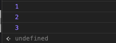
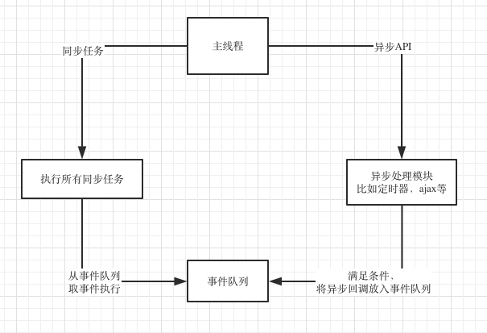
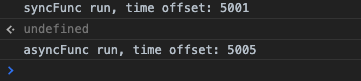
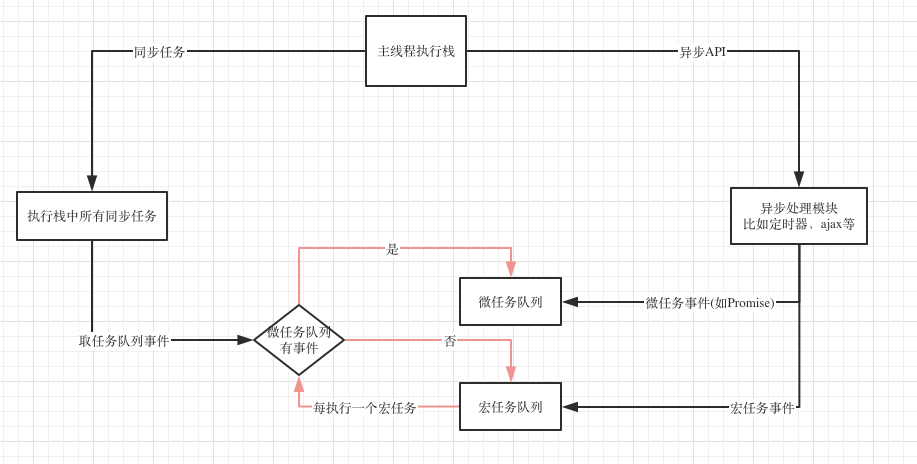
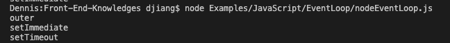
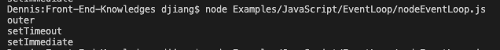
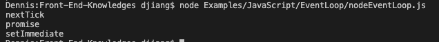

笔者以前面试的时候经常遇到写一堆`setTimeout`,`setImmediate`来问哪个先执行。本文主要就是来讲这个问题的，但是不是简单的讲讲哪个先，哪个后。笼统的知道`setImmediate`比`setTimeout(fn, 0)`先执行是不够的，因为有些情况下`setTimeout(fn, 0)`是会比`setImmediate`先执行的。要彻底搞明白这个问题，我们需要系统的学习JS的异步机制和底层原理。本文就会从异步基本概念出发，一直讲到Event Loop的底层原理，让你彻底搞懂`setTimeout`,`setImmediate`，`Promise`, `process.nextTick`谁先谁后这一类问题。

## 同步和异步

同步异步简单理解就是，同步的代码都是按照书写顺序执行的，异步的代码可能跟书写顺序不一样，写在后面的可能先执行。下面来看个例子：

```javascript
const syncFunc = () => {
  const time = new Date().getTime();
  while(true) {
    if(new Date().getTime() - time > 2000) {
      break;
    }
  }
  console.log(2);
}

console.log(1);
syncFunc();
console.log(3);
```

上述代码会先打印出1，然后调用`syncFunc`，`syncFunc`里面while循环会运行2秒，然后打印出2，最后打印出3。所以这里代码的执行顺序跟我们的书写顺序是一致，他是同步代码：



再来看个异步例子：

```javascript
const asyncFunc = () => {
  setTimeout(() => {
    console.log(2);
  }, 2000);
}

console.log(1);
asyncFunc();
console.log(3);
```

上述代码的输出是：


可以看到我们中间调用的`asyncFunc`里面的2却是最后输出的，这是因为`setTimeout`是一个异步方法。他的作用是设置一个定时器，等定时器时间到了再执行回调里面的代码。所以异步就相当于做一件事，但是并不是马上做，而是你先给别人打了个招呼，说xxx条件满足的时候就干什么什么。就像你晚上睡觉前在手机上设置了一个第二天早上7天的闹钟，就相当于给了手机一个异步事件，触发条件是时间到达早上7点。**使用异步的好处是你只需要设置好异步的触发条件就可以去干别的事情了，所以异步不会阻塞主干上事件的执行。特别是对于JS这种只有一个线程的语言，如果都像我们第一个例子那样去`while(true)`，那浏览器就只有一直卡死了，只有等这个循环运行完才会有响应**。

## JS异步是怎么实现的

我们都知道JS是单线程的，那单线程是怎么实现异步的呢？事实上所谓的"JS是单线程的"只是指JS的主运行线程只有一个，而不是整个运行环境都是单线程。JS的运行环境主要是浏览器，以大家都很熟悉的Chrome的内核为例，他不仅是多线程的，而且是多进程的：


上图只是一个概括分类，意思是Chrome有这几类的进程和线程，并不是每种只有一个，比如渲染进程就有多个，每个选项卡都有自己的渲染进程。有时候我们使用Chrome会遇到某个选项卡崩溃或者没有响应的情况，这个选项卡对应的渲染进程可能就崩溃了，但是其他选项卡并没有用这个渲染进程，他们有自己的渲染进程，所以其他选项卡并不会受影响。这也是Chrome单个页面崩溃并不会导致浏览器崩溃的原因，而不是像老IE那样，一个页面卡了导致整个浏览器都卡。

对于前端工程师来说，主要关心的还是渲染进程，下面来分别看下里面每个线程是做什么的。

### GUI线程

GUI线程就是渲染页面的，他解析HTML和CSS，然后将他们构建成DOM树和渲染树就是这个线程负责的。

### JS引擎线程

这个线程就是负责执行JS的主线程，前面说的"JS是单线程的"就是指的这个线程。大名鼎鼎的Chrome V8引擎就是在这个线程运行的。**需要注意的是，这个线程跟GUI线程是互斥的。互斥的原因是JS也可以操作DOM，如果JS线程和GUI线程同时操作DOM，结果就混乱了，不知道到底渲染哪个结果。这带来的后果就是如果JS长时间运行，GUI线程就不能执行，整个页面就感觉卡死了。所以我们最开始例子的`while(true)`这样长时间的同步代码在真正开发时是绝对不允许的**。

### 定时器线程

前面异步例子的`setTimeout`其实就运行在这里，他跟JS主线程根本不在同一个地方，所以“单线程的JS”能够实现异步。JS的定时器方法还有`setInterval`，也是在这个线程。

### 事件触发线程

定时器线程其实只是一个计时的作用，他并不会真正执行时间到了的回调，真正执行这个回调的还是JS主线程。所以当时间到了定时器线程会将这个回调事件给到事件触发线程，然后事件触发线程将它加到事件队列里面去。最终JS主线程从事件队列取出这个回调执行。事件触发线程不仅会将定时器事件放入任务队列，其他满足条件的事件也是他负责放进任务队列。

### 异步HTTP请求线程

这个线程负责处理异步的ajax请求，当请求完成后，他也会通知事件触发线程，然后事件触发线程将这个事件放入事件队列给主线程执行。

**所以JS异步的实现靠的就是浏览器的多线程，当他遇到异步API时，就将这个任务交给对应的线程，当这个异步API满足回调条件时，对应的线程又通过事件触发线程将这个事件放入任务队列，然后主线程从任务队列取出事件继续执行**。这个流程我们多次提到了任务队列，这其实就是Event Loop，下面我们详细来讲解下。

## Event Loop

所谓Event Loop，就是事件循环，其实就是JS管理事件执行的一个流程，具体的管理办法由他具体的运行环境确定。目前JS的主要运行环境有两个，浏览器和Node.js。这两个环境的Event Loop还有点区别，我们会分开来讲。

### 浏览器的Event Loop

事件循环就是一个循环，是各个异步线程用来通讯和协同执行的机制。各个线程为了交换消息，还有一个公用的数据区，这就是事件队列。各个异步线程执行完后，通过事件触发线程将回调事件放到事件队列，主线程每次干完手上的活儿就来看看这个队列有没有新活儿，有的话就取出来执行。画成一个流程图就是这样：



流程讲解如下:

> 1. 主线程每次执行时，先看看要执行的是同步任务，还是异步的API
> 2. 同步任务就继续执行，一直执行完
> 3. 遇到异步API就将它交给对应的异步线程，自己继续执行同步任务
> 4. 异步线程执行异步API，执行完后，将异步回调事件放入事件队列上
> 5. 主线程手上的同步任务干完后就来事件队列看看有没有任务
> 6. 主线程发现事件队列有任务，就取出里面的任务执行
> 7. 主线程不断循环上述流程

### 定时器不准

Event Loop的这个流程里面其实还是隐藏了一些坑的，最典型的问题就是总是先执行同步任务，然后再执行事件队列里面的回调。这个特性就直接影响了定时器的执行，我们想想我们开始那个2秒定时器的执行流程：

> 1. 主线程执行同步代码
> 2. 遇到`setTimeout`，将它交给定时器线程
> 3. 定时器线程开始计时，2秒到了通知事件触发线程
> 4. 事件触发线程将定时器回调放入事件队列，异步流程到此结束
> 5. 主线程如果有空，将定时器回调拿出来执行，如果没空这个回调就一直放在队列里。

上述流程我们可以看出，如果主线程长时间被阻塞，定时器回调就没机会执行，即使执行了，那时间也不准了，我们将开头那两个例子结合起来就可以看出这个效果：

```javascript
const syncFunc = (startTime) => {
  const time = new Date().getTime();
  while(true) {
    if(new Date().getTime() - time > 5000) {
      break;
    }
  }
  const offset = new Date().getTime() - startTime;
  console.log(`syncFunc run, time offset: ${offset}`);
}

const asyncFunc = (startTime) => {
  setTimeout(() => {
    const offset = new Date().getTime() - startTime;
    console.log(`asyncFunc run, time offset: ${offset}`);
  }, 2000);
}

const startTime = new Date().getTime();

asyncFunc(startTime);

syncFunc(startTime);
```

执行结果如下：



通过结果可以看出，虽然我们先调用的`asyncFunc`，虽然`asyncFunc`写的是2秒后执行，但是`syncFunc`的执行时间太长，达到了5秒，`asyncFunc`虽然在2秒的时候就已经进入了事件队列，但是主线程一直在执行同步代码，一直没空，所以也要等到5秒后，同步代码执行完毕才有机会执行这个定时器回调。**所以再次强调，写代码时一定不要长时间占用主线程**。

### 引入微任务

前面的流程图我为了便于理解，简化了事件队列，其实事件队列里面的事件还可以分两类：宏任务和微任务。微任务拥有更高的优先级，当事件循环遍历队列时，先检查微任务队列，如果里面有任务，就全部拿来执行，执行完之后再执行一个宏任务。执行每个宏任务之前都要检查下微任务队列是否有任务，如果有，优先执行微任务队列。所以完整的流程图如下：



上图需要注意以下几点：

> 1. 一个Event Loop可以有一个或多个事件队列，但是只有一个微任务队列。
> 2. 微任务队列全部执行完会重新渲染一次
> 3. 每个宏任务执行完都会重新渲染一次
> 4. requestAnimationFrame处于渲染阶段，不在微任务队列，也不在宏任务队列

所以想要知道一个异步API在哪个阶段执行，我们得知道他是宏任务还是微任务。

常见宏任务有：

> 1. `script` (可以理解为外层同步代码)
> 2. `setTimeout/setInterval`
> 3. `setImmediate`(Node.js)
> 4. I/O
> 5. UI事件
> 6. `postMessage`

常见微任务有：

> 1. `Promise`
> 2. `process.nextTick`(Node.js)
> 3. `Object.observe`
> 4. `MutaionObserver`

上面这些事件类型中要注意`Promise`，他是微任务，也就是说他会在定时器前面运行，我们来看个例子:

```javascript
console.log('1');
setTimeout(() => {
  console.log('2');
},0);
Promise.resolve().then(() => {
  console.log('5');
})
new Promise((resolve) => {
  console.log('3');
  resolve();
}).then(() => {
  console.log('4');
})
```

上述代码的输出是`1,3,5,4,2`。因为：

> 1. 先输出1，这个没什么说的，同步代码最先执行
> 2. `console.log('2');`在`setTimeout`里面，`setTimeout`是宏任务，“2”进入宏任务队列
> 3. `console.log('5');`在`Promise.then`里面，进入微任务队列
> 4. `console.log('3');`在Promise构造函数的参数里面，这其实是同步代码，直接输出
> 5. `console.log('4');`在then里面，他会进入微任务队列，检查事件队列时先执行微任务
> 6. 同步代码运行结果是“1，3”
> 7. 然后检查微任务队列，输出“5，4”
> 8. 最后执行宏任务队列，输出“2”

### Node.js的Event Loop

Node.js是运行在服务端的js，虽然他也用到了V8引擎，但是他的服务目的和环境不同，导致了他API与原生JS有些区别，他的Event Loop还要处理一些I/O，比如新的网络连接等，所以与浏览器Event Loop也是不一样的。Node的Event Loop是分阶段的，如下图所示：


> 1. timers: 执行`setTimeout`和`setInterval`的回调
> 2. pending callbacks: 执行延迟到下一个循环迭代的 I/O 回调
> 3. idle, prepare: 仅系统内部使用
> 4. poll: 检索新的 I/O 事件;执行与 I/O 相关的回调。事实上除了其他几个阶段处理的事情，其他几乎所有的异步都在这个阶段处理。
> 5. check: `setImmediate`在这里执行
> 6. close callbacks: 一些关闭的回调函数，如：`socket.on('close', ...)`

每个阶段都有一个自己的先进先出的队列，只有当这个队列的事件执行完或者达到该阶段的上限时，才会进入下一个阶段。在每次事件循环之间，Node.js都会检查它是否在等待任何一个I/O或者定时器，如果没有的话，程序就关闭退出了。我们的直观感受就是，如果一个Node程序只有同步代码，你在控制台运行完后，他就自己退出了。

还有个需要注意的是`poll`阶段，他后面并不一定每次都是`check`阶段，`poll`队列执行完后，如果没有`setImmediate`但是有定时器到期，他会绕回去执行定时器阶段：


#### `setImmediate`和`setTimeout`

上面的这个流程说简单点就是**在一个异步流程**里，`setImmediate`会比定时器先执行，我们写点代码来试试：

```javascript
console.log('outer');

setTimeout(() => {
  setTimeout(() => {
    console.log('setTimeout');
  }, 0);
  setImmediate(() => {
    console.log('setImmediate');
  });
}, 0);
```

上述代码运行如下:



和我们前面讲的一样，`setImmediate`先执行了。我们来理一下这个流程：

> 1. 外层是一个`setTimeout`，所以执行他的回调的时候已经在`timers`阶段了
> 2. 处理里面的`setTimeout`，因为本次循环的`timers`正在执行，所以他的回调其实加到了下个`timers`阶段
> 3. 处理里面的`setImmediate`，将它的回调加入`check`阶段的队列
> 4. 外层`timers`阶段执行完，进入`pending callbacks`，`idle, prepare`，`poll`，这几个队列都是空的，所以继续往下
> 5. 到了`check`阶段，发现了`setImmediate`的回调，拿出来执行
> 6. 然后是`close callbacks`，队列是空的，跳过
> 7. 又是`timers`阶段，执行我们的`console`

但是请注意我们上面`console.log('setTimeout')`和`console.log('setImmediate')`都包在了一个`setTimeout`里面，如果直接写在最外层会怎么样呢？代码改写如下:

```javascript
console.log('outer');

setTimeout(() => {
  console.log('setTimeout');
}, 0);

setImmediate(() => {
  console.log('setImmediate');
});
```

我们来运行下看看效果：



好像是`setTimeout`先输出来，我们多运行几次看看:


怎么`setImmediate`又先出来了，这代码是见鬼了还是啥？这个世界上是没有鬼怪的，所以事情都有原因的，我们顺着之前的Event Loop再来理一下。在理之前，需要告诉大家一件事情，node.js里面`setTimeout(fn, 0)`会被强制改为`setTimeout(fn, 1)`,[这在官方文档中有说明](https://nodejs.org/api/timers.html#timers_settimeout_callback_delay_args)。(说到这里顺便提下，HTML 5里面`setTimeout`最小的时间限制是4ms)。原理我们都有了，我们来理一下流程：

> 1. 外层同步代码一次性全部执行完，遇到异步API就塞到对应的阶段
> 2. 遇到`setTimeout`，虽然设置的是0毫秒触发，但是被node.js强制改为1毫秒，塞入`times`阶段
> 3. 遇到`setImmediate`塞入`check`阶段
> 4. 同步代码执行完毕，进入Event Loop
> 5. 先进入`times`阶段，检查当前时间过去了1毫秒没有，如果过了1毫秒，满足`setTimeout`条件，执行回调，如果没过1毫秒，跳过
> 6. 跳过空的阶段，进入check阶段，执行`setImmediate`回调

通过上述流程的梳理，我们发现关键就在这个1毫秒，如果同步代码执行时间较长，进入Event Loop的时候1毫秒已经过了，`setTimeout`执行，如果1毫秒还没到，就先执行了`setImmediate`。每次我们运行脚本时，机器状态可能不一样，导致运行时有1毫秒的差距，一会儿`setTimeout`先执行，一会儿`setImmediate`先执行。但是这种情况只会发生在还没进入`timers`阶段的时候。像我们第一个例子那样，因为已经在`timers`阶段，所以里面的`setTimeout`只能等下个循环了，所以`setImmediate`肯定先执行。同理的还有其他`poll`阶段的API也是这样的，比如：

```javascript
var fs = require('fs')

fs.readFile(__filename, () => {
    setTimeout(() => {
        console.log('setTimeout');
    }, 0);
    setImmediate(() => {
        console.log('setImmediate');
    });
});
```

这里`setTimeout`和`setImmediate`在`readFile`的回调里面，由于`readFile`回调是I/O操作，他本身就在`poll`阶段，所以他里面的定时器只能进入下个`timers`阶段，但是`setImmediate`却可以在接下来的`check`阶段运行，所以`setImmediate`肯定先运行，他运行完后，去检查`timers`，才会运行`setTimeout`。

类似的，我们再来看一段代码，如果他们两个不是在最外层，而是在`setImmediate`的回调里面，其实情况跟外层一样，结果也是随缘的，看下面代码:

```javascript
console.log('outer');

setImmediate(() => {
  setTimeout(() => {
    console.log('setTimeout');
  }, 0);
  setImmediate(() => {
    console.log('setImmediate');
  });
});
```

原因跟写在最外层差不多，因为`setImmediate`已经在`check`阶段了，里面的循环会从`timers`阶段开始，会先看`setTimeout`的回调，如果这时候已经过了1毫秒，就执行他，如果没过就执行`setImmediate`。

#### `process.nextTick()`

`process.nextTick()`是一个特殊的异步API，他不属于任何的Event Loop阶段。[事实上Node在遇到这个API时，Event Loop根本就不会继续进行，会马上停下来执行`process.nextTick()`，这个执行完后才会继续Event Loop](https://nodejs.org/zh-cn/docs/guides/event-loop-timers-and-nexttick/#process-nexttick)。我们写个例子来看下：

```javascript
var fs = require('fs')

fs.readFile(__filename, () => {
    setTimeout(() => {
        console.log('setTimeout');
    }, 0);

    setImmediate(() => {
        console.log('setImmediate');
        
        process.nextTick(() => {
          console.log('nextTick 2');
        });
    });

    process.nextTick(() => {
      console.log('nextTick 1');
    });
});
```

这段代码的打印如下：


我们还是来理一下流程:

> 1. 我们代码基本都在`readFile`回调里面，他自己执行时，已经在`poll`阶段
> 2. 遇到`setTimeout(fn, 0)`，其实是`setTimeout(fn, 1)`，塞入后面的`timers`阶段
> 3. 遇到`setImmediate`，塞入后面的`check`阶段
> 4. 遇到`nextTick`，立马执行，输出'nextTick 1'
> 5. 到了`check`阶段，输出'setImmediate',又遇到个`nextTick`,立马输出'nextTick 2'
> 6. 到了下个`timers`阶段，输出'setTimeout'

这种机制其实类似于我们前面讲的微任务，但是并不完全一样,比如同时有`nextTick`和`Promise`的时候，肯定是`nextTick`先执行，原因是`nextTick`的队列比`Promise`队列优先级更高。来看个例子:

```javascript
const promise = Promise.resolve()
setImmediate(() => {
  console.log('setImmediate');
});
promise.then(()=>{
    console.log('promise')
})
process.nextTick(()=>{
    console.log('nextTick')
})
```

代码运行结果如下：



## 总结

本文从异步基本概念出发一直讲到了浏览器和Node.js的Event Loop，现在我们再来总结一下：

1. JS所谓的“单线程”只是指主线程只有一个，并不是整个运行环境都是单线程
2. JS的异步靠底层的多线程实现
3. 不同的异步API对应不同的实现线程
4. 异步线程与主线程通讯靠的是Event Loop
5. 异步线程完成任务后将其放入任务队列
6. 主线程不断轮询任务队列，拿出任务执行
7. 任务队列有宏任务队列和微任务队列的区别
8. 微任务队列的优先级更高，所有微任务处理完后才会处理宏任务
9. `Promise`是微任务
10. Node.js的Event Loop跟浏览器的Event Loop不一样，他是分阶段的
11. `setImmediate`和`setTimeout(fn, 0)`哪个回调先执行，需要看他们本身在哪个阶段注册的，如果在定时器回调或者I/O回调里面，`setImmediate`肯定先执行。如果在最外层或者`setImmediate`回调里面，哪个先执行取决于当时机器状况。
12. `process.nextTick`不在Event Loop的任何阶段，他是一个特殊API，他会立即执行，然后才会继续执行Event Loop

**文章的最后，感谢你花费宝贵的时间阅读本文，如果本文给了你一点点帮助或者启发，请不要吝啬你的赞和GitHub小星星，你的支持是作者持续创作的动力。**

**作者博文GitHub项目地址： [https://github.com/dennis-jiang/Front-End-Knowledges](https://github.com/dennis-jiang/Front-End-Knowledges)**

**作者掘金文章汇总：[https://juejin.im/post/5e3ffc85518825494e2772fd](https://juejin.im/post/5e3ffc85518825494e2772fd)**