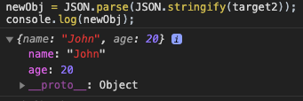
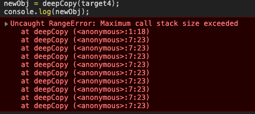

JS中有两种数据类型，值类型和引用类型，当我们需要把一个变量赋给另一个变量时，对于值类型很简单：

```javascript
let a = 1;
let b = a;
b = 10;
console.log(a, b); // 1, 10
```

但是如果a是一个对象，这就有问题了

```javascript
let a = {value: 1};
let b = a;
b.value = 10;
console.log(a.value, b.value); // 10, 10
```

我们发现改变`b.value`的时候，`a.value`的值也跟着变了，这是因为JS里面的对象是引用类型，我们在把变量a赋值给变量b的时候，赋值过去的其实是a的引用地址，b有了相同的引用地址，那a跟b指向的都是同一块内存空间，操作b的属性，其实就是操作了这块内存，因为a也指向这块内存，所以a的属性也变了。这其实就是一个浅拷贝。

## 浅拷贝

上面这样我们直接将一个引用变量赋值给另一个变量是一种浅拷贝，浅拷贝其实还有其他形式。这次我们需要拷贝的目标是

```javascript
let target = {
	name: 'John',
  age: 20,
  friend: {
    name: 'Michel',
    age: 30
  }
}
```

我们可以直接遍历`target`对象，将它赋给一个新对象就行。

```javascript
const shallowCopy = (obj) => {
  // 判断参数是数组还是对象
  const result = Array.isArray(obj) ? [] : {};
  for(let key in obj) {
    // 使用hasOwnProperty来判断是否是自身属性
    // 只拷贝自身属性，不拷贝原型链上的属性，即继承属性
    if(obj.hasOwnProperty(key)){
      result[key] = obj[key];
    }
  }
  
  return result;
}
```

然后我们来用一下这个方法：

```javascript
let newObj = shallowCopy(target);
newObj.age = 50;
console.log(target.age, newObj.age); //20, 50
```

我们可以看到当我们改变newObj的属性时，原对象的属性并没有受影响，但是如果我们改变`newObj.friend`呢？

```javascript
newObj.friend.age = 50;
console.log(target.friend.age, newObj.friend.age); //50, 50
```

我们发现当我们改变`newObj.friend`的属性的时候，原对象的`newObj.friend`的属性也改变了，这是因为`target.friend`本身也是一个对象，我们拷贝的时候只拷贝了他的引用地址，所以我们通过`newObj`操作他的时候也改变了原来的`target`。

从上面可以看出我们的`shallowCopy`方法只拷贝了对象的一层，这也是一种浅拷贝。其实还有一些原生方法也是只拷贝一层的，比如`Object.assign`和`...`扩展运算符

```javascript
let newObj = Object.assign({}, target); // 这是一层的浅拷贝
let newObj = {...target};  // 这也是一层的浅拷贝
```

那深拷贝应该怎么实现呢？

## 深拷贝

### JSON

最简单的实现方法就是用`JSON.stringify`先将对象转换为字符串，然后再用`JSON.parse`重新解析为JSON，这样新生成的对象与原对象就完全没有关系了，还是以前面的`target`为例：

```javascript
let newObj = JSON.parse(JSON.stringify(target));

newObj.friend.age = 50;
console.log(target.friend.age, newObj.friend.age); //30, 50
```

但是我们换一个`target`再来试试：

```javascript
let target2 = {
  name: 'John',
  age: 20,
  drive: () => {},
  girlFriend: undefined
}

let newObj = JSON.parse(JSON.stringify(target2));
console.log(newObj);
```

结果如下图，我们发现`drive`和`girlFriend`两个属性都丢了，**这是因为`JSON.stringify`不能将方法和`undefined`属性转化为字符串，在转换为字符串过程中就丢了，再解析回来自然也没有了**。



### 递归遍历

要解决上面的问题，我们还要自己动手，我们改造下上面的`shallowCopy`方法，让他能够递归复制。

```javascript
const deepCopy = (obj) => {
  const result = Array.isArray(obj) ? [] : {};
  for(let key in obj) {
    if(obj.hasOwnProperty(key)){
      // 如果属性也是对象，递归调用自身
      if(obj[key] && typeof obj[key] === 'object'){
        result[key] = deepCopy(obj[key])
      } else {
        result[key] = obj[key];
      }
    }
  }
  
  return result;
}
```

来看下结果：

```javascript
let newObj = deepCopy(target2);
console.log(newObj);
```


这下我们的`drive`方法和`girlFriend`属性都复制过来了。

### 拷贝Symbol

那如果换一个带有`Symbol`属性的对象呢？

```javascript
let target3 = {
  [Symbol('name')]: 'John',
  age: 20,
  drive: () => {},
  girlFriend: undefined
}
```

我们来看看结果：

```javascript
let newObj = deepCopy(target3);
console.log(newObj);
```


我们发现`Symbol`属性丢了，那怎么办呢？这个原因是`for...in...`循环拿不到`Symbol`属性，如果要拿`Symbol`属性，我们可以用`Object.getOwnPropertySymbols`和`Reflect.ownKeys`。`Object.getOwnPropertySymbols`会返回对象的`Symbol`属性列表：


`Reflect.ownKeys`会返回对象的所有自有属性，包括`Symbol`属性和不可枚举属性，但是不包括继承属性。所以我们的`deepCopy`方法改为：

```javascript
const deepCopy = (obj) => {
  const result = Array.isArray(obj) ? [] : {};
  // 用 Reflect.ownKeys可以获取Symbol属性，用for...of来循环数组
  for(let key of Reflect.ownKeys(obj)) {
    if(obj.hasOwnProperty(key)){
      if(obj[key] && typeof obj[key] === 'object'){
        result[key] = deepCopy(obj[key])
      } else {
        result[key] = obj[key];
      }
    }
  }
  
  return result;
}
```

再来看看结果：

```javascript
let newObj = deepCopy(target3);
console.log(newObj);
```


### 解决循环引用

我们来考虑一个新的目标对象

```javascript
let target4 = {
  [Symbol('name')]: 'John',
  age: 20,
  drive: () => {},
  girlFriend: undefined
}

target4.target = target4;
```

这个对象的`target`属性又引用了自身，所以有了循环引用，用我们之前的深拷贝方法直接会报错



要解决这个问题，我们需要每次都将引用类型的键和值都记录下来，由于Object的键不能是对象，所以我们不能用Object记录，这里采用了WeakMap来记录：

```javascript
const deepCopy2 = (originObj) => {
  // 全局只能有一个记录的map，所以里面又嵌了一个方法
  const map = new WeakMap();
  function dp(obj){
    const result = Array.isArray(obj) ? [] : {};
    
    const existObj = map.get(obj);
    // 检查map中是不是已经有这个对象了，有了就直接返回，不再递归
    if(existObj){
      return existObj;
    }
    
    // 没有就记录下来
    map.set(obj, result);

    for(let key of Reflect.ownKeys(obj)) {
      if(obj.hasOwnProperty(key)){
        if(obj[key] && typeof obj[key] === 'object'){
          result[key] = dp(obj[key])
        } else {
          result[key] = obj[key];
        }
      }
    }
    
    return result;
  }

  return dp(originObj);
}
```

`WeakMap`的兼容性不是很好，如果是老浏览器不支持`WeakMap`，我们可以用两个数组来模拟，一个数组存键，一个数组存值，每次都只在两个数组末尾新增值，这样键和值在数组中的索引就是一样的，我们可以通过这个索引来进行键和值的匹配。

## 浅拷贝的应用：mixin--混合模式

直接看代码

```javascript
const mixin = {
  // 注意：这里的say和run不能写成箭头函数，因为箭头函数拿不到正确的this
  say() {
    console.log(`${this.name}在说话`)
  },
  run() {
    console.log(`${this.name}在跑步`)
  }
}

class Student{
  constructor(name){
    this.name = name
  }
}

Object.assign(Student.prototype, mixin);

const student1 = new Student('Jhon');
student1.say();
```

上面的代码我们没有用继承，而是用了拷贝的方式，让`Student`类具有了mixin的方法，我们直接将mixin里面的方法复制到了`Student`的原型链上。这种模式在很多地方都有应用，比如Vue：

```javascript
Vue.mixin({
  data() {
    return {
      name: 'Jhon'
    }
  },
  methods: {
    say() {
      console.log('hello');
    }
  }
})

new Vue({
  el: '#app',
  data() {
    return {
      age: 16
    }
  },
  mounted() {
    this.say();  // hello
  }
})
```


## 深拷贝应用：pick函数

在underscore里面有一个pick函数，可以实现如下效果：

```javascript
const _ = require('underscore');

let obj = {
  name: 'Jhon',
  age: 25
}

let age = _.pick(obj, 'age');
console.log(age);   // {age: 25}
```

上述代码的输出是一个只包含`age`属性的新对象`{age: 30}`，下面让我们自己来实现一个pick函数，实现在原理很简单，把我们之前深拷贝的方法改一下就行，让他只拷贝我们需要的属性。

**注意：underscore只会拷贝一层目标属性，下面我们实现的是递归的深拷贝**

```javascript
const pick = (originObj, property) => {
  const map = new WeakMap();
  function dp(obj, skipEqual){
    const result = Array.isArray(obj) ? [] : {};
    
    const existObj = map.get(obj);

    if(existObj){
      return existObj;
    }
    
    map.set(obj, result);

    for(let key of Reflect.ownKeys(obj)) {
      // 只需要加一个检测，看看key是不是我们需要的属性就行
      if(obj.hasOwnProperty(key) && key === property || skipEqual){
        // underscore不需要下面的递归，直接 result[key] = obj[key]; 就行
        if(obj[key] && typeof obj[key] === 'object'){
          result[key] = dp(obj[key], true)
        } else {
          result[key] = obj[key];
        }
      }
    }
    
    return result;
  }

  return dp(originObj);
}
```

