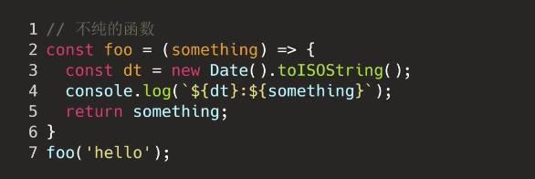

### 函数式编程

函数式编程是一种编程范式，是一种构建计算机程序结构和元素的风格，它把计算看作是对数学函数的评估，避免了状态的变化和数据的可变，与函数式编程相对的是命令式编程。我们有这样一个需求，给数组的每个数字加一：

```javascript
// 数组每个数字加一, 命令式编程
let arr = [1, 2, 3, 4];
let newArr = [];
for(let i = 0; i < arr.length; i++){
  newArr.push(arr[i] + 1);
}

console.log(newArr); // [2, 3, 4, 5]
```

这段代码结果没有问题，但是没法重用。我们换一个思维，这里面包含的操作其实就两个，一个是遍历数组，一个是成员加一。我们把这两个方法拆出来：

```javascript
// 先拆加一出来
let add1 = x => x +1;

// 然后拆遍历方法出来，通过遍历返回一个操作后的新数组
// fn是我们需要对每个数组想进行的操作
let createArr = (arr, fn) => {
  const newArr = [];
  for(let i = 0; i < arr.length; i++){
    newArr.push(fn(arr[i]));
  }
  
  return newArr;
} 

// 用这两个方法来得到我们期望的结果
const arr = [1, 2, 3, 4];
const newArr = createArr(arr, add1);
console.log(newArr);  // [2, 3, 4, 5], 结果任然是对的
```

这样拆分后，如果我们下次的需求是对数组每个元素乘以2，我们只需要写一个乘法的方法，然后复用之前的代码就行：

```javascript
let multiply2 = x => x * 2;

// 调用之前的createArr
const arr2 = [1, 2, 3, 4];
const newArr2 = createArr(arr2, multiply2);
console.log(newArr2);  // [2, 4, 6, 8], 结果是对的
```

事实上我们的加一函数只能加一，也不好复用，它还可以继续拆：

```javascript
// 先写一个通用加法，他接收第一个加数，返回一个方法
// 返回的这个方法接收第二个加数，第一个加数是上层方法的a
// 这样当我们需要计算1+2是，就是add(1)(2)
let add = (a) => {
  return (b) => {
    return a + b;
  }
}

// 我们也可以将返回的函数赋给一个变量，这个变量也就变成一个能特定加a的一个方法
let add1 = add(1);

let res = add1(4); 
console.log(res);  // 5
```

所以函数式编程就是将程序分解为一些更可重用、更可靠且更易于理解的部分，然后将他们组合起来，形成一个更易推理的程序整体。

### 纯函数

纯函数是指一个函数，如果它的调用参数相同，则永远返回相同的结果。它不依赖于程序执行期间函数外部任何状态或数据的变化，只依赖于其输入参数。同时函数的运行也不改变任何外部数据，它只通过它的返回值与外部通讯。

下面这个函数就不是纯函数，因为函数内部需要的`discount`需要从外部获取：

```javascript
let discount = 0.8;
const calPrice = price => price * discount;
let price = calPrice(200);  // 160

// 当discount变了，calPrice传同样额参数，结果不一样，所以不纯
discount = 0.9;
price = calPrice(200);  // 180
```

要改为纯函数也很简单，将`discount`作为参数传递进去就行了

```javascript
const calPrice = (price, discount) => price * discount;
```

纯函数可以保证代码的稳定性，因为相同的输入永远会得到相同结果。不纯的函数可能会带来副作用。

### 函数副作用

函数副作用是指调用函数时除了返回函数值之外，还对主调用函数产生附加的影响，比如修改全局变量或者外部变量，或者修改参数。这可能会带来难以查找的问题并降低代码的可读性。下面的`foo`就有副作用，当后面有其他地方需要使用a，可能就会拿到一个被污染的值

```javascript
let a = 5;
let foo = () => a = a * 10;
foo();
console.log(a); // 50
```

除了我们自己写的函数有副作用外，一些原生API也可能有副作用，我们写代码时应该注意：


我们的目标是尽可能的减少副作用，将函数写为纯函数，下面这个不纯的函数使用了`new Date`，每次运行结果不一样，是不纯的：



要给为纯函数可以将依赖注入进去，所谓依赖注入就是将不纯的部分提取出来作为参数，这样我们可以让副作用代码集中在外部，远离核心代码，保证核心代码的稳定性

```javascript
// 依赖注入
const foo = (d, log, something) => {
  const dt = d.toISOString();
  return log(`${dt}: ${something}`);
}

const something = 'log content';
const d = new Date();
const log = console.log.bind(console);
foo(d, log, something);
```

所以减少副作用一般的方法就是：

```
1. 函数使用参数进行运算，不要修改参数
2. 函数内部不修改外部变量
3. 运算结果通过返回值返回给外部
```

### 可变性和不可变性

* **可变性**：指一个变量创建以后可以任意修改
* **不可变性**： 指一个变量被创建后永远不会发生改变，不可变性是函数式编程的核心概念

下面是一个可变的例子：


如果我们一定要修改这个参数，我们应该将这个参数进行深拷贝后再操作，这样就不会修改参数了：


