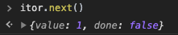
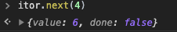
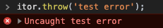
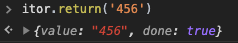

这篇文章是讲JS异步原理和实现方式的第四篇文章，前面三篇是：

[setTimeout和setImmediate到底谁先执行，本文让你彻底理解Event Loop](https://juejin.im/post/5e782486518825490455fb17)

[从发布订阅模式入手读懂Node.js的EventEmitter源码](https://juejin.im/post/5e7978485188255e237c2a29)

[手写一个Promise/A+,完美通过官方872个测试用例](https://juejin.im/post/5e8bec156fb9a03c4d40f4bc)

本文主要会讲Generator的运用和实现原理，然后我们会去读一下co模块的源码，最后还会提一下async/await。

本文全部例子都在GitHub上：[https://github.com/dennis-jiang/Front-End-Knowledges/tree/master/Examples/JavaScript/Generator](https://github.com/dennis-jiang/Front-End-Knowledges/tree/master/Examples/JavaScript/Generator)

## Generator

异步编程一直是JS的核心之一，业界也是一直在探索不同的解决方法，从“回调地狱”到发布订阅模式，再到Promise，都是在优化异步编程。尽管Promise已经很优秀了，也不会陷入“回调地狱”，但是嵌套层数多了也会有一连串的`then`，始终不能像同步代码那样直接往下写就行了。Generator是ES6引入的进一步改善异步编程的方案，下面我们先来看看基本用法。

### 基本用法

Generator的中文翻译是“生成器”，其实他要干的事情也是一个生成器，一个函数如果加了`*`，他就会变成一个生成器函数，他的运行结果会返回一个迭代器对象，比如下面的代码：

```javascript
// gen是一个生成器函数
function* gen() {
  let a = yield 1;
  let b = yield a + 2;
  yield b + 3;
}

let itor = gen();   // 生成器函数运行后会返回一个迭代器对象，即itor。
```

#### next

[ES6规范中规定](https://developer.mozilla.org/zh-CN/docs/Web/JavaScript/Reference/Iteration_protocols#迭代器协议)迭代器必须有一个`next`方法，这个方法会返回一个对象，这个对象具有`done`和`value`两个属性，`done`表示当前迭代器内容是否已经执行完，执行完为`true`，否则为`false`，`value`表示当前步骤返回的值。在`generator`具体运用中，每次遇到`yield`关键字都会暂停执行，当调用迭代器的`next`时，会将`yield`后面表达式的值作为返回对象的`value`，比如上面生成器的执行结果如下:



我们可以看到第一次调`next`返回的就是第一个`yeild`后面表达式的值，也就是1。**需要注意的是，整个迭代器目前暂停在了第一个`yield`这里，给变量`a`赋值都没执行，要调用下一个`next`的时候才会给变量`a`赋值，然后一直执行到第二个`yield`**。那应该给`a`赋什么值呢？从代码来看，`a`的值应该是`yield`语句的返回值，但是`yield`本身是没有返回值的，或者说返回值是`undefined`，如果要给`a`赋值需要下次调`next`的时候手动传进去，我们这里传一个4，4就会作为上次`yield`的返回值赋给`a`:



可以看到第二个`yield`后面的表达式`a + 2`的值是6，这是因为我们传进去的4被作为上一个`yield`的返回值了，然后计算`a + 2`自然就是6了。

我们继续`next`，把这个迭代器走完：


上图是接着前面运行的，图中第一个`next`返回的`value`是`NaN`是因为我们调`next`的时候没有传参数，也就是说`b`为`undefined`，`undefined + 3`就为`NaN`了 。最后一个`next`其实是把函数体执行完了，这时候的`value`应该是这个函数`return`的值，但是因为我们没有写`return`，默认就是`return undefined`了，执行完后`done`会被置为`true`。

#### throw

迭代器还有个方法是`throw`，这个方法可以在函数体外部抛出错误，然后在函数里面捕获，还是上面那个例子:

```javascript
function* gen() {
  let a = yield 1;
  let b = yield a + 2;
  yield b + 3;
}

let itor = gen();  
```

我们这次不用`next`执行了，直接`throw`错误出来:



这个错误因为我们没有捕获，所以直接抛到最外层来了，我们可以在函数体里面捕获他，稍微改下:

```javascript
function* gen() {
  try {
    let a = yield 1;
    let b = yield a + 2;
    yield b + 3;
  } catch (e) {
    console.log(e);
  }
}

let itor = gen();  
```

然后再来`throw`下：


这个图可以看出来，错误在函数里里面捕获了，走到了`catch`里面，这里面只有一个`console`同步代码，整个函数直接就运行结束了，所以`done`变成`true`了，当然`catch`里面可以继续写`yield`然后用`next`来执行。

#### return

迭代器还有个`return`方法，这个方法就很简单了，他会直接终止当前迭代器，将`done`置为`true`，这个方法的参数就是迭代器的`value`，还是上面的例子：

```javascript
function* gen() {
  let a = yield 1;
  let b = yield a + 2;
  yield b + 3;
}

let itor = gen();  
```

这次我们直接调用`return`:



#### yield*

简单理解，`yield*`就是在生成器里面调用另一个生成器，但是他并不会占用一个`next`，而是直接进入被调用的生成器去运行。

```javascript
function* gen() {
  let a = yield 1;
  let b = yield a + 2;
}

function* gen2() {
  yield 10 + 5;
  yield* gen();
}

let itor = gen2();  
```

上面代码我们第一次调用`next`，值自然是`10 + 5`，即15，然后第二次调用`next`，其实就走到了`yield*`了，这其实就相当于调用了`gen`，然后执行他的第一个`yield`，值就是1。


### 协程

其实Generator就是实现了协程，协程是一个比线程还小的概念。一个进程可以有多个线程，一个线程可以有多个协程，但是一个线程同时只能有一个协程在运行。这个意思就是说如果当前协程可以执行，比如同步代码，那就执行他，如果当前协程暂时不能继续执行，比如他是一个异步读文件的操作，那就将它挂起，然后去执行其他协程，等这个协程结果回来了，可以继续了再来执行他。`yield`其实就相当于将当前任务挂起了，下次调用再从这里开始。协程这个概念其实很多年前就已经被提出来了，其他很多语言也有自己的实现。Generator相当于JS实现的协程。

### 异步应用

前面讲了Generator的基本用法，我们用它来处理一个异步事件看看。我还是使用前面文章用到过的例子，三个网络请求，请求3依赖请求2的结果，请求2依赖请求1的结果，如果使用回调是这样的:

```javascript
const request = require("request");

function* requestGen() {
  function sendRequest(url) {
    request(url, function (error, response) {
      if (!error && response.statusCode == 200) {
        console.log(response.body);

        // 注意这里，引用了外部的迭代器itor
        itor.next(response.body);
      }
    })
  }

  const url = 'https://www.baidu.com';

  // 使用yield发起三个请求，每个请求成功后再继续调next
  const r1 = yield sendRequest(url);
  console.log('r1', r1);
  const r2 = yield sendRequest(url);
  console.log('r2', r2);
  const r3 = yield sendRequest(url);
  console.log('r3', r3);
}

const itor = requestGen();

// 手动调第一个next
itor.next();
```

我们这次使用Generator来解决“回调地狱”：

```javascript
const request = require("request");

function* requestGen() {
  
  function sendRequest(url) {
    request(url, function (error, response) {
      if (!error && response.statusCode == 200) {
        console.log(response.body);

        // 注意这里，引用了外部的迭代器itor
        itor.next(response.body);
      }
    })
  }

  const url = 'https://www.baidu.com';

  // 使用yield发起三个请求，每个请求成功后再继续调next
  yield sendRequest(url);
  yield sendRequest(url);
  yield sendRequest(url);
}

const itor = requestGen();

// 手动调第一个next
itor.next();
```

这个例子中我们在生成器里面写了一个请求方法，这个方法会去发起网络请求，每次网络请求成功后又继续调用next执行后面的`yield`，最后是在外层手动调一个`next`触发这个流程。这其实就类似一个尾调用，这样写可以达到效果，但是在`requestGen`里面引用了外面的迭代器`itor`，耦合很高，而且不好复用。

### 简易实现

一下简易实现来自于[异步编程二三事 | Promise/async/Generator实现原理解析 | 9k字](https://juejin.im/post/5e3b9ae26fb9a07ca714a5cc#heading-19)，这个实现可以帮我们理清Generator的yield返回值用ES5怎么模拟，但是因为`next`不能接收参数，还是做不到后面要讲的`thunk`函数自动执行：

```javascript
// 生成器函数根据yield语句将代码分割为switch-case块，后续通过切换_context.prev和_context.next来分别执行各个case
function gen$(_context) {
  while (1) {
    switch (_context.prev = _context.next) {
      case 0:
        _context.next = 2;
        return 'result1';

      case 2:
        _context.next = 4;
        return 'result2';

      case 4:
        _context.next = 6;
        return 'result3';

      case 6:
      case "end":
        return _context.stop();
    }
  }
}

// 低配版context  
var context = {
  next:0,
  prev: 0,
  done: false,
  stop: function stop () {
    this.done = true
  }
}

// 低配版invoke
let gen = function() {
  return {
    next: function() {
      value = context.done ? undefined: gen$(context)
      done = context.done
      return {
        value,
        done
      }
    }
  }
} 

// 测试使用
var g = gen() 
g.next()  // {value: "result1", done: false}
g.next()  // {value: "result2", done: false}
g.next()  // {value: "result3", done: false}
g.next()  // {value: undefined, done: true}
```

## thunk函数

为了解决前面说的耦合高，不好复用的问题，就有了thunk函数。thunk函数理解起来有点绕，我先把代码写出来，然后再一步一步来分析它的执行顺序：

```javascript
function Thunk(fn) {
  return function(...args) {
    return function(callback) {
      return fn.call(this, ...args, callback)
    }
  }
}

function run(fn) {
  let gen = fn();
  
  function next(err, data) {
    let result = gen.next(data);
    
    if(result.done) return;
    
    result.value(next);
  }
  
  next();
}

// 使用thunk方法
const request = require("request");
const requestThunk = Thunk(request);

function* requestGen() {
  const url = 'https://www.baidu.com';
  
  let r1 = yield requestThunk(url);
  console.log(r1.body);
  
  let r2 = yield requestThunk(url);
  console.log(r2.body);
  
  let r3 = yield requestThunk(url);
  console.log(r3.body);
}

// 启动运行
run(requestGen);
```

这段代码里面的Thunk函数返回了好几层函数，我们从他的使用入手一层一层剥开看：

1. `requestThunk`是Thunk运行的返回值，也就是第一层返回值，参数是`request`，也就是:

   ```javascript
   function(...args) {
     return function(callback) {
       return request.call(this, ...args, callback);   // 注意这里调用的是request
     }
   }
   ```

2. `run`函数的参数是生成器，我们看看他到底干了啥:

   > 1. run里面先调用生成器，拿到迭代器`gen`，然后自定义了一个`next`方法，并调用这个`next`方法，为了便于区分，我这里称这个自定义的`next`为局部`next`
   >
   > 2. 局部`next`会调用生成器的`next`，生成器的`next`其实就是`yield requestThunk(url)`，参数是我们传进去的`url`，这就调到我们前面的那个方法，这个`yield`返回的`value`其实是：
   >
   >    ```javascript
   >    function(callback) {
   >      return request.call(this, url, callback);   
   >    }
   >    ```
   >
   > 3. 检测迭代器是否已经迭代完毕，如果没有，就继续调用第二步的这个函数，这个函数其实才真正的去`request`，这时候传进去的参数是局部`next`，局部`next`也作为了`request`的回调函数。
   >
   > 4. 这个回调函数在执行时又会调`gen.next`，这样生成器就可以继续往下执行了，同时`gen.next`的参数是回调函数的`data`，这样，生成器里面的`r1`其实就拿到了请求的返回值。

Thunk函数就是这样一种可以自动执行Generator的函数，因为Thunk函数的包装，我们在Generator里面可以像同步代码那样直接拿到`yield`异步代码的返回值。

## co模块

co模块是一个很受欢迎的模块，他也可以自动执行Generator，他的yield后面支持thunk和Promise，我们先来看看他的基本使用，然后再去分析下他的源码。

官方GitHub：[https://github.com/tj/co](https://github.com/tj/co)

### 基本使用

#### 支持thunk

前面我们讲了thunk函数，我们还是从thunk函数开始。代码还是用我们前面写的thunk函数，但是因为co支持的thunk是只接收回调函数的函数形式，我们使用时需要调整下:

```javascript
// 还是之前的thunk函数
function Thunk(fn) {
  return function(...args) {
    return function(callback) {
      return fn.call(this, ...args, callback)
    }
  }
}

// 将我们需要的request转换成thunk
const request = require('request');
const requestThunk = Thunk(request);

// 转换后的requestThunk其实可以直接用了
// 用法就是 requestThunk(url)(callback)
// 但是我们co接收的thunk是 fn(callback)形式
// 我们转换一下
// 这时候的baiduRequest也是一个函数，url已经传好了，他只需要一个回调函数做参数就行
// 使用就是这样：baiduRequest(callback)
const baiduRequest = requestThunk('https://www.baidu.com');

// 引入co执行, co的参数是一个Generator
// co的返回值是一个Promise，我们可以用then拿到他的结果
const co = require('co');
co(function* () {
  const r1 = yield baiduRequest;
  const r2 = yield baiduRequest;
  const r3 = yield baiduRequest;
  
  return {
    r1,
    r2,
    r3,
  }
}).then((res) => {
  // then里面就可以直接拿到前面返回的{r1, r2, r3}
  console.log(res);
});
```

#### 支持Promise

其实co官方是建议yield后面跟Promise的，虽然支持thunk，但是未来可能会移除。使用Promise，我们代码写起来其实更简单，直接用fetch就行，不用包装Thunk。

```javascript
const fetch = require('node-fetch');
const co = require('co');
co(function* () {
  // 直接用fetch，简单多了，fetch返回的就是Promise
  const r1 = yield fetch('https://www.baidu.com');
  const r2 = yield fetch('https://www.baidu.com');
  const r3 = yield fetch('https://www.baidu.com');
  
  return {
    r1,
    r2,
    r3,
  }
}).then((res) => {
  // 这里同样可以拿到{r1, r2, r3}
  console.log(res);
});
```

### 源码分析

本文的源码分析基于co模块4.6.0版本，源码：[https://github.com/tj/co/blob/master/index.js](https://github.com/tj/co/blob/master/index.js)

仔细看源码会发现他代码并不多，总共两百多行，一半都是在进行yield后面的参数检测和处理，检测他是不是Promise，如果不是就转换为Promise，所以即使你yield后面传的thunk，他还是会转换成Promise处理。转换Promise的代码相对比较独立和简单，我这里不详细展开了，这里主要还是讲一讲核心方法`co(gen)`。下面是我复制的去掉了注释的简化代码:

```javascript
function co(gen) {
  var ctx = this;
  var args = slice.call(arguments, 1);

  return new Promise(function(resolve, reject) {
    if (typeof gen === 'function') gen = gen.apply(ctx, args);
    if (!gen || typeof gen.next !== 'function') return resolve(gen);

    onFulfilled();

    function onFulfilled(res) {
      var ret;
      try {
        ret = gen.next(res);
      } catch (e) {
        return reject(e);
      }
      next(ret);
      return null;
    }

    function onRejected(err) {
      var ret;
      try {
        ret = gen.throw(err);
      } catch (e) {
        return reject(e);
      }
      next(ret);
    }

    function next(ret) {
      if (ret.done) return resolve(ret.value);
      var value = toPromise.call(ctx, ret.value);
      if (value && isPromise(value)) return value.then(onFulfilled, onRejected);
      return onRejected(new TypeError('You may only yield a function, promise, generator, array, or object, '
        + 'but the following object was passed: "' + String(ret.value) + '"'));
    }
  });
}
```

1. 从整体结构看，co的参数是一个Generator，返回值是一个Promise，几乎所有逻辑代码都在这个Promise里面，这也是我们使用时用then拿结果的原因。

2. Promise里面先把Generator拿出来执行，得到一个迭代器`gen`

3. 手动调用一次`onFulfilled`，开启迭代

   > 1. `onFulfilled`接收一个参数`res`，第一次调用是没有传这个参数，这个参数主要是用来接收后面的then返回的结果。
   > 2. 然后调用`gen.next`，注意这个的返回值ret的形式是{value, done}，然后将这个ret传给局部的next

4. 然后执行局部next，他接收的参数是yield返回值{value, done}

   > 1. 这里先检测迭代是否完成，如果完成了，就直接将整个promise resolve。
   > 2. 这里的value是yield后面表达式的值，可能是thunk，也可能是promise
   > 3. 将value转换成promise
   > 4. 将转换后的promise拿出来执行，成功的回调是前面的`onFulfilled`

5. 我们再来看下`onFulfilled`，这是第二次执行`onFulfilled`了。这次执行的时候传入的参数res是上次异步promise的执行结果，对应我们的fetch就是拿回来的数据，这个数据传给第二个`gen.next`，效果就是我们代码里面的赋值给了第一个`yield`前面的变量`r1`。然后继续局部next，这个next其实就是执行第二个异步Promise了。这个promise的成功回调又继续调用`gen.next`，这样就不断的执行下去，直到`done`变成`true`为止。
6. 最后看一眼`onRejected`方法，这个方法其实作为了异步promise的错误分支，这个函数里面直接调用了`gen.throw`，这样我们在Generator里面可以直接用`try...catch...`拿到错误。需要注意的是`gen.throw`后面还继续调用了`next(ret)`，这是因为在Generator的`catch`分支里面还可能继续有`yield`，比如错误上报的网络请求，这时候的迭代器并不一定结束了。

## async/await

最后提一下`async/await`，先来看一下用法:

```javascript
const fetch = require('node-fetch');

async function sendRequest () {
  const r1 = await fetch('https://www.baidu.com');
  const r2 = await fetch('https://www.baidu.com');
  const r3 = await fetch('https://www.baidu.com');
  
  return {
    r1,
    r2,
    r3,
  }
}

// 注意async返回的也是一个promise
sendRequest().then((res) => {
  console.log('res', res);
});
```

咋一看这个跟前面promise版的co是不是很像，返回值都是一个promise，只是Generator换成了一个`async`函数，函数里面的`yield`换成了`await`，而且外层不需要co来包裹也可以自动执行了。其实async函数就是Generator加自动执行器的语法糖，可以理解为从语言层面支持了Generator的自动执行。上面这段代码跟co版的promise其实就是等价的。

## 总结

1. Generator是一种更现代的异步解决方案，在JS语言层面支持了协程
2. Generator的返回值是一个迭代器
3. 这个迭代器需要手动调`next`才能一条一条执行`yield`
4. `next`的返回值是{value, done}，`value`是yield后面表达式的值
5. `yield`语句本身并没有返回值，下次调`next`的参数会作为上一个`yield`语句的返回值
6. Generator自己不能自动执行，要自动执行需要引入其他方案，前面讲`thunk`的时候提供了一种方案，`co`模块也是一个很受欢迎的自动执行方案
7. 这两个方案的思路有点类似，都是先写一个局部的方法，这个方法会去调用`gen.next`，同时这个方法本身又会传到回调函数或者promise的成功分支里面，异步结束后又继续调用这个局部方法，这个局部方法又调用`gen.next`，这样一直迭代，直到迭代器执行完毕。
8. `async/await`其实是Generator和自动执行器的语法糖，写法和实现原理都类似co模块的promise模式。

**文章的最后，感谢你花费宝贵的时间阅读本文，如果本文给了你一点点帮助或者启发，请不要吝啬你的赞和GitHub小星星，你的支持是作者持续创作的动力。**

**作者博文GitHub项目地址： [https://github.com/dennis-jiang/Front-End-Knowledges](https://github.com/dennis-jiang/Front-End-Knowledges)**

**作者掘金文章汇总：[https://juejin.im/post/5e3ffc85518825494e2772fd](https://juejin.im/post/5e3ffc85518825494e2772fd)**