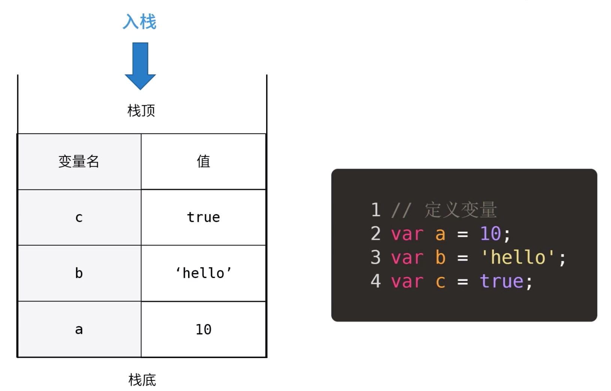
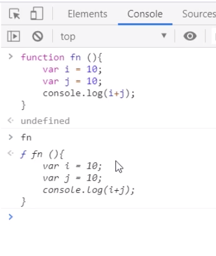
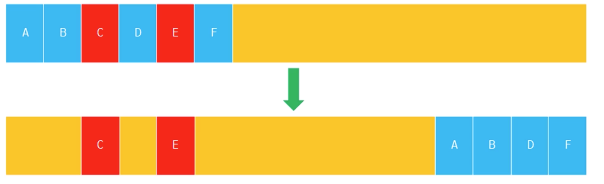

### 为什么要关注内存

如果我们有内存溢出，程序占用的内存会越来越大，最终引起客户端卡顿，甚至无响应。如果我们使用Node.js做后端应用，因为后端程序会长时间运行，如果有内存溢出，造成的后果会更严重，服务器内存可能会很快就消耗光，应用不能正常运行。

### JS数据类型与JS内存机制

JS有如下数据类型

* 原始数据类型：String, Number, Boolean, Null, Undefined, Symbol

* 引用数据类型：Object

而存放这些数据的内存又可以分为两部分：栈内存（Stack）和堆内存（Heap）。原始数据类型存在栈中，引用类型存在堆中。

#### 栈内存

栈是一种只能一端进出的数据结构，先进后出，后进先出。假如我们有如下三个变量：

```javascript
var a = 10;
var b = 'hello';
var c = true;
```

根据我们的定义顺序，`a`会首先入栈，然后是`b`，最后是`c`。最终结构图如下所示：



我们定义一个变量是按照如下顺序进行的，以`var a = 10;` 为例，我们先将10放入内存，然后申明一个变量`a`，这时候`a`的值是`undefined`，最后进行赋值，就是将`a`与10关联起来。


从一个栈删除元素就是出栈，从栈顶删除，他相邻的元素成为新的栈顶元素。


#### 堆内存

JS中原始数据类型的内存大小是固定的，由系统自动分配内存。但是引用数据类型，比如Object, Array，他们的大小不是固定的，所以是存在堆内存的。JS不允许直接操作堆内存，我们在操作对象时，操作的实际是对象的引用，而不是实际的对象。可以理解为对象在栈里面存了一个内存地址，这个地址指向了堆里面实际的对象。所以引用类型的值是一个指向堆内存的引用地址。


函数也是引用类型，当我们定义一个函数时，会在堆内存中开辟一块内存空间，将函数体代码以字符串的形式存进去。然后将这块内存的地址赋值给函数名，函数名和引用地址会存在栈上。


可以在Chrome调试工具中尝试一下，定义一个方法，然后不加括号调用，直接输出函数，可以看到，打印出来的是函数体字符串：



### 垃圾回收

垃圾回收就是找出那些不再继续使用的变量，然后释放其占用的内存，垃圾回收器会按照固定的时间间隔周期性执行这一操作。JS使用垃圾回收机制来自动管理内存，但是他是一把双刃剑：

* **优势**： 可以大幅简化程序的内存管理代码，降低程序员负担，减少因为长时间运行而带来的内存泄漏问题。
* **劣势**：程序员无法掌控内存，JS没有暴露任何关于内存的API，我们无法进行强制垃圾回收，更无法干预内存管理。

#### 引用计数(reference counting)

引用计数是一种回收策略，它跟踪记录每个值被引用的次数，每次引用的时候加一，被释放时减一，如果一个值的引用次数变成0了，就可以将其内存空间回收。

```javascript
const obj = {a: 10};  // 引用 +1
const obj1 = {a: 10};  // 引用 +1
const obj = {};  // 引用 -1
const obj1 = null;  // 引用为 0
```

当声明了一个变量并将一个引用类型值赋值该变量时，则这个值的引用次数就是1.如果同一个值又被赋给另外一个变量，则该值得引用次数加1。相反，如果包含对这个值引用的变量又取 得了另外一个值，则这个值的引用次数减 1。当这个值的引用次数变成 0时，则说明没有办法再访问这个值了，因而就可以将其占用的内存空间回收回来。这样，当垃圾收集器下次再运行时，它就会释放那 些引用次数为零的值所占用的内存。

使用引用计数会有一个很严重的问题：循环引用。循环引用指的是对象A中包含一个指向对象B的指针，而对象B中也包含一个指向对象A的引用。

```javascript
function problem(){ 
    var objectA = {};
    var objectB = {}; 
 
    objectA.a = objectB;
    objectB.b = objectA; 
}
```

在这个例子中，objectA 和 objectB 通过各自的属性相互引用；也就是说，这两个对象的引用次数都是 2。当函数执行完毕后，objectA 和 objectB 还将继续存在，因为它们的引用次数永远不会是 0。

因为引用计数有这样的问题，现在浏览器已经不再使用这个算法了，这个算法主要存在于IE 8及以前的版本，现代浏览器更多的采用标记-清除算法。

#### 标记-清除算法

标记-清除算法就是当变量进入环境是，这个变量标记位“进入环境”；而当变量离开环境时，标记为“离开环境”，当垃圾回收时销毁那些带标记的值并回收他们的内存空间。这里说的环境就是执行环境，执行环境定义了变量或函数有权访问的数据。每个执行环境都有一个与之关联的变量对象（variable object），环境中所定义的所以变量和函数都保存在这个对象中。某个执行环境中所有代码执行完毕后，改环境被销毁，保存在其中的所有变量和函数也随之销毁。

##### 全局执行环境

全局执行环境是最外围的一个执行环境，在浏览器中，全局环境是`window`，Node.js中是`global`对象。全局变量和函数都是作为`window`或者`global`的属性和方法创建的。全局环境只有当程序退出或者关闭网页或者浏览器的时候才会销毁。

##### 局部执行环境(环境栈)

每个函数都有自己的执行环境。当执行流进入一个函数时，函数的环境会被推入一个环境栈中。当这个函数执行之后，栈将其环境弹出，把控制权返回给之前的环境。ECMAScript程序中的执行流就是这个机制控制的。


在一个环境中声明变量的时候，垃圾回收器将其标记为“进入环境”，当函数执行完毕时，将其标记为“离开环境”，内存被回收。

### V8的内存管理

V8是有内存限制的，因为它最开始是为浏览器设计的，不太可能遇到大量内存的使用场景。关键原因还是垃圾回收所导致的线程暂停执行的时间过长。根据官方说法，以1.5G内存为例，V8一次小的垃圾回收需要50ms，而一次非增量的，即全量的垃圾回收更需要一秒。这显然是不可接受的。因此V8限制了内存使用的大小，但是Node.js是可以通过配置修改的，更好的做法是使用`Buffer`对象，因为`Buffer`的内存是底层C++分配的，不占用JS内存，所以他也就不受V8限制。

V8采用了分代回收的策略，将内存分为两个生代：新生代和老生代

#### 新生代

新生代内存中的垃圾回收主要通过 Scavenge 算法进行，具体实现时主要采用了 Cheney 算法。新生代的堆内存被分为多个`Semispace`，每个`Semispace`分为两部分`from`和`to`，只有`from`的空间是使用中的，分配对象空间时，只在`from`中进行分配，`to`是闲置的。进行垃圾回收时按照如下步骤进行：

```
1. 找出from中还在使用的对象，即存活的对象
2. 将这些活着的对象全部复制到to
3. 反转from和to，这时候from中全部是存活对象，to全部是死亡对象
4. 对to进行全部回收
```


可以看到在新生代中我们复制的是存活的对象，死亡对象都留在原地，最后被全部回收。这是因为对于大多数新增变量来说，可能只是用一下，很快就需要释放，那在新生代中每次回收会发现存活的是少数，死亡的是多数。那我们复制的就是少数对象，这样效率更高。如果一个变量在新生代中经过几次复制还活着，那他生命周期可能就比较长，会晋升到老生代。有两种情况会对对象进行晋升：

```
1. 新生代垃圾回收过程中，当一个对象经过多次复制后还存活，移动到老生代；
2. 在from和to进行反转的过程中，如果to空间的使用量超过了25%，那么from的对象全部晋升到老生代
```

#### 老生代

老生代存放的是生命周期较长的对象，他的结构是一个连续的结构，不像新生代分为`from`和`to`两部分。老生代垃圾回收有两种方式，标记清除和标记合并。


##### 标记清除

标记清除是标记死亡的对象，直接其空间释放掉。在标记清除方法清除掉死亡对象后，内存空间就变成不连续的了，所以出现了另一个方案：标记合并。


##### 标记合并

这个方案有点像新生代的Cheney算法，将存活的对象移动到一边，将需要被回收的对象移动到另一边，然后对需要被回收的对象区域进行整体的垃圾回收。



与新生代算法相比，老生代主要操作死亡对象，因为老生代都是生命周期较长的对象，每次回收死亡的比较少；而新生代主要操作的存活对象，因为新生代都是生命周期较短的对象，每次回收存活的较少。这样无论新生代还是老生代，每次回收时都尽可能操作更少的对象，效率就提高了。