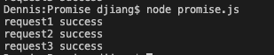

前段时间我用两篇文章深入讲解了异步的概念和Event Loop的底层原理，然后还讲了一种自己实现异步的发布订阅模式：

[setTimeout和setImmediate到底谁先执行，本文让你彻底理解Event Loop](https://juejin.im/post/5e782486518825490455fb17)

[从发布订阅模式入手读懂Node.js的EventEmitter源码](https://juejin.im/post/5e7978485188255e237c2a29)

本文会讲解另一种更现代的异步实现方案：`Promise`。Promise几乎是面试必考点，所以我们不能仅仅会用，还得知道他的底层原理，学习他原理的最好方法就是自己也实现一个Promise。所以本文会自己实现一个遵循`Promise/A+`规范的Promise。实现之后，我们还要用`Promise/A+`官方的测试工具来测试下我们的实现是否正确，这个工具总共有872个测试用例，全部通过才算是符合`Promise/A+`规范，下面是他们的链接：

`Promise/A+`规范: [https://github.com/promises-aplus/promises-spec](https://github.com/promises-aplus/promises-spec)

`Promise/A+`测试工具: [https://github.com/promises-aplus/promises-tests](https://github.com/promises-aplus/promises-tests)

本文的完整代码托管在GitHub上: [https://github.com/dennis-jiang/Front-End-Knowledges/blob/master/Examples/JavaScript/Promise/MyPromise.js](https://github.com/dennis-jiang/Front-End-Knowledges/blob/master/Examples/JavaScript/Promise/MyPromise.js)

## Promise用法

Promise的基本用法，网上有很多，我这里简单提一下，我还是用三个相互依赖的网络请求做例子，假如我们有三个网络请求，请求2必须依赖请求1的结果，请求3必须依赖请求2的结果，如果用回调的话会有三层，会陷入“回调地狱”，用Promise就清晰多了:

```javascript
const request = require("request");

// 我们先用Promise包装下三个网络请求
// 请求成功时resolve这个Promise
const request1 = function() {
  const promise = new Promise((resolve) => {
    request('https://www.baidu.com', function (error, response) {
      if (!error && response.statusCode == 200) {
        resolve('request1 success');
      }
    });
  });

  return promise;
}

const request2 = function() {
  const promise = new Promise((resolve) => {
    request('https://www.baidu.com', function (error, response) {
      if (!error && response.statusCode == 200) {
        resolve('request2 success');
      }
    });
  });

  return promise;
}

const request3 = function() {
  const promise = new Promise((resolve) => {
    request('https://www.baidu.com', function (error, response) {
      if (!error && response.statusCode == 200) {
        resolve('request3 success');
      }
    });
  });

  return promise;
}


// 先发起request1，等他resolve后再发起request2，
// 然后是request3
request1().then((data) => {
  console.log(data);
  return request2();
})
.then((data) => {
  console.log(data);
  return request3();
})
.then((data) => {
  console.log(data);
})
```

上面的例子里面，`then`是可以链式调用的，后面的`then`可以拿到前面`resolve`出来的数据，我们控制台可以看到三个success依次打出来:



## Promises/A+规范

通过上面的例子，其实我们已经知道了一个promise长什么样子，Promises/A+规范其实就是对这个长相进一步进行了规范。下面我会对这个规范进行一些讲解。

### 术语

> 1. `promise`：是一个拥有 `then` 方法的对象或函数，其行为符合本规范
>
> 2. `thenable`：是一个定义了 `then` 方法的对象或函数。这个主要是用来兼容一些老的Promise实现，只要一个Promise实现是thenable，也就是拥有`then`方法的，就可以跟Promises/A+兼容。
> 3. `value`：指`reslove`出来的值，可以是任何合法的JS值(包括 `undefined` , thenable 和 promise等)
> 4. `exception`：异常，在Promise里面用`throw`抛出来的值
> 5. `reason`：拒绝原因，是`reject`里面传的参数，表示`reject`的原因

### Promise状态

Promise总共有三个状态:

> 1. `pending`: 一个promise在resolve或者reject前就处于这个状态。
> 2. `fulfilled`: 一个promise被resolve后就处于`fulfilled`状态，这个状态不能再改变，而且必须拥有一个**不可变**的值(`value`)。
> 3. `rejected`: 一个promise被reject后就处于`rejected`状态，这个状态也不能再改变，而且必须拥有一个**不可变**的拒绝原因(`reason`)。

注意这里的**不可变**指的是`===`，也就是说，如果`value`或者`reason`是对象，只要保证引用不变就行，规范没有强制要求里面的属性也不变。Promise状态其实很简单，画张图就是:


### then方法

一个promise必须拥有一个`then`方法来访问他的值或者拒绝原因。`then`方法有两个参数：

```javascript
promise.then(onFulfilled, onRejected)
```

#### 参数可选

`onFulfilled` 和 `onRejected` 都是可选参数。

* 如果 `onFulfilled` 不是函数，其必须被忽略
* 如果 `onRejected` 不是函数，其必须被忽略

#### `onFulfilled` 特性

如果 `onFulfilled` 是函数：

- 当 `promise` 执行结束后其必须被调用，其第一个参数为 `promise` 的终值`value`
- 在 `promise` 执行结束前其不可被调用
- 其调用次数不可超过一次

#### `onRejected` 特性

如果 `onRejected` 是函数：

- 当 `promise` 被拒绝执行后其必须被调用，其第一个参数为 `promise` 的据因`reason`
- 在 `promise` 被拒绝执行前其不可被调用
- 其调用次数不可超过一次

#### 多次调用

`then` 方法可以被同一个 `promise` 调用多次

- 当 `promise` 成功执行时，所有 `onFulfilled` 需按照其注册顺序依次回调
- 当 `promise` 被拒绝执行时，所有的 `onRejected` 需按照其注册顺序依次回调

#### 返回

`then` 方法必须返回一个 `promise` 对象。

```javascript
promise2 = promise1.then(onFulfilled, onRejected); 
```

- 如果 `onFulfilled` 或者 `onRejected` 返回一个值 `x` ，则运行 **Promise 解决过程**：`[[Resolve]](promise2, x)`
- 如果 `onFulfilled` 或者 `onRejected` 抛出一个异常 `e` ，则 `promise2` 必须拒绝执行，并返回拒因 `e`
- 如果 `onFulfilled` 不是函数且 `promise1` 成功执行， `promise2` 必须成功执行并返回相同的值
- 如果 `onRejected` 不是函数且 `promise1` 拒绝执行， `promise2` 必须拒绝执行并返回相同的据因

规范里面还有很大一部分是讲解**Promise 解决过程**的，光看规范，很空洞，前面这些规范已经可以指导我们开始写一个自己的Promise了，**Promise 解决过程**会在我们后面写到了再详细讲解。

## 自己写一个Promise

我们自己要写一个Promise，肯定需要知道有哪些工作需要做，我们先从Promise的使用来窥探下需要做啥:

> 1. 新建Promise需要使用`new`关键字，那他肯定是作为面向对象的方式调用的，Promise是一个类。[关于JS的面向对象更详细的解释可以看这篇文章。](https://juejin.im/post/5e50e5b16fb9a07c9a1959af)
> 2. 我们`new Promise(fn)`的时候需要传一个函数进去，说明Promise的参数是一个函数
> 3. 构造函数传进去的`fn`会收到`resolve`和`reject`两个函数，用来表示Promise成功和失败，说明构造函数里面还需要`resolve`和`reject`这两个函数，这两个函数的作用是改变Promise的状态。
> 4. 根据规范，promise有`pending`，`fulfilled`，`rejected`三个状态，初始状态为`pending`，调用`resolve`会将其改为`fulfilled`，调用`reject`会改为`rejected`。
> 5. promise实例对象建好后可以调用`then`方法，而且是可以链式调用`then`方法，说明`then`是一个实例方法。[链式调用的实现这篇有详细解释，我这里不再赘述](https://juejin.im/post/5e64cf0ef265da5734024f84#heading-7)。简单的说就是`then`方法也必须返回一个带`then`方法的对象，可以是this或者新的promise实例。

### 构造函数

为了更好的兼容性，本文就不用ES6了。

```javascript
// 先定义三个常量表示状态
var PENDING = 'pending';
var FULFILLED = 'fulfilled';
var REJECTED = 'rejected';

function MyPromise(fn) {
  this.status = PENDING;    // 初始状态为pending
  this.value = null;        // 初始化value
  this.reason = null;       // 初始化reason
}
```

### `resolve`和`reject`方法

根据规范，`resolve`方法是将状态改为fulfilled，`reject`是将状态改为rejected。

```javascript
// 这两个方法直接写在构造函数里面
function MyPromise(fn) {
  // ...省略前面代码...
  
  // 存一下this,以便resolve和reject里面访问
  var that = this;
  // resolve方法参数是value
  function resolve(value) {
    if(that.status === PENDING) {
      that.status = FULFILLED;
      that.value = value;
    }
  }
  
  // reject方法参数是reason
  function reject(reason) {
    if(that.status === PENDING) {
      that.status = REJECTED;
      that.reason = reason;
    }
  }
}
```

### 调用构造函数参数

最后将`resolve`和`reject`作为参数调用传进来的参数，记得加上`try`，如果捕获到错误就`reject`。

```javascript
function MyPromise(fn) {
  // ...省略前面代码...
  
  try {
    fn(resolve, reject);
  } catch (error) {
    reject(error);
  }
}
```

### `then`方法

根据我们前面的分析，`then`方法可以链式调用，所以他是实例方法，而且规范中的API是`promise.then(onFulfilled, onRejected)`，我们先把架子搭出来：

```javascript
MyPromise.prototype.then = function(onFulfilled, onRejected) {}
```

那`then`方法里面应该干什么呢，其实规范也告诉我们了，先检查`onFulfilled`和`onRejected`是不是函数，如果不是函数就忽略他们，所谓“忽略”并不是什么都不干，对于`onFulfilled`来说“忽略”就是将`value`原封不动的返回，对于`onRejected`来说就是返回`reason`，`onRejected`因为是错误分支，我们返回`reason`应该throw一个Error:

```javascript
MyPromise.prototype.then = function(onFulfilled, onRejected) {
  // 如果onFulfilled不是函数，给一个默认函数，返回value
  var realOnFulfilled = onFulfilled;
  if(typeof realOnFulfilled !== 'function') {
    realOnFulfilled = function (value) {
      return value;
    }
  }

  // 如果onRejected不是函数，给一个默认函数，返回reason的Error
  var realOnRejected = onRejected;
  if(typeof realOnRejected !== 'function') {
    realOnRejected = function (reason) {
      if(reason instanceof Error) {
        throw reason;
      } else {
        throw new Error(reason)
      }
    }
  }
}
```

参数检查完后就该干点真正的事情了，想想我们使用Promise的时候，如果promise操作成功了就会调用`then`里面的`onFulfilled`，如果他失败了，就会调用`onRejected`。对应我们的代码就应该检查下promise的status，如果是`FULFILLED`，就调用`onFulfilled`，如果是`REJECTED`，就调用`onRejected`:

```javascript
MyPromise.prototype.then = function(onFulfilled, onRejected) {
  // ...省略前面代码...

  if(this.status === FULFILLED) {
    onFulfilled(this.value)
  }

  if(this.status === REJECTED) {
    onRejected(this.reason);
  }
}
```

再想一下，我们新建一个promise的时候可能是直接这样用的:

```javascript
new Promise(fn).then(onFulfilled, onRejected);
```

上面代码`then`是在实例对象一创建好就调用了，这时候`fn`里面的异步操作可能还没结束呢，也就是说他的`status`还是`PENDING`，这怎么办呢，这时候我们肯定不能立即调`onFulfilled`或者`onRejected`的，因为`fn`到底成功还是失败还不知道呢。**那什么时候知道`fn`成功还是失败呢？答案是`fn`里面主动调`resolve`或者`reject`的时候。所以如果这时候`status`状态还是`PENDING`，我们应该将`onFulfilled`和`onRejected`两个回调存起来，等到`fn`有了结论，`resolve`或者`reject`的时候再来调用对应的代码。因为后面`then`还有链式调用，会有多个`onFulfilled`和`onRejected`，我这里用两个数组将他们存起来，等`resolve`或者`reject`的时候将数组里面的全部方法拿出来执行一遍**：

```javascript
// 构造函数
function MyPromise(fn) {
  // ...省略其他代码...
  
  // 构造函数里面添加两个数组存储成功和失败的回调
  this.onFulfilledCallbacks = [];
  this.onRejectedCallbacks = [];
  
  function resolve(value) {
    if(that.status === PENDING) {
      // ...省略其他代码...
      // resolve里面将所有成功的回调拿出来执行
      that.onFulfilledCallbacks.forEach(callback => {
        callback(that.value);
      });
    }
  }
  
  function reject(reason) {
    if(that.status === PENDING) {
      // ...省略其他代码...
      // resolve里面将所有失败的回调拿出来执行
      that.onRejectedCallbacks.forEach(callback => {
        callback(that.reason);
      });
    }
  }
}

// then方法
MyPromise.prototype.then = function(onFulfilled, onRejected) {
  // ...省略其他代码...

  // 如果还是PENDING状态，将回调保存下来
  if(this.status === PENDING) {
    this.onFulfilledCallbacks.push(realOnFulfilled);
    this.onRejectedCallbacks.push(realOnRejected);
  }
}
```

上面这种暂时将回调保存下来，等条件满足的时候再拿出来运行让我想起了一种模式：订阅发布模式。我们往回调数组里面`push`回调函数，其实就相当于往事件中心注册事件了，`resolve`就相当于发布了一个成功事件，所有注册了的事件，即`onFulfilledCallbacks`里面的所有方法都会拿出来执行，同理`reject`就相当于发布了一个失败事件。[更多订阅发布模式的原理可以看这里](https://juejin.im/post/5e7978485188255e237c2a29)。

### 完成了一小步

到这里为止，其实我们已经可以实现异步调用了，只是`then`的返回值还没实现，还不能实现链式调用，我们先来玩一下：

```javascript
var request = require("request");
var MyPromise = require('./MyPromise');

var promise1 = new MyPromise((resolve) => {
  request('https://www.baidu.com', function (error, response) {
    if (!error && response.statusCode == 200) {
      resolve('request1 success');
    }
  });
});

promise1.then(function(value) {
  console.log(value);
});

var promise2 = new MyPromise((resolve, reject) => {
  request('https://www.baidu.com', function (error, response) {
    if (!error && response.statusCode == 200) {
      reject('request2 failed');
    }
  });
});

promise2.then(function(value) {
  console.log(value);
}, function(reason) {
  console.log(reason);
});
```

上述代码输出如下图，符合我们的预期，说明到目前为止，我们的代码都没问题:


### `then`的返回值

根据规范`then`的返回值必须是一个promise，规范还定义了不同情况应该怎么处理，我们先来处理几种比较简单的情况:

1. 如果 `onFulfilled` 或者 `onRejected` 抛出一个异常 `e` ，则 `promise2` 必须拒绝执行，并返回拒因 `e`。

```javascript
MyPromise.prototype.then = function(onFulfilled, onRejected) {
	// ... 省略其他代码 ...
  
  // 有了这个要求，在RESOLVED和REJECTED的时候就不能简单的运行onFulfilled和onRejected了。
  // 我们需要将他们用try...catch...包起来，如果有错就reject。
  if(this.status === FULFILLED) {
    var promise2 = new MyPromise(function(resolve, reject) {
      try {
        realOnFulfilled(that.value);
      } catch (error) {
        reject(error);
      }
    });
  
    return promise2;
  }

  if(this.status === REJECTED) {
    var promise2 = new MyPromise(function(resolve, reject) {
      try {
        realOnRejected(that.reason);
      } catch (error) {
        reject(error);
      }
    });
  
    return promise2;
  }
  
  // 如果还是PENDING状态，也不能直接保存回调方法了，需要包一层来捕获错误
  if(this.status === PENDING) {
    var promise2 = new MyPromise(function(resolve, reject) {
      that.onFulfilledCallbacks.push(function() {
        try {
          realOnFulfilled(that.value);
        } catch (error) {
          reject(error);
        }
      });
      that.onRejectedCallbacks.push(function() {
        try {
          realOnRejected(that.reason);
        } catch (error) {
          reject(error);
        }
      });
    });
  
    return promise2;
  }
}
```

2. 如果 `onFulfilled` 不是函数且 `promise1` 成功执行， `promise2` 必须成功执行并返回相同的值

```javascript
// 我们就根据要求加个判断，注意else里面是正常执行流程，需要resolve
// 这是个例子，每个realOnFulfilled后面都要这样写
  if(this.status === FULFILLED) {
    var promise2 = new MyPromise(function(resolve, reject) {
      try {
        if (typeof onFulfilled !== 'function') {
          resolve(that.value);
        } else {
          realOnFulfilled(that.value);
          resolve(that.value);
        }
      } catch (error) {
        reject(error);
      }
    });
  
    return promise2;
  }
```

3. 如果 `onRejected` 不是函数且 `promise1` 拒绝执行， `promise2` 必须拒绝执行并返回相同的据因。这个要求其实在我们检测 `onRejected` 不是函数的时候已经做到了，因为我们默认给的`onRejected`里面会throw一个Error，所以代码肯定会走到catch里面去。但是我们为了更直观，代码还是跟规范一一对应吧。需要注意的是，如果`promise1`的`onRejected`执行成功了，`promise2`应该被`resolve`。改造代码如下:

```javascript
  if(this.status === REJECTED) {
    var promise2 = new MyPromise(function(resolve, reject) {
      try {
        if(typeof onRejected !== 'function') {
          reject(that.reason);
        } else {
          realOnRejected(that.reason);
          resolve();
        }
      } catch (error) {
        reject(error);
      }
    });
  
    return promise2;
  }
```

4. 如果 `onFulfilled` 或者 `onRejected` 返回一个值 `x` ，则运行下面的 **Promise 解决过程**：`[[Resolve]](promise2, x)`。这条其实才是规范的第一条，因为他比较麻烦，所以我将它放到了最后。前面我们代码的实现，其实只要`onRejected`或者`onFulfilled`成功执行了，我们都要`resolve promise2`。多了这条，我们还需要对`onRejected`或者`onFulfilled`的返回值进行判断，如果有返回值就要进行 **Promise 解决过程**。我们专门写一个方法来进行**Promise 解决过程**。前面我们代码的实现，其实只要`onRejected`或者`onFulfilled`成功执行了，我们都要`resolve promise2`，这个过程我们也放到这个方法里面去吧，所以代码变为下面这样，其他地方类似：

```javascript
  if(this.status === FULFILLED) {
    var promise2 = new MyPromise(function(resolve, reject) {
      try {
        if (typeof onFulfilled !== 'function') {
          resolve(that.value);
        } else {
          var x = realOnFulfilled(that.value);
          resolvePromise(promise2, x, resolve, reject);   // 调用Promise 解决过程
        }
      } catch (error) {
        reject(error);
      }
    });
  
    return promise2;
  }
```

### **Promise 解决过程**

现在我们该来实现`resolvePromise`方法了，规范中这一部分较长，我就直接把规范作为注释写在代码里面了。

```javascript
function resolvePromise(promise, x, resolve, reject) {
  // 如果 promise 和 x 指向同一对象，以 TypeError 为据因拒绝执行 promise
  // 这是为了防止死循环
  if (promise === x) {
    return reject(new TypeError('The promise and the return value are the same'));
  }

  if (x instanceof MyPromise) {
    // 如果 x 为 Promise ，则使 promise 接受 x 的状态
    // 也就是继续执行x，如果执行的时候拿到一个y，还要继续解析y
    // 这个if跟下面判断then然后拿到执行其实重复了，可有可无
    x.then(function (y) {
      resolvePromise(promise, y, resolve, reject);
    }, reject);
  }
  // 如果 x 为对象或者函数
  else if (typeof x === 'object' || typeof x === 'function') {
    // 这个坑是跑测试的时候发现的，如果x是null，应该直接resolve
    if (x === null) {
      return resolve(x);
    }

    try {
      // 把 x.then 赋值给 then 
      var then = x.then;
    } catch (error) {
      // 如果取 x.then 的值时抛出错误 e ，则以 e 为据因拒绝 promise
      return reject(error);
    }

    // 如果 then 是函数
    if (typeof then === 'function') {
      var called = false;
      // 将 x 作为函数的作用域 this 调用之
      // 传递两个回调函数作为参数，第一个参数叫做 resolvePromise ，第二个参数叫做 rejectPromise
      // 名字重名了，我直接用匿名函数了
      try {
        then.call(
          x,
          // 如果 resolvePromise 以值 y 为参数被调用，则运行 [[Resolve]](promise, y)
          function (y) {
            // 如果 resolvePromise 和 rejectPromise 均被调用，
            // 或者被同一参数调用了多次，则优先采用首次调用并忽略剩下的调用
            // 实现这条需要前面加一个变量called
            if (called) return;
            called = true;
            resolvePromise(promise, y, resolve, reject);
          },
          // 如果 rejectPromise 以据因 r 为参数被调用，则以据因 r 拒绝 promise
          function (r) {
            if (called) return;
            called = true;
            reject(r);
          });
      } catch (error) {
        // 如果调用 then 方法抛出了异常 e：
        // 如果 resolvePromise 或 rejectPromise 已经被调用，则忽略之
        if (called) return;

        // 否则以 e 为据因拒绝 promise
        reject(error);
      }
    } else {
      // 如果 then 不是函数，以 x 为参数执行 promise
      resolve(x);
    }
  } else {
    // 如果 x 不为对象或者函数，以 x 为参数执行 promise
    resolve(x);
  }
}
```

### `onFulfilled` 和 `onRejected` 的执行时机

在规范中还有一条：`onFulfilled` 和 `onRejected` 只有在执行环境堆栈仅包含**平台代码**时才可被调用。这一条的意思是实践中要确保 `onFulfilled` 和 `onRejected` 方法异步执行，且应该在 `then` 方法被调用的那一轮事件循环之后的新执行栈中执行。所以在我们执行`onFulfilled` 和 `onRejected`的时候都应该包到`setTimeout`里面去。

```javascript
// 这块代码在then里面
if(this.status === FULFILLED) {
  var promise2 = new MyPromise(function(resolve, reject) {
    // 这里加setTimeout
    setTimeout(function() {
      try {
        if (typeof onFulfilled !== 'function') {
          resolve(that.value);
        } else {
          var x = realOnFulfilled(that.value);
          resolvePromise(promise2, x, resolve, reject);
        }
      } catch (error) {
        reject(error);
      }
    }, 0);
  });

  return promise2;
}

if(this.status === REJECTED) {
  var promise2 = new MyPromise(function(resolve, reject) {
    // 这里加setTimeout
    setTimeout(function() {
      try {
        if(typeof onRejected !== 'function') {
          reject(that.reason);
        } else {
          var x = realOnRejected(that.reason);
          resolvePromise(promise2, x, resolve, reject);
        }
      } catch (error) {
        reject(error);
      }
    }, 0);
  });

  return promise2;
}

if (this.status === PENDING) {
  var promise2 = new MyPromise(function (resolve, reject) {
    that.onFulfilledCallbacks.push(function () {
      // 这里加setTimeout
      setTimeout(function () {
        try {
          if (typeof onFulfilled !== 'function') {
            resolve(that.value);
          } else {
            var x = realOnFulfilled(that.value);
            resolvePromise(promise2, x, resolve, reject);
          }
        } catch (error) {
          reject(error);
        }
      }, 0);
    });
    that.onRejectedCallbacks.push(function () {
      // 这里加setTimeout
      setTimeout(function () {
        try {
          if (typeof onRejected !== 'function') {
            reject(that.reason);
          } else {
            var x = realOnRejected(that.reason);
            resolvePromise(promise2, x, resolve, reject);
          }
        } catch (error) {
          reject(error);
        }
      }, 0)
    });
  });

  return promise2;
}
```

### 测试我们的Promise

我们使用Promise/A+官方的测试工具[promises-aplus-tests](https://github.com/promises-aplus/promises-tests)来对我们的`MyPromise`进行测试，要使用这个工具我们必须实现一个静态方法`deferred`，官方对这个方法的定义如下:

> `deferred`: 返回一个包含{ promise, resolve, reject }的对象
>
> ​	`promise` 是一个处于`pending`状态的promise
>
> ​	`resolve(value)` 用`value`解决上面那个`promise`
>
> ​	`reject(reason)` 用`reason`拒绝上面那个`promise`

我们实现代码如下：

```javascript
MyPromise.deferred = function() {
  var result = {};
  result.promise = new MyPromise(function(resolve, reject){
    result.resolve = resolve;
    result.reject = reject;
  });

  return result;
}
```

然后用npm将`promises-aplus-tests`下载下来，再配置下package.json就可以跑测试了:

```json
{
  "devDependencies": {
    "promises-aplus-tests": "^2.1.2"
  },
  "scripts": {
    "test": "promises-aplus-tests MyPromise"
  }
}
```

在跑测试的时候发现一个坑，在`resolvePromise`的时候，如果x是`null`，他的类型也是`object`，是应该直接用x来resolve的，之前的代码会走到`catch`然后`reject`，所以需要检测下`null`：

```javascript
// 这个坑是跑测试的时候发现的，如果x是null，应该直接resolve
if(x === null) {
  return resolve(x);
}
```

这个测试总共872用例，我们写的Promise完美通过了所有用例:


### 其他Promise方法

在ES6的官方Promise还有很多API，比如：

> Promise.resolve
>
> Promise.reject
>
> Promise.all
>
> Promise.race
>
> Promise.prototype.catch
>
> Promise.prototype.finally
>
> Promise.allSettled

虽然这些都不在Promise/A+里面，但是我们也来实现一下吧，加深理解。其实我们前面实现了Promise/A+再来实现这些已经是小菜一碟了，因为这个API全部是前面的封装而已。

#### Promise.resolve

将现有对象转为Promise对象，如果 Promise.resolve 方法的参数，不是具有 then 方法的对象（又称 thenable 对象），则返回一个新的 Promise 对象，且它的状态为fulfilled。

```javascript
MyPromise.resolve = function(parameter) {
  if(parameter instanceof MyPromise) {
    return parameter;
  }

  return new MyPromise(function(resolve) {
    resolve(parameter);
  });
}
```

#### Promise.reject

返回一个新的Promise实例，该实例的状态为rejected。Promise.reject方法的参数reason，会被传递给实例的回调函数。

```javascript
MyPromise.reject = function(reason) {
  return new MyPromise(function(resolve, reject) {
    reject(reason);
  });
}
```

#### Promise.all

该方法用于将多个 Promise 实例，包装成一个新的 Promise 实例。

```javascript
const p = Promise.all([p1, p2, p3]);
```

`Promise.all()`方法接受一个数组作为参数，`p1`、`p2`、`p3`都是 Promise 实例，如果不是，就会先调用Promise.resolve`方法，将参数转为 Promise 实例，再进一步处理。当p1, p2, p3全部resolve，大的promise才resolve，有任何一个reject，大的promise都reject。

```javascript
MyPromise.all = function(promiseList) {
  var resPromise = new MyPromise(function(resolve, reject) {
    var count = 0;
    var result = [];
    var length = promiseList.length;

    if(length === 0) {
      return resolve(result);
    }

    promiseList.forEach(function(promise, index) {
      MyPromise.resolve(promise).then(function(value){
        count++;
        result[index] = value;
        if(count === length) {
          resolve(result);
        }
      }, function(reason){
        reject(reason);
      });
    });
  });

  return resPromise;
}
```

#### Promise.race

用法:

```javascript
const p = Promise.race([p1, p2, p3]);
```

该方法同样是将多个 Promise 实例，包装成一个新的 Promise 实例。上面代码中，只要`p1`、`p2`、`p3`之中有一个实例率先改变状态，`p`的状态就跟着改变。那个率先改变的 Promise 实例的返回值，就传递给`p`的回调函数。

```javascript
MyPromise.race = function(promiseList) {
  var resPromise = new MyPromise(function(resolve, reject) {
    var length = promiseList.length;

    if(length === 0) {
      return resolve();
    } else {
      for(var i = 0; i < length; i++) {
        MyPromise.resolve(promiseList[i]).then(function(value) {
          return resolve(value);
        }, function(reason) {
          return reject(reason);
        });
      }
    }
  });

  return resPromise;
}
```

#### Promise.prototype.catch

`Promise.prototype.catch`方法是`.then(null, rejection)`或`.then(undefined, rejection)`的别名，用于指定发生错误时的回调函数。

```javascript
MyPromise.prototype.catch = function(onRejected) {
  this.then(null, onRejected);
}
```

#### Promise.prototype.finally

`finally`方法用于指定不管 Promise 对象最后状态如何，都会执行的操作。该方法是 ES2018 引入标准的。

```javascript
MyPromise.prototype.finally = function(fn) {
  return this.then(function(value){
    return MyPromise.resolve(value).then(function(){
      return value;
    });
  }, function(error){
    return MyPromise.resolve(reason).then(function() {
      throw error
    });
  });
}
```

#### Promise.allSettled

该方法接受一组 Promise 实例作为参数，包装成一个新的 Promise 实例。只有等到所有这些参数实例都返回结果，不管是`fulfilled`还是`rejected`，包装实例才会结束。该方法由 [ES2020](https://github.com/tc39/proposal-promise-allSettled) 引入。该方法返回的新的 Promise 实例，一旦结束，状态总是`fulfilled`，不会变成`rejected`。状态变成`fulfilled`后，Promise 的监听函数接收到的参数是一个数组，每个成员对应一个传入`Promise.allSettled()`的 Promise 实例的执行结果。

```javascript
MyPromise.allSettled = function(promiseList) {
  return new MyPromise(function(resolve){
    var length = promiseList.length;
    var result = [];
    var count = 0;

    if(length === 0) {
      return resolve(result);
    } else {
      for(var i = 0; i < length; i++) {

        (function(i){
          var currentPromise = MyPromise.resolve(promiseList[i]);

          currentPromise.then(function(value){
            count++;
            result[i] = {
              status: 'fulfilled',
              value: value
            }
            if(count === length) {
              return resolve(result);
            }
          }, function(reason){
            count++;
            result[i] = {
              status: 'rejected',
              reason: reason
            }
            if(count === length) {
              return resolve(result);
            }
          });
        })(i)
      }
    }
  });
}
```

### 完整代码

完全版的代码较长，这里如果看不清楚的可以去我的GitHub上看:

[https://github.com/dennis-jiang/Front-End-Knowledges/blob/master/Examples/JavaScript/Promise/MyPromise.js](https://github.com/dennis-jiang/Front-End-Knowledges/blob/master/Examples/JavaScript/Promise/MyPromise.js)

```javascript
// 先定义三个常量表示状态
var PENDING = 'pending';
var FULFILLED = 'fulfilled';
var REJECTED = 'rejected';

function MyPromise(fn) {
  this.status = PENDING;    // 初始状态为pending
  this.value = null;        // 初始化value
  this.reason = null;       // 初始化reason

  // 构造函数里面添加两个数组存储成功和失败的回调
  this.onFulfilledCallbacks = [];
  this.onRejectedCallbacks = [];

  // 存一下this,以便resolve和reject里面访问
  var that = this;
  // resolve方法参数是value
  function resolve(value) {
    if (that.status === PENDING) {
      that.status = FULFILLED;
      that.value = value;

      // resolve里面将所有成功的回调拿出来执行
      that.onFulfilledCallbacks.forEach(callback => {
        callback(that.value);
      });
    }
  }

  // reject方法参数是reason
  function reject(reason) {
    if (that.status === PENDING) {
      that.status = REJECTED;
      that.reason = reason;

      // resolve里面将所有失败的回调拿出来执行
      that.onRejectedCallbacks.forEach(callback => {
        callback(that.reason);
      });
    }
  }

  try {
    fn(resolve, reject);
  } catch (error) {
    reject(error);
  }
}

function resolvePromise(promise, x, resolve, reject) {
  // 如果 promise 和 x 指向同一对象，以 TypeError 为据因拒绝执行 promise
  // 这是为了防止死循环
  if (promise === x) {
    return reject(new TypeError('The promise and the return value are the same'));
  }

  if (x instanceof MyPromise) {
    // 如果 x 为 Promise ，则使 promise 接受 x 的状态
    // 也就是继续执行x，如果执行的时候拿到一个y，还要继续解析y
    // 这个if跟下面判断then然后拿到执行其实重复了，可有可无
    x.then(function (y) {
      resolvePromise(promise, y, resolve, reject);
    }, reject);
  }
  // 如果 x 为对象或者函数
  else if (typeof x === 'object' || typeof x === 'function') {
    // 这个坑是跑测试的时候发现的，如果x是null，应该直接resolve
    if (x === null) {
      return resolve(x);
    }

    try {
      // 把 x.then 赋值给 then 
      var then = x.then;
    } catch (error) {
      // 如果取 x.then 的值时抛出错误 e ，则以 e 为据因拒绝 promise
      return reject(error);
    }

    // 如果 then 是函数
    if (typeof then === 'function') {
      var called = false;
      // 将 x 作为函数的作用域 this 调用之
      // 传递两个回调函数作为参数，第一个参数叫做 resolvePromise ，第二个参数叫做 rejectPromise
      // 名字重名了，我直接用匿名函数了
      try {
        then.call(
          x,
          // 如果 resolvePromise 以值 y 为参数被调用，则运行 [[Resolve]](promise, y)
          function (y) {
            // 如果 resolvePromise 和 rejectPromise 均被调用，
            // 或者被同一参数调用了多次，则优先采用首次调用并忽略剩下的调用
            // 实现这条需要前面加一个变量called
            if (called) return;
            called = true;
            resolvePromise(promise, y, resolve, reject);
          },
          // 如果 rejectPromise 以据因 r 为参数被调用，则以据因 r 拒绝 promise
          function (r) {
            if (called) return;
            called = true;
            reject(r);
          });
      } catch (error) {
        // 如果调用 then 方法抛出了异常 e：
        // 如果 resolvePromise 或 rejectPromise 已经被调用，则忽略之
        if (called) return;

        // 否则以 e 为据因拒绝 promise
        reject(error);
      }
    } else {
      // 如果 then 不是函数，以 x 为参数执行 promise
      resolve(x);
    }
  } else {
    // 如果 x 不为对象或者函数，以 x 为参数执行 promise
    resolve(x);
  }
}

MyPromise.prototype.then = function (onFulfilled, onRejected) {
  // 如果onFulfilled不是函数，给一个默认函数，返回value
  // 后面返回新promise的时候也做了onFulfilled的参数检查，这里可以删除，暂时保留是为了跟规范一一对应，看得更直观
  var realOnFulfilled = onFulfilled;
  if (typeof realOnFulfilled !== 'function') {
    realOnFulfilled = function (value) {
      return value;
    }
  }

  // 如果onRejected不是函数，给一个默认函数，返回reason的Error
  // 后面返回新promise的时候也做了onRejected的参数检查，这里可以删除，暂时保留是为了跟规范一一对应，看得更直观
  var realOnRejected = onRejected;
  if (typeof realOnRejected !== 'function') {
    realOnRejected = function (reason) {
      throw reason;
    }
  }

  var that = this;   // 保存一下this

  if (this.status === FULFILLED) {
    var promise2 = new MyPromise(function (resolve, reject) {
      setTimeout(function () {
        try {
          if (typeof onFulfilled !== 'function') {
            resolve(that.value);
          } else {
            var x = realOnFulfilled(that.value);
            resolvePromise(promise2, x, resolve, reject);
          }
        } catch (error) {
          reject(error);
        }
      }, 0);
    });

    return promise2;
  }

  if (this.status === REJECTED) {
    var promise2 = new MyPromise(function (resolve, reject) {
      setTimeout(function () {
        try {
          if (typeof onRejected !== 'function') {
            reject(that.reason);
          } else {
            var x = realOnRejected(that.reason);
            resolvePromise(promise2, x, resolve, reject);
          }
        } catch (error) {
          reject(error);
        }
      }, 0);
    });

    return promise2;
  }

  // 如果还是PENDING状态，将回调保存下来
  if (this.status === PENDING) {
    var promise2 = new MyPromise(function (resolve, reject) {
      that.onFulfilledCallbacks.push(function () {
        setTimeout(function () {
          try {
            if (typeof onFulfilled !== 'function') {
              resolve(that.value);
            } else {
              var x = realOnFulfilled(that.value);
              resolvePromise(promise2, x, resolve, reject);
            }
          } catch (error) {
            reject(error);
          }
        }, 0);
      });
      that.onRejectedCallbacks.push(function () {
        setTimeout(function () {
          try {
            if (typeof onRejected !== 'function') {
              reject(that.reason);
            } else {
              var x = realOnRejected(that.reason);
              resolvePromise(promise2, x, resolve, reject);
            }
          } catch (error) {
            reject(error);
          }
        }, 0)
      });
    });

    return promise2;
  }
}

MyPromise.deferred = function () {
  var result = {};
  result.promise = new MyPromise(function (resolve, reject) {
    result.resolve = resolve;
    result.reject = reject;
  });

  return result;
}

MyPromise.resolve = function (parameter) {
  if (parameter instanceof MyPromise) {
    return parameter;
  }

  return new MyPromise(function (resolve) {
    resolve(parameter);
  });
}

MyPromise.reject = function (reason) {
  return new MyPromise(function (resolve, reject) {
    reject(reason);
  });
}

MyPromise.all = function (promiseList) {
  var resPromise = new MyPromise(function (resolve, reject) {
    var count = 0;
    var result = [];
    var length = promiseList.length;

    if (length === 0) {
      return resolve(result);
    }

    promiseList.forEach(function (promise, index) {
      MyPromise.resolve(promise).then(function (value) {
        count++;
        result[index] = value;
        if (count === length) {
          resolve(result);
        }
      }, function (reason) {
        reject(reason);
      });
    });
  });

  return resPromise;
}

MyPromise.race = function (promiseList) {
  var resPromise = new MyPromise(function (resolve, reject) {
    var length = promiseList.length;

    if (length === 0) {
      return resolve();
    } else {
      for (var i = 0; i < length; i++) {
        MyPromise.resolve(promiseList[i]).then(function (value) {
          return resolve(value);
        }, function (reason) {
          return reject(reason);
        });
      }
    }
  });

  return resPromise;
}

MyPromise.prototype.catch = function (onRejected) {
  this.then(null, onRejected);
}

MyPromise.prototype.finally = function (fn) {
  return this.then(function (value) {
    return MyPromise.resolve(fn()).then(function () {
      return value;
    });
  }, function (error) {
    return MyPromise.resolve(fn()).then(function () {
      throw error
    });
  });
}

MyPromise.allSettled = function (promiseList) {
  return new MyPromise(function (resolve) {
    var length = promiseList.length;
    var result = [];
    var count = 0;

    if (length === 0) {
      return resolve(result);
    } else {
      for (var i = 0; i < length; i++) {

        (function (i) {
          var currentPromise = MyPromise.resolve(promiseList[i]);

          currentPromise.then(function (value) {
            count++;
            result[i] = {
              status: 'fulfilled',
              value: value
            }
            if (count === length) {
              return resolve(result);
            }
          }, function (reason) {
            count++;
            result[i] = {
              status: 'rejected',
              reason: reason
            }
            if (count === length) {
              return resolve(result);
            }
          });
        })(i)
      }
    }
  });
}

module.exports = MyPromise;
```

## 总结

至此，我们的Promise就简单实现了，只是我们不是原生代码，不能做成微任务，如果一定要做成微任务的话，只能用其他微任务API模拟，比如`MutaionObserver`或者`process.nextTick`。下面再回顾下几个要点:

1. Promise其实是一个发布订阅模式
2. `then`方法对于还在`pending`的任务，其实是将回调函数`onFilfilled`和`onRejected`塞入了两个数组
3. Promise构造函数里面的`resolve`方法会将数组`onFilfilledCallbacks`里面的方法全部拿出来执行，这里面是之前then方法塞进去的成功回调
4. 同理，Promise构造函数里面的`reject`方法会将数组`onRejectedCallbacks`里面的方法全部拿出来执行，这里面是之前then方法塞进去的失败回调
5. `then`方法会返回一个新的Promise以便执行链式调用
6. `catch`和`finally`这些实例方法都必须返回一个新的Promise实例以便实现链式调用

**文章的最后，感谢你花费宝贵的时间阅读本文，如果本文给了你一点点帮助或者启发，请不要吝啬你的赞和GitHub小星星，你的支持是作者持续创作的动力。**

**作者博文GitHub项目地址： [https://github.com/dennis-jiang/Front-End-Knowledges](https://github.com/dennis-jiang/Front-End-Knowledges)**

**作者掘金文章汇总：[https://juejin.im/post/5e3ffc85518825494e2772fd](https://juejin.im/post/5e3ffc85518825494e2772fd)**

