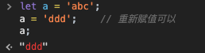
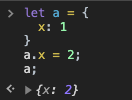
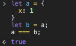
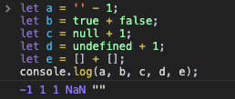
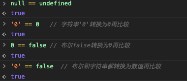
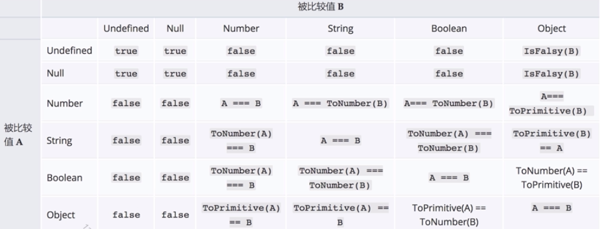
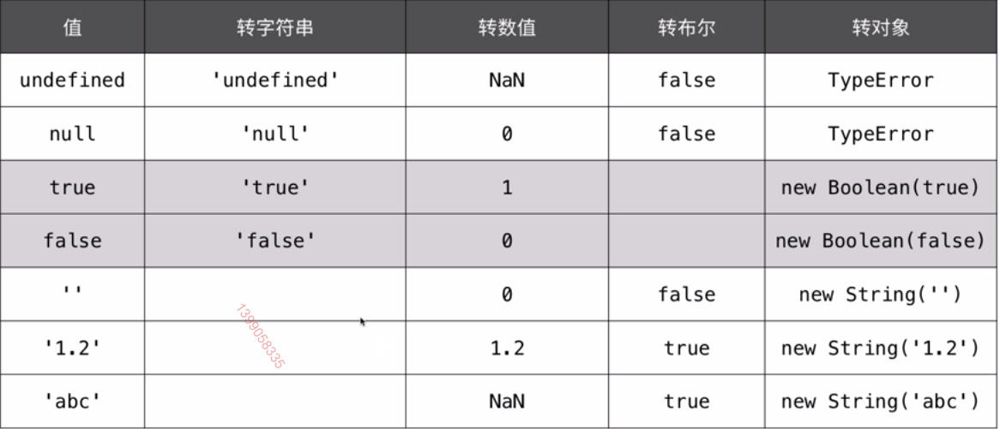
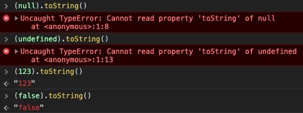
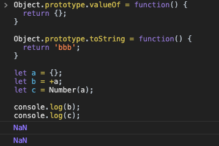
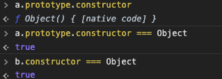

JS有很多数据类型，对于不同数据类型的识别和相互转换也是面试中的一个常考点，本文主要讲的就是类型转换和类型检测。

## 数据类型

JS中的数据类型主要分为两大类：原始类型(值类型)和引用类型。常见的数据类型如下图所示：


原始数据类型存在栈中，引用类型在栈中存的是一个引用地址，这个地址指向的是堆中的一个数据对象。需要注意的是`null`在这里我们算在原始类型里面，但是你用`typeof`的时候会发现他是`object`，原因是就算他是一个对象，那他应该在栈中存一个引用地址，但是他是一个空对象，所以这个地址为空，也就是不对应堆中的任意一个数据，他在堆中没有数据，只存在于栈中，所以这里算为了原始类型。引用类型其实主要就是`Object`，`Array`和`Function`这些其实也都是`Object`派生出来的。[关于这两种类型在内存中的更详细的知识可以看这篇文章。](https://juejin.im/post/5e2155cee51d4552455a8878)


下面我们来看看这两种类型的区别：

### 原始类型

1. 原始类型的值无法更改，要更改只能重新赋值。像下面这样尝试去修改是不行的，但是整个重新赋值可以。

   

   

2. 原始类型的比较就是比较值，值相等，他们就相等

### 引用类型

1. 引用类型的值是可以修改的，注意这个时候我们虽然修改了`a`里面的属性，但是`a`在栈上的引用地址并没有变化，变化的是堆中的数据。

   

2. 引用类型的比较是比较他们的索引地址，而不是他们的值。比如下面两个对象，看着是一样的，但是他们的引用地址不一样，其实是不等的：

   

   要想让他们相等，得直接将`b`赋值为`a`，这样他们的引用地址一样，就是相等的。

   

## 类型转换

JS中当不同类型的数据进行计算的时候会进行类型转换，比如下面的例子：



上面的例子中，我们用了加减来操作几个非数字的类型，这时候JS会进行隐式的类型转换，然后再进行加减运算。除了JS本身的隐式转换外，有时候我们还会主动进行类型转换，这就算是显示类型转换了。

### 隐式类型转换

#### 转为字符串

经常出现在`+`运算中，并且其中有一个操作数不是数值类型

```javascript
let s = 4 + 'px' + 5;
console.log(s);   // 4px5

s = 123e-2 + 'a';  
console.log(s);   // 1.23a
```

#### 转为数值

经常出现在数学运算中，表示连接字符串的`+`运算除外

```javascript
let s = 'abc';
console.log(+s, -s); // NaN, NaN

s = ' 123 ';
console.log(+s, -s); // 123 -123

s = new Date();
console.log(+s, -s);  // 1588675647421 -1588675647421   (这个操作相当于取毫秒数)
```

#### 转为bool的场景

经常出现在if或者逻辑运算中

```javascript
let s = 'abc';
if(s) {
  console.log(s);  // abc
}

console.log(!!s);  // true
```

下面的值在进行bool转换时会转换为`false`，除此以外都是`true`:

1. 0
2. NaN
3. ''(空字符串)
4. null
5. undefined

#### ==运算符

当我们使用`==`进行比较时，如果两边的类型不同，JS会进行类型转换，然后再比较，`===`则不会进行类型转换，如果`===`两边的数据类型不同，直接返回`false`。



上面只是列举了其中几种情况，更多的情况可以参考下面这种表，这个表来自于MDN。这个表的内容比较多，有些是规范直接定义的，比如`null == undefined`，也没有太多逻辑可言。我们不确定时可以来查下这个表，但是实际开发中其实是不建议使用`==`的，因为如果你把这个转换关系记错了的话可能就会引入比较难排查的bug，一般推荐直接使用`===`。



#### 转换规则

下面这几张表是一些转换规则，来自于《JS权威指南》:




### 显式类型转换

显式类型转换是我们自己写代码明确转换的类型，可以使代码看起来更清晰，是实际开发时推荐的做法。


#### 转字符串

显式转换为字符串可以使用`toString`方法，它的执行结果通常和`String()`方法一致。Number类型的`toString`方法还支持参数，可以指定需要转换的进制。下面的图是一些原始类型的`toString()`，`null`和`undefined`没有`toString`方法，调用会报错:



Number类型的`toString`方法支持进制:


#### 转数值

转为数值就很简单了，经常在用，就是这两个全局方法：`parseInt`和`parseFloat`。

### 对象转字符串

对象转换为字符串和数值会稍微麻烦点，下面我们单独来探究下。对象转为字符串主要有三种方法:

1. `value.toString()`

   这个前面讲过了

2. `'' + value`。这个是前面提到过的隐式转换，但是`value`是对象的话会按照下面的顺序进行转换：

   1. 先调用`value.valueOf`方法，如果值是原始值，则返回
   2. 否则调用`value.toString`方法，如果值是原始值，则返回
   3. 否则报错TypeError

3. `String(value)`。这个是前面提到的显式转换，流程跟前面类似，但是调用`toString`和`valueOf`的顺序不一样。

   1. 先调用`value.toString`方法，如果值是原始值，则返回
   2. 否则调用`value.valueOf`方法，如果值是原始值，则返回
   3. 否则报错TypeError

需要注意的是，`Date`对象有点特殊，他始终调用`toString`方法。

下面我们写一段代码来验证下:

```javascript
Object.prototype.valueOf = function() {
  return 'aaa';
}

Object.prototype.toString = function() {
  return 'bbb';
}

let a = {};
let b = '' + a;
let c = String(a);

console.log(b);
console.log(c);
```

上述代码输出是，跟我们预期一样:


### 对象转数值

对象类型转为数值主要有两种方法:

1. `+value`
2. `Number(value)`

这两种的执行逻辑是一样的:

1. 先调用`valueOf`方法，如果值是原始值，就返回
2. 否则，调用`toString`方法，然后将`toString`的返回值转换为数值

照例写个例子看下:

```javascript
Object.prototype.valueOf = function() {
  return {};
}

Object.prototype.toString = function() {
  return 'bbb';
}

let a = {};
let b = +a;
let c = Number(a);

console.log(b);
console.log(c);
```

上述代码的输出都是`NaN`，这是因为我们`toString`方法返回的`bbb`没办法转化为正常数值，强行转就是`NaN`:



## 类型检测

类型检测是我们经常遇到的问题，面试时也经常问到各种类型检测的方法，下面是几种常用的类型检测的方法。

### typeof

做类型检测最常用的就是`typeof`了:

```javascript
let a;
typeof a;   // undefined

let b = true;
typeof b;   // boolean

let c = 123;
typeof c;   // number

let d = 'abc';
typeof d;   // string

let e = () => {};
typeof e;   // function

let f = {};
typeof f;   // object

let g = Symbol();
typeof g;   // symbol
```

### instanceof

`typeof`最简单，但是他只能判断基本的类型，如果是对象的话，没法判断具体是哪个对象。`instanceof`可以检测一个对象是不是某个类的实例，这种检测其实基于面向对象和原型链的，[更多关于instanceof原理的可以看这篇文章](https://juejin.im/post/5e50e5b16fb9a07c9a1959af#heading-8)。下面来看个例子:

```javascript
let a = new Date();
a instanceof Date;  // true
```

### constructor

`constructor`的原理其实跟前面的`instanceof`有点像，也是基于面向对象和原型链的。一个对象如果是一个类的实例的话，那他原型上的`constructor`其实也就指向了这个类，我们可以通过判断他的`constructor`来判断他是不是某个类的实例。[具体的原理在前面提到的文章也有详细说明](https://juejin.im/post/5e50e5b16fb9a07c9a1959af#heading-4)。还是用上面那个例子:

```javascript
let a = new Date();
a.constructor === Date;  // true
```

使用`constructor`判断的时候要注意，如果原型上的`constructor`被修改了，这种检测可能就失效了，比如:

```javascript
function a() {}
a.prototype = {
  x: 1
}

let b = new a();
b.constructor === a;    // 注意这时候是 false
```

上面为`false`的原因是，`constructor`这个属性其实是挂在`a.prototype`下面的，我们在给`a.prototype`赋值的时候其实覆盖了之前的整个`prototype`，也覆盖了`a.prototype.constructor`,这时候他其实压根就没有这个属性，如果我们非要访问这个属性，只能去原型链上找，这时候会找到`Object`:



要避免这个问题，我们在给原型添加属性时，最好不要整个覆盖，而是只添加我们需要的属性，上面的改为:

```javascript
a.prototype.x = 1;
```

如果一定要整个覆盖，记得把`constructor`加回来:

```javascript
a.prototype = {
  constructor: a,
  x: 1
}
```

### duck-typing

`duck-typing`翻译叫“鸭子类型”，名字比较奇怪，意思是指一个动物，如果看起来像鸭子，走起路来像鸭子，叫起来也像鸭子，那我们就认为他是只鸭子。就是说我们通过他的外观和行为来判断他是不是鸭子，而不是准确的去检测他的基因是不是鸭子。这种方式在科学上当然是不严谨的，但是在部分场景下却是有效的。用编程语言来说，就是看某个对象是不是具有某些特定的属性和方法，来确定他是不是我们要的对象。比如有些开源库判断一个对象是不是数组会有下面的写法:

```javascript
function isArray(object) {
  return object !== null && 
    typeof object === 'object' && 
    'splice' in object && 
    'join' in object
}

isArray([]);  // true
```

这就是通过检测目标对象是不是包含Array应该有的方法来判断他是不是一个Array。这就是所谓的看着像鸭子，那就是鸭子。但是一个具有`splice`和`join`方法的对象也能通过这个检测，所以这样是不准确的，只是部分场景适用。

### Object.prototype.toString.call

`Object.prototype.toString.call`是比较准确的，可以用来判断原生对象具体是哪个类型:

```javascript
Object.prototype.toString.call(new Array());   // [object Array]
Object.prototype.toString.call(new Date());    // [object Date]
```

这个方法返回的是`[object XXX]`，这个XXX是对应的构造函数名字。但是他只能检测原生对象，对于自定义类型是没有用的:

```javascript
function a() {}
let b = new a();

Object.prototype.toString.call(b);   // [object Object]
```

可以看到对于自定义类`a`的实例`b`，我们得到仍然是`[object Object]`，而不是我们预期的`[object a]`。

### 一些原生方法: Array.isArray，Number.isInteger

JS为了解决类型检测的问题，也引入了一些原生方法来提供支持，比如`Array.isArray`和`Number.isInteger`等。`Array.isArray`可以用来检测一个对象是不是数组:

```javascript
Array.isArray([]);   // true
Array.isArray(123);  // false
```

`Number.isInteger`可以用来检测一个对象是不是整数:

```javascript
Number.isInteger(1);     // true
Number.isInteger(-1);    // true
Number.isInteger(-1.1);  // false
Number.isInteger('aaa'); // false
```

如果有原生检测的方法我们当然推荐使用原生方法了，但是目前原生方法并没有那么多和全面，很多时候还是要用前面的方法来检测类型。

### 小节

JS其实没有一种完美的方法来检测所有的类型，具体的检测方法需要我们根据实际情况来进行选择和取舍。下面是几种方法的总结：


## 总结

1. JS有两种数据类型，原始类型和引用类型，引用类型主要就是对象。
2. 当我们使用`+`，逻辑判断或者`==`时会有隐式的类型转换。
3. 有时候隐式的类型转换会出现我们不想要的结果，如果我们确定要进行判断或者类型转换，最好使用显式的，比如使用`===`，而不是`==`。
4. 对象转为字符串和数值可能需要调`valueOf`和`toString`方法，调用顺序需要看具体场景。
5. JS没有一个完美的类型检测方法，我们最好根据需要选择具体的检测方法。

**文章的最后，感谢你花费宝贵的时间阅读本文，如果本文给了你一点点帮助或者启发，请不要吝啬你的赞和GitHub小星星，你的支持是作者持续创作的动力。**

**作者博文GitHub项目地址： [https://github.com/dennis-jiang/Front-End-Knowledges](https://github.com/dennis-jiang/Front-End-Knowledges)**

**作者掘金文章汇总：[https://juejin.im/post/5e3ffc85518825494e2772fd](https://juejin.im/post/5e3ffc85518825494e2772fd)**

## 其他

### 模板字符串的tag

### Symbol.for Symbol.keyfor  well-known symbol

