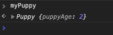

这篇文章主要讲一下JS中面向对象以及 `__proto__`，`ptototype`和`constructor`，这几个概念都是相关的，所以一起讲了。

在讲这个之前我们先来说说类，了解面向对象的朋友应该都知道，如果我要定义一个通用的类型我可以使用类(class)。比如在java中我们可以这样定义一个类：

```java
public class Puppy{
    int puppyAge;

    public Puppy(age){
      puppyAge = age;
    }
  
    public void say() {
      System.out.println("汪汪汪"); 
    }
}
```

上述代码我们定义了一个Puppy类，这个类有一个属性是puppyAge，也就是小狗的年龄，然后有一个构造函数Puppy()，这个构造函数接收一个参数，可以设置小狗的年龄，另外还有一个说话的函数say。这是一个通用的类，当我们需要一个两岁的小狗实例是直接这样写，这个实例同时具有父类的方法:

```java
Puppy myPuppy = new Puppy( 2 );
myPuppy.say();     // 汪汪汪
```

但是早期的JS没有class关键字啊（以下说JS没有class关键字都是指ES6之前的JS，主要帮助大家理解概念），JS为了支持面向对象，使用了一种比较曲折的方式，这也是导致大家迷惑的地方，其实我们将这种方式跟一般的面向对象类比起来就很清晰了。下面我们来看看JS为了支持面向对象需要解决哪些问题，都用了什么曲折的方式来解决。

## 没有class，用函数代替

首先JS连class关键字都没有，怎么办呢？用函数代替，JS中最不缺的就是函数，函数不仅能够执行普通功能，还能当class使用。比如我们要用JS建一个小狗的类怎么写呢？直接写一个函数就行：

```javascript
function Puppy() {}
```

这个函数可以直接用new关键字生成实例：

```javascript
const myPuppy = new Puppy();
```

这样我们也有了一个小狗实例，但是我们没有构造函数，不能设置小狗年龄啊。

## 函数本身就是构造函数

当做类用的函数本身也是一个函数，而且他就是默认的构造函数。我们想让Puppy函数能够设置实例的年龄，只要让他接收参数就行了。

```javascript
function Puppy(age) {
  this.puppyAge = age;
}

// 实例化时可以传年龄参数了
const myPuppy = new Puppy(2);
```

注意上面代码的`this`，被作为类使用的函数里面this总是指向实例化对象，也就是myPuppy。这么设计的目的就是让使用者可以通过构造函数给实例对象设置属性，这时候console出来看`myPuppy.puppyAge`就是2。

```javascript
console.log(myPuppy.puppyAge);   // 输出是 2
```

## 实例方法用prototype

上面我们实现了类和构造函数，但是类方法呢？Java版小狗还可以“汪汪汪”叫呢，JS版怎么办呢？JS给出的解决方案是给方法添加一个`prototype`属性，挂载在这上面的方法，在实例化的时候会给到实例对象。我们想要myPuppy能说话，就需要往`Puppy.prototype`添加说话的方法。

```javascript
Puppy.prototype.say = function() {
  console.log("汪汪汪");
}
```

使用new关键字产生的实例都有类的`prototype`上的属性和方法，我们在`Puppy.prototype`上添加了say方法，myPuppy就可以说话了，我么来试一下:

```javascript
myPuppy.say();    // 汪汪汪
```

## 实例方法查找用`__proto__`

那myPuppy怎么就能够调用`say`方法了呢，我们把他打印出来看下，这个对象上并没有say啊，这是从哪里来的呢？



这就该`__proto__`上场了，当你访问一个对象上没有的属性时，比如`myPuppy.say`，对象会去`__proto__`查找。`__proto__`的值就等于父类的prototype, `myPuppy.__proto__`指向了`Puppy.prototype`。


如果你访问的属性在`Puppy.prototype`也不存在，那又会继续往`Puppy.prototype.__proto__`上找，这时候其实就找到了`Object.prototype`了，`Object.prototype`再往上找就没有了，也就是null，**这其实就是原型链**。


## constructor

我们说的constructor一般指类的`prototype.constructor`。`prototype.constructor`是prototype上的一个保留属性，这个属性就指向类函数本身，用于指示当前类的构造函数。


既然`prototype.constructor`是指向构造函数的一个指针，那我们是不是可以通过它来修改构造函数呢？我们来试试就知道了。我们先修改下这个函数，然后新建一个实例看看效果：

```javascript
function Puppy(age) {
  this.puppyAge = age;
}

Puppy.prototype.constructor = function myConstructor(age) {
  this.puppyAge = age + 1;
}

const myPuppy2 = new Puppy(2);
console.log(myPuppy2.puppyAge);    // 输出是2
```

上例说明，**我们修改`prototype.constructor`只是修改了这个指针而已，并没有修改真正的构造函数。**

可能有的朋友会说我打印`myPuppy2.constructor`也有值啊，那`constructor`是不是也是对象本身的一个属性呢？其实不是的，之所以你能打印出这个值，是因为你打印的时候，发现myPuppy2本身并不具有这个属性，又去原型链上找了，找到了`prototype.constructor`。我们可以用`hasOwnProperty`看一下就知道了：


上面我们其实已经说清楚了`prototype`，`__proto__`，`constructor`几者之间的关系，下面画一张图来更直观的看下：


## 静态方法

我们知道很多面向对象有静态方法这个概念，比如Java直接是加一个`static`关键字就能将一个方法定义为静态方法。JS中定义一个静态方法更简单，直接将它作为类函数的属性就行：

```javascript
Puppy.statciFunc = function() {    // statciFunc就是一个静态方法
  console.log('我是静态方法，this拿不到实例对象');
}      

Puppy.statciFunc();            // 直接通过类名调用
```

静态方法和实例方法最主要的区别就是实例方法可以访问到实例，可以对实例进行操作，而静态方法一般用于跟实例无关的操作。这两种方法在jQuery中有大量应用，在jQuery中`$(selector)`其实拿到的就是实例对象，通过`$(selector)`进行操作的方法就是实例方法。比如`$(selector).append()`，这会往这个实例DOM添加新元素，他需要这个DOM实例才知道怎么操作，将`append`作为一个实例方法，他里面的this就会指向这个实例，就可以通过this操作DOM实例。那什么方法适合作为静态方法呢？比如`$.ajax`，这里的`ajax`跟DOM实例没关系，不需要这个this，可以直接挂载在$上作为静态方法。

## 继承

面向对象怎么能没有继承呢，根据前面所讲的知识，我们其实已经能够自己写一个继承了。所谓继承不就是子类能够继承父类的属性和方法吗？换句话说就是子类能够找到父类的`prototype`，最简单的方法就是子类原型的`__proto__`指向父类原型就行了。

```javascript
function Parent() {}
function Child() {}

Child.prototype.__proto__ = Parent.prototype;

const obj = new Child();
console.log(obj instanceof Child );   // true
console.log(obj instanceof Parent );   // true
```

上述继承方法只是让Child访问到了Parent原型链，但是没有执行Parent的构造函数：

```javascript
function Parent() {
  this.parentAge = 50;
}
function Child() {}

Child.prototype.__proto__ = Parent.prototype;

const obj = new Child();
console.log(obj.parentAge);    // undefined
```

为了解决这个问题，我们不能单纯的修改`Child.prototype.__proto__`指向，还需要用new执行下Parent的构造函数:

```javascript
function Parent() {
  this.parentAge = 50;
}
function Child() {}

Child.prototype.__proto__ = new Parent();

const obj = new Child();
console.log(obj.parentAge);    // 50
```

上述方法会多一个`__proto__`层级，可以换成修改`Child.prototype`的指向来解决，注意将`Child.prototype.constructor`重置回来：

```javascript
function Parent() {
  this.parentAge = 50;
}
function Child() {}

Child.prototype = new Parent();
Child.prototype.constructor = Child;      // 注意重置constructor

const obj = new Child();
console.log(obj.parentAge);    // 50
```

当然还有很多其他的继承方式，他们的原理都差不多，只是实现方式不一样，核心都是让子类拥有父类的方法和属性，感兴趣的朋友可以自行查阅。

## 自己实现一个new

结合上面讲的，我们知道new其实就是生成了一个对象，这个对象能够访问类的原型，知道了原理，我们就可以自己实现一个new了。

```javascript
function myNew(func, ...args) {
  const obj = {};     // 新建一个空对象
  const result = func.call(obj, ...args);  // 执行构造函数
  obj.__proto__ = func.prototype;    // 设置原型链
  
  // 注意如果原构造函数有Object类型的返回值，包括Functoin, Array, Date, RegExg, Error
  // 那么应该返回这个返回值
  const isObject = typeof result === 'object' && result !== null;
  const isFunction = typeof result === 'function';
  if(isObject || isFunction) {
    return result;
  }
  
  // 原构造函数没有Object类型的返回值，返回我们的新对象
  return obj;
}

function Puppy(age) {
  this.puppyAge = age;
}

Puppy.prototype.say = function() {
  console.log("汪汪汪");
}

const myPuppy3 = myNew(Puppy, 2);

console.log(myPuppy3.puppyAge);  // 2
console.log(myPuppy3.say());     // 汪汪汪
```

## 自己实现一个instanceof

知道了原理，其实我们也知道了instanceof是干啥的。instanceof不就是检查一个对象是不是某个类的实例吗？换句话说就是检查一个对象的的原型链上有没有这个类的`prototype`，知道了这个我们就可以自己实现一个了：

```javascript
function myInstanceof(targetObj, targetClass) {
  // 参数检查
  if(!targetObj || !targetClass || !targetObj.__proto__ || !targetClass.prototype){
    return false;
  }
  
  let current = targetObj;
  
  while(current) {   // 一直往原型链上面找
    if(current.__proto__ === targetClass.prototype) {
      return true;    // 找到了返回true
    }
    
    current = current.__proto__;
  }
  
  return false;     // 没找到返回false
}

// 用我们前面的继承实验下
function Parent() {}
function Child() {}

Child.prototype.__proto__ = Parent.prototype;

const obj = new Child();
console.log(myInstanceof(obj, Child) );   // true
console.log(myInstanceof(obj, Parent) );   // true
console.log(myInstanceof({}, Parent) );   // false
```

## ES6的class

最后还是提一嘴ES6的class，其实ES6的class就是前面说的函数类的语法糖，比如我们的Puppy用ES6的class写就是这样：

```javascript
class Puppy {
  // 构造函数
  constructor(age) {            
    this.puppyAge = age;
  }
  
  // 实例方法
  say() {
    console.log("汪汪汪")
  }
  
  // 静态方法
  static statciFunc() {
    console.log('我是静态方法，this拿不到实例对象');
  }
}

const myPuppy = new Puppy(2);
console.log(myPuppy.puppyAge);    // 2
console.log(myPuppy.say());       // 汪汪汪
console.log(Puppy.statciFunc());  // 我是静态方法，this拿不到实例对象
```

使用class可以让我们的代码看起来更像标准的面向对象，构造函数，实例方法，静态方法都有明确的标识。但是他本质只是改变了一种写法，所以可以看做是一种语法糖，如果你去看babel编译后的代码，你会发现他其实也是把class编译成了我们前面的函数类，extends关键字也是使用我们前面的原型继承的方式实现的。

## 总结

最后来个总结，其实前面小节的标题就是核心了，我们再来总结下：

1. JS中的函数可以作为函数使用，也可以作为类使用
2. 作为类使用的函数实例化时需要使用new
3. 为了让函数具有类的功能，函数都具有`prototype`属性。
4. 为了让实例化出来的对象能够访问到`prototype`上的属性和方法，实例对象的`__proto__`指向了类的`prototype`。所以`prototype`是函数的属性，不是对象的。对象拥有的是`__proto__`，是用来查找`prototype`的。
5. `prototype.constructor`指向的是构造函数，也就是类函数本身。改变这个指针并不能改变构造函数。
6. 对象本身并没有`constructor`属性，你访问到的是原型链上的`prototype.constructor`。
7. 函数本身也是对象，也具有`__proto__`，他指向的是JS内置对象`Function`的原型`Function.prototype`。所以你才能调用`func.call`,`func.apply`这些方法，你调用的其实是`Function.prototype.call`和`Function.prototype.apply`。
8. `prototype`本身也是对象，所以他也有`__proto__`，指向了他父级的`prototype`。`__proto__`和`prototype`的这种链式指向构成了JS的原型链。原型链的最终指向是`Object`的原型。`Object`上面原型链是null，即`Object.prototype.__proto__ === null`。
9. 另外要注意的是`Function.__proto__ === Function.prototype`，这是因为JS中所有函数的原型都是`Function.prototype`，也就是说所有函数都是`Function`的实例。`Function`本身也是可以作为函数使用的----`Function()`，所以他也是`Function`的一个实例。类似的还有`Object`，`Array`等，他们也可以作为函数使用:`Object()`, `Array()`。所以他们本身的原型也是`Function.prototype`，即`Object.__proto__ === Function.prototype`。换句话说，这些可以new的内置对象其实都是一个类，就像我们的Puppy类一样。
10. ES6的class其实是函数类的一种语法糖，书写起来更清晰，但原理是一样的。

再来看一下完整图：


