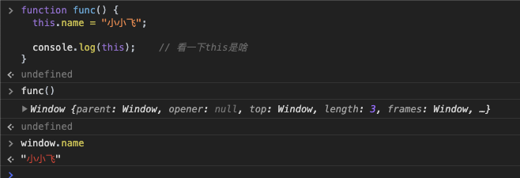
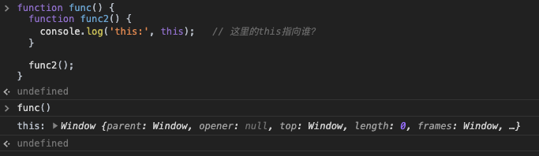
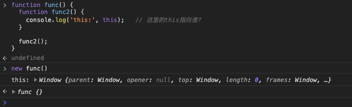

JS中的this是一个老生常谈的问题了，因为它并不是一个确定的值，在不同情况下有不同的指向，所以也经常使人困惑。本篇文章会谈谈我自己对this的理解。

## this到底是啥

其实this就是一个指针，它指示的就是当前的一个执行环境，可以用来对当前执行环境进行一些操作。因为它指示的是执行环境，所以在定义这个变量时，其实是不知道它真正的值的，只有运行时才能确定他的值。同样一段代码，用不同的方式执行，他的this指向可能是不一样的。我们来看看如下代码：

```javascript
function func() {
  this.name = "小小飞";
  
  console.log(this);    // 看一下this是啥
}
```

这个方法很简单，只是给this添加了一个name属性，我们把这个方法复制到Chrome调试工具看下结果：



上图中我们直接调用了`func()`，发现this指向的是window，`name`属性添加到了window上。下面我们换一种调用方式，我们换成`new func()`来调用：


我们看到输出了两个`func {name: "小小飞"}`，一个是我们new返回的对象，另一个是方法里面的console。这两个值是一样的，说明这时候方法里面this就指向了new返回的对象，而不是前面例子的window了。这是因为当你使用`new`去调用一个方法时，这个方法其实就作为构造函数使用了，这时候的this指向的是new出来的对象。

下面我们分别讲解下几种情况

### 使用new调用时，this指向new出来的对象

这个规则其实是JS面向对象的一部分，JS使用了一种很曲折的方式来支持面向对象。当你用new来执行一个函数时，这个函数就变成了一个类，new关键字会返回一个类的实例给你，这个函数会充当构造函数的角色。作为面向对象的构造函数，必须要有能够给实例初始化属性的能力，所以构造函数里面必须要有某种机制来操作生成的实例，这种机制就是this。让this指向生成的实例就可以通过this来操作实例了。[关于JS的面向对象更详细的解释可以看这篇文章。](https://juejin.im/post/5e50e5b16fb9a07c9a1959af)

this的这种特性还有一些妙用。一个函数可以直接调用，也可以用new调用，那假如我只想使用者通过new调用有没有办法呢？下图截取自Vue源码：


Vue巧妙利用了this的特性，通过检查this是不是Vue的一个实例来检测使用者是通过new调用的还是直接调用的。

### 没有明确调用者时，this指向window

这个其实在最开始的例子就讲过了，那里没有明确调用者，this指向的是window。我们这里讲另外一个例子，函数里面的函数，this指向谁？

```javascript
function func() {
  function func2() {
    console.log('this:', this);   // 这里的this指向谁？
  }
  
  func2();
}
```

我们执行一下看看：

直接执行：



使用new执行：



我们发现无论是直接执行，还是使用new执行，this的值都指向的window。直接执行时很好理解，因为没有明确调用者，那this自然就是window。**需要注意的是使用new时，只有被new的`func`才是构造函数，他的this指向new出来的对象，他里面的函数的this还是指向`window`。**

### 有明确调用者时，this指向调用者

看这个例子：

```javascript
var obj = {
  myName: "小小飞",
  func: function() {
    console.log(this.myName);
  }
}

obj.func();    // 小小飞
```

上述例子很好理解，因为调用者是obj，所以func里面的this就指向obj，`this.myName`就是`obj.myName`。其实这一条和上一条可以合在一起，没有明确调用者时其实隐含的调用者就是window，所以经常有人说**this总是指向调用者**。

下面我们将这个例子稍微改一下：

```javascript
var myName = "大飞哥";

var obj = {
  myName: "小小飞",
  func: function() {
    console.log(this.myName);
  }
}

var anotherFunc = obj.func;

anotherFunc();   // 输出是啥？
```

这里的输出应该是“大飞哥”，因为虽然`anotherFunc`的函数体跟`obj.func`一样，但是他的执行环境不一样，他其实没有明确的调用者，或者说调用者是window。这里的`this.myName`其实是`window.myName`，也就是“大飞哥”。

我们将这个例子再改一下：

```javascript
let myName = "大飞哥";

var obj = {
  myName: "小小飞",
  func: function() {
    console.log(this.myName);
  }
}

var anotherFunc = obj.func;

anotherFunc();   // 注意这里输出是undefined
```

这次我们只是将第一个`var`改成了`let`，但是我们的输出却变成了`undefined`。这是因为let，const定义变量，即使在最外层也不会变成window的属性，只有var定义的变量才会成为window的属性。

### 箭头函数并不会绑定this

这句话的意思是箭头函数本身并不具有this，箭头函数在被申明确定this，这时候他会直接将当前作用域的this作为自己的this。还是之前的例子我们将函数改为箭头函数：

```javascript
var myName = "大飞哥";

var obj = {
  myName: "小小飞",
  func: () => {
    console.log(this.myName);
  }
}

var anotherFunc = obj.func;

obj.func();      // 大飞哥
anotherFunc();   // 大飞哥
```

上述代码里面的`obj.func()`输出也是“大飞哥”，是因为`obj`在创建时申明了箭头函数，这时候箭头函数会去寻找当前作用域，因为`obj`是一个对象，并不是作用域，所以这里的作用域是window，this也就是window了。

再来看一个例子：

```javascript
var myName = "大飞哥";

var obj = {
  myName: "小小飞",
  func: function () {
    return {
      getName: () => {
        console.log(this.myName);
      }
    }
  }
}

var anotherFunc = obj.func().getName;

obj.func().getName();      // 小小飞
anotherFunc();   // 小小飞

```

两个输出都是“小小飞”，`obj.func().getName()`输出“小小飞”很好理解，这里箭头函数是在`obj.func()`的返回值里申明的，这时他的this其实就是`func()`的this，因为他是被`obj`调用的，所以this指向obj。

那为什么`anotherFunc()`输出也是“小小飞”呢？这是因为`anotherFunc()`输出的this，其实在`anotherFunc`赋值时就确定了：

1. `var anotherFunc = obj.func().getName;`其实是先执行了`obj.func()`
2. 执行`obj.func()`的时候`getName`箭头函数被申明
3. 这时候箭头函数的this应该是当前作用域的this，也就是`func()`里面的this
4. `func()`因为是被`obj`调用，所以this指向`obj`
5. 调用`anotherFunc`时，其实this早就确定了，也就是`obj`，最终输出的是`obj.myName`。

再来看一个构造函数里面的箭头函数，前面我们说了构造函数里面的函数，直接调用时，他的this指向window，但是如果这个函数时箭头函数呢：

```javascript
var myName = "大飞哥";

function func() {
  this.myName = "小小飞";
  
  const getName = () => {
    console.log(this.myName);
  }
  
  getName();
}

new func(); // 输出啥？
```

这里输出的是“小小飞”，原理还是一样的，箭头函数在申明时this确定为当前作用域的this，在这里就是`func`的作用域，跟`func`的this一样指向new出来的实例。如果不用new，而是直接调用，这里的this就指向window。

### DOM事件回调里面，this指向绑定事件的对象

```javascript
function func(e) {
  console.log(this === e.currentTarget);   // 总是true
  console.log(this === e.target);          // 如果target等于currentTarget,这个就为true
}

const ele = document.getElementById('test');

ele.addEventListener('click', func);
```

`currentTarget`指的是绑定事件的DOM对象，`target`指的是触发事件的对象。DOM事件回调里面this总是指向`currentTarget`，如果触发事件的对象刚好是绑定事件的对象，即`target === currentTarget`，this也会顺便指向`target`。如果回调是箭头函数，this是箭头函数申明时作用域的this。

### 严格模式下this是undefined

```javascript
function func() {
  "use strict"
  console.log(this);
}

func();   // 输出是undefined
```

注意这里说的严格模式下this是undefined是指在函数体内部，如果本身就在全局作用域，this还是指向window。

```html
<html>
  ...
  <script>
    "use strict"
    console.log(this);     // window
  </script>
  ...
</html>
```

## this能改吗

this是能改的，`call`和`apply`都可以修改this，ES6里面还新增了一个`bind`函数。

### 使用call和apply修改this

```javascript
const obj = {
  myName: "大飞哥",
  func: function(age, gender) {
    console.log(`我的名字是${this.myName}, 我的年龄是${age}，我是一个${gender}`);
  }
}

const obj2 = {
  myName: "小小飞"
}

obj.func.call(obj2, 18, "帅哥");  // 我的名字是小小飞, 我的年龄是18，我是一个帅哥
```

注意上面输出的名字是"小小飞"，也就是`obj2.myName`。正常直接调用`obj.func()`输出的名字应该是`obj.myName`，也就是"大飞哥"。但是如果你使用`call`来调用，call的第一个参数就是手动指定的`this`。我们将它指定为`obj2`，那在函数里面的`this.myName`其实就是`obj2.myName`了。

`apply`方法跟`call`方法作用差不多，只是后面的函数参数形式不同，使用apply调用应该这样写，函数参数应该放到一个数组或者类数组里面：

```javascript
obj.func.apply(obj2, [18, "帅哥"]);   // 我的名字是小小飞, 我的年龄是18，我是一个帅哥
```

之所以有call和apply两个方法实现了差不多的功能，是为了让大家使用方便，如果你拿到的参数是一个一个的，那就使用call吧，但是有时候拿到的参数是`arguments`，这是函数的一个内置变量，是一个类数组结构，表示当前函数的所有参数，那就可以直接用apply，而不用将它展开了。

### 使用bind修改this

`bind`是ES5引入的一个方法，也可以修改this，但是调用它并不会立即执行方法本身，而是会返回一个修改了this的新方法：

```javascript
const obj = {
  myName: "大飞哥",
  func: function(age, gender) {
    console.log(`我的名字是${this.myName}, 我的年龄是${age}，我是一个${gender}`);
  }
}

const obj2 = {
  myName: "小小飞"
}

const func2 = obj.func.bind(obj2);   // 返回一个this改为obj2的新方法
func2(18, "帅哥");    // 我的名字是小小飞, 我的年龄是18，我是一个帅哥
```

bind和call，apply最大的区别就是call，apply会立即执行方法，而bind并不会立即执行，而是会返回一个新方法供后面使用。

bind函数也可以接收多个参数，第二个及以后的参数会作为新函数的参数传递进去，比如前面的bind也可以这样写：

```javascript
const func3 = obj.func.bind(obj2, 18);   // 注意我们这里已经传了一个年龄参数
func3("帅哥");    //注意这里只传了性别参数，年龄参数已经在func3里面了，输出还是：我的名字是小小飞, 我的年龄是18，我是一个帅哥
```


## 自己写一个call

知道了call的作用，我们自己来写一个call：

```javascript
Function.prototype.myCall = function(...args) {
  // 参数检查
  if(typeof this !== "function") {
    throw new Error('Must call with a function');
  }
  
  const realThis = args[0] || window;
  const realArgs = args.slice(1);
  const funcSymbol = Symbol('func');
  realThis[funcSymbol] = this;   // 这里的this是原方法，保存到传入的第一个参数上
  
  //用传入的参数来调方法，方法里面的this就是传入的参数了
  const res = realThis[funcSymbol](...realArgs); 
  
  delete realThis[funcSymbol];  // 最后删掉临时存储的原方法
  
  return res;  // 将执行的返回值返回
}
```

## 自己写一个apply

apply方法跟call方法很像，区别只是在取调用参数上：

```javascript
Function.prototype.myApply = function(...args) {
  if(typeof this !== "function") {
    throw new Error('Must call with a function');
  }
  
  const realThis = args[0] || window;
  // 直接取第二个参数，是一个数组
  const realArgs = args[1];        
  const funcSymbol = Symbol('func');
  realThis[funcSymbol] = this;   
  
  const res = realThis[funcSymbol](...realArgs); 
  
  delete realThis[funcSymbol]; 
  
  return res; 
}
```

## 自己写一个bind

自己写一个bind需要用到前面的apply，注意他的返回值是一个方法

```javascript
Function.prototype.myBind = function(...args) {
  if(typeof this !== "function") {
    throw new Error('Must call with a function');
  }
  
  const _func = this;    // 原方法
  const realThis = args[0] || window;   // 绑定的this
  const otherArgs = args.slice(1);    // 取出后面的参数作为新函数的默认参数
  
  return function(...args2) {   // 返回一个方法
    return _func.apply(realThis, [...otherArgs,...args2]);  // 拼接存储参数和新参数，然后用apply执行
  }
}
```

## 总结

1. 函数外面的this，即全局作用域的this指向window。
2. 函数里面的this总是指向直接调用者。如果没有直接调用者，隐含的调用者是window。
3. 使用new调用一个函数，这个函数即为构造函数。构造函数里面的this是和实例对象沟通的桥梁，他指向实例对象。
4. 箭头函数里面的this在它申明时确定，跟他当前作用域的this一样。
5. DOM事件回调里面，this指向绑定事件的对象(currentTarget)，而不是触发事件的对象(target)。当然这两个可以是一样的。如果回调是箭头函数，请参考上一条，this是它申明时作用域的this。
6. 严格模式下，函数里面的this指向undefined，函数外面(全局作用域)的this还是指向window。
7. call和apply可以改变this，这两个方法会立即执行原方法，他们的区别是参数形式不一样。
8. bind也可以修改this，但是他不会立即执行，而是返回一个修改了this的函数。