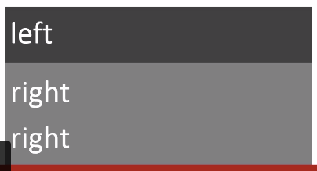
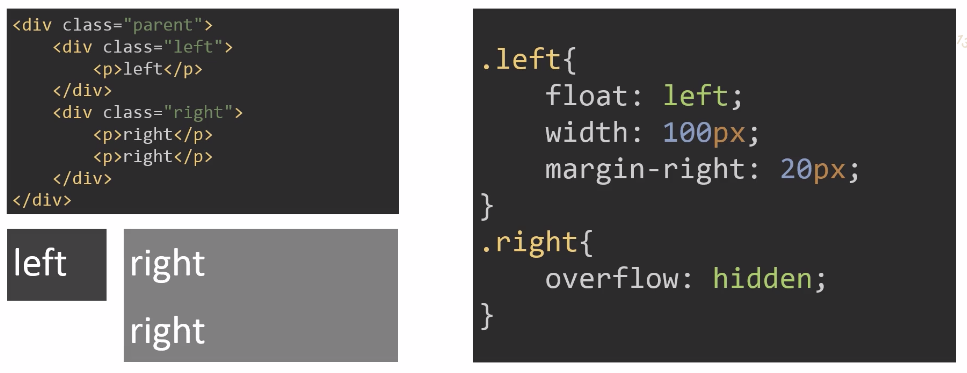
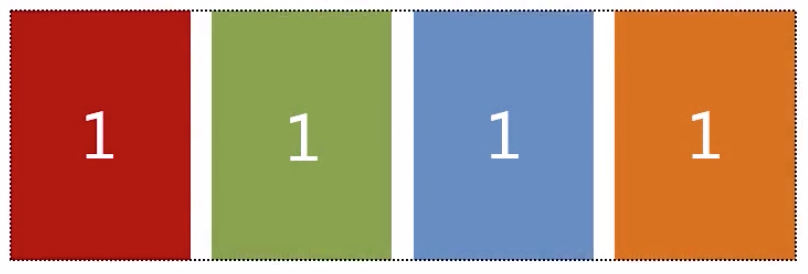
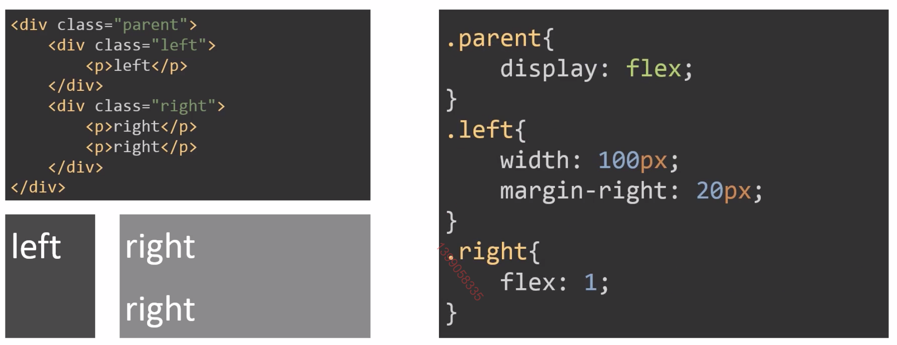

多列布局在一个网页设计中非常常见，不仅可以用来做外部容器的布局，在一些局部也经常出现多列布局，比如下面圈出来的都是多列布局：


## 定宽 + 自适应

### 定宽 | 自适应

我们先讲一个最简单的两列布局，左边列定宽，右边列自适应：


下面我们来看看有哪些方法可以解决这个问题：

#### float + margin

我们有如下html代码：

```html
<div class="parent">
  <div class="left">
    <p>left</p>
  </div>
  <div class="right">
    <p>right</p>
    <p>right</p>
  </div>
</div>
```

当我们没有给他设置样式的时候，它是这样子



我们要的是两列布局，所以我们给left加一个`float:left;`，然后它变成这样了：


我们看到right的内容环绕了left，这是浮动（float）的一个特性，那怎么解决呢? 因为右边环绕了左边，我们只需要将右边往右边移过去就行了: `margin-left: 100px;`如果左右两列还想要一点间距，`margin-left`设置大一点就行了。


#### float + overflow

这个方案和前面的`float + margin`的方案很像，只是解决右边环绕左边的思路不一样，我们先给左边写`float:left;`右边还是会环绕左边：


这次我们解决这个问题不用`margin-left`了，而是用`overflow`:



这种方案如果要间距，可以在left上设置一个`margin-right: 20px;`。为什么`overflow:hidden`可以决绝浮动环绕的问题呢，这其实用到了BFC的原理。下面我们来讲讲BFC:

##### BFC

BFC（Block Formatting Context）块级格式上下文，是Web页面中盒模型布局的CSS渲染模式，指一个独立的渲染区域或者说是一个隔离的独立容器。

下列情况都可以形成一个BFC:

```markdown
1. 浮动元素，float 除 none 以外的值； 
2. 定位元素，position（absolute，fixed）； 
3. display 为以下其中之一的值 inline-block，table-cell，table-caption； 
4. overflow 除了 visible 以外的值（hidden，auto，scroll）；
```

BFC有如下特性：

```markdown
1. 内部的Box会在垂直方向上一个接一个的放置。
2. 垂直方向上的距离由margin决定
3. bfc的区域不会与float的元素区域重叠。
4. 计算bfc的高度时，浮动元素也参与计算
5. bfc就是页面上的一个独立容器，容器里面的子元素不会影响外面元素。
```

上面几个特性怎么理解呢？

1. 如果垂直方向上有多个div，他们都有margin，那垂直的margin会合并

   ```html
   <div class="parent">
     <div class="child"></div>
     <div class="child"></div>
   </div>
   
   .child {
   	margin-top: 10px;
   	margin-bottom: 20px;
   }
   ```

   上述代码两个child之间的间距是20px，而不是30px，因为垂直的margin会合并。但如果我给上面第一个child再套一个容器，使用`overflow:hidden;`他就成了一个BFC，根据BFC的特性，BFC的子元素不会影响外面的元素，margin就不会合并，两个child的间距就是30px;

   ```html
   <div class="parent3">
     <div class="overflow">
       <div class="child3">child4</div>
     </div>
     <div class="child3">child4</div>
   </div>
   
   .child3 {
   	margin-top: 10px;
   	margin-bottom: 20px;
   }
   
   .overflow {
   	overflow: hidden;
   }
   ```

2. BFC是一个独立的容器，不会被浮动元素覆盖，里面的文字也不会环绕浮动元素，我们这里的两栏布局就是利用的这个特性。

3. 计算BFC高度时，浮动元素的高度也会计算其中，这不就是我们用来清除浮动的一种做法吗?

   ```css
   .parent {
   	overflow: hidden;
   }
   ```

#### table

我们还可以用table来实现，父级设置display为table，那他的宽度就是内容的宽度，所以我们需要手动指定宽度为100%。两个子级设置display为table-cell，这样他们其实就相当于table的两个单元格。由于我们要固定左边的宽度，父级table应该使用布局优先，即`table-layout: fixed;`。这时候如果左右两边要间距，是没法设置margin的，因为他们是单元格，但是我们可以在左边子级上设置padding-right.

```html
<div class="parent4">
  <div class="left4">
    <p>left4</p>
  </div>
  <div class="right4">
    <p>right4</p>
    <p>right4</p>
  </div>
</div>

.parent4 {
	display: table;
	width: 100%;
	table-layout: fixed;
}

.left4 {
	display: table-cell;
	width: 100px;
	padding-right: 20px
}

.right4 {
	display: table-cell;
}

```

##### table-layout

`table-layout`有两个值：

* **fixed**： 是表格布局优先，列宽由表格宽度和列宽度设定，而与单元格的内容无关。这种模式下，浏览器在接收表格第一行后就可以渲染出来，速度更快。
* **auto**: 这是默认值，表示表格内容优先，列的宽度是由列单元格中没有折行的最宽的内容设定的。此算法有时会较慢，这是由于它需要在确定最终的布局之前访问表格中所有的内容。

#### flex

又遇到flex了，用flex做这种布局太简单了，直接父级设置display: flex, 左子级定宽，右子级设置`flex:1`就行了，如果要间距，可以直接用margin。

```css
.parent5 {
	display: flex;
}

.left5 {
	width: 100px;
	margin-right: 20px;
}

.right5 {
	flex: 1;
}
```

##### flex: 1

`flex: 1`是`flex: 1 1 0`的简写，对应的完全体是：

```css
{
	flex-grow: 1;
  flex-shrink: 1;
  flex-basis: 0;
}
```

* **flex-grow**：设置元素的扩展比例。假如父级元素总宽度为500px, 子元素A, B, C三个元素的`flex-grow`分别为1, 2, 2，那他们的宽度比例为1:2:2，三个元素最终的宽度为100px, 200px, 200px;
* **flex-shrink**: 设置元素的收缩比例。假如父级元素总宽度为500px,现在有A, B, C, D, E五个子元素，他们的`flex-shrink`分别为1, 1, 1, 2, 2,他们的`flex-basis`都是120px。计算可知，五个子元素总宽度为120 \* 5 = 600px，超出了父级100px，所以需要对子元素进行收缩。收缩的时候就要通过`flex-shrink`来计算，我们发现他们`flex-shrink`的总和为1 + 1 + 1 + 2 + 2 = 7。所以将超出的100px分成7份，每份约14px，然后按照`flex-shrink`进行收缩。A, B ,C的份数都是1，所以他们收缩14px，他们的最终宽度是120 - 14 = 106px；D, E的份数是2，所以他们应该收缩14 \* 2 = 28px，最终宽度是120 - 28 = 92px。
* **flex-basis**: 设置元素的初始值，扩展和收缩都以此为参照物。

### 定宽 | 定宽 | 自适应

三列布局，前面两列定宽，最后一列自适应，这个跟前面的一列定宽，一列自适应的很像，很多方案都可以直接用, 比如用`float + overflow`。


## 不定宽 + 自适应


两列布局，左边不定宽，宽度由内容决定，右边自适应的常见解决方案：

### 不定宽：float + overflow

跟前面定宽的写法很像，只是左边子级宽度不能写死了，要留给它的子元素决定。


### 不定宽：table

用table也可以实现，但是要注意，`table-layout`不能设置`fixed`了，因为左边宽度不定，我们可以不设置他，这样就是默认值`auto`。默认的table天生宽度就是内容决定的，左右两边如果内容一样长，那他们的长度可能是一样的，都有留白，像这样：


但是我们想要的是左边挤到内容区，留白都给右边，只需要给左边一个很小的宽度，比如`width: 0.1%`或者`1px`都行。


### 不定宽：flex

又是flex，跟之前定宽的很像，只需要把前面左边的宽度去掉就行了。

```css
.parent5 {
	display: flex;
}

.left5 {
	margin-right: 20px;
}

.right5 {
	flex: 1;
}
```

### 多列不定宽 + 自适应


多列不定宽+自适应前面几种方案都可以实现，以`float + overflow`为例：


## 等宽



等宽布局就是几个元素，每个元素的宽度是一样的，而且他们之间还可能有间距。如果没有间距，这个很好实现，每个元素宽度25%就行了，但是如果有间距，还设置25%，里面的内容就超出父容器了，就会掉下来。那应该怎么做呢？仔细看写，我们会发现他们有如下关系：


```javascript
C = W * N + G * (N -1);  // 此处N为4
// 变换为
C = W * N + G * N - G；
// 再变为
C = (W + G) * N - G;
// 最后变为
C + G = (W + G) * N;
```

`C + G = (W + G) * N;`对应的示意图为：


这次我们的html结构如下所示，间距是20px：

```html
<div class="parent6">
  <div class="column"><p>1</p></div>
  <div class="column"><p>2</p></div>
  <div class="column"><p>3</p></div>
  <div class="column"><p>4</p></div>
</div>
```

### 等宽：float

通过前面的公式可知，我们需要将父级拓宽一个间距，即20px，用`margin-left: 20px`即可实现。每个子元素左浮动，宽度为25%，同时padding-left: 20px，这个是间距，我们为了让间距是在宽度内部减出去，还需要设置`box-sizing: border-box;`。

```css
.parent6 {
	margin-left: -20px;
}

.column {
	float: left;
	width: 25%;
	padding-left: 20px;
	box-sizing: border-box;
}
```


用float的方式布局有一个不足之处，就是我们写死了`25%`，这个只适用于4列，如果不知道几列就不能这么写了，当然用JS动态计算不算。

### 等宽：table

用table就不用写死`25%`，因为在`table-layout:fixed`的情况下，列宽不是根据内容计算的，默认列宽是相等的，天生就是等宽。但是在实现的时候需要注意，我们需要在parent外面再套一个容器，因为用table肯定会把parent设置成table,宽度是100%，没办法进行拓宽，再套一个容器的目的就是给他拓宽用的。


我们思考一下，如果不在parent外面再套一层容器能不能解决？当然是能解决的，在外面再套一层容器的目的无非就是拓宽parent宽度，我们可以直接指定parent宽度为`calc(100% + 20px)`，这样实际的内容会靠右20px，我们再用相对定位左移20px就行了：

```css
.parent8 {
	display: table;
	width: calc(100% + 20px);
	table-layout: fixed;
  position: relative;
	left: -20px;
}

.column3 {
	display: table-cell;
	padding-left: 20px;
}
```

### 等宽：flex

用flex实现这个太简单了，每个子元素都设置`flex:1`就行了。


## 等高

等高布局要实现的就是当一列高度被撑高时，另一列也会跟着被撑高。


### 等高：table

又是table，表格的一行里面不同的单元格天生就是等高的。


这个方案里面`table-layut:fixed;`可以不设置。间距用透明的`border-right`来做。`background-clip`是一个CSS3属性，表示背景要显示到的区域，有三个值：

* **border-box**: 背景被裁剪到边框盒。
* **padding-box**: 背景被裁剪到内边距框。
* **content-box**: 背景被裁剪到内容框。

### 等高：flex

万能的flex又来了，也很简单，跟前面定宽+自适应的解决方案是一样的。



这是因为flex默认的`align-items`就是`stretch`，就是拉伸到充满容器。

### 等高：float

前面的布局解决方案里面都有float，等高能用float解决吗？答案是可以的，但是稍微麻烦点。在前面定宽+自适应的基础上给左右子元素都写一个极大的`padding-bottom`，这样两个子元素的高度都很大了，然后我们用一个同样的大的负的`margin-bottom`和父级的`overflow:hidden`将高度减回来。


这样做虽然左右子元素看起来是一样高的，但是调试可以发现，他们的高度已经加了9999px，远远超过父容器了。这并不是真正意义上的等高，真正意义上的等高还是要用前面两种方案。

## 终极方案：Grid

Grid是一个比flex还要强大的布局方案，所以我们这里把它单独拉出来讲，看看用grid怎么实现前面的需求。我们这里主要用到了grid布局的两个属性：

* **grid-template-columns**: 指定grid布局列的排列，支持绝对值（像素），百分比，auto。
* **grid-column-gap**：列间距

### 定宽 | 自适应

```css
<div class="parent11">
	<div class="left11">
		<p>left11</p>
	</div>
	<div class="right11">
		<p>right11</p>
		<p>right11</p>
	</div>
</div>

.parent11 {
	display: grid;
	grid-template-columns: 100px auto;
	grid-column-gap: 20px;
}
```

### 定宽 | 定宽 | 自适应

只需要将上面的`grid-template-columns`改了就行了：

```css
grid-template-columns: 100px 100px auto;
```

### 等宽

还是改`grid-template-columns`：

```css
grid-template-columns: auto auto auto;
```

### 等高

上面的三个全部是等高的，不需要额外干什么。

## 总结

通过前面的几种布局，我们可以看到基本上都是用到了三个思路

* **float**：float就是浮动，让左边元素浮动起来，但是这需要解决右边环绕左边的问题，我们用了margin和BFC两种方案来解决。在等高布局中，浮动元素的方案不是等高的，我们通过一个很大的内边距，然后一个负的外边距来进行补偿，这样虽然看起来解决了问题，但是元素的真是高度其实已经变了。
* **table**：布局中我们用到了表格的两个特性，一个是通过`table-layout`来控制是布局优先还是内容优先，如果将其设置为`fixed`，可以将一列宽度固定，不受内容长度影响。不设置`table-layout`，或者设置为`auto`，这其实是一样的，因为他的默认值就是`auto`，那里面的列都是根据内容长度来自适应的，如果我们想让一列不留白，缩小到内容宽度，只需要给这一列一个很小的宽，比如`0.1%`或者`1px`就行了。我们用到的另一个特性是，表格同一列里面的单元格天生就是等高的，我们用这个来做了等高布局。
* **flex**：flex本身就是为了布局而生的，所以他原生支持各种布局，一个`flex:1`就可以让他自适应剩下的空间，而且flex默认的`align-items`是`stretch`，这让他在纵轴（cross轴）上天生就是等高的。但是这是CSS3才引入的，一些老的浏览器可能不支持。
* **grid**: grid比flex还要强大，而且可以直接做二维布局，我们这里用来做一维多列布局，也是杀鸡用牛刀了。它还有很多属性，可以参考[阮一峰的教程](http://www.ruanyifeng.com/blog/2019/03/grid-layout-tutorial.html)。但是grid很新，如果需要兼容老浏览器，还是要用前面的方案。

