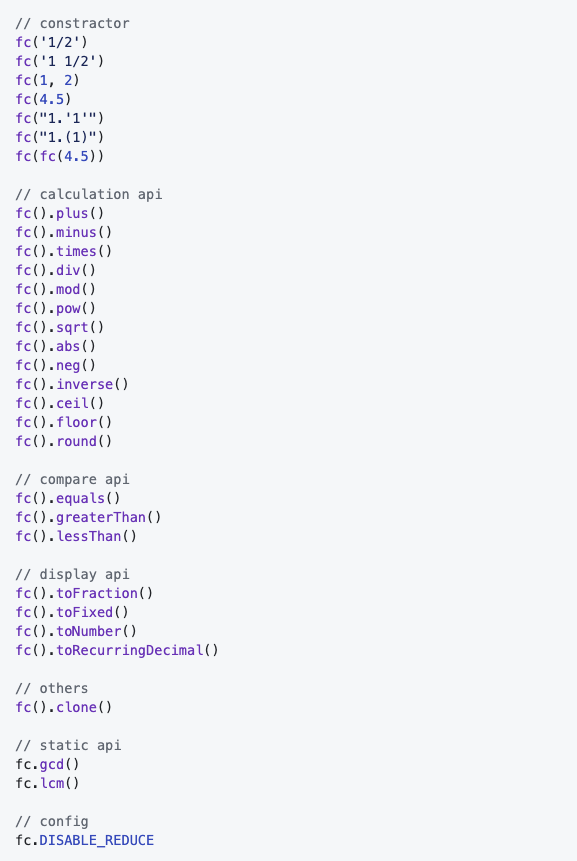
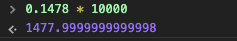

本文讲解的是怎么实现一个工具库并打包发布到npm给大家使用。本文实现的工具是一个分数计算器，大家考虑如下情况：
$$
\sqrt{(((\frac{1}{3}+3.5)*\frac{2}{9}-\frac{27}{109})/\frac{889}{654})^4}
$$
这是一个分数计算式，使用JS原生也是可以计算的，但是只能得到一个近视值：

```javascript
Math.sqrt(Math.pow(((1/3+3.5)*2/9-27/109)/(889/654),4));   //  0.1975308641975308
```

因为上面好几个分数都除不尽，所以JS计算只能算出一个近似值，如果我们需要一个精确值，就需要用分数来表示，JS原生是不支持分数计算的，本文实现的工具库就可以进行这种分数计算，使用本文的库计算如下：

```javascript
fc('1/3')
  .plus(3.5)
  .times('2/9')
  .minus('27/109')
  .div('889/654')
  .pow(4)
  .sqrt()
  .toFraction();     // 输出： 16/81
```

用我们的库输出的就是一个精确的分数，本库还可以将这个分数转化为精确的循环小数，比如上面的分数转化成循环小数就是：

```javascript
fc('16/81').toRecurringDecimal(); // "0.(197530864)"
```

上面计算的输出是：`0.(197530864)`。其中`()`里面的是循环的数字，也就是说原来的小数是`0.197530864197530864197530864...`。本工具还可以将循环小数转换回来：

```javascript
fc('0.(197530864)').toFraction(); // 16/81
```

**因为本工具实质上都是在进行分数计算，分子和分母都是整数，所以JS本身浮点数计算不准的问题本工具也解决了：**

```javascript
0.1 + 0.2;     // 0.30000000000000004
fc(0.1).plus(0.2).toNumber(); // 0.3
```

这个库的名字是`fraction-calculator`，已经发布到npm，大家可以安装试用：

```
npm install fraction-calculator --save
```

本工具(以下简称`fc`)代码使用GitHub托管，欢迎大家`star`，有任何问题可以直接在GitHub提issue。

**GitHub地址： https://github.com/dennis-jiang/fraction-calculator**

GitHub上有详细的使用说明，本文接下来的篇幅会详细讲解怎么实现功能和打包发布。

## 功能实现

### API一览

先来看看我们需要实现的API，心里大概有个数



从上图可以看出，我们的API主要分如下几类：

1. 构造器
2. 计算API
3. 比较API
4. 输出显示API
5. 静态API
6. 其他API
7. 配置

下面我们分别来讲讲每部分怎么实现：

### 构造器

因为我们进行的是分数计算，JS没有分数数据类型，我们需要一个字符串来表示分数，而且在数学中，一个大于1的分数，比如$$\frac{5}{2}$$既可以表示为这种形式，也可以表示为$$2\frac{1}{2}$$，这种读作“二又二分之一”，我们这两种字符串都需要支持。为了方便使用，用户直接用数字肯定也是要支持的。还有前面说过，我们支持循环小数转分数，所以循环小数也要支持，我这里支持两种循环小数的表示方法，使用`''`和`()`来标记循环部分都可以。为了让用户使用更方便，最好`new`关键字也省了，像jQuery那样，直接拿来就用。为了让我们的库变得更稳健，我们最好也支持传入自己的一个实例，就可以随便嵌套了，比如`fc(fc(0.5).plus('1/3')).times(5)`。最后，顺便也支持下两个参数吧，万一有用户喜欢呢，第一个参数表示分子，第二个表示分母。总结下来，我们的构造器的需求是：

1. 不用new就可以直接使用
2. 支持字符串的分数，包括有整数部分或者没有整数部分
3. 支持数字
4. 支持循环小数
5. 支持另一个实例
6. 支持两个数字参数

#### 从去掉new开始构建架构

作为项目的第一步，肯定是要想想我的API要以什么形式组织，以什么形式暴露出去。这就让我想起了jQuery，n年前我还在用jQuery做网页，一个$直接拿来点点点就行了，想要啥就点啥。做fc的时候就想着能不能也让用户用的这么爽，直接用fc点点点就行，于是就借鉴了jQuery的做法，不用new就可以直接调用。[关于jQuery架构的详细解释可以看这篇文章。](https://juejin.im/post/5e549c4d6fb9a07cd614d268)下面我们直接上成品：

```javascript
// 首先创建一个fc的函数，我们最终要返回的其实就是一个fc的实例
// 但是我们又不想让用户new，那么麻烦
// 所以我们要在构造函数里面给他new好这个实例，直接返回
function FractionCalculator(numStr, denominator) {
  // 我们new的其实是fc.fn.init
  return new FractionCalculator.fn.init(numStr, denominator);
}

// fc.fn其实就是fc的原型，算是个简写，所有实例都会拥有这上面的方法
FractionCalculator.fn = FractionCalculator.prototype = {};

// 这个其实才是真正的构造函数，这个构造函数也很简单，就是将传入的参数转化为分数
// 然后将转化的分数挂载到this上，这里的this其实就是返回的实例
FractionCalculator.fn.init = function(numStr, denominator) {
  this.fraction = FractionCalculator.getFraction(numStr, denominator);
};

// 前面new的是init，其实返回的是init的实例
// 为了让返回的实例能够访问到fc的方法，将init的原型指向fc的原型
FractionCalculator.fn.init.prototype = FractionCalculator.fn;
```

上面代码其实就完成了我们的基础架构，里面用到了JS面向对象的知识，[如果对JS面向对象不是很了解，可以看看这篇文章。](https://juejin.im/post/5e50e5b16fb9a07c9a1959af#comment)如果对上面代码有点迷糊，强烈建议看看前面链接的两篇文章，所谓学以致用，就是要先学理论然后才拿来用嘛。

有了上面的基础架构，我们要添加实例方法和静态方法就很简单了：

```javascript
// 添加实例方法这样写，下面是plus方法，注意这里是在fn上，也就是原型上
FractionCalculator.fn.plus = function() {}

// 添加静态方法这样写，下面是gcd方法，注意这里没在fn上
FractionCalculator.gcd = function() {}
```

前面我们在init方法里面其实将计算好的分数挂载到了`this.fraction`上，这里的`fraction`结构其实很简单，就一个分子和分母。后面我们所有的操作其实都在玩这个对象：

```javascript
let fraction = {
  numerator,      // 分子
  denominator,    // 分母
};
```

#### 支持浮点数，解决JS本身精度问题

前面说了，JS本身对浮点数计算并不准，fc能够解决这个问题，解决这个问题的方法就是当构造器接收到浮点数时，将它转换为整数的分子和分母。可能有朋友听说过JS将浮点数转换成整数直接乘以10的n次方就行，n是小数位数，算完了再除以这个数就行。我最开始也是这么实现的，直到我遇到了它：`0.1478`。`0.1478`并不是一个什么特殊的数字，就是我测试的时候随便输的一个数，按照这个思路，应该将它乘以10000，然后它就会变成整数1478吧，我们来看看结果：



结果有点出乎意料啊，看来这条路走不通了。最终我的方案是作为字符串处理，先将数字转换为字符串，把小数点去掉，然后再转换成数字，这样就能得到正确的数字了。小数全程不参与运算。

然后我们构造器还要支持两个数字，带整数的字符串和不带整数的字符串，这些都不难直接将拿到的参数解析成分子和分母塞到这个对象上就行了。另外我们要支持另一个实例作为参数，那就用`instanceof`检查下传入参数是不是fc的实例，如果是就将传入参数的`fraction`挂载到当前实例就行了。这两部分代码都不难，有兴趣的朋友可以去GitHub看我源码。真正有点麻烦的是循环小数转分数。

#### 循环小数转分数

做这个需求的时候，我的数学知识报警了，虽然是中学知识，但是这么多年没用，还是忘记了，赶紧回去翻翻课本才搞定。下面一起来复习下中学数学知识：循环小数转分数。

> 题目：请将循环小数5.45(689)转换成分数，其中括号里面的是循环部分。

解这个题之前先来复习一个概念，循环小数分为纯循环小数和混循环小数两种：

>纯循环小数：小数部分全部循环，比如0.(689)
>
>混循环小数：小数部分前面有几位不参与循环，后面的才是循环部分，比如0.234(689)

再来复习一个定理：

> 任何纯循环小数都可以转换为，分母为n个9的分数，n为循环小数的循环位数。而分子就是循环节本身。
>
> 举个例子，0.(689)是纯循环小数，他的循环部分为689，总共三位，所以他转换为分数的分母就是三个9，分子就是689。转换成分数就是$$\frac{689}{999}$$。

有了这个定理，前面的题目就可以求解了：

> 5.45(689)
>
> = 5 + 0.45 + 0.00(689)
>
> = 5 + $$\frac{45}{100}$$ + (0.(689)/100)
>
> = 5 + $$\frac{45}{100}$$ + ($$\frac{689}{999}$$/100)
>
> = 5 + $$\frac{45}{100}$$ + $$\frac{689}{99900}$$

算到这一步其实就可以了，我们已经将它转化成了分数的加法，只要我们实现了fc的加法，然后直接调用就行了。所以我这里代码的思路是先用正则将循环小数分成，整数，非循环部分，循环部分，然后用这个计算方法分别转换成分数，然后加起来就行了。具体的代码我就不贴了，有兴趣的朋友还是去我GitHub看源码吧，哈哈。

### 计算API

计算API是最多的一类API，我们需要支持加，减，乘，除，取余，次方，开方，绝对值，取反，取倒数，上取整，下取整，四舍五入。同时用户在计算的时候可能是连续计算的，可能加减乘除都有，我们还需要支持链式调用。下面我们先讲讲链式调用：

#### 链式调用

链式调用在JS的世界里很常见，比如jQuery，可以随意点点点，那这个是怎么实现的呢？比如如下代码：

```javascript
fc(1.5).plus('1/3').times(5).toNumber();
```

1. 前面讲了`fc(1.5)`返回的是一个fc的实例，为了能够让他调到`plus`，所以`plus`肯定得是一个实例方法
2. `plus`的返回值还能调到`times`方法，那`plus`的返回值到底是什么呢？答案还是fc实例，我们`plus`还得返回一个fc实例，`times`也是一个实例方法，所以`plus`的返回值能访问。
3. 那`plus`怎么返回一个fc实例呢？其实很简单，他自己就是实例方法，是被fc实例调用的，所以这个方法里面的this就指向了调用者，也就是fc实例。**所以要实现链式调用，就要在对应的实例方法里面返回this。**[如果你对this指向还不是很熟悉，请看这篇文章。](https://juejin.im/post/5e59e35ce51d4526e651c338)

下面来看一段链式调用的示例代码：

```javascript
function fc() {}

fc.prototype.func1 = function() { return this;}
fc.prototype.func2 = function() { return this;}

// 因为实例方法func1和func2都返回了this，所以可以一直点点点
const instance = new fc();
instance.func1().func2().func2().func1();
```

上述代码只是一个链式调用演示，并没有具体功能，大家可以根据自己需要添加功能。

#### 约分和通分

我们的计算API看似有很多，其实核心的就是加法和乘法。因为减法就是加一个符号相反的数，除法就是乘一个倒数。其他的计算API基本都可以用这两个核心方法来算。

下面来看看加法，我们再来回忆下中学数学知识，分数加法的计算：先通分，将分母变成一样的，然后分子进行相加，然后将最后结果进行约分。看个例子：

> $$\frac{1}{2} + \frac{1}{3}$$
>
> = $$\frac{3}{6} + \frac{2}{6}$$
>
> =$$\frac{5}{6}$$

要通分就要计算他们的最小公倍数(lowest common multiple，以下简称LCM)，要计算最小公倍数其实需要先算最大公约数(greatest common divisor，以下简称GCD)。我们以前算最大公约数，都是将目标数分解成质因数，然后将公共的质因数相乘，就是最大公约数，这个方法比较繁琐，还要先拆解质因数。我们这里不用这个方法，而用欧几里得算法，上定理：

> 欧几里得算法：对于两个数a, b的最大公约数gcd(a, b)有：
>
> gcd(a, b) = gcd(b, a %b )

仔细看这个公式，你会发现他其实是可以迭代的，举个例子：

>gcd(150, 270)
>
>= gcd(270, 150)
>
>= gcd(150, 120)
>
>= gcd(120, 30)
>
>= gcd(30, 0)

迭代到最终的模为0，其实这时候的"a"就是最终的GCD，我们这里就是30，30是150和270的GCD。对于这种可以迭代的公式，我们直接一个while循环就搞定了：

```javascript
function getGCD(a, b) {
  // get greatest common divisor(GCD)
  // GCD(a, b) = GCD(b, a % b)
  a = Math.abs(a);
  b = Math.abs(b);
  let mod = a % b;

  while (mod !== 0) {
    a = b;
    b = mod;
    mod = a % b;
  }

  return b;
}
```

拿到了GCD我们就可以约分了，也可以用来算LCM，来看看怎么算LCM：

> 对于两个数a, b, 如果gcd是他们的最大公约数，那么存在另外两个互质的数字x, y：
>
> a = x * gcd
>
> b = y * gcd
>
> 所以他们的最小公倍数就是 x \* y * gcd，也就是
>
> (x \* gcd) \* (y * gcd) / gcd
>
> = a * b / gcd

有了LCM，我们的分数加减法就没有问题了。另外乘法直接分子乘分子，分母乘分母就行了，这里不展开说了。

#### 取余和取模

还有个需要注意的概念是取余和取模，也就是我们计算API里面的`mod`方法。我们先来看看取余和取模的区别：

> 对于两个正数来说，取余和取模是没有区别的，他们的区别在于一个是正数，一个是负数的时候，对于商的取舍上有区别。
>
> 取余： 取余时，如果除不尽，商往0的方向取整
>
> 取模： 取模时，如果除不尽，商往负无穷的方向取整
>
> 举个例子： -7 对 4取余和取模
>
> 1. 先算商-1.75
> 2. 取余，商往0方向取整，也就是-1，然后算 -7 - (-1) * 4 = -3
> 3. 取模，商往负无穷方向取整，也就是-2， 然后算 -7 - (-2) * 4 = 1

JS的`%`其实是取余计算，所以fc的`mod`方法跟他保持了一致，是取余运算，算法跟前面的例子是一样的，计算过程中用到了我们前面实现的减法和乘法。

其他几个计算API都比较简单，有些还是基于`Math`实现的，比如`pow`, `ceil`...我这里就不展开讲了，有兴趣的朋友还是去看我GitHub源码，哈哈~

### 比较API

这几个比较API都很简单，直接用原本的数减去目标数就行，减法前面已经实现了。最后将结果跟0比较，可以轻松得出是大于，小于还是等于。

### 显示API

显示API有4个，可以以小数，固定位数小数，循环小数和分数的形式展示。其中`toFraction`, `toFixed`, `toNumber`都比较简单，`toNumber`直接用分子除以分母就行, `toFixed`再这个基础上调一下JS本身的`toFixed`就行，`toFraction`就是将分子和分母用字符串形式输出就行，输出前记得约分。真正有点麻烦的是输出成循环小数。

#### 输出成循环小数

将分数转换成循环小数的方法不止一种，我们先来说说理论上正确，但是实现起来是坑的方法。

前面循环小数化分数的时候我们已经讲了，对于`0.(456)`转化成分数就是$$\frac{456}{999}$$。那反过来说，只要我将一个分数的分母转换成n个9的形式，分子不就是循环部分了吗？那我们就可以从一个9开始遍历，然后到n个9，找到一个能除进的就行，比如：

> $$\frac{5}{3}$$
>
> = $$\frac{15}{9}$$
>
> = $$1 + \frac{6}{9}$$
>
> = 1.6666666666...

但是需要注意的是，有些分母的质因子含有2和5，这种一辈子都转换不成n个9，对于这种分数，我们需要对分子乘以10，然后约分，来去掉分母的2和5质因子，如果还去不掉，就再乘10。不要担心这里乘以的10，这里乘了多少10，最后把小数点往左移动多少位就行了。来个例子：

> $$\frac{3}{28}$$          // 分母含质因子2，调整分子乘以10
>
> -> $$\frac{30}{28}$$ 
>
> = $$\frac{15}{14}$$    // 分母含质因子2，调整分子乘以10
>
> -> $$\frac{150}{14}$$  
>
> = $$\frac{75}{7}$$
>
> = $$10 + \frac{5}{7}$$
>
> = $$10 + \frac{714285}{999999}$$
>
> = 10.714285714285714285714285714285
>
> -> 0.10(714285)        // 前面乘了两个10，小数点左移两位

上面这个算法理论上来说是正确的，我最开始也是按照这个算法实现的，吭哧吭哧写了半天代码，测试的时候遇到了很多诡异的情况。调试的时候发现，原因是在计算过程中，可能需要很多个9的分母，但是JS对于超过20位的数字，直接就四舍五入用科学计数法表示了，后面的计算基于这个肯定就不准了：


这条路走不通，只有换条路走，让我们从这种“高级”算法中回来，回到我们质朴的小学数学。我们学习除法的时候遇到除不尽的时候，都是将余数乘以10，然后继续算，那我们程序也这样算就好了，那怎么才算有循环了呢？**有循环的判断其实就是出现了同样的余数。**因为出现了同样的余数，你后面再用这个数字去乘以10计算，肯定跟之前同样的那个余数得到了同样的结果，这就**循环了。**想通了这个质朴的道理，我们只需要将每次计算的余数存下来，下次计算的时候检查一下这个余数是不是存在了，如果已经存在了，那循环节就找到了。这个余数第一次出现的位置就是循环节开始的位置，第二次出现的前一个位置就是循环节结束的位置。贴个示例代码吧，为了加快每次查找的速度，我这里用的是一个对象来存储余数：

```javascript
function getDecimalsFromFraction(numerator, denominator) {
  // make sure numerator is less than denominator
  const modObj = {};
  const quotientArray = [];

  let mod;
  let index = 0;

  while (true) {
    mod = numerator % denominator;

    if (mod === 0) {
      return quotientArray.join('');
    }

    let existIndex = modObj[mod];
    if (existIndex >= 0) {
      let quotientLength = quotientArray.length;
      quotientArray.splice(existIndex, 0, '(');
      quotientArray.splice(quotientLength + 1, 0, ')');

      return quotientArray.join('');
    }

    modObj[mod] = index;
    index++;
    numerator = mod * 10;

    let quotient = parseInt(numerator / denominator);
    quotientArray.push(quotient);

    if (index >= 3000) {
      // Recurring part can be very long, we only handle first 3000 numbers
      return quotientArray.join('');
    }
  }
}
```

这么计算的问题是一个分数化循环小数的循环节可能非常长，这个最大长度，理论值是分母-1，因为任何数除以分母，余数可能是1到分母减1之间的任何一个数，运气不好的时候，可能全部轮一遍。当他非常长的时候，计算很慢，而且没有必要，所以我这里只搜索前面3000位小数，如果3000位还没搜索到，就直接把已有的商返回了。

### 静态API

fc有两个静态API，`gcd`和`lcm`，这其实就是我们前面计算用到的最大公约数和最小公倍数，既然都写出来了，为啥不顺便暴露给用户用呢？

### 其他API

剩下就是`clone`了，这其实为为了方便用户想继续操作，但是又不想修改当前值的时候用。另外还有一个配置，默认输出分数的时候会约分，加了个开关，可以输出不约分的分数。

到这里，我们的功能就讲完了，下面会说说工程相关的。

## 单元测试

单元测试是很重要的，尤其是对于这种计算库，我写完一个功能，需要测试下他功能正常不，就需要单元测试。更重要的是可以保证重构的正确性，实现过程中，我多次踩坑，进行了多次重构。如果没有单元测试，重构完我心里是没谱的，不知道之前的功能有没有搞坏。有了单元测试，重构完，直接把单元测试拿来跑一遍就行。我这里单元测试的框架用的[Jest](https://jestjs.io/)，具体使用大家可以看官方文档，也可以看我源码当例子，我这里不再赘述，下面贴一个例子：

```javascript
describe('FractionCalculator instance', () => {
  it('can support integer', () => {
    const instance = fc(4);

    expect(instance.fraction).toEqual({
      numerator: 4,
      denominator: 1,
    });
  });
 });
```

## 打包发布

做了一个工具库，当然是希望给大家用，造福社会了~打包之前我们要知道我们需要一个什么样的包，我们的用户环境可能是什么样的，根据具体需求配置打包策略。我这里的需求是：

> 1. 流行的ES6，node.js要支持
> 2. 浏览器要支持
> 3. 老的浏览器，比如IE，尽量支持

根据需求，我们需要支持`import`, `require`, `script`标签三种引入方式。好在webpack很强大，我们只要加一点简单的配置，就能支持这三种了:

```javascript
{
  ...
  library: 'fc',                 // 库名字，也是script引入时挂载到window的对象名字
  libraryTarget: 'umd',          // 支持的引入方式，umd是包括ES6, node, 浏览器，AMD等
  libraryExport: 'default',      // 默认导出的路径，我用export default导出的就写'default'
  ...
}
```

另外fc开发的时候用了一些ES6的特性，老浏览器是不支持的，所以我还用了babel翻译下，babel配置也很简单:

```javascript
{
  ...
  "useBuiltIns": "usage"     // 关键就是这个配置，这个只会添加用到了的polyfill
  ...
}
```

最终我打了三个包出来：

1. `fraction-calculator.js`没有压缩，没有polyfill的版本，供ES6和node使用，package.json里面的main也指向的这个包，这样用户npm安装之后，import或者require的就是这个文件
2. `fraction-calculator.min.js`压缩版的`fraction-calculator.js`，供高级浏览器使用，比如火狐，Chrome，高级浏览器自己支持ES6，就不用polyfill了，这个文件体积也最小，只有7kb
3. `fraction-calculator.polyfill.min.js`加了polyfill的`fraction-calculator.min.js`，体积会稍微大一点，供IE之类的使用。

这些都弄好后就`npm publish`吧，这个命令会将这个库推送到npm去，然后别人就可以下载安装了。

## 总结

做这个工具起源于偶然间看到的欧几里得算法，看到这个算法可以约分，能约分就能计算分数了，那我也写个分数的加减乘除玩玩。做完这个功能之后，想到还有小数，循环小数呢，于是慢慢加了些功能，就成现在这样了。最开始的初衷其实不是解决JS浮点数精度问题，做完之后才发现，我靠，这样一来JS浮点数精度问题不是也解决了吗，算是意外惊喜了~文中只讲了核心方法，其他方法并没有展开讲，大家有兴趣的可以看我源码哦，顺便当帮我code review了，哈哈~

文章的最后，感谢你花费宝贵的时间阅读本文，如果本文给了你一点点帮助或者启发，请不要吝啬你的赞和GitHub小星星，你的支持是作者持续创作的动力。本工具刚刚发布，可能还有一些小bug，如果你在使用中遇到任何问题，可以直接在GitHub提issue哦。

fc项目GitHub地址： https://github.com/dennis-jiang/fraction-calculator

作者博文GitHub项目地址： https://github.com/dennis-jiang/Front-End-Knowledges

作者掘金文章汇总：https://juejin.im/post/5e3ffc85518825494e2772fd