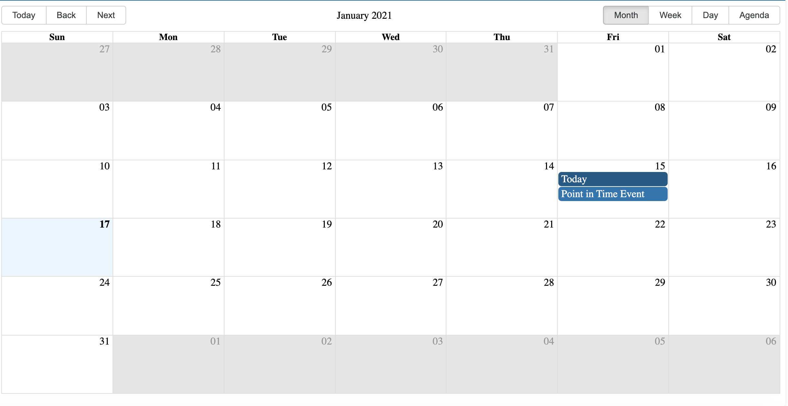
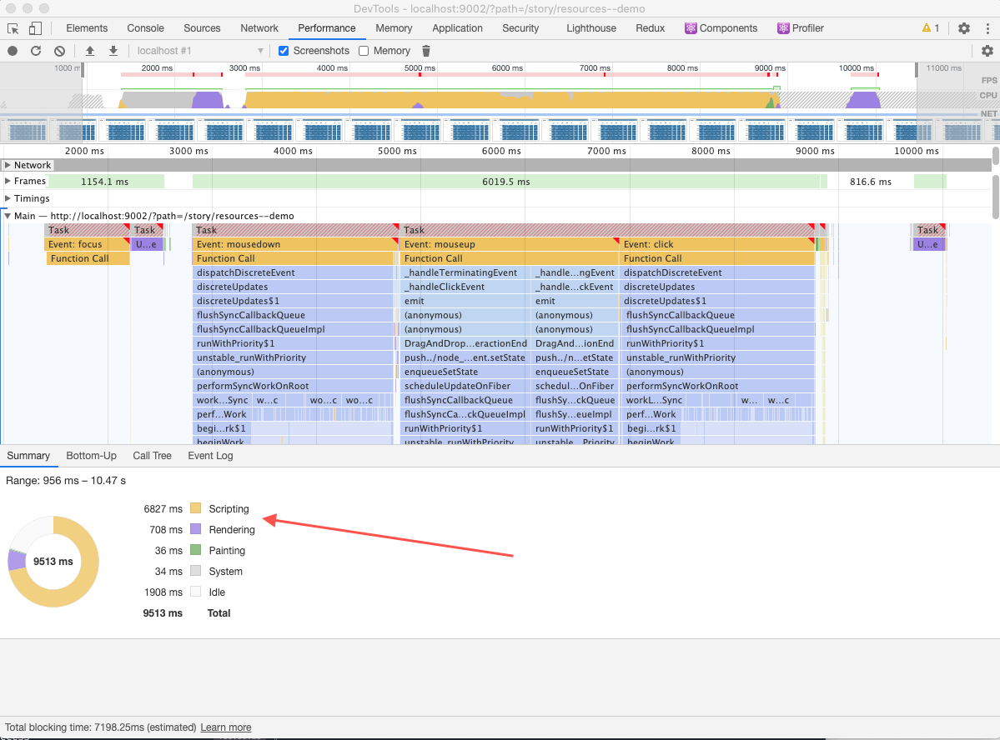
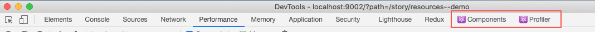
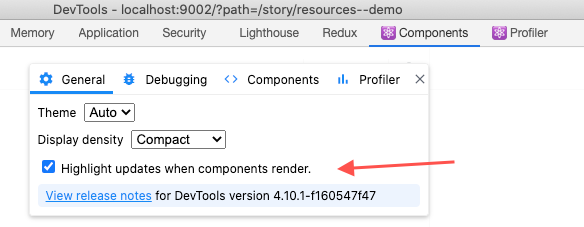
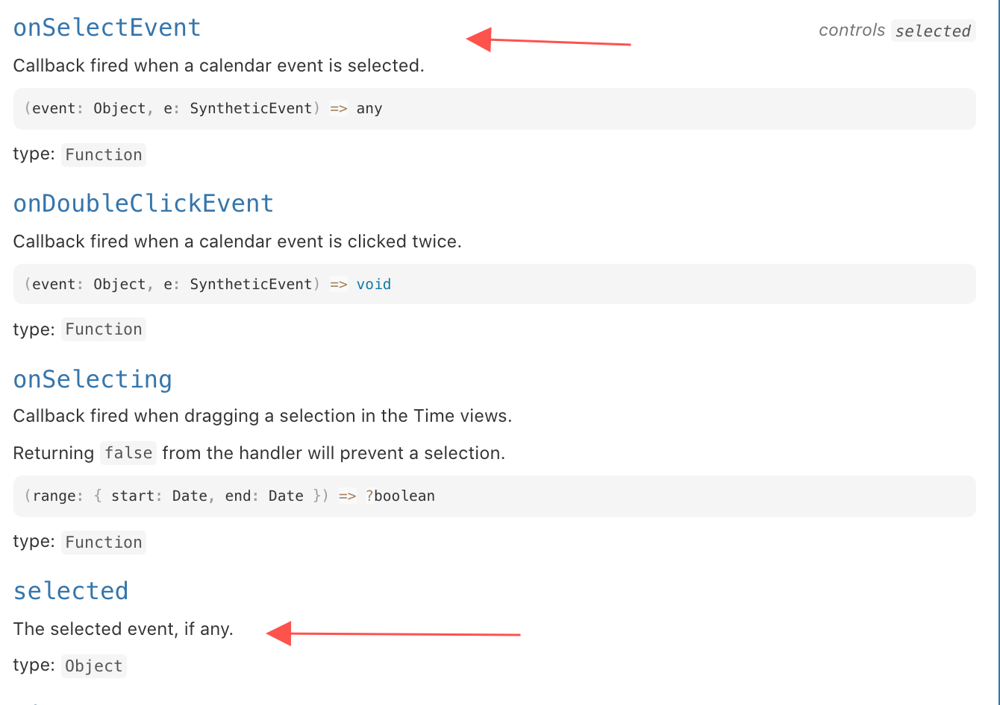
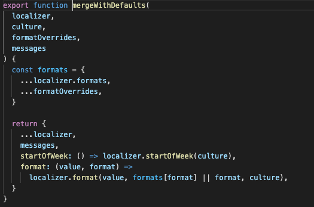
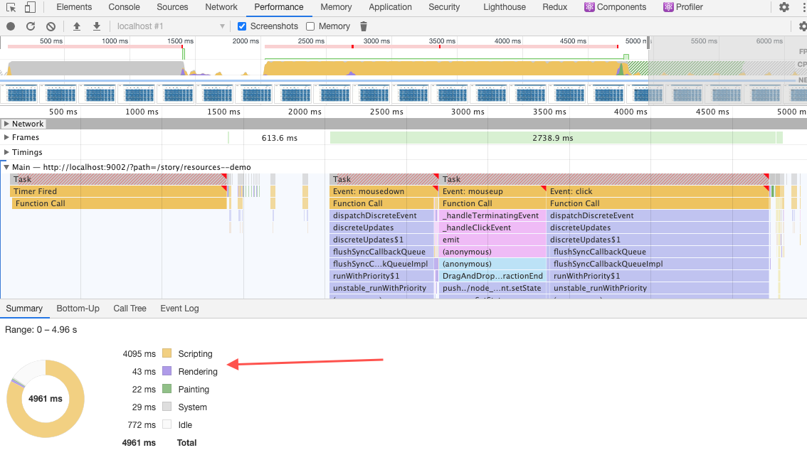
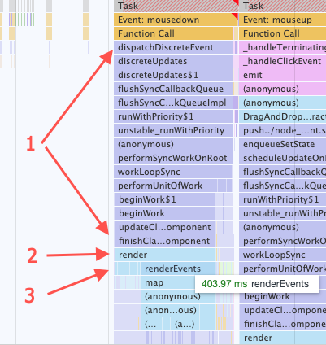

# 歪门邪道性能优化：魔改三方库源码，性能提高几十倍！

本文会分享一个React性能优化的故事，这也是我在工作中真实遇到的故事，最终我们是通过魔改第三方库源码将它性能提高了几十倍。这个第三方库也是很有名的，在GitHub上有4.5k star，这就是：[react-big-calendar](https://github.com/jquense/react-big-calendar)。

**这个工作不是我一个人做的，而是我们团队几个月前共同完成的，我觉得挺有意思，就将它复盘总结了一下，分享给大家**。

在本文中你可以看到：

1. React常用性能分析工具的使用介绍
2. 性能问题的定位思路
3. 常见性能优化的方式和效果：`PureComponent`,  `shouldComponentUpdate`, `Context`, `按需渲染`等等
4. 对于第三方库的问题的解决思路

关于我工作中遇到的故事，我前面其实也分享过两篇文章了：

1. [速度提高几百倍，记一次数据结构在实际工作中的运用](https://juejin.cn/post/6898569107877134350)

2. [使用mono-repo实现跨项目组件共享](https://juejin.cn/post/6913788953971654663)

特别是**速度提高几百倍，记一次数据结构在实际工作中的运用**，这篇文章在某平台单篇阅读都有三万多，有些朋友也提出了质疑。觉得我这篇文章里面提到的问题现实中不太可能遇到，里面的性能优化更多是偏理论的，有点杞人忧天。这个观点我基本是认可的，我在那篇文章正文也提到过可能是个伪需求，但是技术问题本来很多就是理论上的，我们在leetcode上刷题还是纯理论呢，理论结合实际才能发挥其真正的价值，即使是杞人忧天，但是性能确实快上了那么一点点，也给大家提供了另一个思路，我觉得也是值得的。

与之相对的，本文提到的问题完全不是杞人忧天了，而是实打实的用户需求，我们经过用户调研，发现用户确实有这么多数据量，需求上不可能再压缩了，只能技术上优化，这也是逼得我们去改第三方库源码的原因。

## 需求背景

老规矩，为了让大家快速理解我们遇到的问题，我会简单讲一下我们的需求背景。我还是在那家外企，不久前我们接到一个需求：做一个体育场馆管理`Web App`。这里面有一个核心功能是场馆日程的管理，有点类似于大家`Outlook`里面的`Calendar`。大家如果用过`Outlook`，应该对他的`Calendar`有印象，基本上我们的会议及其他日程安排都可以很方便的放在里面。我们要做的这个也是类似的，体育场馆的老板可以用这个日历来管理他下面场地的预定。

假设你现在是一个羽毛球场的老板，来了个客户说，嘿，老板，这周六场地有空吗，我订一个小时呢！场馆每天都很多预定，你也不记得周六有没有空，所以你打开我们的网站，看了下日历：



你发现1月15号，也就是星期五有两个预定，周六还全是空闲的，于是给他说：你运气真好，周六目前还没人预定，时段随便挑！上面这个截图是`react-big-calendar`的官方示例，我们也是选定用他来搭建我们自己的应用。

### 真实场景

上面这个例子只是说明下我们的应用场景，里面预定只有两个，场地只有一块。但是我们真实的客户可比这个大多了，根据我们的调研，我们较大的客户有**数百块场地**，每个场地每天的预定可能有**二三十个**。上面那个例子我们换个生意比较好的老板，假设这个老板有20块羽毛球场地，每天客户都很多，某天还是来了个客户说，嘿，老板，这周六场地有空吗，我订一个小时呢！但是这个老板生意很好，他看到的日历是这样的：


本周**场馆1全满**！！如果老板想要为客户找到一个有空的场地，他需要连续切换场馆1，场馆2。。。一直到场馆20，手都点酸了。。。为了减少老板手的负担，我们的产品经理提出一个需求，**同时在页面上显示10个场馆的日历**，好在`react-big-calendar`本身就是支持这个的，他把这个叫做[resources](http://jquense.github.io/react-big-calendar/examples/index.html#prop-resources)。

## 性能爆炸

看起来我们要的基本功能`react-big-calendar`都能提供，前途还是很美好的，直到我们将真实的数据渲染到页面上。。。我们的预定不仅仅是展示，还需要支持一系列的操作，比如编辑，复制，剪切，粘贴，拖拽等等。当然这一切操作的前提都是选中这个预定，下面这个截图是我选中某个预定的耗时：



**仅仅是一个最简单的点击事件，脚本执行耗时`6827ms`，渲染耗时`708ms`，总计耗时`7.5s`左右，这TM！这玩意儿还想卖钱？送给我，我都不想用**！

可能有朋友不知道这个性能怎么看，这其实是Chrome自带的性能工具，基本步骤是：

1. 打开Chrome调试工具，点到`Performance`一栏
2. 点击左上角的小圆点，开始录制
3. 执行你想要的操作，我这里就是点击一个预定
4. 等你想要的结果出来，我这里就是点击的预定颜色加深
5. 再点击左上角的小圆点，结束录制就可以看到了

为了让大家看得更清楚，我这里录制了一个操作的动图，这个图可以看到，点击操作的响应花了很长时间，Chrome加载这个性能数据也花了很长时间：


### 测试数据量

上面仅仅一个点击耗时就七八秒，是因为我故意用了很大数据量吗？不是！我的测试数据量是完全按照用户真实场景计算的：同时显示10个场馆，每个场馆每天20个预定，上面使用的是周视图，也就是可以同时看到7天的数据，那总共显示的预定就是：

`10 * 20 * 7 = 1400`，总共**1400**个预定显示在页面上。

为了跟上面这个龟速点击做个对比，我再放下优化后的动图，让大家对后面这个长篇大论实现的效果先有个预期：


## 定位问题

我们一般印象中，React不至于这么慢啊，如果慢了，大概率是写代码的人没写好！我们都知道React有个虚拟树，当一个状态改变了，我们只需要更新与这个状态相关的节点就行了，出现这种情况，是不是他干了其他不必要的更新与渲染呢？为了解决这个疑惑，我们安装了React专用调试工具：[React Developer Tools](https://chrome.google.com/webstore/detail/react-developer-tools/fmkadmapgofadopljbjfkapdkoienihi)。这是一个Chrome的插件，Chrome插件市场可以下载，安装成功后，Chrome的调试工具下面会多两个Tab页：



在`Components`这个Tab下有个设置，打开这个设置可以看到你每次操作触发哪些组件更新，我们就是从这里面发现了一点惊喜：



为了看清楚点击事件触发哪些更新，我们先减少数据量，只保留一两个预定，然后打开这个设置看看：


哼，这有点意思。。。我只是点击一个预定，你把整个日历的所有组件都给我更新了！那整个日历有多少组件呢？上面这个图可以看出`10:00 AM`到`10:30 AM`之间是一个大格子，其实这个大格子中间还有条分割线，只是颜色较淡，看的不明显，也就是说每15分钟就是一个格子。这个15分钟是可以配置的，你也可以设置为1分钟，但是那样格子更多，性能更差！我们是根据需求给用户提供了15分钟，30分钟，1小时等三个选项。当用户选择15分钟的时候，渲染的格子最多，性能最差。

那如果一个格子是15分钟，总共有多少格子呢？一天是`24 * 60 = 1440`分钟，15分钟一个格子，总共`96`个格子。我们周视图最多展示7天，那就是`7 * 96 = 672`格子，最多可以展示10个场馆，就是`672 * 10 = 6720`个格子，这还没算日期和时间本身占据的组件，四舍五入一下姑且就算**`7000`个格子**吧。

**我仅仅是点击一下预定，你就把作为背景的7000个格子全部给我更新一遍，怪不得性能差**！

再仔细看下上面这个动图，我点击的是小的那个事件，当我点击他时，注意大的那个事件也更新了，外面也有个蓝框，不是很明显，但是确实是更新了，在我后面调试打Log的时候也证实了这一点。所以在真实1400条数据下，被更新的还有另外**1399个事件**，这其实也是不必要的。

**我这里提到的`事件`和前文提到的`预定`是一个东西，`react-big-calendar`里面将这个称为`event`，也就是`事件`，对应我们业务的意义就是`预定`**。

### 为什么会这样？

这个现象我好像似曾相识，也是我们经常会犯的一个性能上的问题：**将一个状态放到最顶层，然后一层一层往下传，当下面某个元素更新了这个状态，会导致根节点更新，从而触发下面所有子节点的更新**。这里说的更新并不一定要重新渲染DOM节点，但是会运行每个子节点的`render`函数，然后根据`render`函数运行结果来做`diff`，看看要不要更新这个DOM节点。React在这一步会帮我们省略不必要的DOM操作，但是`render`函数的运行却是必须的，而成千上万次`render`函数的运行也会消耗大量性能。

说到这个我想起以前看到过的一个资料，也是讲这个问题的，他用了一个一万行的列表来做例子，原文在这里：[high-performance-redux](http://somebody32.github.io/high-performance-redux/)。下面这个例子来源于这篇文章：

```javascript
function itemsReducer(state = initial_state, action) {
  switch (action.type) {
  case 'MARK':
    return state.map((item) =>
      action.id === item.id ?
        {...item, marked: !item.marked } :
        item
    );
  default:
    return state;
  }
}

class App extends Component {
  render() {
    const { items, markItem } = this.props;
    return (
      <div>
        {items.map(item =>
          <Item key={item.id} id={item.id} marked={item.marked} onClick={markItem} />
        )}
      </div>
    );
  }
};

function mapStateToProps(state) {
  return state;
}

const markItem = (id) => ({type: 'MARK', id});

export default connect(
  mapStateToProps,
  {markItem}
)(App);
```

上面这段代码不复杂，就是一个`App`，接收一个`items`参数，然后将这个参数全部渲染成`Item`组件，然后你可以点击单个`Item`来改变他的选中状态，运行效果如下：


这段代码所有数据都在`items`里面，这个参数从顶层`App`传进去，当点击`Item`的时候改变`items`数据，从而更新整个列表。这个运行结果跟我们上面的`Calendar`有类似的问题，当单条`Item`状态改变的时候，其他没有涉及的`Item`也会更新。原因也是一样的：顶层的参数`items`改变了。

说实话，类似的写法我见过很多，即使不是从`App`传入，也会从其他大的组件节点传入，从而引起类似的问题。当数据量少的时候，这个问题不明显，很多时候都被忽略了，像上面这个图，即使一万条数据，因为每个`Item`都很简单，所以运行一万次`render`你也不会明显感知出来，在控制台看也就一百多毫秒。但是我们面临的`Calendar`就复杂多了，每个子节点的运算逻辑都更复杂，最终将我们的响应速度拖累到了七八秒上。

### 优化方案

还是先说这个一万条的列表，原作者除了提出问题外，也提出了解决方案：顶层`App`只传id，`Item`渲染的数据自己连接`redux store`获取。下面这段代码同样来自这篇文章：

```javascript
// index.js
function items(state = initial_state, action) {
  switch (action.type) {
  case 'MARK':
    const item = state[action.id];
    return {
      ...state,
      [action.id]: {...item, marked: !item.marked}
    };
  default:
    return state;
  }
}

function ids(state = initial_ids, action) {
  return state;
}

function itemsReducer(state = {}, action) {
  return {
    // 注意这里，数据多了一个ids
    ids: ids(state.ids, action),
    items: items(state.items, action),
  }
}

const store = createStore(itemsReducer);

export default class NaiveList extends Component {
  render() {
    return (
      <Provider store={store}>
        <App />
      </Provider>
    );
  }
}
```

```javascript
// app.js
class App extends Component {
  static rerenderViz = true;
  render() {
    // App组件只使用ids来渲染列表，不关心具体的数据
    const { ids } = this.props;
    return (
      <div>
        {
          ids.map(id => {
            return <Item key={id} id={id} />;
          })
        }
      </div>
    );
  }
};

function mapStateToProps(state) {
  return {ids: state.ids};
}

export default connect(mapStateToProps)(App);
```

```javascript
// Item.js
// Item组件自己去连接Redux获取数据
class Item extends Component {
  constructor() {
    super();
    this.onClick = this.onClick.bind(this);
  }

  onClick() {
    this.props.markItem(this.props.id);
  }

  render() {
    const {id, marked} = this.props.item;
    const bgColor = marked ? '#ECF0F1' : '#fff';
    return (
      <div
        onClick={this.onClick}
      >
        {id}
      </div>
    );
  }
}

function mapStateToProps(_, initialProps) {
  const { id } = initialProps;
  return (state) => {
    const { items } = state;
    return {
      item: items[id],
    };
  }
}

const markItem = (id) => ({type: 'MARK', id});

export default connect(mapStateToProps, {markItem})(Item);
```

这段代码的优化主要在这几个地方：

1. 将数据从单纯的`items`拆分成了`ids`和`items`。
2. 顶层组件`App`使用`ids`来渲染列表，`ids`里面只有`id`，所以只要不是增加和删除，仅仅单条数据的状态变化，`ids`并不需要变化，所以`App`不会更新。
3. `Item`组件自己去连接自己需要的数据，当自己关心的数据变化时才更新，其他组件的数据变化并不会触发更新。

## 拆解第三方库源码

上面通过使用调试工具我看到了一个熟悉的现象，并猜到了他慢的原因，但是目前仅仅是猜测，具体是不是这个原因还要看看他的源码才能确认。好在我在看他的源码前先去看了下[他的文档](http://jquense.github.io/react-big-calendar/examples/index.html#api)，然后发现了这个：



`react-big-calendar`接收两个参数`onSelectEvent`和`selected`，`selected`表示当前被选中的事件(预定)，`onSelectEvent`可以用来改变`selected`的值。也就是说当我们选中某个预定的时候，会改变`selected`的值，由于这个参数是从顶层往下传的，所以他会引起下面所有子节点的更新，在我们这里就是差不多`7000个背景格子 + 1399个其他事件`，这样就导致不需要更新的组件更新了。

### 顶层selected换成Context?

`react-big-calendar`在顶层设计`selected`这样一个参数是可以理解的，因为使用者可以通过修改这个值来控制选中的事件。这样选中一个事件就有了两个途径：

1. 用户通过点击某个事件来改变`selected`的值
2. 开发者可以在外部直接修改`selected`的值来选中某个事件

有了前面一万条数据列表优化的经验，我们知道对于这种问题的处理办法了：使用`selected`的组件自己去连接Redux获取值，而不是从顶部传入。**可惜，`react-big-calendar`并没有使用Redux，也没有使用其他任何状态管理库。**如果他使用Redux，我们还可以考虑添加一个`action`来给外部修改`selected`，可惜他没有。没有Redux就玩不转了吗？当然不是！React其实自带一个全局状态共享的功能，那就是`Context`。`React Context API`[官方有详细介绍](https://reactjs.org/docs/context.html)，[我之前的一篇文章也介绍过他的基本使用方法](https://juejin.cn/post/6847902222756347911#heading-1)，这里不再讲述他的基本用法，我这里想提的是他的另一个特性：使用`Context Provider`包裹时，如果你传入的`value`变了，会运行下面所有节点的render函数，这跟前面提到的普通`props`是一样的。**但是，如果Provider下面的儿子节点是PureComponent，可以不运行儿子节点的render函数，而直接运行使用这个value的孙子节点**。

什么意思呢，下面我将我们面临的问题简化来说明下。假设我们只有三层，第一层是顶层容器`Calendar`，第二层是背景的空白格子(儿子)，第三层是真正需要使用`selected`的事件(孙子)：


示例代码如下：

```javascript
// SelectContext.js
// 一个简单的Context
import React from 'react'

const SelectContext = React.createContext()

export default SelectContext;
```

```javascript
// Calendar.js
// 使用Context Provider包裹，接收参数selected，渲染背景Background
import SelectContext from './SelectContext';

class Calendar extends Component {
  constructor(...args) {
    super(...args)
    
    this.state = {
      selected: null
    };
    
    this.setSelected = this.setSelected.bind(this);
  }
  
  setSelected(selected) {
    this.setState({ selected })
  }
  
  componentDidMount() {
    const { selected } = this.props;
    
    this.setSelected(selected);
  }
  
  render() {
    const { selected } = this.state;
    const value = {
      selected,
      setSelected: this.setSelected
    }
    
    return (
    	<SelectContext.Provider value={value}>
      	<Background />
      </SelectContext.Provider>
    )
  }
}
```

```javascript
// Background.js
// 继承自PureComponent，渲染背景格子和事件Event
class Background extends PureComponent {
  render() {
    const { events } = this.props;
    return  (
    	<div>
      	<div>这里面是7000个背景格子</div>
      	下面是渲染1400个事件
      	{events.map(event => <Event event={event}/>)}
      </div>
    )
  }
}
```

```javascript
// Event.js
// 从Context中取selected来决定自己的渲染样式
import SelectContext from './SelectContext';

class Event extends Component {
  render() {
    const { selected, setSelected } = this.context;
    const { event } = this.props;
    
    return (
    	<div className={ selected === event ? 'class1' : 'class2'} onClick={() => setSelected(event)}>
      </div>
    )
  }
}

Event.contextType = SelectContext;    // 连接Context
```

### 什么是PureComponent？

我们知道如果我们想阻止一个组件的`render`函数运行，我们可以在`shouldComponentUpdate`返回`false`，当新的`props`相对于老的`props`来说没有变化时，其实就不需要运行`render`，`shouldComponentUpdate`就可以这样写：

```javascript
shouldComponentUpdate(nextProps) {
    const fields = Object.keys(this.props)
    const fieldsLength = fields.length
    let flag = false

    for (let i = 0; i < fieldsLength; i = i + 1) {
      const field = fields[i]
      if (
        this.props[field] !== nextProps[field]
      ) {
        flag = true
        break
      }
    }

    return flag
  }
```

这段代码就是将新的`nextProps`与老的`props`一一进行对比，如果一样就返回`false`，不需要运行`render`。而`PureComponent`其实就是React官方帮我们实现了这样一个`shouldComponentUpdate`。所以我们上面的`Background`组件继承自`PureComponent`，就自带了这么一个优化。如果`Background`本身的参数没有变化，他就不会更新，而`Event`因为自己连接了`SelectContext`，所以当`SelectContext`的值变化的时候，`Event`会更新。这就实现了我前面说的**如果Provider下面的儿子节点是PureComponent，可以不运行儿子节点的render函数，而直接运行使用这个value的孙子节点**。

### PureComponent不起作用

理想是美好的，现实是骨感的。。。理论上来说，如果我将中间儿子这层改成了`PureComponent`，背景上7000个格子就不应该更新了，性能应该大幅提高才对。但是我测试后发现并没有什么用，这7000个格子还是更新了，什么鬼？其实这是`PureComponent`本身的一个问题：**只进行浅比较**。注意`this.props[field] !== nextProps[field]`，如果`this.props[field]`是个引用对象呢，比如对象，数组之类的？因为他是浅比较，所以即使前后属性内容没变，但是引用地址变了，这两个就不一样了，就会导致组件的更新！

而在`react-big-calendar`里面大量存在这种计算后返回新的对象的操作，比如他在顶层`Calendar`里面有这种操作：


代码地址：[https://github.com/jquense/react-big-calendar/blob/master/src/Calendar.js#L790](https://github.com/jquense/react-big-calendar/blob/master/src/Calendar.js#L790)

这行代码的意思是每次`props`改变都去重新计算状态`state`，而他的计算代码是这样的：


代码地址：[https://github.com/jquense/react-big-calendar/blob/master/src/Calendar.js#L794](https://github.com/jquense/react-big-calendar/blob/master/src/Calendar.js#L794)

注意他的返回值是一个新的对象，而且这个对象里面的属性，比如`localizer`的计算方法`mergeWithDefaults`也是这样，每次都返回新的对象：



代码地址：[https://github.com/jquense/react-big-calendar/blob/master/src/localizer.js#L39](https://github.com/jquense/react-big-calendar/blob/master/src/localizer.js#L39)

这样会导致中间儿子节点每次接受到的`props`虽然内容是一样的，但是因为是一个新对象，即使使用了`PureComponent`，其运行结果也是需要更新。这种操作在他的源码中大量存在，其实从功能角度来说，这样写是可以理解的，因为我有时候也会这么干。。。有时候某个属性更新了，不太确定要不要更新下面的组件，干脆直接返回一个新对象触发更新，省事是省事了，但是面对我们这种近万个组件的时候性能就崩了。。。

### 歪门邪道shouldComponentUpdate

如果只有一两个属性是这样返回新对象，我还可以考虑给他重构下，但是调试了一下发现有大量的属性都是这样，咱也不是他作者，也不知道会不会改坏功能，没敢乱动。但是不动性能也绷不住啊，想来想去，还是在儿子的`shouldComponentUpdate`上动点手脚吧。简单的`this.props[field] !== nextProps[field]`判断肯定是不行的，因为引用地址变啦，但是他内容其实是没变，那我们就判断他的内容吧。两个对象的深度比较需要使用递归，也可以参考`React diff`算法来进行性能优化，但是无论你怎么优化这个算法，性能最差的时候都是两个对象一样的时候，因为他们是一样的，你需要遍历到最深处才能肯定他们是一样的，如果对象很深，这种递归算法不见得会比运行一遍`render`快，而我们面临的大多数情况都是这种性能最差的情况。所以递归对比不太靠谱，其实如果你对这些数据心里有数，没有循环引用什么的，你可以考虑直接将两个对象转化为字符串来进行对比，也就是

```javascript
JSON.stringify(this.props[field]) !== JSON.stringify(nextProps[field])
```

**注意，这种方式只适用于你对props数据了解，没有循环引用，没有变化的Symbol，函数之类的属性，因为JSON.stringify执行时会丢掉Symbol和函数，所以我说他是歪门邪道性能优化**。

将这个转化为字符串比较的`shouldComponentUpdate`加到背景格子的组件上，性能得到了明显增强，点击相应速度从7.5秒下降到了5.3秒左右。


### 按需渲染

上面我们用`shouldComponentUpdate`阻止了7000个背景格子的更新，响应时间下降了两秒多，但是还是需要5秒多时间，这也很难接受，还需要进一步优化。按照我们之前说的如果还能阻止另外1399个事件的更新那就更好了，但是经过对他数据结构的分析，我们发现他的数据结构跟我们前面举的列表例子还不一样。我们列表的例子所有数据都在`items`里面，是否选中是`item`的一个属性，而`react-big-calendar`的数据结构里面`event`和`selectedEvent`是两个不同的属性，每个事件通过判断自己的`event`是否等于`selectedEvent`来判断自己是否被选中。这造成的结果就是每次我们选中一个事件，`selectedEvent`的值都会变化，每个事件的属性都会变化，也就是会更新，运行`render`函数。如果不改这种数据结构，是阻止不了另外1399个事件更新的。但是改这个数据结构改动太大，对于一个第三方库，我们又不想动这么多，怎么办呢？

这条路走不通了，我们完全可以换一个思路，背景7000个格子，再加上1400个事件，用户屏幕有那么大吗，看得完吗？肯定是看不完的，既然看不完，那我们只渲染他能看到部分不就可以了！按照这个思路，我们找到了一个库：[react-visibility-sensor](https://www.npmjs.com/package/react-visibility-sensor)。这个库使用方法也很简单：

```javascript
function MyComponent (props) {
  return (
    <VisibilitySensor>
      {({isVisible}) =>
        <div>I am {isVisible ? 'visible' : 'invisible'}</div>
      }
    </VisibilitySensor>
  );
}
```

结合我们前面说的，我们可以将`VisibilitySensor`套在`Background`上面：

```javascript
class Background extends PureComponent {
  render() {
    return (
      <VisibilitySensor>
        {({isVisible}) =>
          <Event isVisible={isVisible}/>
        }
      </VisibilitySensor>
    )
  }
}
```

然后`Event`组件如果发现自己处于不可见状态，就不用渲染了，只有当自己可见时才渲染：

```javascript
class Event extends Component {
  render() {
    const { selected } = this.context;
    const { isVisible, event } = this.props;
    
    return (
      { isVisible ? (
       <div className={ selected === event ? 'class1' : 'class2'}>
      	复杂内容
       </div>
      ) : null}
    )
  }
}

Event.contextType = SelectContext;
```

按照这个思路我们又改了一下，发现性能又提升了，整体时间下降到了大概4.1秒：



仔细看上图，我们发现渲染事件`Rendering`时间从1秒左右下降到了43毫秒，快了二十几倍，这得益于渲染内容的减少，但是`Scripting`时间，也就是脚本执行时间仍然高达4.1秒，还需要进一步优化。

### 砍掉mousedown事件

渲染这块已经没有太多办法可以用了，只能看看`Scripting`了，我们发现性能图上鼠标事件有点刺眼：


一次点击同时触发了三个点击事件：`mousedown`，`mouseup`，`click`。如果我们能干掉`mousedown`，`mouseup`是不是时间又可以省一半，先去看看他注册这两个事件时干什么的吧。可以直接在代码里面全局搜`mousedown`，最终发现都是在[Selection.js](https://github.com/jquense/react-big-calendar/blob/master/src/Selection.js)，通过对这个类代码的阅读，发现他是个典型的观察者模式，然后再搜`new Selection`找到使用的地方，发现`mousedown`，`mouseup`主要是用来实现事件的拖拽功能的，`mousedown`标记拖拽开始，`mouseup`标记拖拽结束。如果我把它去掉，拖拽功能就没有了。经过跟产品经理沟通，我们后面是需要拖拽的，所以这个不能删。

事情进行到这里，我也没有更多办法了，但是响应时间还是有4秒，真是让人头大


反正没啥好办法了，我就随便点着玩，突然，我发现`mousedown`的调用栈好像有点问题：



这个调用栈我用数字分成了三块：

1. 这里面有很多熟悉的函数名啊，像啥`performUnitOfWork`，`beginWork`，这不都是我在[React Fiber这篇文章中提过的吗?](https://juejin.cn/post/6844904197008130062)所以这些是React自己内部的函数调用
2. `render`函数，这是某个组件的渲染函数
3. 这个`render`里面又调用了`renderEvents`函数，看起来是用来渲染事件列表的，主要的时间都耗在这里了

`mousedown`监听本身我是干不掉了，但是里面的执行是不是可以优化呢？`renderEvents`已经是库自己写的代码了，所以可以直接全局搜，看看在哪里执行的。最终发现是在[TimeGrid.js](https://github.com/jquense/react-big-calendar/blob/master/src/TimeGrid.js)的`render`函数被执行了，其实这个是不需要执行的，我们直接把前面歪门邪道的`shouldComponentUpdate`复制过来就可以阻止他的执行。然后再看下性能数据呢：


我们发现`Scripting`下降到了3.2秒左右，比之前减少约800毫秒，而`mousedown`的时间也从之前的几百毫秒下降到了50毫秒，在图上几乎都看不到了，`mouseup`事件也不怎么看得到了，又算进了一步吧~

### 忍痛阉割功能

到目前为止，我们的性能优化都没有阉割功能，响应速度从7.5秒下降到了3秒多一点，优化差不多一倍。但是，目前这速度还是要三秒多，别说作为一个工程师了，作为一个用户我都忍不了。咋办呢？我们是真的有点黔驴技穷了。。。

看看上面那个性能图，主要消耗时间的有两个，一个是`click`事件，还有个`timer`。`timer`到现在我还不知道他哪里来的，但是`click`事件我们是知道的，就是用户点击某个事件后，更改`SelectContext`的`selected`属性，然后`selected`属性从顶层节点传入触发下面组件的更新，中间儿子节点通过`shouldComponentUpdate`跳过更新，孙子节点直接连接`SelectContext`获取`selected`属性更新自己的状态。这个流程是我们前面优化过的，但是，等等，这个貌似还有点问题。

**在我们的场景中，中间儿子节点其实包含了高达7000个背景格子，虽然我们通过`shouldComponentUpdate`跳过了`render`的执行，但是7000个`shouldComponentUpdate`本省执行也是需要时间的啊！有没有办法连`shouldComponentUpdate`的执行也跳过呢**？这貌似是个新的思路，但是经过我们的讨论，发现没办法在保持功能的情况下做到，但是可以适度阉割一个功能就可以做到，那阉割的功能是哪个呢？那就是暴露给外部的受控`selected`属性！

前面我们提到过选中一个事件有两个途径：

1. 用户通过点击某个事件来改变`selected`的值
2. 开发者可以在外部直接修改`selected`的值来选中某个事件

之所以`selected`要放在顶层组件上就是为了实现第二个功能，让外部开发者可以通过这个受控的`selected`属性来改变选中的事件。但是经过我们评估，`外部修改selected`这个并不是我们的需求，我们的需求都是用户点击来选中，也就是说`外部修改selected`这个功能我们可以不要。

如果不要这个功能那就有得玩了，`selected`完全不用放在顶层了，只需要放在事件外层的容器上就行，这样，改变`selected`值只会触发事件的更新，啥背景格子的更新压根就不会触发，那怎么改呢？在我们前面的`Calendar -- Background -- Event`模型上再加一层`EventContainer`，变成`Calendar -- Background -- EventContainer -- Event`。`SelectContext.Provider`也不用包裹`Calendar`了，直接包裹`EventContainer`就行。代码大概是这个样子：

```javascript
// Calendar.js
// Calendar简单了，不用接受selected参数，也不用SelectContext.Provider包裹了
class Calendar extends Component {
  render() {
    return (
      <Background />
    )
  }
}
```

```javascript
// Background.js
// Background要不要使用shouldComponentUpdate阻止更新可以看看还有没有其他参数变化，因为selected已经从顶层拿掉了
// 改变selected本来就不会触发Background更新
// Background不再渲染单个事件，而是渲染EventContainer
class Background extends PureComponent {
  render() {
    const { events } = this.props;
    return  (
    	<div>
      	<div>这里面是7000个背景格子</div>
      	下面是渲染1400个事件
      	<EventContainer events={events}/>
      </div>
    )
  }
}
```

```javascript
// EventContainer.js
// EventContainer需要SelectContext.Provider包裹
// 代码类似之前的Calendar
import SelectContext from './SelectContext';

class EventContainer extends Component {
  constructor(...args) {
    super(...args)
    
    this.state = {
      selected: null
    };
    
    this.setSelected = this.setSelected.bind(this);
  }
  
  setSelected(selected) {
    this.setState({ selected })
  }
  
  render() {
    const { selected } = this.state;
    const { events } = this.props;
    const value = {
      selected,
      setSelected: this.setSelected
    }
    
    return (
    	<SelectContext.Provider value={value}>
      	{events.map(event => <Event event={event}/>)}
      </SelectContext.Provider>
    )
  }
}
```

```javascript
// Event.js
// Event跟之前是一样的，从Context中取selected来决定自己的渲染样式
import SelectContext from './SelectContext';

class Event extends Component {
  render() {
    const { selected, setSelected } = this.context;
    const { event } = this.props;
    
    return (
    	<div className={ selected === event ? 'class1' : 'class2'} onClick={() => setSelected(event)}>
      </div>
    )
  }
}

Event.contextType = SelectContext;    // 连接Context
```

这种结构最大的变化就是当`selected`变化的时候，更新的节点是`EventContainer`，而不是顶层`Calendar`，这样就不会触发`Calendar`下其他节点的更新。缺点就是`Calendar`无法从外部接收`selected`了。

需要注意一点是，如果像我们这样`EventContainer`下面直接渲染`Event`列表，`selected`不用`Context`也可以，可以直接作为`EventContainer`的`state`。**但是如果`EventContainer`和`Event`中间还有层级，需要穿透传递，仍然需要`Context`，中间层级和以前的类似，使用`shouldComponentUpdate`阻止更新**。

还有一点，因为`selected`不在顶层了，所以`selected`更新也不会触发中间`Background`更新了，所以`Background`上的`shouldComponentUpdate`也可以删掉了。

我们这样优化后，性能又提升了：


现在`Scripting`时间直接从3.2秒降到了800毫秒，其中`click`事件只有163毫秒，现在从我使用来看，卡顿已经不明显了，直接录个动图来对比下吧：


上面这个动图已经基本看不出卡顿了，但是我们性能图上为啥还有800毫秒呢，而且有一个很长的`Timer Fired`。经过我们的仔细排查，发现这其实是个乌龙，`Timer Fired`在我一开始录制性能就出现了，那时候我还在切换页面，还没来得及点击呢，如果我们点进去会发现他其实是按需渲染引入的`react-visibility-sensor`的一个检查元素可见性的定时任务，并不是我们点击事件的响应时间。把这块去掉，我们点击事件的响应时间其实不到200毫秒。

**从7秒多优化到不到200毫秒，三十多倍的性能优化，终于可以交差了，哈哈😃**

## 总结

本文分享的是我工作中实际遇到的一个案例，实现的效果是将7秒左右的响应时间优化到了不到200毫秒，优化了三十几倍，优化的代价是牺牲了一个不常用的功能。

本来想着要是优化好了可以给这个库提个PR，造福大家的。但是优化方案确实有点歪门邪道：

1. 使用了`JSON.stringify`来进行`shouldComponentUpdate`的对比优化，对于函数，`Symbol`属性的改变没法监听到，不适合开放使用，只能在数据自己可控的情况下小规模使用。
2. 牺牲了一个暴露给外部的受控属性`selected`，破坏了功能。

基于这两点，PR我们就没提了，而是将修改后的代码放到了自己的私有NPM仓库。

下面再来总结下本文面临的问题和优化思路：

### 遇到的问题

我们需求是要做一个体育场馆的管理日历，所以我们使用了`react-big-calendar`这个库。我们需求的数据量是渲染7000个背景格子，然后在这个背景格子上渲染1400个事件。这近万个组件渲染后，我们发现仅仅一次点击就需要7秒多，完全不能用。经过细致排查，我们发现慢的原因是点击事件的时候会改变一个属性`selected`。这个属性是从顶层传下来的，改变后会导致所有组件更新，也就是所有组件都会运行`render`函数。

### 第一步优化

为了阻止不必要的`render`运行，我们引入了`Context`，将`selected`放到`Context`上进行透传。中间层级因为不需要使用`selected`属性，所以可以使用`shouldComponentUpdate`来阻止`render`的运行，底层需要使用`selected`的组件自行连接`Context`获取。

#### 第一步优化的效果

响应时间从7秒多下降到5秒多。

#### 第一步优化的问题

底层事件仍然有1400个，获取`selected`属性后，1400个组件更新仍然要花大量的时间。

### 第二步优化

为了减少点击后更新的事件数量，我们为事件引入按需渲染，只渲染用户可见的事件组件。同时我们还对`mousedown`和`mouseup`进行了优化，也是使用`shouldComponentUpdate`阻止了不必要的更新。

#### 第二步优化效果

响应时间从5秒多下降到3秒多。

#### 第二步优化的问题

响应时间仍然有三秒多，经过分析发现，背景7000个格子虽然使用`shouldComponentUpdate`阻止了`render`函数的运行，但是`shouldComponentUpdate`本身运行7000次也要费很长时间。

### 第三步优化

为了让7000背景格子连`shouldComponentUpdate`都不运行，我们忍痛阉割了顶层受控的`selected`属性，直接将它放到了事件的容器上，它的更新再也不会触发背景格子的更新了，也就是连`shouldComponentUpdate`都不运行了。

#### 第三步优化效果

响应时间从3秒多下降到不到200毫秒。

#### 第三步优化的问题

功能被阉割了，其他完美！

## 参考资料：

[react-big-calendar仓库](https://github.com/jquense/react-big-calendar)

[high-performance-redux](http://somebody32.github.io/high-performance-redux/)

**文章的最后，感谢你花费宝贵的时间阅读本文，如果本文给了你一点点帮助或者启发，请不要吝啬你的赞和GitHub小星星，你的支持是作者持续创作的动力。**

**欢迎关注我的公众号[进击的大前端](https://test-dennis.oss-cn-hangzhou.aliyuncs.com/QRCode/QR430.jpg)第一时间获取高质量原创~**

**“前端进阶知识”系列文章：[https://juejin.im/post/5e3ffc85518825494e2772fd](https://juejin.im/post/5e3ffc85518825494e2772fd)**

**“前端进阶知识”系列文章源码GitHub地址： [https://github.com/dennis-jiang/Front-End-Knowledges](https://github.com/dennis-jiang/Front-End-Knowledges)**

