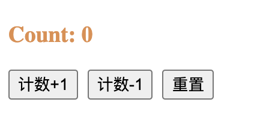

[上一篇文章我们手写了一个Redux](https://juejin.im/post/5efec81be51d4534942dd589)，但是单纯的Redux只是一个状态机，是没有UI呈现的，所以一般我们使用的时候都会配合一个UI库，比如在React中使用Redux就会用到`React-Redux`这个库。这个库的作用是将Redux的状态机和React的UI呈现绑定在一起，当你`dispatch action`改变`state`的时候，会自动更新页面。本文还是从它的基本使用入手来自己写一个`React-Redux`，然后替换官方的NPM库，并保持功能一致。

**本文全部代码已经上传GitHub，大家可以拿下来玩玩：[https://github.com/dennis-jiang/Front-End-Knowledges/tree/master/Examples/React/react-redux](https://github.com/dennis-jiang/Front-End-Knowledges/tree/master/Examples/React/react-redux)**

## 基本用法

下面这个简单的例子是一个计数器，跑起来效果如下：


要实现这个功能，首先我们要在项目里面添加`react-redux`库，然后用它提供的`Provider`包裹整个`React`App的根组件：

```javascript
import React from 'react';
import ReactDOM from 'react-dom';
import { Provider } from 'react-redux'
import store from './store'
import App from './App';

ReactDOM.render(
  <React.StrictMode>
    <Provider store={store}>
      <App />
    </Provider>
  </React.StrictMode>,
  document.getElementById('root')
);
```

上面代码可以看到我们还给`Provider`提供了一个参数`store`，这个参数就是Redux的`createStore`生成的`store`，我们需要调一下这个方法，然后将返回的`store`传进去：

```javascript
import { createStore } from 'redux';
import reducer from './reducer';

let store = createStore(reducer);

export default store;
```

上面代码中`createStore`的参数是一个`reducer`，所以我们还要写个`reducer`:

```javascript
const initState = {
  count: 0
};

function reducer(state = initState, action) {
  switch (action.type) {
    case 'INCREMENT':
      return {...state, count: state.count + 1};
    case 'DECREMENT':
      return {...state, count: state.count - 1};
    case 'RESET':
      return {...state, count: 0};
    default:
      return state;
  }
}

export default reducer;
```

这里的`reduce`会有一个初始`state`，里面的`count`是`0`，同时他还能处理三个`action`，这三个`action`对应的是UI上的三个按钮，可以对`state`里面的计数进行加减和重置。到这里其实我们`React-Redux`的接入和`Redux`数据的组织其实已经完成了，后面如果要用`Redux`里面的数据的话，只需要用`connect`API将对应的`state`和方法连接到组件里面就行了，比如我们的计数器组件需要`count`这个状态和加一，减一，重置这三个`action`，我们用`connect`将它连接进去就是这样：

```javascript
import React from 'react';
import { connect } from 'react-redux';
import { increment, decrement, reset } from './actions';

function Counter(props) {
  const { 
    count,
    incrementHandler,
    decrementHandler,
    resetHandler
   } = props;

  return (
    <>
      <h3>Count: {count}</h3>
      <button onClick={incrementHandler}>计数+1</button>
      <button onClick={decrementHandler}>计数-1</button>
      <button onClick={resetHandler}>重置</button>
    </>
  );
}

const mapStateToProps = (state) => {
  return {
    count: state.count
  }
}

const mapDispatchToProps = (dispatch) => {
  return {
    incrementHandler: () => dispatch(increment()),
    decrementHandler: () => dispatch(decrement()),
    resetHandler: () => dispatch(reset()),
  }
};

export default connect(
  mapStateToProps,
  mapDispatchToProps
)(Counter)
```

上面代码可以看到`connect`是一个高阶函数，他的第一阶会接收`mapStateToProps`和`mapDispatchToProps`两个参数，这两个参数都是函数。`mapStateToProps`可以自定义需要将哪些`state`连接到当前组件，这些自定义的`state`可以在组件里面通过`props`拿到。`mapDispatchToProps`方法会传入`dispatch`函数，我们可以自定义一些方法，这些方法可以调用`dispatch`去`dispatch action`，从而触发`state`的更新，这些自定义的方法也可以通过组件的`props`拿到，`connect`的第二阶接收的参数是一个组件，我们可以猜测这个函数的作用就是将前面自定义的`state`和方法注入到这个组件里面，同时要返回一个新的组件给外部调用，所以`connect`其实也是一个高阶组件。

到这里我们汇总来看下我们都用到了哪些API，这些API就是我们后面要手写的目标：

> `Provider`: 用来包裹根组件的组件，作用是注入`Redux`的`store`。
>
> `createStore`: `Redux`用来创建`store`的核心方法，[我们另一篇文章已经手写过了]()。
>
> `connect`：用来将`state`和`dispatch`注入给需要的组件，返回一个新组件，他其实是个高阶组件。

所以`React-Redux`核心其实就两个API，而且两个都是组件，作用还很类似，都是往组件里面注入参数，`Provider`是往根组件注入`store`，`connect`是往需要的组件注入`state`和`dispatch`。

在手写之前我们先来思考下，为什么`React-Redux`要设计这两个API，假如没有这两个API，只用`Redux`可以吗？当然是可以的！其实我们用`Redux`的目的不就是希望用它将整个应用的状态都保存下来，每次操作只用`dispatch action`去更新状态，然后UI就自动更新了吗？那我从根组件开始，每一级都把`store`传下去不就行了吗？每个子组件需要读取状态的时候，直接用`store.getState()`就行了，更新状态的时候就`store.dispatch`，这样其实也能达到目的。但是，如果这样写，子组件如果嵌套层数很多，每一级都需要手动传入`store`，比较丑陋，开发也比较繁琐，而且如果某个新同学忘了传`store`，那后面就是一连串的错误了。所以最好有个东西能够将`store`全局的注入组件树，而不需要一层层作为`props`传递，这个东西就是`Provider`！而且如果每个组件都独立依赖`Redux`会破坏`React`的数据流向，这个我们后面会讲到。

## React的Context API

React其实提供了一个全局注入变量的API，这就是context api。假如我现在有一个需求是要给我们所有组件传一个文字颜色的配置，我们的颜色配置在最顶级的组件上，当这个颜色改变的时候，下面所有组件都要自动应用这个颜色。那我们可以使用context api注入这个配置：

### 先使用`React.createContext`创建一个context

```javascript
// 我们使用一个单独的文件来调用createContext
// 因为这个返回值会被Provider和Consumer在不同的地方引用
import React from 'react';

const TestContext = React.createContext();

export default TestContext;
```

### 使用`Context.Provider`包裹根组件

创建好了context，如果我们要传递变量给某些组件，我们需要在他们的根组件上加上`TestContext.Provider`，然后将变量作为`value`参数传给`TestContext.Provider`:

```javascript
import TestContext from './TestContext';

const setting = {
  color: '#d89151'
}

ReactDOM.render(
  <TestContext.Provider value={setting}>
  	<App />
  </TestContext.Provider>,
  document.getElementById('root')
);
```

### 使用`Context.Consumer`接收参数

上面我们使用`Context.Provider`将参数传递进去了，这样被`Context.Provider`包裹的所有子组件都可以拿到这个变量，只是拿这个变量的时候需要使用`Context.Consumer`包裹，比如我们前面的`Counter`组件就可以拿到这个颜色了，只需要将它返回的`JSX`用`Context.Consumer`包裹一下就行：

```javascript
// 注意要引入同一个Context
import TestContext from './TestContext';

// ... 中间省略n行代码 ...
// 返回的JSX用Context.Consumer包裹起来
// 注意Context.Consumer里面是一个方法，这个方法就可以访问到context参数
// 这里的context也就是前面Provider传进来的setting，我们可以拿到上面的color变量
return (
    <TestContext.Consumer>
      {context => 
        <>
          <h3 style={{color:context.color}}>Count: {count}</h3>
          <button onClick={incrementHandler}>计数+1</button>&nbsp;&nbsp;
          <button onClick={decrementHandler}>计数-1</button>&nbsp;&nbsp;
          <button onClick={resetHandler}>重置</button>
        </>
      }
    </TestContext.Consumer>
  );
```

上面代码我们通过`context`传递了一个全局配置，可以看到我们文字颜色已经变了:



### 使用`useContext`接收参数

除了上面的`Context.Consumer`可以用来接收`context`参数，新版React还有`useContext`这个hook可以接收context参数，使用起来更简单，比如上面代码可以这样写：

```javascript
const context = useContext(TestContext);

return (
    <>
      <h3 style={{color:context.color}}>Count: {count}</h3>
      <button onClick={incrementHandler}>计数+1</button>&nbsp;&nbsp;
      <button onClick={decrementHandler}>计数-1</button>&nbsp;&nbsp;
      <button onClick={resetHandler}>重置</button>
    </>
);
```


所以我们完全可以用`context api`来传递`redux store`，现在我们也可以猜测`React-Redux`的`Provider`其实就是包装了`Context.Provider`，而传递的参数就是`redux store`，而`React-Redux`的`connect`HOC其实就是包装的`Context.Consumer`或者`useContext`。我们可以按照这个思路来自己实现下`React-Redux`了。

## 手写`Provider`

上面说了`Provider`用了`context api`，所以我们要先建一个`context`文件，导出需要用的`context`：

```javascript
// Context.js
import React from 'react';

const ReactReduxContext = React.createContext();

export default ReactReduxContext;
```

这个文件很简单，新建一个`context`再导出就行了，[对应的源码看这里](https://github.com/reduxjs/react-redux/blob/master/src/components/Context.js)。

然后将这个`context`应用到我们的`Provider`组件里面：

```javascript
import React from 'react';
import ReactReduxContext from './Context';

function Provider(props) {
  const {store, children} = props;

  // 这是要传递的context
  const contextValue = { store };

  // 返回ReactReduxContext包裹的组件，传入contextValue
  // 里面的内容就直接是children，我们不动他
  return (
    <ReactReduxContext.Provider value={contextValue}>
      {children}
    </ReactReduxContext.Provider>
  )
}
```

`Provider`的组件代码也不难，直接将传进来的`store`放到`context`上，然后直接渲染`children`就行，[对应的源码看这里](https://github.com/reduxjs/react-redux/blob/master/src/components/Provider.js)。

## 手写`connect`

### 基本功能

其实`connect`才是React-Redux中最难的部分，里面功能复杂，考虑的因素很多，想要把它搞明白我们需要一层一层的来看，首先我们实现一个只具有基本功能的`connect`。

```javascript
import React, { useContext } from 'react';
import ReactReduxContext from './Context';

// 第一层函数接收mapStateToProps和mapDispatchToProps
function connect(mapStateToProps, mapDispatchToProps) {
  // 第二层函数是个高阶组件，里面获取context
  // 然后执行mapStateToProps和mapDispatchToProps
  // 再将这个结果组合用户的参数作为最终参数渲染WrappedComponent
  // WrappedComponent就是我们使用connext包裹的自己的组件
  return function connectHOC(WrappedComponent) {

    function ConnectFunction(props) {
      // 复制一份props到wrapperProps
      const { ...wrapperProps } = props;

      // 获取context的值
      const context = useContext(ReactReduxContext);

      const { store } = context;  // 解构出store
      const state = store.getState();   // 拿到state

      // 执行mapStateToProps和mapDispatchToProps
      const stateProps = mapStateToProps(state);
      const dispatchProps = mapDispatchToProps(store.dispatch);

      // 组装最终的props
      const actualChildProps = Object.assign({}, stateProps, dispatchProps, wrapperProps);

      // 渲染WrappedComponent
      return <WrappedComponent {...actualChildProps}></WrappedComponent>
    }

    return ConnectFunction;
  }
}

export default connect;
```

### 触发更新

用上面的`Provider`和`connect`替换官方的`react-redux`其实已经可以渲染出页面了，但是点击按钮还不会有反应，因为我们虽然通过`dispatch`改变了`store`中的`state`，但是这种改变并没有触发我们组件的更新。之前Redux那篇文章讲过，可以用`store.subscribe`来监听`state`的变化并执行回调，我们这里需要注册的回调是检查我们最终给`WrappedComponent`的`props`有没有变化，如果有变化就重新渲染`ConnectFunction`，所以这里我们需要解决两个问题：

> 1. 当我们`state`变化的时候检查最终给到`ConnectFunction`的参数有没有变化
> 2. 如果这个参数有变化，我们需要重新渲染`ConnectFunction`

#### 检查参数变化

要检查参数的变化，我们需要知道上次渲染的参数和本地渲染的参数，然后拿过来比一下就知道了。为了知道上次渲染的参数，我们可以直接在`ConnectFunction`里面使用`useRef`将上次渲染的参数记录下来：

```javascript
// 记录上次渲染参数
const lastChildProps = useRef();
useLayoutEffect(() => {
  lastChildProps.current = actualChildProps;
}, []);
```

注意`lastChildProps.current`是在第一次渲染结束后赋值，而且需要使用`useLayoutEffect`来保证渲染后立即同步执行。

因为我们检测参数变化是需要重新计算`actualChildProps`，计算的逻辑其实都是一样的，我们将这块计算逻辑抽出来，成为一个单独的方法`childPropsSelector`:

```javascript
function childPropsSelector(store, wrapperProps) {
  const state = store.getState();   // 拿到state

  // 执行mapStateToProps和mapDispatchToProps
  const stateProps = mapStateToProps(state);
  const dispatchProps = mapDispatchToProps(store.dispatch);

  return Object.assign({}, stateProps, dispatchProps, wrapperProps);
}
```

然后就是注册`store`的回调，在里面来检测参数是否变了，如果变了就强制更新当前组件，对比两个对象是否相等，`React-Redux`里面是采用的`shallowEqual`，也就是浅比较，也就是只对比一层，如果你`mapStateToProps`返回了好几层结构，比如这样：

```json
{
  stateA: {
    value: 1
  }
}
```

你去改了`stateA.value`是不会触发重新渲染的，`React-Redux`这样设计我想是出于性能考虑，如果是深比较，比如递归去比较，比较浪费性能，而且如果有循环引用还可能造成死循环。采用浅比较就需要用户遵循这种范式，不要传入多层结构，[这点在官方文档中也有说明](https://react-redux.js.org/using-react-redux/connect-mapstate#return)。我们这里直接抄一个它的浅比较：

```javascript
// shallowEqual.js 
function is(x, y) {
  if (x === y) {
    return x !== 0 || y !== 0 || 1 / x === 1 / y
  } else {
    return x !== x && y !== y
  }
}

export default function shallowEqual(objA, objB) {
  if (is(objA, objB)) return true

  if (
    typeof objA !== 'object' ||
    objA === null ||
    typeof objB !== 'object' ||
    objB === null
  ) {
    return false
  }

  const keysA = Object.keys(objA)
  const keysB = Object.keys(objB)

  if (keysA.length !== keysB.length) return false

  for (let i = 0; i < keysA.length; i++) {
    if (
      !Object.prototype.hasOwnProperty.call(objB, keysA[i]) ||
      !is(objA[keysA[i]], objB[keysA[i]])
    ) {
      return false
    }
  }

  return true
}
```

在回调里面检测参数变化:

```javascript
// 注册回调
store.subscribe(() => {
  const newChildProps = childPropsSelector(store, wrapperProps);
  // 如果参数变了，记录新的值到lastChildProps上
  // 并且强制更新当前组件
  if(!shallowEqual(newChildProps, lastChildProps.current)) {
    lastChildProps.current = newChildProps;

    // 需要一个API来强制更新当前组件
  }
});
```

#### 强制更新

要强制更新当前组件的方法不止一个，如果你是用的`Class`组件，你可以直接`this.setState({})`，老版的`React-Redux`就是这么干的。但是新版`React-Redux`用hook重写了，那我们可以用React提供的`useReducer`或者`useState`hook，`React-Redux`源码用了`useReducer`，为了跟他保持一致，我也使用`useReducer`:

```javascript
function storeStateUpdatesReducer(count) {
  return count + 1;
}

// ConnectFunction里面
function ConnectFunction(props) {
  // ... 前面省略n行代码 ... 
  
  // 使用useReducer触发强制更新
  const [
    ,
    forceComponentUpdateDispatch
  ] = useReducer(storeStateUpdatesReducer, 0);
  // 注册回调
  store.subscribe(() => {
    const newChildProps = childPropsSelector(store, wrapperProps);
    if(!shallowEqual(newChildProps, lastChildProps.current)) {
      lastChildProps.current = newChildProps;
      forceComponentUpdateDispatch();
    }
  });
  
  // ... 后面省略n行代码 ...
}
```

`connect`这块代码主要对应的是源码中`connectAdvanced`这个类，基本原理和结构跟我们这个都是一样的，只是他写的更灵活，支持用户传入自定义的`childPropsSelector`和合并`stateProps, dispatchProps, wrapperProps`的方法。有兴趣的朋友可以去看看他的源码：[https://github.com/reduxjs/react-redux/blob/master/src/components/connectAdvanced.js](https://github.com/reduxjs/react-redux/blob/master/src/components/connectAdvanced.js)

到这里其实已经可以用我们自己的`React-Redux`替换官方的了，计数器的功能也是支持了。但是下面还想讲一下`React-Redux`是怎么保证组件的更新顺序的，因为源码中很多代码都是在处理这个。

## 保证组件更新顺序

前面我们的`Counter`组件使用`connect`连接了`redux store`，假如他下面还有个子组件也连接到了`redux store`，我们就要考虑他们的回调的执行顺序的问题了。我们知道React是单向数据流的，参数都是由父组件传给子组件的，现在引入了`Redux`，即使父组件和子组件都引用了同一个变量`count`，但是子组件完全可以不从父组件拿这个参数，而是直接从`Redux`拿，这样就打破了`React`本来的数据流向。在`父->子`这种单向数据流中，如果他们的一个公用变量变化了，肯定是父组件先更新，然后参数传给子组件再更新，但是在`Redux`里，数据变成了`Redux -> 父，Redux -> 子`，`父`与`子`完全可以根据`Redux`的数据进行独立更新，而不能完全保证父级先更新，子级再更新的流程。所以`React-Redux`花了不少功夫来手动保证这个更新顺序，`React-Redux`保证这个更新顺序的方案是在`redux store`外，再单独创建一个监听者类`Subscription`：

> 1. `Subscription`负责处理所有的`state`变化的回调
> 2. 如果当前连接`redux`的组件是第一个连接`redux`的组件，也就是说他是连接`redux`的根组件，他的`state`回调直接注册到`redux store`；同时新建一个`Subscription`实例`subscription`通过`context`传递给子级。
> 3. 如果当前连接`redux`的组件不是连接`redux`的根组件，也就是说他上面有组件已经注册到`redux store`了，那么他可以拿到上面通过`context`传下来的`subscription`，源码里面这个变量叫`parentSub`，那当前组件的更新回调就注册到`parentSub`上。同时再新建一个`Subscription`实例，替代`context`上的`subscription`，继续往下传，也就是说他的子组件的回调会注册到当前`subscription`上。
> 4. 当`state`变化了，根组件注册到`redux store`上的回调会执行更新根组件，同时根组件需要手动执行子组件的回调，子组件回调执行会触发子组件更新，然后子组件再执行自己`subscription`上注册的回调，触发孙子组件更新，孙子组件再调用注册到自己`subscription`上的回调。。。这样就实现了从根组件开始，一层一层更新子组件的目的，保证了`父->子`这样的更新顺序。

### `Subscription`类

所以我们先新建一个`Subscription`类：

```javascript
export default class Subscription {
  constructor(store, parentSub) {
    this.store = store
    this.parentSub = parentSub
    this.listeners = [];        // 源码listeners是用链表实现的，我这里简单处理，直接数组了

    this.handleChangeWrapper = this.handleChangeWrapper.bind(this)
  }

  // 子组件注册回调到Subscription上
  addNestedSub(listener) {
    this.listeners.push(listener)
  }

  // 执行子组件的回调
  notifyNestedSubs() {
    const length = this.listeners.length;
    for(let i = 0; i < length; i++) {
      const callback = this.listeners[i];
      callback();
    }
  }

  // 回调函数的包装
  handleChangeWrapper() {
    if (this.onStateChange) {
      this.onStateChange()
    }
  }

  // 注册回调的函数
  // 如果parentSub有值，就将回调注册到parentSub上
  // 如果parentSub没值，那当前组件就是根组件，回调注册到redux store上
  trySubscribe() {
      this.parentSub
        ? this.parentSub.addNestedSub(this.handleChangeWrapper)
        : this.store.subscribe(this.handleChangeWrapper)
  }
}
```

[`Subscription`对应的源码看这里](https://github.com/reduxjs/react-redux/blob/master/src/utils/Subscription.js)。

### 改造`Provider`

然后在我们前面自己实现的`React-Redux`里面，我们的根组件始终是`Provider`，所以`Provider`需要实例化一个`Subscription`并放到`context`上，而且每次`state`更新的时候需要手动调用子组件回调，代码改造如下：

```javascript
import React, { useMemo, useEffect } from 'react';
import ReactReduxContext from './Context';
import Subscription from './Subscription';

function Provider(props) {
  const {store, children} = props;

  // 这是要传递的context
  // 里面放入store和subscription实例
  const contextValue = useMemo(() => {
    const subscription = new Subscription(store)
    // 注册回调为通知子组件，这样就可以开始层级通知了
    subscription.onStateChange = subscription.notifyNestedSubs
    return {
      store,
      subscription
    }
  }, [store])

  // 拿到之前的state值
  const previousState = useMemo(() => store.getState(), [store])

  // 每次contextValue或者previousState变化的时候
  // 用notifyNestedSubs通知子组件
  useEffect(() => {
    const { subscription } = contextValue;
    subscription.trySubscribe()

    if (previousState !== store.getState()) {
      subscription.notifyNestedSubs()
    }
  }, [contextValue, previousState])

  // 返回ReactReduxContext包裹的组件，传入contextValue
  // 里面的内容就直接是children，我们不动他
  return (
    <ReactReduxContext.Provider value={contextValue}>
      {children}
    </ReactReduxContext.Provider>
  )
}

export default Provider;
```

### 改造`connect`

有了`Subscription`类，`connect`就不能直接注册到`store`了，而是应该注册到父级`subscription`上，更新的时候除了更新自己还要通知子组件更新。在渲染包裹的组件时，也不能直接渲染了，而是应该再次使用`Context.Provider`包裹下，传入修改过的`contextValue`，这个`contextValue`里面的`subscription`应该替换为自己的。改造后代码如下：

```javascript
import React, { useContext, useRef, useLayoutEffect, useReducer } from 'react';
import ReactReduxContext from './Context';
import shallowEqual from './shallowEqual';
import Subscription from './Subscription';

function storeStateUpdatesReducer(count) {
  return count + 1;
}

function connect(
  mapStateToProps = () => {}, 
  mapDispatchToProps = () => {}
  ) {
  function childPropsSelector(store, wrapperProps) {
    const state = store.getState();   // 拿到state

    // 执行mapStateToProps和mapDispatchToProps
    const stateProps = mapStateToProps(state);
    const dispatchProps = mapDispatchToProps(store.dispatch);

    return Object.assign({}, stateProps, dispatchProps, wrapperProps);
  }

  return function connectHOC(WrappedComponent) {
    function ConnectFunction(props) {
      const { ...wrapperProps } = props;

      const contextValue = useContext(ReactReduxContext);

      const { store, subscription: parentSub } = contextValue;  // 解构出store和parentSub
      
      const actualChildProps = childPropsSelector(store, wrapperProps);

      const lastChildProps = useRef();
      useLayoutEffect(() => {
        lastChildProps.current = actualChildProps;
      }, [actualChildProps]);

      const [
        ,
        forceComponentUpdateDispatch
      ] = useReducer(storeStateUpdatesReducer, 0)

      // 新建一个subscription实例
      const subscription = new Subscription(store, parentSub);

      // state回调抽出来成为一个方法
      const checkForUpdates = () => {
        const newChildProps = childPropsSelector(store, wrapperProps);
        // 如果参数变了，记录新的值到lastChildProps上
        // 并且强制更新当前组件
        if(!shallowEqual(newChildProps, lastChildProps.current)) {
          lastChildProps.current = newChildProps;

          // 需要一个API来强制更新当前组件
          forceComponentUpdateDispatch();

          // 然后通知子级更新
          subscription.notifyNestedSubs();
        }
      };

      // 使用subscription注册回调
      subscription.onStateChange = checkForUpdates;
      subscription.trySubscribe();

      // 修改传给子级的context
      // 将subscription替换为自己的
      const overriddenContextValue = {
        ...contextValue,
        subscription
      }

      // 渲染WrappedComponent
      // 再次使用ReactReduxContext包裹，传入修改过的context
      return (
        <ReactReduxContext.Provider value={overriddenContextValue}>
          <WrappedComponent {...actualChildProps} />
        </ReactReduxContext.Provider>
      )
    }

    return ConnectFunction;
  }
}

export default connect;
```

到这里我们的`React-Redux`就完成了，跑起来的效果跟官方的效果一样，完整代码已经上传GitHub了：[https://github.com/dennis-jiang/Front-End-Knowledges/tree/master/Examples/React/react-redux](https://github.com/dennis-jiang/Front-End-Knowledges/tree/master/Examples/React/react-redux)

下面我们再来总结下`React-Redux`的核心原理。

## 总结

1. `React-Redux`是连接`React`和`Redux`的库，同时使用了`React`和`Redux`的API。
2. `React-Redux`主要是使用了`React`的`context api`来传递`Redux`的`store`。
3. `Provider`的作用是接收`Redux store`并将它放到`context`上传递下去。
4. `connect`的作用是从`Redux store`中选取需要的属性传递给包裹的组件。
5. `connect`会自己判断是否需要更新，判断的依据是需要的`state`是否已经变化了。
6. `connect`在判断是否变化的时候使用的是浅比较，也就是只比较一层，所以在`mapStateToProps`和`mapDispatchToProps`中不要反回多层嵌套的对象。
7. 为了解决父组件和子组件各自独立依赖`Redux`，破坏了`React`的`父级->子级`的更新流程，`React-Redux`使用`Subscription`类自己管理了一套通知流程。
8. 只有连接到`Redux`最顶级的组件才会直接注册到`Redux store`，其他子组件都会注册到最近父组件的`subscription`实例上。
9. 通知的时候从根组件开始依次通知自己的子组件，子组件接收到通知的时候，先更新自己再通知自己的子组件。