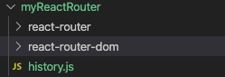
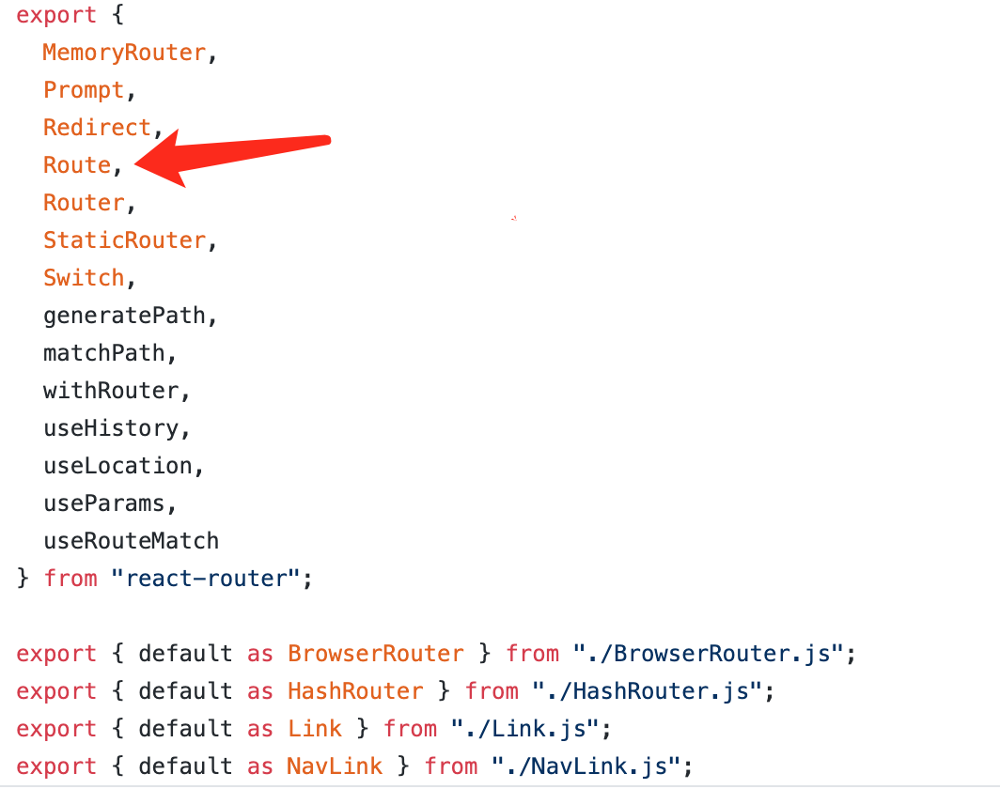

我们讲了`React-Router`的基本用法，并实现了常见的前端路由鉴权。本文会继续深入`React-Router`讲讲他的源码，套路还是一样的，我们先用官方的API实现一个简单的例子，然后自己手写这些API来替换官方的并且保持功能不变。

**本文全部代码已经上传GitHub，大家可以拿下来玩玩：**

## 简单示例

本文用的例子是上篇文章开始那个不带鉴权的简单路由跳转例子，跑起来是这样子的：


我们再来回顾下代码，在`app.js`里面我们用`Route`组件渲染了几个路由：

```javascript
import React from 'react';
import {
  BrowserRouter as Router,
  Switch,
  Route,
} from "react-router-dom";
import Home from './pages/Home';
import Login from './pages/Login';
import Backend from './pages/Backend';
import Admin from './pages/Admin';


function App() {
  return (
    <Router>
      <Switch>
        <Route path="/login" component={Login}/>
        <Route path="/backend" component={Backend}/>
        <Route path="/admin" component={Admin}/>
        <Route path="/" component={Home}/>
      </Switch>
    </Router>
  );
}

export default App;
```

每个页面的代码都很简单，只有一个标题和回首页的链接，比如登录页长这样，其他几个页面类似：

```javascript
import React from 'react';
import { Link } from 'react-router-dom';

function Login() {
  return (
    <>
      <h1>登录页</h1>
      <Link to="/">回首页</Link>
    </>
  );
}

export default Login;
```

这样我们就完成了一个最简单的`React-Router`的应用示例，我们来分析下我们用到了他的哪些API，这些API就是我们今天要手写的目标，仔细一看，我们好像只用到了几个组件，这几个组件都是从`react-router-dom`导出来的：

> **BrowserRouter**: 被我们重命名为了`Router`，他包裹了整个`React-Router`，感觉跟[以前写过的`react-redux`的`Provider`类似](https://juejin.im/post/5f0595f75188252e415f5519)，我猜是用来注入`context`之类的。
>
> **Route**: 这个组件是用来定义具体的路由的，接收路由地址`path`和对应渲染的组件作为参数。
>
> **Switch**：这个组件是用来设置匹配模式的，不加这个的话，如果浏览器地址匹配到了多个路由，这几个路由都会渲染出来，加了这个只会渲染匹配的第一个路由组件。
>
> **Link**：这个是用来添加跳转链接的，功能类似于原生的`a`标签，我猜他里面也是封装了一个`a`标签。

## BrowserRouter源码

我们代码里面最外层的就是`BrowserRouter`，我们先去看看他的源码干了啥，地址传送门：[https://github.com/ReactTraining/react-router/blob/master/packages/react-router-dom/modules/BrowserRouter.js](https://github.com/ReactTraining/react-router/blob/master/packages/react-router-dom/modules/BrowserRouter.js)

看了他的源码，我们发现`BrowserRouter`代码很简单，只是一个壳：

```javascript
import React from "react";
import { Router } from "react-router";
import { createBrowserHistory as createHistory } from "history";

class BrowserRouter extends React.Component {
  history = createHistory(this.props);

  render() {
    return <Router history={this.history} children={this.props.children} />;
  }
}
```

在这个壳里面还引用了两个库`react-router`和`history`，`BrowserRouter`仅仅是调用`history`的`createHistory`得到一个`history`对象，然后用这个对象渲染了`react-router`的`Router`组件。看起来我们要搞懂`react-router-dom`的源码还必须得去看`react-router`和`history`的源码，现在我们手上有好几个需要搞懂的库了，为了看懂他们的源码，我们得先理清楚他们的结构关系。

## React-Router的项目结构

`React-Router`的结构是一个典型的`monorepo`，`monorepo`这两年开始流行了，是一种比较新的多项目管理方式，与之相对的是传统的`multi-repo`。比如`React-Router`的项目结构是这样的：


比如这里的`packages`文件夹下面有四个文件夹，这四个文件夹每个都可以作为一个单独的项目发布。之所以把他们放在一起，是因为他们之前有很强的依赖关系：

> **react-router**：是`React-Router`的核心库，处理一些共用的逻辑
>
> **react-router-config**：是`React-Router`的配置处理，我们一般不需要使用
>
> **react-router-dom**：浏览器上使用的库，会引用`react-router`核心库
>
> **react-router-native**：支持`React-Native`的路由库，也会引用`react-router`核心库

像这样多个仓库，发布多个包的情况，传统模式是给每个库都建一个`git repo`，这种方式被称为`multi-repo`。像`React-Router`这样将多个库放在同一个`git repo`里面的就是`monorepo`。这样做的好处是如果出了一个BUG或者加一个新功能，需要同时改`react-router`和`react-router-dom`，`monorepo`只需要一个`commit`一次性就改好了，发布也可以一起发布。如果是`multi-repo`则需要修改两个`repo`，然后分别发布两个`repo`，发布的时候还要协调两个`repo`之间的依赖关系。所以现在很多开源库都使用`monorepo`来将依赖很强的模块放在一个`repo`里面，比如[React源码](https://github.com/facebook/react)也是一个典型的`monorepo`。


`yarn`有一个`workspaces`可以支持`monorepo`，使用这个功能需要在`package.json`里面配置`workspaces`，比如这样：

```javascript
"workspaces": {
    "packages": [
      "packages/*"
    ]
  }
```

扯远了，`monorepo`可以后面单独开一篇文章来讲，这里讲这个主要是为了说明`React-Router`分拆成了多个包，这些包之间是有比较强的依赖的。

前面我们还用了一个库是`history`，这个库没在`React-Router`的`monorepo`里面，而是单独的一个库，因为官方把他写的功能很独立了，不一定非要结合`React-Router`使用，在其他地方也可以使用。

## React-Router架构思路

我之前另一篇文章讲[Vue-Router的原理](https://juejin.im/post/5e255dd76fb9a0301572944a#heading-3)提到过，前端路由实现无非这几个关键点：

> 1. 监听URL的改变
> 2. 改变vue-router里面的current变量
> 3. 监视current变量
> 4. 获取对应的组件
> 5. render新组件

其实`React-Router`的思路也是类似的，只是`React-Router`将这些功能拆分得更散，监听URL变化独立成了history库，vue-router里面的`current`变量在React里面是用`Context API`实现的，而且放到了核心库`react-router`里面，对于新组件的渲染则放到了对应的平台库`react-router-dom`或者`react-router-native`里面。按照这个思路，我们自己写的`React-Router`文件夹下面也建几个对应的文件夹：



## 手写自己的React-Router

然后我们顺着这个思路一步一步的将我们代码里面用到的API替换成自己的。

### BrowserRouter组件

`BrowserRouter`这个代码前面看过，直接抄过来就行:

```javascript
import React from "react";
import { Router } from "react-router";
import { createBrowserHistory as createHistory } from "history";

class BrowserRouter extends React.Component {
  history = createHistory(this.props);

  render() {
    return <Router history={this.history} children={this.props.children} />;
  }
}

export default BrowserRouter;
```

### react-router的Router组件

上面的`BrowserRouter`用到了`react-router`的`Router`组件，这个组件在浏览器和`React-Native`端都有使用，主要获取当前路由并通过`Context API`将它传递下去：

```javascript
import React from "react";

import HistoryContext from "./HistoryContext.js";
import RouterContext from "./RouterContext.js";

/**
 * The public API for putting history on context.
 */
class Router extends React.Component {
  // 静态方法，检测当前路由是否匹配
  static computeRootMatch(pathname) {
    return { path: "/", url: "/", params: {}, isExact: pathname === "/" };
  }

  constructor(props) {
    super(props);

    this.state = {
      location: props.history.location     // 将history的location挂载到state上
    };

    // 下面两个变量是防御性代码，防止根组件还没渲染location就变了
    // 如果location变化时，当前根组件还没渲染出来，就先记下他，等当前组件mount了再设置到state上
    this._isMounted = false;
    this._pendingLocation = null;

    // 通过history监听路由变化，变化的时候，改变state上的location
    this.unlisten = props.history.listen(location => {
      if (this._isMounted) {
        this.setState({ location });
      } else {
        this._pendingLocation = location;
      }
    });
  }

  componentDidMount() {
    this._isMounted = true;

    if (this._pendingLocation) {
      this.setState({ location: this._pendingLocation });
    }
  }

  componentWillUnmount() {
    if (this.unlisten) {
      this.unlisten();
      this._isMounted = false;
      this._pendingLocation = null;
    }
  }

  render() {
    // render的内容很简单，就是两个context
    // 一个是路由的相关属性，包括history和location等
    // 一个只包含history信息，同时将子组件通过children渲染出来
    return (
      <RouterContext.Provider
        value={{
          history: this.props.history,
          location: this.state.location,
          match: Router.computeRootMatch(this.state.location.pathname),
        }}
      >
        <HistoryContext.Provider
          children={this.props.children || null}
          value={this.props.history}
        />
      </RouterContext.Provider>
    );
  }
}

export default Router;
```

[上述代码是我精简过的代码，原版代码可以看这里。](https://github.com/ReactTraining/react-router/blob/master/packages/react-router/modules/Router.js)这段代码主要是创建了两个`context`，将路由信息和`history`信息放到了这两个`context`上，其他也没干山了。[关于React的`Context API`我在另外一篇文章详细讲过，这里不再赘述了。](https://juejin.im/post/5f0595f75188252e415f5519#heading-1)

### history

前面我们其实用到了history的三个API：

> **createBrowserHistory**: 这个是用在BrowserRouter里面的，用来创建一个history对象，后面的listen和unlisten都是挂载在这个API上面的。
>
> **history.listen**：这个是用在Router组件里面的，用来监听路由变化。
>
> **history.unlisten**：这个也是在Router组件里面用的，是`listen`方法的返回值，用来在清理的时候取消监听的。

下面我们来实现这个history:

```javascript
// 创建和管理listeners的方法
function createEvents() {
  let handlers = [];

  return {
    push(fn) {
      handlers.push(fn);
      return function() {
        handlers = handlers.filter(handler => handler !== fn);
      };
    },
    call(arg) {
      handlers.forEach(fn => fn && fn(arg));
    }
  }
}

function createBrowserHistory() {
  const listeners = createEvents();

  // 路由变化时的回调
  const handlePop = function() {
    listeners.call();     // 路由变化时执行回调
  }

  // 监听路由变化，BrowserHistory监听的事件是popstate
  window.addEventListener('popstate', handlePop);

  // 返回的history上有个listen方法
  const history = {
    listen(listener) {
      return listeners.push(listener);
    }
  }

  return history;
}

export default createBrowserHistory;
```

上述`history`代码是超级精简版的代码，官方源码很多，还支持其他功能，我们这里只拎出来核心功能，对官方源码感兴趣的看这里：[https://github.com/ReactTraining/history/blob/master/packages/history/index.ts](https://github.com/ReactTraining/history/blob/master/packages/history/index.ts)

### Route组件

我们前面的应用里面还有个很重要的组件是`Route`组件，这个组件是用来匹配路由和具体的组件的。这个组件看似是从`react-router-dom`里面导出来的，其实他只是相当于做了一个转发，原封不动的返回了`react-router`的`Route`组件：



这个组件其实只有一个作用，就是将参数上的`path`拿来跟当前的`location`做对比，如果匹配上了就渲染参数上的`component`就行。为了匹配`path`和`location`，还需要一个辅助方法`matchPath`，[我直接从源码抄这个方法了](https://github.com/ReactTraining/react-router/blob/master/packages/react-router/modules/matchPath.js)。大致思路是将我们传入的参数`path`转成一个正则，然后用这个正则去匹配当前的`pathname`：

```javascript
import pathToRegexp from "path-to-regexp";

const cache = {};
const cacheLimit = 10000;
let cacheCount = 0;

function compilePath(path, options) {
  const cacheKey = `${options.end}${options.strict}${options.sensitive}`;
  const pathCache = cache[cacheKey] || (cache[cacheKey] = {});

  if (pathCache[path]) return pathCache[path];

  const keys = [];
  const regexp = pathToRegexp(path, keys, options);
  const result = { regexp, keys };

  if (cacheCount < cacheLimit) {
    pathCache[path] = result;
    cacheCount++;
  }

  return result;
}

/**
 * Public API for matching a URL pathname to a path.
 */
function matchPath(pathname, options = {}) {
  if (typeof options === "string" || Array.isArray(options)) {
    options = { path: options };
  }

  const { path, exact = false, strict = false, sensitive = false } = options;

  const paths = [].concat(path);

  return paths.reduce((matched, path) => {
    if (!path && path !== "") return null;
    if (matched) return matched;

    const { regexp, keys } = compilePath(path, {
      end: exact,
      strict,
      sensitive
    });
    const match = regexp.exec(pathname);

    if (!match) return null;

    const [url, ...values] = match;
    const isExact = pathname === url;

    if (exact && !isExact) return null;

    return {
      path, // the path used to match
      url: path === "/" && url === "" ? "/" : url, // the matched portion of the URL
      isExact, // whether or not we matched exactly
      params: keys.reduce((memo, key, index) => {
        memo[key.name] = values[index];
        return memo;
      }, {})
    };
  }, null);
}

export default matchPath;
```

然后是`Route`组件，调用下`matchPath`来看下当前路由是否匹配就行了，当前路由记得从`RouterContext`里面拿：

```javascript
import React from "react";

import RouterContext from "./RouterContext.js";
import matchPath from "./matchPath.js";

/**
 * The public API for matching a single path and rendering.
 */
class Route extends React.Component {
  render() {
    return (
      <RouterContext.Consumer>
        {context => {
          // 从RouterContext获取location
          const location = context.location;
          const match = matchPath(location.pathname, this.props);  // 调用matchPath检测当前路由是否匹配

          const props = { ...context, location, match };

          let { component } = this.props;

          // render对应的component之前先用最新的参数match更新下RouterContext
          // 这样下层嵌套的Route可以拿到对的值
          return (
            <RouterContext.Provider value={props}>
              {props.match
                ? React.createElement(component, props)
                : null}
            </RouterContext.Provider>
          );
        }}
      </RouterContext.Consumer>
    );
  }
}

export default Route;
```

上述代码也是精简过的，官方源码还支持函数组件和`render`方法等，具体代码可以看这里：[https://github.com/ReactTraining/react-router/blob/master/packages/react-router/modules/Route.js](https://github.com/ReactTraining/react-router/blob/master/packages/react-router/modules/Route.js)

其实到这里，`React-Router`的核心功能已经实现了，但是我们开始的例子中还用到了`Switch`和`Link`组件，我们也一起来把它实现了吧。

### Switch组件

我们上面的`Route`组件的功能是只要`path`匹配上当前路由就渲染组件，也就意味着如果多个`Route`的`path`都匹配上了当前路由，这几个组件都会渲染。所以`Switch`组件的功能只有一个，就是即使多个`Route`的`path`都匹配上了当前路由，也只渲染第一个匹配上的组件。要实现这个功能其实也不难，把`Switch`的`children`拿出来循环，找出第一个匹配的`child`，给它添加一个标记属性`computedMatch`，然后修改下`Route`的渲染逻辑，先检测`computedMatch`，如果没有这个再使用`matchPath`自己去匹配：

```javascript
import React from "react";

import RouterContext from "./RouterContext.js";
import matchPath from "./matchPath.js";

class Switch extends React.Component {
  render() {
    return (
      <RouterContext.Consumer>
        {context => {
          const location = context.location;     // 从RouterContext获取location

          let element, match;     // 两个变量记录第一次匹配上的子元素和match属性

          // 使用React.Children.forEach来遍历子元素，而不能使用React.Children.toArray().find()
          // 因为toArray会给每个子元素添加一个key，这会导致两个有同样component，但是不同URL的<Route>重复渲染
          React.Children.forEach(this.props.children, child => {
            // 先检测下match是否已经匹配到了
            // 如果已经匹配过了，直接跳过
            if (!match && React.isValidElement(child)) {
              element = child;

              const path = child.props.path;

              match = matchPath(location.pathname, { ...child.props, path });
            }
          });

          // 最终<Switch>组件的返回值只是匹配上子元素的一个拷贝，其他子元素被忽略了
          // match属性会被塞给拷贝元素的computedMatch
          // 如果一个都没匹配上，返回null
          return match
            ? React.cloneElement(element, { location, computedMatch: match })   
            : null;
        }}
      </RouterContext.Consumer>
    );
  }
}

export default Switch;
```

然后修改下`Route`组件，让他先检查`computedMatch`：

```javascript
// ... 省略其他代码 ...
const match = this.props.computedMatch
              ? this.props.computedMatch
              : matchPath(location.pathname, this.props);  // 调用matchPath检测当前路由是否匹配
```

`Switch`组件其实也是在`react-router`里面，源码跟我们上面写的差不多：[https://github.com/ReactTraining/react-router/blob/master/packages/react-router/modules/Switch.js](https://github.com/ReactTraining/react-router/blob/master/packages/react-router/modules/Switch.js)

### Link组件

`Link`组件功能也很简单，就是一个跳转，浏览器上要实现一个跳转，可以用`a`标签，但是如果直接使用`a`标签可能会导致页面刷新，所以不能直接使用它，而应该使用`history API`，[具体文档可以看这里](https://developer.mozilla.org/zh-CN/docs/Web/API/History)。我们这里要跳转URL可以直接使用`history.pushState`。使用`history.pushState`需要注意一下几点：

> 1. `history.pushState`只会改变`state`状态，不会刷新页面。换句话说就是你用了这个API，你会看到浏览器地址栏的地址变化了，但是页面并没有变化。
> 2. 当你使用`history.pushState`改变`state`状态的时候，`popstate`事件会触发，我们就是通过监听`popstate`事件来渲染对应的组件的。
> 3. `history.pushState(state, title[, url])`接收三个参数，第一个参数`state`是往新路由传递的信息，可以为空，官方`React-Router`会往里面加一个随机的`key`和其他信息，我们这里直接为空吧，第二个参数`title`目前大多数浏览器都不支持，可以直接给个空字符串，第三个参数`url`是可选的，但是却是我们这里的关键，这个参数是要跳往的目标地址。
> 4. 由于`history`已经成为了一个独立的库，所以我们应该将`history.pushState`相关处理加到`history`库里面。

我们先在`history`里面新加一个API`push`，这个API会调用`history.pushState`：

```javascript
// ... 省略其他代码 ...
push(url) {
  const history = window.history;
  history.pushState(null, '', url);
}
```

上面说了我们直接使用`a`标签会导致页面刷新，但是如果不使用`a`标签，`Link`组件应该渲染个什么标签在页面上呢？可以随便渲染个`span`，`div`什么的都行，但是可能会跟大家平时的习惯不一样，还可能导致一些样式失效，所以官方还是选择了渲染一个`a`标签在这里，只是使用`event.preventDefault`禁止了默认行为，然后用`history api`自己实现了跳转，当然你可以自己传`component`参数进去改变默认的`a`标签。因为是`a`标签，不能兼容`native`，所以`Link`组件其实是在`react-router-dom`这个包里面：

```javascript
import React from "react";
import RouterContext from "../react-router/RouterContext";

// LinkAnchor只是渲染了一个没有默认行为的a标签
// 跳转行为由传进来的navigate实现
function LinkAnchor({navigate, ...rest}) {
  let props = {
    ...rest,
    onClick: event => {
      event.preventDefault();
      navigate();
    }
  }

  return <a {...props} />;
}

function Link({
  component = LinkAnchor,
  to,
  ...rest
}) {
  return (
    <RouterContext.Consumer>
      {context => {
        const { history } = context;     // 从RouterContext获取history对象

        const props = {
          ...rest,
          href: to,
          navigate() {
            history.push(to);
          }
        };

        return React.createElement(component, props);
      }}
    </RouterContext.Consumer>
  );
}

export default Link;
```

上述代码是精简版的`Link`，基本逻辑跟官方源码一样：[https://github.com/ReactTraining/react-router/blob/master/packages/react-router-dom/modules/Link.js](https://github.com/ReactTraining/react-router/blob/master/packages/react-router-dom/modules/Link.js)

到这里开头示例用到的全部API都换成了我们自己的，其实也实现了`React-Router`的核心功能。但是我们只实现了`H5 history`模式，`hash`模式并没有实现，其实有了这个架子，添加`hash`模式也比较简单了，基本架子不变，在`react-router-dom`里面添加一个`HashRouter`,他的基本结构跟`BrowserRouter`是一样的，只是他会调用`history`的`createHashHistory`，`createHashHistory`里面不仅仅会去监听`popstate`，某些浏览器在`hash`变化的时候不会触发`popstate`，所以还需要监听`hashchange`事件。对应的源码如下，大家可以自行阅读：

**HashRouter**: [https://github.com/ReactTraining/react-router/blob/master/packages/react-router-dom/modules/HashRouter.js](https://github.com/ReactTraining/react-router/blob/master/packages/react-router-dom/modules/HashRouter.js)

**createHashHistory**: [https://github.com/ReactTraining/history/blob/28c89f4091ae9e1b0001341ea60c629674e83627/packages/history/index.ts#L616](https://github.com/ReactTraining/history/blob/28c89f4091ae9e1b0001341ea60c629674e83627/packages/history/index.ts#L616)

## 总结

`React-Router`的核心源码我们已经读完了，下面我们来总结下：

1. `React-Router`因为有跨平台的需求，所以分拆了好几个包，这几个包采用`monorepo`的方式管理：
   1. `react-router`是核心包，包含了大部分逻辑和组件，处理`context`和路由匹配都在这里。
   2. `react-router-dom`是浏览器使用的包，像`Link`这样需要渲染具体的`a`标签的组件就在这里。
   3. `react-router-native`是`react-native`使用的包，里面包含了`android`和`ios`具体的项目。

2. 浏览器事件监听也单独独立成了一个包`history`，跟`history`相关的处理都放在了这里，比如`push`，`replace`什么的。
3. 前端路由组件的核心逻辑其实都差不多，包括我[之前写过的`vue-router`](https://juejin.im/post/5e255dd76fb9a0301572944a)也是一个套路：
   1. 使用不刷新的路由API，比如`history`或者`hash`
   2. 根据不同模式监听对应的事件，`history`模式监听的是`popstate`，`hash`模式监听的是`hashchange`。
   3. 当路由事件触发时，将变化的路由写入到框架的响应式数据上，`vue`里面是通过插件实现的，`react`里面是将这个值写到根`router`的`state`上，然后通过`context`传给子组件。
   4. 具体渲染时将路由配置的`path`和当前浏览器地址做一个对比，匹配上就渲染。

**本文全部代码已经上传GitHub，大家可以拿下来玩玩：**

## 参考资料

官方文档：[https://reactrouter.com/web/guides/quick-start](https://reactrouter.com/web/guides/quick-start)

GitHub源码地址：[https://github.com/ReactTraining/react-router/tree/master/packages](https://github.com/ReactTraining/react-router/tree/master/packages)

**文章的最后，感谢你花费宝贵的时间阅读本文，如果本文给了你一点点帮助或者启发，请不要吝啬你的赞和GitHub小星星，你的支持是作者持续创作的动力。**

**作者博文GitHub项目地址： [https://github.com/dennis-jiang/Front-End-Knowledges](https://github.com/dennis-jiang/Front-End-Knowledges)**

**作者掘金文章汇总：[https://juejin.im/post/5e3ffc85518825494e2772fd](https://juejin.im/post/5e3ffc85518825494e2772fd)**