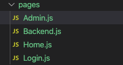
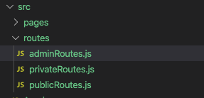

`React-Router`是React生态里面很重要的一环，现在React的单页应用的路由基本都是前端自己管理的，而不像以前是后端路由，React管理路由的库常用的就是就是`React-Router`。本文想写一下`React-Router`的使用，但是光介绍API又太平淡了，[而且官方文档已经写得很好了](https://reactrouter.com/web/guides/quick-start)，我这里就用一个常见的开发场景来看看`React-Router`是怎么用的吧。而我们一般的系统都会有用户访问权限的限制，某些页面可能需要用户具有一定的权限才能访问。本文就是用`React-Router`来实现一个前端鉴权模型。

本文全部代码已经上传GitHub，大家可以拿下来玩玩：[https://github.com/dennis-jiang/Front-End-Knowledges/tree/master/Examples/React/react-router-usage](https://github.com/dennis-jiang/Front-End-Knowledges/tree/master/Examples/React/react-router-usage)

## 应用示例

本文要实现的功能是大家经常遇到的场景，就是要控制不同的用户角色来访问不同的页面，这里总共有四个页面：

> 1. `/index`: 网站首页
> 2. `/login`: 登录页
> 3. `/backend`：后台页面
> 4. `/admin`：管理页面

另外还有三种角色：

> 1. `未登录用户`：只能访问网站首页`/index`和登录页`/login`
> 2. `普通用户`：可以访问网站首页`/index`，登录页`/login`和后台页面`/backend`
> 3. `管理员`：可以访问管理页面`/admin`和其他所有页面

## 引入React-Router

要实现路由鉴权，我们还得一步一步来，我们先用React-Router搭建一个简单的带有这几个页面的项目。我们直接用`create-react-app`创建一个新项目，然后建了一个`pages`文件夹，里面放入我们前面说的那几个页面：



我们页面先写简单点，先写个标题吧，比如这样：

```javascript
import React from 'react';

function Admin() {
  return (
    <h1>管理员页面</h1>
  );
}
```

其他几个页面也是类似的。

然后我们就可以在`App.js`里面引入`React-Router`做路由跳转了，注意我们在浏览器上使用的是`react-router-dom`，新版的`React-Router`将核心逻辑层和展示层分开了，核心逻辑会处理路由匹配等，展示层会处理实际的跳转和路由变化的监听，之所以这么分，是因为React-Router不仅仅需要支持浏览器，还需要支持React Native，这两个平台的监听和跳转是不一样的，所以现在[React-Router](https://github.com/ReactTraining/react-router/tree/master/packages)下面有好几个包了：

> `react-router`：核心逻辑处理，包括路由匹配和Context处理等
>
> `react-router-dom`：跟浏览器相关的路由监听和跳转
>
> `react-router-native`：跟RN相关的路由监听和跳转

在实际使用时，我们一般不需要引用`react-router`，而是直接用`react-router-dom`就行，因为它自己会去引用`react-router`。下面我们在项目里面引入`react-router-dom`。

```javascript
import React from 'react';
import {
  BrowserRouter as Router,
  Switch,
  Route,
} from "react-router-dom";
import Home from './pages/Home';
import Login from './pages/Login';
import Backend from './pages/Backend';
import Admin from './pages/Admin';

function App() {
  return (
    <Router>
      <Switch>
        <Route path="/login" component={Login}/>
        <Route path="/backend" component={Backend}/>
        <Route path="/admin" component={Admin}/>
        <Route path="/" component={Home}/>
      </Switch>
    </Router>
  );
}

export default App;
```

然后可以在`Home`页面用`Link`加上跳转到其他页面的链接，这样就可以跳转了：

```javascript
import React from 'react';
import { Link } from 'react-router-dom';

function Home() {
  return (
    <>
      <h1>首页</h1>
      <ul>
        <li><Link to="/login">登录</Link></li>
        <li><Link to="/backend">后台</Link></li>
        <li><Link to="/admin">管理员</Link></li>
      </ul>
    </>
  );
}

export default Home;
```

到现在我们的应用运行起来是这样的：


## 模块划分

虽然我们的跳转实现了，但是所有人都可以访问任何页面，我们前面的需求是要根据登录的角色限制访问的页面的，在写代码前，我们先来思考下应该怎么做这个。当然最直观最简单的方法就是每个页面都检测下当前用户的角色，匹配不上就报错或者跳回首页。我们现在只有几个页面，这样做好像也还好，但是如果我们的应用变大了，页面变多了，每个页面都来一次检测就显得很重复了，所以我们应该换个角度来思考这个问题。

仔细一看，其实我们总共就三种角色，对应三种不同的权限，这三个权限还有层级关系，高级别的权限包含了低级别的权限，所以我们的页面也可以按照这些权限分为三种：

> 1. `公共页面`：所有人都可以访问，没登录也可以访问，包括网站首页和登录页
> 2. `普通页面`：普通登录用户可以访问的页面
> 3. `管理员页面`：只有管理员才能访问的页面

为了好管理这三种页面，我们可以将他们抽取成三个文件，放到一个独立的文件夹`routes`里面，三个文件分别命名为`publicRoutes.js`，`privateRoutes.js`，`adminRoutes.js`：



对于每个路由文件，我们可以将这类路由组织成数组，然后`export`出去给外面调用，比如`publicRoutes.js`：

```javascript
import Login from '../pages';
import Home from '../pages/Home';

const publicRoutes = [
  {
    path: '/login',
    component: Login,
    exact: true,
  },
  {
    path: '/',
    component: Home,
    exact: true,
  },
];

export default publicRoutes;
```

然后我们外面使用的地方直接改为：

```javascript
import publicRoutes from './routes/publicRoutes';

function App() {
  return (
    <Router>
      <Switch>
        {publicRoutes.map(
          ({path, component, ...routes}) => 
            <Route key={path} path={path} component={component} {...routes}/>
        )}
        <Route path="/backend" component={Backend}/>
        <Route path="/admin" component={Admin}/>
      </Switch>
    </Router>
  );
}
```

这样我们的`App.js`里面就不会有冗长的路由路由列表了，而是只需要循环一个数组就行了。但是对于需要登录才能访问的页面和管理员页面我们不能直接渲染`Route`组件，我们最好再封装一个高级组件，将鉴权的工作放到这个组件里面去，这样我们普通的页面在实现时就不需要关心怎么鉴权了。

## 封装高级组件

要封装这个鉴权组件思路也很简单，前面我们将`publicRoutes`直接拿来循环渲染了`Route`组件，我们的鉴权组件只需要在这个基础上再加一个逻辑就行了：在渲染真正的`Route`组件前先检查一下当前用户是否有对应的权限，如果有就直接渲染`Route`组件，如果没有就返回某个页面，可以是登录页或者后台首页，具体根据自己项目需求来。所以我们的路由配置文件`privateRoutes.js`，`adminRoutes.js`里面的路由会比`publicRoutes.js`的多两个参数：

```javascript
// privateRoutes.js
import Backend from '../pages/Backend';

const privateRoutes = [
  {
    path: '/backend',
    component: Backend,
    exact: true,
    role: 'user',       // 当前路由需要的角色权限
    backUrl: '/login'   // 不满足权限跳转的路由
  },
];

export default privateRoutes;
```

`adminRoutes.js`是类似的写法：

```javascript
// adminRoutes.js
import Admin from '../pages/Admin';

const adminRoutes = [
  {
    path: '/admin',
    component: Admin,
    exact: true,
    role: 'admin',       // 需要的权限是admin
    backUrl: '/backend'  // 不满足权限跳回后台页面
  },
];

export default adminRoutes;
```

然后就可以写我们的高级组件了，我们将它命名为`AuthRoute`吧，注意我们这里假设的用户登录时后端API会返回给我们当前用户的角色，一个用户可能有多个角色，比如普通用户的角色是`['user']`，管理员的角色是`['user', 'admin']`，具体的权限验证逻辑要看自己项目权限的设计，这里只是一个例子：

```javascript
// AuthRoute.js
import React from 'react';
import { Route, Redirect } from 'react-router-dom';

function AuthRoute(props) {
  const {
    user: {
      role: userRole
    },
    role: routeRole,
    backUrl,
    ...otherProps
  } = props;

  // 如果用户有权限，就渲染对应的路由
  if (userRole && userRole.indexOf(routeRole) > -1) {
    return <Route {...otherProps} />
  } else {
    // 如果没有权限，返回配置的默认路由
    return <Redirect to={backUrl} />
  }
}

export default AuthRoute;
```

然后用我们的`AuthRoute`的渲染`adminRoutes`和`privateRoutes`:

```javascript
// ... 省略其他代码 ...

{privateRoutes.map(
  (route) => <AuthRoute key={route.path} {...route}/>
)}
{adminRoutes.map(
  (route) => <AuthRoute key={route.path} {...route}/>
)}
```

## 登录设置权限

在我们的`AuthRoute`里面用到了`user: { role }`这个变量，但是我们还没设置它。真实项目中一般是登录的时候后端API会返回当前用户的角色，然后前端将这个权限信息保存在一些状态管理工具里面，比如`Redux`。我们这里直接在`Login`页面写死两个按钮来模拟这个权限了，用户的配置就用根组件的`state`来管理了，`Login`页面的两个按钮会改变对应的`state`：

```javascript
import React from 'react';
import { Link } from 'react-router-dom';

function Login(props) {
  const {loginAsUser, loginAsAdmin, history} = props;

  const userLoginHandler = () => {
    loginAsUser();      // 调用父级方法设置用户权限
    history.replace('/backend');     // 登录后跳转后台页面
  }

  const adminLoginHandler = () => {
    loginAsAdmin();     // 调用父级方法设置管理员权限
    history.replace('/admin');     // 登录后跳转管理员页面
  }

  return (
    <>
      <h1>登录页</h1>
      <button onClick={userLoginHandler}>普通用户登录</button>
      <br/><br/>
      <button onClick={adminLoginHandler}>管理员登录</button>
      <br/><br/>
      <Link to="/">回首页</Link>
    </>
  );
}

export default Login;
```

到这里我们这个简单的路由鉴权就完成了，具体跑起来效果如下：


## 总结

1. `React-Router`可以用来管理前端的路由跳转，是`React`生态里面很重要的一个库。
2. `React-Router`为了同时支持浏览器和`React-Native`，他分拆成了三个包`react-router`核心包，`react-router-dom`浏览器包，`react-router-native`支持`React-Native`。使用时不需要引入`react-router`，只需要引入需要的平台包就行。
3. 对于需要不同权限的路由，我们可以将他们拎出来分好类，单独建成一个文件，如果路由不多，放在一个文件导出多个数组也行。
4. 对于需要鉴权的路由，我们可以用一个高级组件将权限校验的逻辑封装在里面，其他页面只需要加好配置，完全不用关心鉴权的问题。

**本文内容偏简单，作为熟悉`React-Router`的用法还不错，但是我们不能只会用，还要知道他的原理。下篇文章我们就来看看`React-Router`的源码里面蕴藏了什么奥秘，大家可以点个关注不迷路，哈哈~**

## 参考资料

官方文档：[https://reactrouter.com/web/guides/quick-start](https://reactrouter.com/web/guides/quick-start)

GitHub源码地址：[https://github.com/ReactTraining/react-router/tree/master/packages](https://github.com/ReactTraining/react-router/tree/master/packages)

**文章的最后，感谢你花费宝贵的时间阅读本文，如果本文给了你一点点帮助或者启发，请不要吝啬你的赞和GitHub小星星，你的支持是作者持续创作的动力。**

**作者博文GitHub项目地址： [https://github.com/dennis-jiang/Front-End-Knowledges](https://github.com/dennis-jiang/Front-End-Knowledges)**

**作者掘金文章汇总：[https://juejin.im/post/5e3ffc85518825494e2772fd](https://juejin.im/post/5e3ffc85518825494e2772fd)**