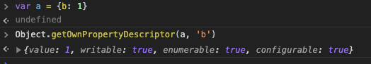
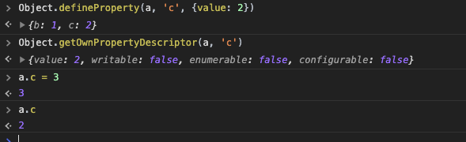

## VUE响应式原理

这里的响应式(Reactive)不同于CSS布局的响应式(Responsive), 这里的响应式是指数据和视图的绑定，数据一旦更新，视图会自动更新。下面让我们来看看Vue是怎么实现响应式的，Vue 2.0和Vue 3.0的实现原理还不一样，我们来分开讲。

### Vue 2.0的响应式

#### Object.defineProperty

Vue 2.0的响应式主要用到了`Object.defineProperty`,我们先来说说这个方法。`Object.defineProperty(obj, prop, descriptor)`是用来定义属性描述符的，它接收三个参数，第一个参数目标对象，第二个参数是目标对象里面的属性，第三个参数是想要设置的属性描述符，包含如下几个值及默认值

```json
{
  value: undefined, // 属性的值
  get: undefined,   // 获取属性值时触发的方法
  set: undefined,   // 设置属性值时触发的方法
  writable: false,  // 属性值是否可修改，false不可改
  enumerable: false, // 属性是否可以用for...in 和 Object.keys()枚举
  configurable: false  // 该属性是否可以用delete删除，false不可删除，为false时也不能再修改该参数
}
```

对于一个普通的对象

```javascript
var a = {b: 1}
```

我们可以使用`Object.getOwnPropertyDescriptor`来获取一个属性的描述符



你会发现`a.b`这个属性的`writable`, `enumerable`, `configurable`这三个描述符都是`true`，但是我们前面说他们的默认值是`false`啊，这是怎么回事呢？这是因为我们定义属性的方法不一样，我们最开始的定义这个属性的时候已经给他赋值了，所以他已经是可写的了。我们换一种声明方式，用`Object.defineProperty`直接声明`a.c`，再看看他的属性描述符



我们定义的时候只指定了值为2，没有指定其他描述符，那么`writable`, `enumerable`, `configurable`都是默认值`false`，也就意味着`a.c`不能修改，不能枚举，也不能再配置。即使你显式`a.c=3`也没有用，他的值还是2，而且这样写在严格模式还会报错。因为`configurable`是`false`，也不能通过`Object.defineProperty`再修改描述符，会直接报错：


##### set 和 get

这才是重头戏，Vue就是通过`set`和`get`来实现的响应式，我们通过自己实现一个简单版的Vue来讲解这个问题。首先我们先定义一个vue:

```javascript
function vue(){
	this.$data = {a: 1};
  this.el = document.getElementById('app');
  this.virtualDom = '';
  this.observer(this.$data);
  this.render();
}
```

我们需要在`observer`方法里面来实现`set`和`get`，因为我们要监听的是值属性，要是属性本身又是一个对象，比如

```javascript
{
  a: {
    b: {
      c: 1
    }
  }
}
```

我们需要递归的设置`set`和`get`来监听里面的值。我们简单版的`get`就直接返回值了，其实这里可以进行优化，后面再讲。`set`方法接收一个参数`newValue`，我们直接赋值给value，然后调用render方法更新界面

```javascript
vue.prototype.observer = function(obj){
	var value;
  var self = this;
  for(var key in obj){  // 递归设置set和get
    value = obj[key];
    if(typeof value === 'object'){
      this.observer(value);
    } else {
      Object.defineProperty(this.$data, key, {
        get: function(){
          return value;
        },
        set: function(newValue){
          value = newValue;
          self.render();
        }
      });
    }
  }
}
```

下面是`render`方法：

```javascript
vue.prototype.render = function(){
	this.virtualDom = `I am ${this.$data.a}`;
  this.el.innerHTML = this.virtualDom;
}
```

这样你每次修改`$data.a`的时候，界面就会自动更新。需要注意的是，如果你设置了`get`方法，但是没有写返回值，会默认返回`undefined`，你每次读这个属性都是`undefined`，如果设置了`set`方法，值的更新就必须自己全部实现，不实现去赋值也不会成功。事实上，`get`和`set`需要优化的地方还很多，我们现在是一旦触发`set`就更新了整个DOM，但实际上我们可能有100个组件，其中只有一个组件使用了`set`的值，这会造成很大的资源浪费。我们需要找出一个变量到底被哪些组件使用了，当变量更新的时候只去更新那些用到了的组件。这才是Vue真正的做法：


这样我们的`get`和`set`就变成了这样：

```javascript
Object.defineProperty(this.$data, key, {
  get: function(){
    dep.depend(); // 这里进行依赖收集
    return value;
  },
  set: function(newValue){
    value = newValue;
    // self.render();
    dep.notify();  // 这里进行virtualDom更新，通知需要更新的组件render
  }
});
```

[dep](https://github.com/vuejs/vue/blob/dev/src/core/observer/dep.js)是Vue负责管理依赖的一个类，后面单独开一篇文章讲。

#### 数组的处理

数组不能用`Object.defineProperty`来处理，应该怎么办呢？Vue里面操作数组，直接用下标更改，是没有用的，必须使用`push`, `shift`等方法来操作，为什么呢？

```javascript
var a = [1, 2, 3];
a[0] = 10;  // 这样不能更新视图
```

其实Vue用装饰者模式来重写了数组这些方法，在讲这个之前我们先讲讲`Object.create`

##### Object.create

这个方法创建一个新对象，使用现有的对象来提供新创建的对象的`__proto__`,接收两个参数`Object.create(proto[, propertiesObject])`。第一个参数是新创建对象的原型对象，第二个参数可选，如果没有指定为 [`undefined`](https://developer.mozilla.org/zh-CN/docs/Web/JavaScript/Reference/Global_Objects/undefined)，则是要添加到新创建对象的不可枚举（默认）属性（即其自身定义的属性，而不是其原型链上的枚举属性）对象的属性描述符以及相应的属性名称。这些属性对应[`Object.defineProperties()`](https://developer.mozilla.org/zh-CN/docs/Web/JavaScript/Reference/Global_Objects/Object/defineProperties)的第二个参数。看实现类式继承的例子：

```javascript
// Shape - 父类(superclass)
function Shape() {
  this.x = 0;
  this.y = 0;
}

// 父类的方法
Shape.prototype.move = function(x, y) {
  this.x += x;
  this.y += y;
  console.info('Shape moved.');
};

// Rectangle - 子类(subclass)
function Rectangle() {
  Shape.call(this); // call super constructor.
}

// 子类续承父类
Rectangle.prototype = Object.create(Shape.prototype);
// 此时 Rectangle.prototype !== Shape.prototype
// 但是 Rectangle.prototype.__prpto__ === Shape.prototype
Rectangle.prototype.constructor = Rectangle;  // 前面会改掉构造函数，重新设置构造函数

var rect = new Rectangle();

console.log('Is rect an instance of Rectangle?',
  rect instanceof Rectangle); // true
console.log('Is rect an instance of Shape?',
  rect instanceof Shape); // true
rect.move(1, 1); // Outputs, 'Shape moved.'
```

多继承例子：

```javascript
function MyClass() {
     SuperClass.call(this);
     OtherSuperClass.call(this);
}

// 继承一个类
MyClass.prototype = Object.create(SuperClass.prototype);
// 混合其它
Object.assign(MyClass.prototype, OtherSuperClass.prototype);
// 重新指定constructor
MyClass.prototype.constructor = MyClass;

MyClass.prototype.myMethod = function() {
     // do a thing
};
```

我们回到Vue, 看看它数组的装饰者模式：

```javascript
var arraypro = Array.prototype;     // 获取Array的原型
var arrob = Object.create(arraypro); // 用Array的原型创建一个新对象，arrob.__proto__ === arraypro，免得污染原生Array;
var arr=['push', 'pop', 'shift'];   // 需要重写的方法

arr.forEach(function(method){
  arrob[method] = function(){
    arraypro[method].apply(this, arguments);  // 重写时先调用原生方法
    dep.notify();                             // 并且同时更新
  }
});

// 对于用户定义的数组，手动将数组的__proto__指向我们修改过的原型
var a = [1, 2, 3];
a.__proto__ = arrob;
```

上面对于新对象`arrob`的方法，我们是直接赋值的，这样会有一个问题，就是用户可能会不小心改掉我们的对象，所以我们可以用到我们前面讲到的`Object.defineProperty`来规避这个问题，我们创建一个公用方法`def`专门来设置不能修改值的属性

```javascript

function def (obj, key, value) {
  Object.defineProperty(obj, key, {
    // 这里我们没有指定writeable，默认为false，即不可修改
    enumerable: true,
    configurable: true,
    value: value,
  });
}

// 数组方法重写改为
arr.forEach(function(method){
  def(arrob, method, function(){
    arraypro[method].apply(this, arguments);  // 重写时先调用原生方法
    dep.notify();                             // 并且同时更新
  });
});
```

### Vue 3.0的响应式

3.0的响应式原理跟2.0类似，也是在`get`的时候收集依赖，在`set`的时候更新视图。但是3.0使用了ES6的新API `Proxy`和`Reflect`，使用`Proxy`相对于`Object.defineProperty`有如下好处：

```markdown
1. Object.defineProperty需要指定对象和属性，对于多层嵌套的对象需要递归监听，Proxy可以直接监听整个对象，不需要递归；
2. Object.defineProperty的get方法没有传入参数，如果我们需要返回原值，需要在外部缓存一遍之前的值，Proxy的get方法会传入对象和属性，可以直接在函数内部操作，不需要外部变量；
3. set方法也有类似的问题，Object.defineProperty的set方法传入参数只有newValue，也需要手动将newValue赋给外部变量，Proxy的set也会传入对象和属性，可以直接在函数内部操作；
4. new Proxy()会返回一个新对象，不会污染源原对象
5. Proxy可以监听数组，不用单独处理数组
```

上面的`vue.prototype.observer`可以改为：

```javascript
vue.prototype.observer = function(obj){
  var self = this;
  this.$data = new Proxy(this.$data, {
    get: function(target, key){
      return target[key];
    },
    set: function(target, key, newValue){
      target[key] = newValue;
      self.render();
    }
  });
}
```

#### Proxy还可以做数据校验

```javascript
// 需求，校验一个人名字必须是中文，年龄必须大于18岁

var validator = {
  name: function(value){
    var reg = /^[\u4E00-\u9FA5]+$/;
    
    if(typeof value === "string" && reg.test(value)){
      return true;
    }
    
    return false;
  },
  age: function(value){
    if(typeof value==='number' && value >= 18){
      return true;
    }
    
    return false;
  }
}

function person(age, name){
  this.age = age;
  this.name = name;
  
  // 使用Proxy的set校验，每次给对象属性赋值或修改都会校验
  return new Proxy(this, {
    get: function(target, key){
      return target[key];
    },
    set: function(target, key, newValue){
      // set的时候调用前面定义好的验证规则，这其实就是策略模式
      if(validator[key](newValue)){
        return Reflect.set(target, key, newValue);
      }else{
        throw new Error(`${key} is wrong.`)
      }
    }
  });
}
```

`let p = new Proxy(target, handler);`的第二个参数[handler](https://developer.mozilla.org/zh-CN/docs/Web/JavaScript/Reference/Global_Objects/Proxy/handler)不仅可以在get和set时触发，还可以在下列方法时触发：

```
getPrototypeOf()
setPrototypeOf()
isExtensible()
preventExtensions()
getOwnPropertyDescriptor()
defineProperty()
has()
get()
set()
deleteProperty()
ownKeys()
apply()
construct()
```

### 浅谈虚拟DOM和diff算法

我们有这样一个模板：

```html
<template>
  <div id="123">
    <p>
      <span>111</span>
    </p>
    <p>
      123
    </p>
  </div>
  <div>
    <p>456</p>
  </div>
</template>
```

这一段模板转化为虚拟DOM的伪代码，以第一个div为例的伪代码：

```json
{
  dom: 'div',
  props: {
    id: 123
  },
  children: [
    {
      dom: 'p',
      children: [
        dom: 'span',
        text: "111"
      ]
    },
    {
      dom: 'p',
      text: "123"
    }
  ]
}
```

每个节点都可以有多个children，每个child都是一个单独的节点，结构是一样的，也可以有自己的children。

在进行节点比对的时候，Vue只会进行同层的比较，比如有一个节点之前是：

```html
<div>
    <p>123</p>
</div>
```

后面变成了

```html
<div>
    <span>456</span>
</div>
```

比对是只会比对第一层的div, 第二层是p和span比对，不会拿div和span进行比对，如下图：


从数据改变的set方法开始的diff算法如下图所示：


如果新旧两个节点完全不一样了`isSameVnode`返回false，则整个节点更新，如果节点本身是一样的，就比较他们的子节点，下面是伪代码：

```javascript
patchVnode(oldVnode, vnode){
	const el = vnode.el = oldVnode;
  let i, oldCh = oldVnode.children, ch = vnode.children;
  
  if(oldVnode === vnode) return;
  
  if(oldVnode.text !== null && vnode.text !== null && oldVnode.text !== vnode.text){
    // 仅仅是文字改变，更新文字
    setTextContext(el, vnode.text);
  }else{
    updateEle();
    
    if(oldCh&&ch&&oldCh!==ch){
       // 都有子元素，但是变化了
       updateChildren();
    }else if(ch){
      // 新的有子元素, 老的没有，创建新元素
      createEl(vnode);
    }else if(oldCh){
      // 老的有子元素，新的没有，删除老元素
      removeChildren(el);
    }
  }
}
```

